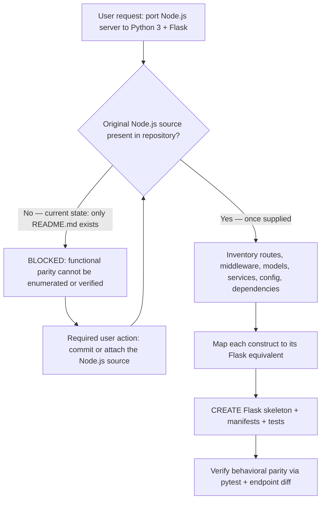
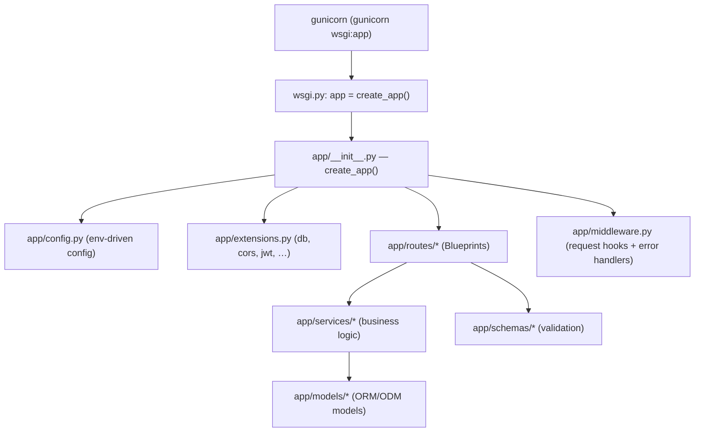
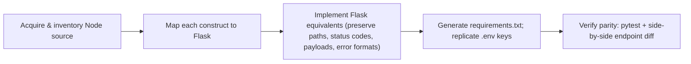

# Technical Specification

# 0. Agent Action Plan

## 0.1 Intent Clarification

This Agent Action Plan interprets a single, concise user request and translates it into a precise, file-level implementation strategy. The defining characteristic of this engagement is a **premise-versus-reality gap**: the request presupposes an existing Node.js codebase to port, yet the repository contains no application source whatsoever. This sub-section captures the intent faithfully, surfaces every implicit requirement, and foregrounds the blocking prerequisite that governs all downstream scope.

### 0.1.1 Core Feature Objective

Based on the prompt, the Blitzy platform understands that the new feature requirement is to **re-implement an existing Node.js server as a behaviorally-equivalent Python 3 application built on the Flask framework, preserving every functionality of the original project**.

> **User Request (verbatim):** "Can you rewrite this node.js server in python 3 using flask, preserving all functionalities of the original project?"

The request decomposes into three explicit objectives:

- **O1 — Language/framework port:** Stand up a Python 3 server on Flask that is the functional equivalent of the original Node.js server.
- **O2 — Full functional parity:** Preserve 100% of the original's observable behavior — every endpoint, middleware effect, data operation, validation rule, error/status-code contract, and side effect. Parity is the stated acceptance criterion.
- **O3 — Specific target stack:** Use Python 3 and the Flask framework specifically (not FastAPI, Django, or any other framework).

The following implicit requirements and prerequisites are surfaced from the request:

- **IR1 — Source availability (BLOCKING prerequisite):** A port can only replicate behavior that can be observed in the original source, so that source must be present. **It is not.** The repository tracks exactly one file, `README.md`, whose entire content is the single heading `# Artifact1` [README.md:L1], added by one "Initial commit" (`9e0722a`) [HEAD:9e0722ace21443bfac8a1400eab45ceacf9fe8dd]. No `.js`, `.ts`, `package.json`, or any other source/manifest file exists anywhere in the working tree or Git history [git ls-files → README.md]. This is corroborated by the broader Technical Specification, which records "no source code ... of any kind" (§1.1) and "no frameworks are declared" (§3.3).
- **IR2 — Endpoint inventory:** Enumerate every HTTP route (method, path, path/query parameters, request body schema, response body schema, status codes, and headers).
- **IR3 — Middleware parity:** Replicate the full middleware chain (body parsing, CORS, authentication, logging, error handling, compression, rate limiting, static serving) in the order applied.
- **IR4 — Data-layer parity:** Replicate the persistence engine, driver/ORM, schema/models, queries, connection configuration, and migrations.
- **IR5 — Service/controller parity:** Replicate all business logic.
- **IR6 — Configuration/environment parity:** Replicate `.env` keys, configuration files, listen host/port, feature flags, and secrets handling.
- **IR7 — Dependency mapping:** Map each npm dependency to a Python equivalent and emit a Python dependency manifest.
- **IR8 — Entry-point parity:** Replace the Node bootstrap (`node server.js` / `app.listen`) with a WSGI entry point.
- **IR9 — Cross-cutting parity:** Replicate authentication/sessions/JWT, websockets, scheduled jobs, file uploads, streaming, and server-side templating — only where actually present in the original.
- **IR10 — Test parity:** Port or author tests that assert equivalent behavior (jest/mocha → pytest).

### 0.1.2 Special Instructions and Constraints

- **Hard constraints (from the prompt):** the target language is **Python 3**; the target framework is **Flask**; the acceptance criterion is **"preserving all functionalities of the original project."**
- **No supplementary inputs:** no attachments were provided (the attachments review returned none), and no user implementation rules were specified (the rules review returned an empty set). There are therefore no externally-mandated files, coding-guideline constraints, or architectural directives beyond the prompt itself.
- **No user-provided examples:** the user supplied no code snippets, sample payloads, or reference URLs that must be preserved verbatim.
- **Derived factual-accuracy constraint (Blitzy-imposed):** because functional parity is defined entirely by the original source, and that source is absent, the plan must **not fabricate** endpoints, models, middleware, or services. Conventions are derived from the original source once supplied; idiomatic Flask layout is used only as the interim scaffold.
- **Web-search requirements:** the user issued no research directive. Version research was nonetheless performed proactively to provide valid, non-placeholder dependency pins (see §0.2.2 and §0.3).

### 0.1.3 Technical Interpretation

These feature requirements translate to the following technical implementation strategy: acquire and inventory the original Node.js source, then for each observed capability create the equivalent Flask construct, generate the Python dependency manifest from the npm manifest, replicate configuration and environment, stand up a WSGI entry point, and verify behavioral parity with an automated test suite.

Expressed as directed actions:

- To **port the HTTP surface**, we will *create* one Flask Blueprint module per Express router/route group under `app/routes/`.
- To **preserve middleware behavior**, we will *create* `app/middleware.py` implementing `before_request`/`after_request` hooks and error handlers that mirror the original middleware chain.
- To **preserve the data layer**, we will *create* model modules under `app/models/` (SQLAlchemy for SQL stores, an ODM for document stores) mirroring each original model.
- To **preserve business logic**, we will *create* service modules under `app/services/`.
- To **replace the server bootstrap**, we will *create* `wsgi.py` exposing `app = create_app()` for execution under gunicorn.
- To **preserve configuration**, we will *create* `app/config.py` and `.env.example` mirroring the original config and `.env` keys.
- To **preserve the dependency contract**, we will *create* `requirements.txt`/`pyproject.toml` mapped from `package.json`.
- To **document the new runtime**, we will *update* the sole existing file, `README.md` [README.md:L1].

The construct-level mapping that governs this translation (the package-level mapping is detailed in §0.3):

| Node.js / npm construct | Python / Flask equivalent |
|-------------------------|---------------------------|
| Express / Koa / Fastify / `http` server | Flask application (Werkzeug WSGI) |
| `node server.js` / `app.listen(port)` | `wsgi.py` + gunicorn (`gunicorn wsgi:app`) |
| `package.json` / npm | `requirements.txt` / `pyproject.toml` + pip |
| Express `Router` | Flask `Blueprint` |
| `app.use(...)` middleware | `before_request` / `after_request` + WSGI middleware |
| `express.json()` body parsing | `request.get_json()` |
| Centralized error middleware | Flask error handlers (`@app.errorhandler`) |
| `.env` via dotenv | `python-dotenv` (Flask `[dotenv]` extra) |
| `cors` | Flask-CORS |
| `jsonwebtoken` | PyJWT / Flask-JWT-Extended |
| Sequelize / TypeORM / Prisma | SQLAlchemy / Flask-SQLAlchemy + Alembic |
| Mongoose | PyMongo / MongoEngine |
| `joi` / `zod` validation | marshmallow / pydantic |
| jest / mocha | pytest |

The decision logic below shows why the entire CREATE scope is gated on the missing source, and the path to unblock it:




## 0.2 Repository Scope Discovery

This sub-section reports the exhaustive inspection of the repository for files relevant to the port, the external research conducted to ground the target stack in valid versions, and the complete set of new files the feature requires.

### 0.2.1 Comprehensive File Analysis

A full inspection of the working tree and Git history was performed. The repository is effectively empty: it tracks exactly one file. There is no Node.js application to "rewrite," so there are no existing application files to transform.

| Category | Patterns inspected | Found in repository |
|----------|--------------------|---------------------|
| Application source | `*.js`, `*.ts`, `*.mjs`, `*.cjs`, `*.py` | None |
| Dependency manifests | `package.json`, `requirements*.txt`, `pyproject.toml` | None |
| Config / IaC | `*.yml`, `*.yaml`, `Dockerfile`, `.env` | None |
| Documentation | `*.md` | `README.md` — 11 bytes, content `# Artifact1` [README.md:L1] |
| VCS metadata | `.git/` | Single branch `main`; one commit `9e0722a` "Initial commit" [HEAD:9e0722ace21443bfac8a1400eab45ceacf9fe8dd] |

**Integration-point discovery** (the locations a feature would normally hook into) returned nothing, because none exist:

- API endpoints / route definitions to connect to the feature — **none** [git ls-files → README.md].
- Database models / migrations affected — **none**.
- Service classes requiring updates — **none**.
- Controllers / request handlers to modify — **none**.
- Middleware / interceptors impacted — **none**.

This absence is consistent with the broader Technical Specification: §1.3.3 places all executable application logic, APIs, persistence, and authentication out of scope, and §3.3 records that no frameworks or libraries are declared. The single existing file, `README.md`, is the only artifact that will be modified (an UPDATE to add Python/Flask documentation); it is not a Node.js source file.

### 0.2.2 Web Search Research Conducted

Because the user specified a concrete target stack but provided no version guidance, external research was performed to pin valid, current, non-placeholder versions and to confirm idiomatic migration patterns. The findings below drive §0.3 (Dependency Inventory) and §0.5 (Technical Implementation).

| Research topic | Finding | Source |
|----------------|---------|--------|
| Current stable Flask release | **Flask 3.1.3**, released 2026-02-19; requires Python ≥ 3.9; pulls in Werkzeug ≥ 3.1, Jinja ≥ 3.1, ItsDangerous ≥ 2.2, Blinker ≥ 1.9, Click | pypi.org/project/Flask |
| Current Python runtime | **Python 3.12.x** recommended (local toolchain 3.12.3; latest 3.12 patch 3.12.13, 2026-03-03); 3.13.13 and 3.14.5 also available | python.org/downloads |
| Production WSGI server | **gunicorn 26.0.0**, released 2026-05-05; requires Python ≥ 3.10 | pypi.org/project/gunicorn |
| Test runner | **pytest 9.0.3**, released 2026-04-07; requires Python ≥ 3.10 | pypi.org/project/pytest |
| Environment-variable loading | Use Flask's `[dotenv]` extra, which bundles `python-dotenv` | pypi.org/project/Flask |
| Express → Flask migration patterns | Map Express `Router` → Flask `Blueprint`; `app.use` middleware → `before_request`/`after_request` + error handlers; adopt the application-factory (`create_app()`) pattern; map ORMs (Sequelize/TypeORM) → SQLAlchemy and Mongoose → PyMongo/MongoEngine; validation (joi/zod) → marshmallow/pydantic | Flask & Pallets documentation |

### 0.2.3 New File Requirements

The port is realized entirely as **new** files, organized with the idiomatic Flask application-factory layout. Every `CREATE` path below is a **conditional template**: its concrete contents — and the exact number/names of route, model, service, schema, and test modules — are determined by the original Node.js source once it is supplied (see §0.6 blocker). No endpoints, models, or services are invented in the interim.

| Target path | Mode | Purpose / Node.js origin |
|-------------|------|--------------------------|
| `wsgi.py` | CREATE | WSGI entry point exposing `app = create_app()`; gunicorn target; replaces `node server.js` / `app.listen` |
| `app/__init__.py` | CREATE | `create_app()` factory: loads config, initializes extensions, registers Blueprints, request hooks, and error handlers |
| `app/config.py` | CREATE | Environment-driven `Config` classes (Base/Dev/Prod/Testing); mirrors Node config + dotenv usage |
| `app/extensions.py` | CREATE | Extension singletons (SQLAlchemy, CORS, JWT, …) — only those the source requires |
| `app/routes/__init__.py`, `app/routes/<resource>.py` | CREATE | One Flask Blueprint per Express router/route group (1:1 with discovered endpoints) |
| `app/models/__init__.py`, `app/models/<entity>.py` | CREATE | ORM/ODM models mirroring each Node model/schema (only if persistence present) |
| `app/services/<service>.py` | CREATE | Business logic mirroring each Node service/controller |
| `app/schemas/<schema>.py` | CREATE | Request/response validation mirroring joi/zod (only if validation present) |
| `app/middleware.py` | CREATE | `before_request`/`after_request` hooks + error handlers mirroring the Express middleware chain |
| `app/templates/**`, `app/static/**` | CREATE (conditional) | Jinja2 templates / static assets — only if the original serves server-rendered views |
| `requirements.txt` and/or `pyproject.toml` | CREATE | Python dependency manifest mapped 1:1 from `package.json` |
| `.env.example` | CREATE | Documents environment variables mirroring the Node `.env` keys |
| `.gitignore` | CREATE | Ignores virtualenv, `__pycache__`, `.env`, `*.pyc` |
| `tests/conftest.py`, `tests/test_<resource>.py` | CREATE | pytest app/client fixtures + per-route parity tests (mirror jest/mocha) |
| `Dockerfile`, `docker-compose.yml` | CREATE (conditional) | Only if the original Node project is containerized |
| `README.md` | UPDATE | Add Python/Flask setup, run (gunicorn / `flask run`), environment, and test instructions [README.md:L1] |


## 0.3 Dependency Inventory

The repository contains **no dependency manifest of any kind** — there is no `package.json`, `requirements.txt`, or `pyproject.toml` [git ls-files → README.md]. Consequently every package below is a **net-new addition**; there are zero updates or removals of existing dependencies. The definite core stack is pinned to verified, current versions; the conditional adapters are added only where the original Node.js source uses the corresponding capability, with their exact versions pinned to current stable at implementation time once the `package.json` is available to map.

### 0.3.1 Core Target Stack (Definite)

These packages are required regardless of the original's specifics and are pinned to versions verified during research (§0.2.2).

| Package | Registry | Version | Purpose |
|---------|----------|---------|---------|
| CPython | python.org | 3.12.x (local 3.12.3; latest patch 3.12.13) | Target language runtime; satisfies every package below (all require ≥ 3.9/3.10) |
| Flask | PyPI | 3.1.3 | Target web framework (WSGI); replaces Express / Node `http` |
| Werkzeug | PyPI | ≥ 3.1 (transitive via Flask) | WSGI utilities, routing, request/response objects |
| Jinja2 | PyPI | ≥ 3.1 (transitive via Flask) | Server-side templating (used only if the original renders views) |
| gunicorn | PyPI | 26.0.0 | Production WSGI server; replaces the `node server.js` process model |
| pytest | PyPI | 9.0.3 | Test runner for parity tests; replaces jest/mocha |
| python-dotenv | PyPI | via `Flask[dotenv]` extra | Loads `.env` files; replaces Node `dotenv` |

A minimal, representative `requirements.txt` core therefore reads:

```text
Flask[dotenv]==3.1.3
gunicorn==26.0.0
pytest==9.0.3
```

### 0.3.2 Conditional Adapter Packages

Each row is included **only if** the original source uses the corresponding npm capability. This list cannot be finalized until the Node.js source (and its `package.json`) is supplied; versions will be pinned to current stable at that time.

| Node.js / npm capability | Python / Flask equivalent | Registry | Purpose |
|--------------------------|---------------------------|----------|---------|
| `cors` | Flask-CORS | PyPI | Cross-origin resource sharing |
| `jsonwebtoken` | PyJWT / Flask-JWT-Extended | PyPI | JWT issuance/verification |
| `passport` / `express-session` | Flask-Login / Flask-Session | PyPI | Authentication / server-side sessions |
| `bcrypt` | bcrypt / passlib | PyPI | Password hashing |
| Sequelize / TypeORM / Prisma (SQL) | SQLAlchemy + Flask-SQLAlchemy + driver (`psycopg[binary]`, `PyMySQL`) + Alembic/Flask-Migrate | PyPI | SQL ORM, drivers, migrations |
| Mongoose (MongoDB) | PyMongo / MongoEngine | PyPI | Document store access |
| `joi` / `zod` | marshmallow / pydantic | PyPI | Request/response validation & serialization |
| `axios` / `node-fetch` | requests / httpx | PyPI | Outbound HTTP client |
| `socket.io` | Flask-SocketIO | PyPI | WebSocket / realtime messaging |
| `node-cron` | APScheduler | PyPI | In-process scheduled jobs |
| `bull` / `agenda` | Celery + broker (Redis/RabbitMQ) | PyPI | Background job queue |
| `multer` | Werkzeug file handling | PyPI (Werkzeug) | Multipart file uploads |
| `helmet` | Flask-Talisman | PyPI | Security headers |
| `morgan` | `logging` (standard library) | stdlib | Request logging |

**Import and external-reference updates:** not applicable. Because no Python source currently exists, there are no internal imports to rewrite and no existing configuration, build, or CI files to repoint. All imports will be authored fresh against the new `app/` package structure defined in §0.2.3.


## 0.4 Integration Analysis

Integration analysis examines where the new feature connects to existing code. Here the result is decisive: **there is no existing code to integrate with**, so all wiring is new and internal to the Flask application being created.

### 0.4.1 Existing Code Touchpoints

There are **no existing code touchpoints**. The repository has no application entry point, no route registry, no model package, no dependency-injection container, no schema, and no migrations to modify [git ls-files → README.md]. The prompt's generic integration template references files such as `src/main.py`, `src/api/routes.py`, `src/models/__init__.py`, and `src/services/container.py`; **none of these (or any equivalent) exist** in this repository, so there are no direct modifications, no dependency injections to register, and no database/schema updates to apply against pre-existing code.

The only pre-existing artifact is `README.md` [README.md:L1], which is documentation, not code; it will be UPDATED (not integrated against) to describe the new application.

### 0.4.2 New Internal Wiring

All integration is therefore greenfield wiring inside the new `app/` package, centered on a single composition root — the `create_app()` application factory. The factory is the analog of an Express application's bootstrap: it is where configuration is loaded, extensions are initialized (the dependency-injection equivalent), Blueprints are registered (the analog of `app.use(router)`), and request hooks plus error handlers are attached.

- `wsgi.py` exposes `app = create_app()` to gunicorn — the entry-point analog of `node server.js`.
- `app/__init__.py` (`create_app()`) loads `app/config.py` from the environment, initializes the singletons declared in `app/extensions.py`, registers each Blueprint from `app/routes/`, and attaches the hooks/handlers in `app/middleware.py`.
- Each Blueprint delegates to `app/services/` for business logic, which in turn uses `app/models/` for persistence and `app/schemas/` for validation.



The concrete set of Blueprints, services, models, and schemas — and thus the exact wiring inside `create_app()` — is determined 1:1 by the original Node.js source once it is supplied (§0.6). The structure above is the canonical target into which those discovered constructs are placed.


## 0.5 Technical Implementation

This sub-section sequences the work file-by-file, describes the porting approach for each file group, and records the user-interface determination. The complete path list with purposes is in §0.2.3; the groups below define the execution order and modes.

### 0.5.1 File-by-File Execution Plan

- **Group 0 — Prerequisite (BLOCKING):** Acquire the original Node.js source by committing it into this repository or attaching it. Until this is satisfied, Groups 1–3 are a template rather than executable scope, because the behavior to replicate is undefined (§0.6).
- **Group 1 — Application core (CREATE):**
  - `wsgi.py` — WSGI entry point for gunicorn.
  - `app/__init__.py` — `create_app()` application factory.
  - `app/config.py` — environment-driven configuration classes.
  - `app/extensions.py` — extension singletons (only those needed).
- **Group 2 — Feature parity (CREATE, 1:1 with discovered Node constructs):**
  - `app/routes/<resource>.py` — one Blueprint per Express router/route group.
  - `app/models/<entity>.py` — ORM/ODM models (only if persistence present).
  - `app/services/<service>.py` — business logic per service/controller.
  - `app/schemas/<schema>.py` — validation per joi/zod (only if present).
  - `app/middleware.py` — request hooks and error handlers mirroring the middleware chain.
- **Group 3 — Manifests, configuration, tests, documentation:**
  - `requirements.txt` and/or `pyproject.toml` (CREATE) — mapped 1:1 from `package.json`.
  - `.env.example` (CREATE) — environment keys mirroring the Node `.env`.
  - `.gitignore` (CREATE) — virtualenv, `__pycache__`, `.env`, `*.pyc`.
  - `tests/conftest.py`, `tests/test_<resource>.py` (CREATE) — pytest fixtures and per-route parity tests.
  - `Dockerfile`, `docker-compose.yml` (CREATE, conditional) — only if the original is containerized.
  - `README.md` (UPDATE) — Python/Flask setup, run, environment, and test instructions [README.md:L1].

### 0.5.2 Implementation Approach per File

The port follows a five-step methodology in which the original Node.js source is the authoritative **reference** input that drives the content of every created file.



- **Step 1 — Acquire & inventory:** enumerate every route (method, path, params, request/response shape, status codes), the middleware order, all models/queries, services, configuration/env keys, and npm dependencies.
- **Step 2 — Map:** translate each construct via the table in §0.1.3 and the package table in §0.3.
- **Step 3 — Implement:** author each Flask file so that route paths, HTTP methods, status codes, payload shapes, headers, and error formats match the original **exactly**. The core composition is the application factory:

```python
app = Flask(__name__)
app.config.from_object(Config)
register_blueprints(app)
```

  and the entry point is a thin WSGI shim:

```python
from app import create_app
app = create_app()
```

- **Step 4 — Generate manifests & config:** emit `requirements.txt`/`pyproject.toml` from `package.json`, and `.env.example` from the original `.env` keys.
- **Step 5 — Verify parity:** run pytest and perform a side-by-side endpoint comparison (same input → identical output and status code) to confirm functional equivalence.

Per-file content is bound to a specific source artifact — for example, `app/routes/users.py` mirrors the Node users router, `app/models/user.py` mirrors the Node `User` model, and `tests/test_users.py` mirrors the corresponding jest/mocha suite.

### 0.5.3 User Interface Design

**Not applicable.** This is a server-side rewrite (Node.js → Flask). The request specifies a server with no user interface, no component library, and no design system, and no Figma frames or image attachments were provided. Accordingly, no UI design content is produced and the Design System Compliance protocol is not exercised. Should the original server render HTML views, those templates would be ported to Jinja2 under `app/templates/` — a server-side templating concern, still not a UI component-library or design-system task. There are no user-provided Figma URLs to reference in any created file.


## 0.6 Scope Boundaries

This sub-section draws the precise boundary of the work. All `CREATE` items are gated on the blocking prerequisite in §0.6.3.

### 0.6.1 Exhaustively In Scope

The following target paths are in scope (trailing wildcards denote a file group). Every `CREATE` path is concretized 1:1 from the original Node.js source once supplied; the single `UPDATE` is the pre-existing `README.md`.

- **Application core:** `wsgi.py`, `app/__init__.py`, `app/config.py`, `app/extensions.py`, `app/middleware.py`
- **Feature parity (1:1 with the original):**
  - `app/routes/**/*.py`
  - `app/models/**/*.py`
  - `app/services/**/*.py`
  - `app/schemas/**/*.py`
  - `app/templates/**`, `app/static/**` (only if the original serves server-rendered views/assets)
- **Dependency manifests:** `requirements.txt`, `pyproject.toml`
- **Configuration:** `.env.example`, `.gitignore`
- **Tests:** `tests/conftest.py`, `tests/**/*.py`
- **Containerization (only if the original is containerized):** `Dockerfile`, `docker-compose.yml`
- **Documentation:** `README.md` (UPDATE — add Python/Flask setup, run, environment, and test sections) [README.md:L1]

### 0.6.2 Explicitly Out of Scope

- The existing `README.md` project identifier — the `# Artifact1` heading is retained; only Python/Flask documentation is appended [README.md:L1].
- Any feature, endpoint, model, field, or behavior **not present** in the original Node.js source. This is a faithful parity port, not a feature expansion; no net-new capabilities are introduced.
- User-interface, front-end, component-library, or design-system work — none is specified for this server-side rewrite (§0.5.3).
- Re-architecture, performance optimization, or refactoring beyond what faithful 1:1 porting requires.
- Infrastructure provisioning, CI/CD pipelines, and cloud configuration, unless the original source contains equivalent definitions to port.
- The `/app` directory (Blitzy platform internals) — strictly off-limits and never inspected or documented.

### 0.6.3 Blocking Prerequisite

The single prerequisite that gates **all** of the `CREATE` scope above:

- **Finding:** the original Node.js server source is **absent** from the repository. The only tracked file is `README.md` (content `# Artifact1`) [README.md:L1], introduced by the lone commit `9e0722a` [HEAD:9e0722ace21443bfac8a1400eab45ceacf9fe8dd]; there are no `.js`/`.ts`/`package.json` or other source files anywhere in the working tree or history [git ls-files → README.md]. No source was provided as an attachment either.
- **Consequence:** "all functionalities of the original project" cannot be enumerated, ported, or verified, because there is no observable behavior to replicate. Producing concrete routes, models, or services now would require fabrication, which is explicitly disallowed.
- **Required user action:** provide the original Node.js source — commit it into this repository (for example, the project root including `package.json` and the server entry point) or attach it to the project.
- **Unblocking outcome:** upon receipt, the conditional template in §0.2.3 and the plan in §0.5 are concretized 1:1 — the exact Blueprint, model, service, schema, and test modules, and the final dependency set in §0.3, are derived directly from the supplied source.


## 0.7 Rules for Feature Addition

No user-specified implementation rules were provided (the rules review returned an empty set), and no setup instructions or coding-guideline constraints accompany the request. The rules below are therefore derived from the prompt's explicit constraints and from idiomatic Flask conventions; they are binding on the implementation once the source is supplied.

- **Functional parity is the prime directive.** Every observable behavior of the original — route methods and paths, request/response payload shapes, HTTP status codes, headers, validation rules, and error formats — must be reproduced exactly. Parity is the acceptance criterion stated by the user.
- **No fabrication (factual accuracy).** Routes, models, middleware, and services must be derived from the original source. Nothing is invented; if the source is absent, the corresponding files are not authored (see §0.6.3).
- **Mandated target stack.** The implementation must use **Python 3** and the **Flask** framework specifically, per the prompt. Flask is pinned to 3.1.3 and the runtime to Python 3.12.x (§0.3.1).
- **Idiomatic Flask architecture.** Use the application-factory pattern (`create_app()`), Flask Blueprints for route grouping, an `extensions.py` module for extension singletons, and `before_request`/`after_request` hooks plus `@errorhandler` for the middleware chain.
- **Contract preservation / backward compatibility.** The external HTTP contract must remain identical so existing clients require no changes; environment-variable names and configuration keys are preserved 1:1 from the original `.env`/config.
- **Dependency fidelity.** Each npm dependency maps to a deliberate Python equivalent (§0.3); all versions are valid, current, and explicitly pinned — never placeholders such as `latest` or `1.0.0`.
- **Security parity (no weakening).** Authentication/authorization, input validation, password hashing, CORS policy, and security headers present in the original are reproduced with equivalent strength; the port must not relax any existing security control.
- **Test-verified equivalence.** Behavior is validated with pytest, asserting that equivalent inputs produce equivalent outputs and status codes, before the port is considered complete.
- **Documentation currency.** `README.md` is updated to reflect the Python/Flask runtime (install, run via gunicorn/`flask run`, environment, and tests) while retaining the existing `# Artifact1` identifier [README.md:L1].


## 0.8 Attachments

No attachments were provided with this request. The attachments review returned none — there are no PDF, image, or document attachments, and no Figma frames or URLs.

- **File attachments:** None provided.
- **Figma screens (frame name + URL):** None provided.

Because no attachments accompany the prompt, the original Node.js source — which the request presupposes — was not supplied through this channel either. The repository itself contains only `README.md` (`# Artifact1`) [README.md:L1]. Supplying the original source (as a repository commit or an attachment) is the blocking prerequisite documented in §0.6.3.


