# Technical Specification

# 1. Introduction

## 1.1 EXECUTIVE SUMMARY

### 1.1.1 Project Overview

The repository under specification, identified as **Artifact1**, is a minimal Git-tracked project artifact currently consisting of a single documentation file located at the repository root. The project's identifier is established exclusively through a top-level Markdown heading (`# Artifact1`) in the repository's `README.md` file, which contains no further descriptive content, usage instructions, architectural references, or implementation details.

The repository was initialized with a single commit titled "Initial commit" on May 29, 2026 by author *Blitzy-Multi* and contains no source code, configuration files, dependency manifests, build scripts, test suites, container definitions, CI/CD pipelines, or runtime artifacts of any kind. The system documented herein therefore represents an **early-stage placeholder repository** rather than a functioning software product. This Technical Specification documents the repository in its present, verifiable state.

### 1.1.2 Core Business Problem

The repository contains no declarations, documentation, or artifacts that articulate a business problem statement. No business case, problem description, user need, market gap, or domain context is present in the current repository state.

| Aspect | Status in Current Repository |
|--------|------------------------------|
| Problem statement | Not defined in current repository state |
| Domain context | Not defined in current repository state |
| User pain points | Not defined in current repository state |
| Market gap addressed | Not defined in current repository state |

The articulation of the core business problem is expected to be established through subsequent contributions and will be reflected in future revisions of this Technical Specification.

### 1.1.3 Key Stakeholders and Users

The repository does not declare or document any stakeholders, target users, user personas, role definitions, or audience groups. The only identifiable individual associated with the repository is the commit author of the single existing commit.

| Stakeholder Category | Identification |
|----------------------|----------------|
| End users | Not defined in current repository state |
| Business sponsors | Not defined in current repository state |
| Technical contributors | Single commit author: *Blitzy-Multi* (`mmwforfinance@gmail.com`) |
| Operational owners | Not defined in current repository state |

### 1.1.4 Expected Business Impact and Value Proposition

The repository contains no documentation of expected outcomes, value proposition, cost-benefit analysis, return-on-investment projections, or qualitative benefit statements. No marketing collateral, product description, or strategic narrative is present in either the `README.md` file or in any other repository artifact (none of which exist beyond the README). Consequently, this Technical Specification cannot enumerate verifiable business impact claims at this time.

## 1.2 SYSTEM OVERVIEW

### 1.2.1 Project Context

#### Business Context and Market Positioning

No business context, market positioning, competitive analysis, or product strategy documentation exists in the repository. The single artifact present — the `README.md` file — contains only the project name as a heading and provides no contextual narrative.

#### Current System Limitations

The repository does not reference any existing system that is being replaced, migrated, or upgraded. There is no mention of legacy components, prior implementations, deprecation timelines, or migration constraints. As the repository is in its initial state (one commit, one file), it does not represent the replacement or extension of any prior system.

#### Integration with Existing Enterprise Landscape

No enterprise integrations are declared in the repository. The following table summarizes the absence of integration evidence:

| Integration Category | Evidence in Repository |
|----------------------|------------------------|
| External APIs | None referenced |
| Database systems | None referenced |
| Message brokers / event streams | None referenced |
| Identity / authentication providers | None referenced |
| Third-party services or SaaS platforms | None referenced |

### 1.2.2 High-Level Description

#### Primary System Capabilities

The repository does not implement any executable capabilities. The sole capability presently realized is the **declaration of a project identifier** ("Artifact1") through a single Markdown heading rendered by any standard Markdown viewer. No functional, behavioral, or operational capabilities are implemented.

#### Major System Components

The complete inventory of components present in the repository is as follows:

| Component | Path | Type | Description |
|-----------|------|------|-------------|
| Project README | `README.md` | Markdown documentation | 11-byte file containing the H1 heading `# Artifact1` |
| Repository root | `/` | Directory | Container holding the single `README.md` file |

The repository contains no source modules, no library packages, no service endpoints, no client applications, no shared utilities, and no data schemas.

The structural composition of the repository can be represented as follows:

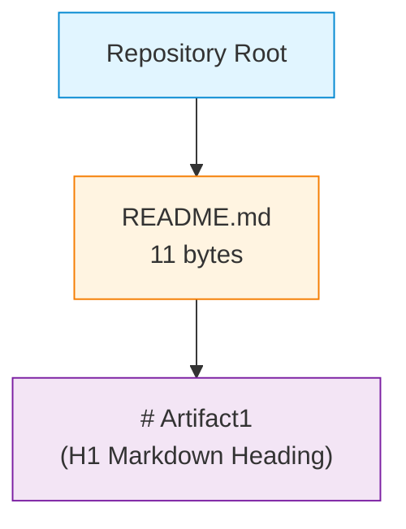

#### Core Technical Approach

The repository does not declare a technology stack, framework selection, language preference, architectural style, or implementation methodology. The following technology categories show **no evidence** of selection or commitment:

| Technical Category | Status |
|--------------------|--------|
| Programming language(s) | None declared (no source files exist) |
| Frameworks / runtimes | None declared (no dependency manifests exist) |
| Build / packaging tooling | None declared (no `Makefile`, `package.json`, `pom.xml`, etc.) |
| Persistence layer | None declared |
| Deployment / containerization | None declared (no `Dockerfile` or orchestration manifests) |
| Continuous integration / delivery | None declared (no `.github/workflows`, `.gitlab-ci.yml`, etc.) |
| Testing approach | None declared (no test files or test runners) |
| Code quality / linting | None declared (no linter or formatter configuration) |

### 1.2.3 Success Criteria

#### Measurable Objectives

No measurable objectives are documented in the repository. The single `README.md` file does not contain goal statements, target outcomes, acceptance criteria, or completion milestones.

#### Critical Success Factors

No critical success factors are documented in the repository. There is no statement of risks, dependencies, organizational prerequisites, or conditions that must be satisfied for the project to succeed.

#### Key Performance Indicators (KPIs)

No KPIs, metrics, telemetry definitions, or performance targets are documented in the repository. No monitoring instrumentation, observability configuration, or measurement tooling is declared.

| Success Criterion | Defined in Repository? |
|-------------------|------------------------|
| Quantitative objectives | No |
| Qualitative objectives | No |
| Critical success factors | No |
| Performance KPIs | No |
| Quality / reliability targets | No |
| Adoption / usage targets | No |

## 1.3 SCOPE

This section delineates what is presently within the scope of the repository, based exclusively on observed artifacts, and what is explicitly outside the scope of the repository in its current state.

### 1.3.1 In-Scope Elements

#### Core Features and Functionalities

Based on observable repository contents, the in-scope feature set is restricted to the following:

| In-Scope Item | Evidence | Description |
|---------------|----------|-------------|
| Project identifier declaration | `README.md` | Establishes the project name "Artifact1" via an H1 Markdown heading |
| Version-controlled documentation | Git history (1 commit) | Maintains the project identifier under source control |

No other features, workflows, or capabilities are presently in-scope based on repository evidence.

#### Primary User Workflows

No user-facing workflows are implemented or documented. The only "workflow" supported is the act of a reader opening the `README.md` file to observe the project name.

#### Essential Integrations

No integrations are presently in-scope. The repository declares no connections to external systems, services, APIs, databases, or platforms.

#### Key Technical Requirements

No technical requirements are documented. The repository does not specify language versions, runtime versions, hardware specifications, performance thresholds, security postures, or compliance obligations.

### 1.3.2 Implementation Boundaries

#### System Boundaries

The system boundary in its current state encloses exactly one Markdown documentation file at the repository root. There are no service boundaries, network boundaries, trust boundaries, or process boundaries to delineate, because no executable processes or services exist.

| Boundary Type | Current Definition |
|---------------|--------------------|
| Repository boundary | Single file (`README.md`) at the repository root |
| Service boundary | Not applicable — no services exist |
| Trust / security boundary | Not applicable — no authentication or authorization surface exists |
| Network boundary | Not applicable — no network endpoints exist |

#### User Groups Covered

No user groups are explicitly covered. The repository's audience is implicitly limited to any party who can read a public Markdown file; no role-based segmentation, access control, or persona-driven scoping is established.

#### Geographic / Market Coverage

No geographic or market coverage is declared. The repository contains no references to regions, locales, regulatory jurisdictions, languages (beyond the English-language project name), or market segments.

#### Data Domains Included

No data domains are included. The repository contains no schemas, data models, entity definitions, taxonomies, or master data references. The only "data" present is the 11-byte string `# Artifact1` constituting the README contents.

### 1.3.3 Out-of-Scope Elements

The following list enumerates capabilities and concerns that are **not currently within the scope** of the repository. This list reflects the present, observable state and does not preclude any of these items from being incorporated in future revisions.

#### Excluded Features and Capabilities

| Excluded Category | Rationale |
|-------------------|-----------|
| Executable application logic | No source code files exist in the repository |
| User interface (web, mobile, desktop, CLI) | No UI assets, templates, or interface code exist |
| Application programming interfaces (REST, GraphQL, gRPC, etc.) | No API definitions or implementation code exist |
| Data persistence (relational, NoSQL, file-based, in-memory) | No persistence layer or data access code exists |
| Authentication and authorization mechanisms | No identity, session, or access-control implementation exists |
| Business logic, domain models, or workflow engines | No domain modeling or business rule code exists |
| Background processing, batch jobs, or scheduling | No job definitions or scheduler configuration exist |
| Reporting, analytics, or data visualization | No reporting code or analytics integration exists |
| Internationalization or localization | No locale files or translation infrastructure exist |
| Logging, monitoring, or observability | No instrumentation, log configuration, or telemetry exists |

#### Future Phase Considerations

Because the repository contains no roadmap, milestones, backlog, or planning artifacts, no specific future phases are documented. Any future work — including the addition of source code, the declaration of dependencies, the introduction of build tooling, the creation of tests, or the establishment of deployment pipelines — falls outside the present scope and will require subsequent specification revisions.

#### Integration Points Not Covered

All integration points are out-of-scope in the current state. This explicitly includes (but is not limited to): identity providers, payment processors, email/SMS gateways, cloud platform services (AWS, Azure, GCP), container orchestrators (Kubernetes, Docker Swarm), message brokers (Kafka, RabbitMQ, SQS), object storage (S3, GCS, Azure Blob), search indices (Elasticsearch, OpenSearch), caching layers (Redis, Memcached), and any third-party API consumers or providers.

#### Unsupported Use Cases

All use cases beyond the static rendering of the `README.md` file as a Markdown document are unsupported in the present repository state. No interactive, transactional, batch, real-time, or streaming use cases are presently realizable.

## 1.4 DOCUMENTATION CONTEXT AND CAVEATS

### 1.4.1 Basis of This Specification

This Technical Specification is grounded exclusively in the artifacts presently contained in the repository. Every claim about scope, capabilities, components, integrations, and stakeholders has been verified against the repository's actual contents:

- **Files inspected:** 1 (`README.md`, 11 bytes, containing the literal text `# Artifact1`)
- **Folders inspected:** 1 (repository root, containing only `README.md`)
- **Commits in history:** 1 (initial commit dated May 29, 2026)

### 1.4.2 Limitations of This Specification

Due to the minimal state of the repository, this specification cannot — and does not — assert claims about:

- The intended purpose or business rationale of the project
- Future planned capabilities or feature roadmaps
- Target users, customers, or market segments
- Performance, scalability, security, or compliance characteristics
- Architectural style, technology stack, or implementation strategy

Any such information, once established through future contributions to the repository, will be reflected in subsequent revisions of this Technical Specification.

### 1.4.3 Conventions Used in This Document

Throughout this specification, the following conventions are employed:

| Convention | Meaning |
|------------|---------|
| "Not defined in current repository state" | The repository contains no artifacts that document this element |
| "No evidence found" | An exhaustive search of repository contents produced no matching artifacts |
| "Not applicable" | The element does not apply to the current repository structure |

#### References

The following repository artifacts were examined in the preparation of this section:

- `README.md` — The sole content file at the repository root. An 11-byte Markdown document containing exactly one line: the H1 heading `# Artifact1`. This file is the source of the project identifier used throughout this specification and is the only artifact providing repository content.
- `/` (repository root directory) — The top-level repository folder. Confirmed to contain exactly one child file (`README.md`) and no subdirectories. This directory listing established the absence of any source code folders, configuration folders, test folders, CI/CD folders, or supplementary documentation folders.
- Git commit history — A single commit (`9e0722ace21443bfac8a1400eab45ceacf9fe8dd`, "Initial commit", authored by Blitzy-Multi on May 29, 2026) provided the temporal context and authorship attribution used in §1.1.1 and §1.1.3.

# 2. Product Requirements

## 2.1 INTRODUCTION AND METHODOLOGY

### 2.1.1 Scope of Requirements Documentation

This section enumerates the product requirements derivable exclusively from the present, observable state of the repository. As established in §1.4 (Documentation Context and Caveats), the specification adheres strictly to evidence-based documentation conventions and refrains from fabricating features, requirements, or capabilities that are not substantiated by repository artifacts.

The repository's complete, verified inventory comprises exactly one file (`README.md`, 11 bytes) located at the repository root, containing the literal text `# Artifact1` on a single line. Consequently, the catalog of product requirements documented herein is intentionally minimal and reflects the early-stage placeholder nature of the repository (see §1.1.1).

### 2.1.2 Documentation Conventions Applied

Throughout this section, the conventions from §1.4.3 are applied without modification:

| Convention | Application in §2 |
|------------|--------------------|
| "Not defined in current repository state" | Used where no repository artifact documents the relevant requirement attribute |
| "No evidence found" | Used where exhaustive search of repository contents produced no matching artifact |
| "Not applicable" | Used where a requirement attribute does not apply to the current repository structure |

### 2.1.3 Feature Identification Approach

Features documented in this catalog are derived directly from the in-scope elements enumerated in §1.3.1 ("Core Features and Functionalities"). Each enumerated in-scope item is treated as a candidate feature, evaluated against the repository's verifiable content, and assigned a unique `F-XXX` identifier where evidence supports its enumeration as a discrete, testable feature. No additional features are introduced from inference, intuition, or speculation about future development; this constraint is enforced consistent with the section directive prohibiting fabricated features.

## 2.2 FEATURE CATALOG

### 2.2.1 Feature Inventory Summary

The complete inventory of features identified in the repository is presented below. The inventory contains exactly two features, each corresponding to an in-scope element documented in §1.3.1.

| Feature ID | Feature Name | Category | Status |
|-----------|--------------|----------|--------|
| F-001 | Project Identifier Declaration | Documentation / Metadata | Completed |
| F-002 | Version-Controlled Documentation | Source Control / Documentation | Completed |

### 2.2.2 F-001: Project Identifier Declaration

#### 2.2.2.1 Feature Metadata

| Attribute | Value |
|-----------|-------|
| Unique ID | F-001 |
| Feature Name | Project Identifier Declaration |
| Feature Category | Documentation / Metadata |
| Priority Level | Not defined in current repository state |
| Status | Completed |

The "Priority Level" attribute is recorded as "Not defined in current repository state" because the repository contains no backlog, roadmap, product requirements document, or other artifact that would substantiate a priority designation. The "Status" attribute is recorded as **Completed** because the feature is observably realized in the repository — the README file exists, is well-formed Markdown, and contains the H1 heading that establishes the project identifier.

#### 2.2.2.2 Description

**Overview.** This feature establishes the project's display name, "Artifact1", through a single H1 Markdown heading in the file `README.md` located at the repository root. The heading is the sole content of the file, which totals 11 bytes (the literal string `# Artifact1`).

**Business Value.** Not defined in current repository state. The repository contains no business case, value proposition, ROI projection, or marketing narrative articulating the business value of this declaration (consistent with §1.1.4).

**User Benefits.** The declaration provides a human-readable, rendered project label visible to any reader who opens `README.md` directly or views the repository via a Git hosting interface that renders Markdown. No other user benefits are documented in the repository.

**Technical Context.** The feature relies on the universal Markdown rendering convention by which a line beginning with `# ` followed by text is recognized as a top-level (H1) heading. No runtime, framework, build process, or compilation step is required to realize this feature; the heading is rendered by any standard Markdown viewer or hosting platform.

#### 2.2.2.3 Dependencies

| Dependency Category | Status |
|---------------------|--------|
| Prerequisite Features | None — F-001 has no functional predecessors within the catalog |
| System Dependencies | A Markdown-rendering display surface (e.g., a text editor, terminal viewer, or web-based Git hosting interface) |
| External Dependencies | None — no third-party libraries, services, or platforms are required (consistent with §1.2.1) |
| Integration Requirements | None — no integration points exist (per §1.2.1 and §1.3.3) |

### 2.2.3 F-002: Version-Controlled Documentation

#### 2.2.3.1 Feature Metadata

| Attribute | Value |
|-----------|-------|
| Unique ID | F-002 |
| Feature Name | Version-Controlled Documentation |
| Feature Category | Source Control / Documentation |
| Priority Level | Not defined in current repository state |
| Status | Completed |

#### 2.2.3.2 Description

**Overview.** This feature maintains the project identifier (and any future repository content) under Git source control, providing a verifiable commit history record. As of this specification, the commit history contains exactly one commit: `9e0722ace21443bfac8a1400eab45ceacf9fe8dd` ("Initial commit"), authored by *Blitzy-Multi* (`mmwforfinance@gmail.com`) on May 29, 2026 (per §1.1.1 and §1.4.1).

**Business Value.** Not defined in current repository state.

**User Benefits.** Provides an auditable record of changes to the repository, enabling identification of who authored which change and when. With only a single commit currently present, the record is minimal but extensible as additional contributions are introduced.

**Technical Context.** The feature relies on Git as the underlying version control system. No Git configuration files (`.gitignore`, `.gitattributes`, etc.) are present in the working tree; only default Git behavior is observed. No Git-hosting platform integration is declared in the repository (consistent with §1.2.1).

#### 2.2.3.3 Dependencies

| Dependency Category | Status |
|---------------------|--------|
| Prerequisite Features | None — F-002 has no functional predecessors within the catalog |
| System Dependencies | Git version control system (any compatible version) |
| External Dependencies | None — no third-party hosting, signing, or distribution platform is declared |
| Integration Requirements | None — no hooks, webhooks, or CI/CD integrations are configured (per §1.2.2) |

## 2.3 FUNCTIONAL REQUIREMENTS TABLE

### 2.3.1 F-001 Functional Requirements

#### 2.3.1.1 F-001-RQ-001 — README File Presence

| Attribute | Value |
|-----------|-------|
| Requirement ID | F-001-RQ-001 |
| Description | The repository SHALL contain a `README.md` file at the repository root |
| Acceptance Criteria | A file named `README.md` exists at the repository root and is enumerated in the root directory listing |
| Priority | Must-Have |

| Attribute | Value |
|-----------|-------|
| Complexity | Low |
| Input Parameters | None |
| Output / Response | File `README.md` observable at repository root (verifiable via filesystem listing or Git tree) |
| Performance Criteria | Not applicable — static file presence has no runtime performance dimension |

| Attribute | Value |
|-----------|-------|
| Data Requirements | A single regular file accessible at the path `README.md` |
| Business Rule | Not defined in current repository state |
| Data Validation | File MUST be a regular file (not a symbolic link or directory) accessible at the root path |
| Security Requirement | Not defined in current repository state |
| Compliance Requirement | Not defined in current repository state |

#### 2.3.1.2 F-001-RQ-002 — H1 Heading Project Identifier

| Attribute | Value |
|-----------|-------|
| Requirement ID | F-001-RQ-002 |
| Description | The `README.md` file SHALL declare the project identifier via an H1 Markdown heading |
| Acceptance Criteria | The first line of `README.md` matches the pattern `# <project-name>`; the observed value is exactly `# Artifact1` |
| Priority | Must-Have |

| Attribute | Value |
|-----------|-------|
| Complexity | Low |
| Input Parameters | None |
| Output / Response | Rendered H1 heading "Artifact1" when displayed by any standard Markdown renderer |
| Performance Criteria | Not applicable — Markdown rendering of a single line is computationally trivial |

| Attribute | Value |
|-----------|-------|
| Data Requirements | 11 bytes of UTF-8/ASCII-encoded Markdown text containing the literal string `# Artifact1` |
| Business Rule | Not defined in current repository state |
| Data Validation | The file's first line MUST conform to the CommonMark/GFM H1 syntax (`^# .+$`) |
| Security Requirement | Not defined in current repository state |
| Compliance Requirement | Not defined in current repository state |

### 2.3.2 F-002 Functional Requirements

#### 2.3.2.1 F-002-RQ-001 — Git Repository Initialization

| Attribute | Value |
|-----------|-------|
| Requirement ID | F-002-RQ-001 |
| Description | The repository SHALL be initialized as a valid Git repository containing at least one commit |
| Acceptance Criteria | `git log` returns at least one commit; the present state shows exactly one commit with SHA `9e0722ace21443bfac8a1400eab45ceacf9fe8dd` |
| Priority | Must-Have |

| Attribute | Value |
|-----------|-------|
| Complexity | Low |
| Input Parameters | None |
| Output / Response | Valid Git commit history retrievable via standard Git tooling |
| Performance Criteria | Not applicable |

| Attribute | Value |
|-----------|-------|
| Data Requirements | A valid `.git/` directory structure managed by Git |
| Business Rule | Not defined in current repository state |
| Data Validation | Commit history MUST be readable via standard Git commands without corruption |
| Security Requirement | Not defined in current repository state |
| Compliance Requirement | Not defined in current repository state |

#### 2.3.2.2 F-002-RQ-002 — Project Identifier Under Version Control

| Attribute | Value |
|-----------|-------|
| Requirement ID | F-002-RQ-002 |
| Description | The `README.md` file containing the project identifier SHALL be tracked in the Git repository |
| Acceptance Criteria | `README.md` appears in the output of `git ls-files` for the repository's current `HEAD` |
| Priority | Must-Have |

| Attribute | Value |
|-----------|-------|
| Complexity | Low |
| Input Parameters | None |
| Output / Response | `README.md` enumerated as a tracked file in the current Git index/tree |
| Performance Criteria | Not applicable |

| Attribute | Value |
|-----------|-------|
| Data Requirements | The README content (11 bytes) tracked as a Git blob within the working tree |
| Business Rule | Not defined in current repository state |
| Data Validation | The file MUST be tracked (not untracked or ignored) by Git |
| Security Requirement | Not defined in current repository state |
| Compliance Requirement | Not defined in current repository state |

## 2.4 FEATURE RELATIONSHIPS

### 2.4.1 Feature Dependency Map

The repository contains a single evidence-supported relationship between the two enumerated features. As stated in §1.3.1, the in-scope item "Version-Controlled Documentation" is described as one that "Maintains the project identifier under source control" — this directly establishes that F-002 preserves the artifact realized by F-001. The relationship is one of preservation/containment rather than a runtime functional dependency. No other relationships are documented because no other relationships are evident in the repository (consistent with the section directive prohibiting imagined relationships).

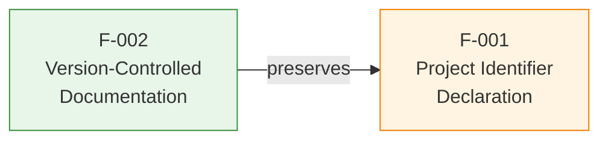

### 2.4.2 Integration Points

No integration points exist between features or between this system and any external system. Per §1.2.1 ("Integration with Existing Enterprise Landscape") and §1.3.3 ("Integration Points Not Covered"), the repository declares no external APIs, databases, message brokers, identity providers, or third-party services.

| Integration Surface | Status |
|--------------------|--------|
| Inter-feature integration | None beyond the preservation relationship (F-002 → F-001) |
| External system integration | None — no external connections declared (§1.2.1) |
| Platform integration | None — no Git-hosting platform integration configured |
| Build/runtime integration | None — no build, test, or deployment integration exists (§1.2.2) |

### 2.4.3 Shared Components

No shared components exist between features. The repository contains no library code, no utility modules, no shared schemas, and no common configuration. Each feature is realized through entirely distinct artifacts:

| Feature | Realizing Artifact |
|---------|--------------------|
| F-001 | The literal Markdown content of `README.md` (the 11-byte string `# Artifact1`) |
| F-002 | The Git `.git/` directory structure and commit history |

### 2.4.4 Common Services

No common services exist. The repository declares no runtime services, background workers, scheduled jobs, or service-oriented components. The repository is entirely static and contains no executable surface (consistent with §1.2.2 "Primary System Capabilities" and §1.3.3 "Excluded Features and Capabilities").

## 2.5 IMPLEMENTATION CONSIDERATIONS

### 2.5.1 F-001 Implementation Considerations

| Consideration | Specification |
|---------------|---------------|
| Technical Constraints | Content MUST be valid Markdown conforming to CommonMark or GitHub Flavored Markdown (GFM), such that an H1 heading is recognized by standard renderers |
| Performance Requirements | Not documented in repository; rendering of a single Markdown heading is computationally trivial |
| Scalability Considerations | Not applicable — static documentation does not scale with load or user volume |
| Security Implications | None observed — the file contains no executable content, no embedded scripts, no external resource references, and no user-input surfaces |

| Consideration | Specification |
|---------------|---------------|
| Maintenance Requirements | Changes occur only if a maintainer edits the heading text or expands the README; no automated maintenance, dependency upgrades, or scheduled refreshes are required |

### 2.5.2 F-002 Implementation Considerations

| Consideration | Specification |
|---------------|---------------|
| Technical Constraints | Repository MUST remain a valid Git repository; no specific Git version is mandated by the repository configuration |
| Performance Requirements | Not documented in repository |
| Scalability Considerations | Not applicable at present — repository contains a single file and a single commit |
| Security Implications | None observed — no credentials, secrets, signing keys, or sensitive metadata are present in the commit |

| Consideration | Specification |
|---------------|---------------|
| Maintenance Requirements | Standard Git operations (commit, push, pull, fetch, merge) constitute the entire maintenance surface; no hooks, signing requirements, or branching policies are configured |

## 2.6 TRACEABILITY MATRIX

### 2.6.1 Requirement-to-Evidence Traceability

Each requirement is traceable to a verifiable artifact in the repository, as enumerated below. This matrix establishes complete bidirectional traceability between requirements documented in §2.3 and the underlying repository evidence.

| Requirement ID | Source Evidence | Verification Method |
|----------------|-----------------|---------------------|
| F-001-RQ-001 | `README.md` at repository root | Directory listing of repository root |
| F-001-RQ-002 | First line of `README.md` = `# Artifact1` | File content inspection (total 11 bytes) |
| F-002-RQ-001 | Git commit `9e0722ace21443bfac8a1400eab45ceacf9fe8dd` | `git log --all --oneline` output |
| F-002-RQ-002 | `README.md` tracked in `HEAD` tree | `git ls-files` output |

### 2.6.2 Cross-References to Related Specification Sections

The following sections of this Technical Specification provide complementary context relevant to the requirements documented above.

| Reference | Related Content |
|-----------|-----------------|
| §1.1.1 Project Overview | Establishes "Artifact1" as the project identifier sourced from `README.md` |
| §1.1.4 Expected Business Impact | Confirms no business value is documented (basis for "Not defined" entries) |
| §1.2.2 Major System Components | Tabulates `README.md` and repository root as the only present components |
| §1.2.2 Primary System Capabilities | Confirms project identifier declaration as the sole realized capability |

| Reference | Related Content |
|-----------|-----------------|
| §1.3.1 Core Features and Functionalities | Source list of in-scope items mapped to F-001 and F-002 |
| §1.3.3 Out-of-Scope Elements | Enumerates capabilities explicitly excluded from current requirements |
| §1.4.2 Limitations of This Specification | Defines categories of claims the specification cannot assert |
| §1.4.3 Conventions Used | Source of the "Not defined in current repository state" convention applied throughout §2 |

### 2.6.3 Related Process Flowcharts

The only process-relevant diagram present in this specification is the structural composition diagram in §1.2.2 ("Major System Components"), which depicts the relationship `Repository Root → README.md → # Artifact1 (H1 Markdown Heading)`. No additional process flowcharts, sequence diagrams, or state machines are referenced because no runtime processes are implemented in the repository (per §1.2.2 and §1.3.3 "Unsupported Use Cases"). The feature dependency diagram in §2.4.1 is the only new diagram introduced in this section.

## 2.7 ASSUMPTIONS, CONSTRAINTS, AND VERSIONING

### 2.7.1 Documented Assumptions

In accordance with §1.4.2, this specification deliberately avoids speculative assumptions. The following minimal assumptions are made strictly to permit evidence-based documentation of the observable artifacts:

| Assumption ID | Assumption | Basis |
|---------------|-----------|-------|
| A-001 | The `README.md` file's content is intended to be rendered as Markdown | The `.md` extension and the H1 syntax conform to standard Markdown conventions |
| A-002 | The project identifier "Artifact1" is intentional and not a placeholder typo | The identifier is consistent with the repository directory name referenced in §1.1.1 |

### 2.7.2 Specification Constraints

The following constraints govern the content of this Product Requirements section and explain the deliberate minimality of the catalog:

| Constraint | Source |
|-----------|--------|
| No fabricated features may be documented | Section prompt directive: "Don't add any features of your own" |
| No fabricated feature relationships may be documented | Section prompt directive: "Don't imagine any feature relationships of your own" |
| Claims must be substantiated by repository artifacts | §1.4.1 "Basis of This Specification" |
| Speculative claims about purpose, roadmap, users, or architecture are prohibited | §1.4.2 "Limitations of This Specification" |

### 2.7.3 Requirement Version Tracking

| Version | Date | Basis Commit | Description |
|---------|------|--------------|-------------|
| 1.0 | May 29, 2026 | `9e0722a` (Initial commit) | Initial requirements derived from the sole commit in the repository |

Future revisions of this section will be triggered by subsequent contributions to the repository that introduce new artifacts (source code, configuration, additional documentation, build manifests, test suites, etc.) bearing on the requirements catalog. At present, no such contributions exist, and the requirements catalog is bounded by the artifacts enumerated above.

#### References

#### Files Examined

- `README.md` — The single 11-byte Markdown file at the repository root; provides the literal content (`# Artifact1`) that grounds feature F-001 and serves as the tracked artifact for feature F-002.
- `/` (repository root) — Verified to contain `README.md` as its sole child; establishes the absence of any other source artifacts, configuration files, or subdirectories, thereby bounding the feature catalog to exactly two features.

#### Git History Inspected

- Single commit `9e0722ace21443bfac8a1400eab45ceacf9fe8dd` ("Initial commit") by *Blitzy-Multi* (`mmwforfinance@gmail.com`), dated May 29, 2026 — Serves as the sole evidence basis for feature F-002 and the acceptance criterion for requirement F-002-RQ-001.

#### Technical Specification Sections Referenced

- §1.1 Executive Summary — Establishes the placeholder nature of the repository and the absence of business problem, stakeholder, and value proposition documentation; informs all "Not defined in current repository state" entries throughout §2.
- §1.2 System Overview — Confirms the sole capability is project identifier declaration and enumerates the absent technology stack and integration categories; basis for §2.4.2, §2.4.3, and §2.4.4.
- §1.3 Scope — Source of the in-scope items mapped to F-001 and F-002, and source of the comprehensive out-of-scope enumeration referenced throughout §2.
- §1.4 Documentation Context and Caveats — Establishes evidence-grounded documentation conventions and explicit limitations applied throughout this section; basis for §2.1.2.

# 3. Technology Stack

## 3.1 Overview and Evidentiary Basis

This section documents the technology stack of the **Artifact1** repository based exclusively on observable artifacts. Per the evidence-grounded methodology established in §1.4.1, every claim in this section is substantiated by direct repository inspection.

### 3.1.1 Repository State Summary

The Artifact1 repository, in its current state, contains a single file — `README.md` (11 bytes) at the repository root — and a single Git commit (`9e0722ace21443bfac8a1400eab45ceacf9fe8dd`, "Initial commit", dated May 29, 2026). The repository contains no source modules, no library packages, no service endpoints, no client applications, no shared utilities, and no data schemas (per §1.2.2). As such, the repository declares **no technology stack in the conventional sense** — no programming languages, no frameworks, no build tooling, no dependency manifests, no deployment infrastructure, and no CI/CD configuration.

The complete inventory of absent technology categories is summarized below, derived directly from the authoritative enumeration in §1.2.2:

| Technical Category | Status in Repository |
|--------------------|----------------------|
| Programming language(s) | None declared (no source files exist) |
| Frameworks / runtimes | None declared (no dependency manifests exist) |
| Build / packaging tooling | None declared (no `Makefile`, `package.json`, `pom.xml`, etc.) |
| Persistence layer | None declared |
| Deployment / containerization | None declared (no `Dockerfile` or orchestration manifests) |
| Continuous integration / delivery | None declared (no `.github/workflows`, `.gitlab-ci.yml`, etc.) |
| Testing approach | None declared (no test files or test runners) |
| Code quality / linting | None declared (no linter or formatter configuration) |

### 3.1.2 Authoritative Constraint on Technology Claims

Per §1.4.2 "Limitations of This Specification", this Technical Specification "cannot — and does not — assert claims about... Architectural style, technology stack, or implementation strategy." Furthermore, the constraint enumerated in §2.7.2 prohibits "Speculative claims about purpose, roadmap, users, or architecture." Consequently, this section documents only the two implicit technology dependencies observable in the artifacts and abstains from prescribing or recommending any speculative stack.

### 3.1.3 Implicit Technologies Observable in the Repository

While the repository declares no explicit stack, two implicit technology dependencies are observable in the artifacts:

| Implicit Technology | Evidence | Specification Reference |
|---------------------|----------|-------------------------|
| Markdown (rendering convention) | `.md` file extension and `# ` H1 syntax in `README.md` | §2.2.2.2 Technical Context; §2.7.1 Assumption A-001 |
| Git (version control system) | Presence of `.git/` repository metadata and a tracked commit history | §2.2.3.2 Technical Context |

These two technologies — Markdown and Git — constitute the **entirety of the technology surface** of the Artifact1 repository in its current state.

---

## 3.2 Programming Languages

### 3.2.1 Declared Languages

**No programming languages are declared in the repository.** Per §1.2.2 "Core Technical Approach", the technical category "Programming language(s)" is recorded as "None declared (no source files exist)." A directory traversal of the repository root confirms the absence of any source-code files in any programming language, including but not limited to `.py`, `.js`, `.ts`, `.java`, `.go`, `.rs`, `.c`, `.cpp`, `.swift`, `.kt`, `.rb`, `.php`, `.cs`, or `.scala`.

### 3.2.2 Implicit Language Convention (Markdown)

The sole language convention observable in the repository is **Markdown**, used for the rendering of `README.md`. Markdown is a lightweight markup language, not a programming language; it produces no executable behavior and requires no runtime, compiler, or interpreter.

| Attribute | Value |
|-----------|-------|
| Name | Markdown |
| Variant / Specification | CommonMark or GitHub Flavored Markdown (GFM) |
| Version | No specific version mandated by the repository |
| Evidence | The `.md` extension and the `# ` H1 heading syntax in `README.md` |
| Justification | Per §2.2.2.2: "The feature relies on the universal Markdown rendering convention by which a line beginning with `# ` followed by text is recognized as a top-level (H1) heading. No runtime, framework, build process, or compilation step is required to realize this feature." |
| Constraint | Per §2.5.1: "Content MUST be valid Markdown conforming to CommonMark or GitHub Flavored Markdown (GFM), such that an H1 heading is recognized by standard renderers." |
| Assumption | Per §2.7.1 Assumption A-001: "The `README.md` file's content is intended to be rendered as Markdown." |

### 3.2.3 Selection Criteria and Constraints

No programming language selection has been made by the repository maintainers. As no source code exists, no selection criteria — performance, ecosystem maturity, team expertise, runtime characteristics, or licensing — apply. The introduction of any programming language to the repository in future contributions will require a subsequent revision of this specification (per §1.4.2).

---

## 3.3 Frameworks and Libraries

### 3.3.1 Declared Frameworks

**No frameworks are declared in the repository.** Per §1.2.2, the technical category "Frameworks / runtimes" is recorded as "None declared (no dependency manifests exist)." The repository contains no framework configuration files, no framework-specific directory conventions (e.g., `src/`, `app/`, `pages/`, `views/`, `controllers/`), and no framework imports or references.

### 3.3.2 Declared Libraries

**No supporting libraries are declared in the repository.** The repository contains no library import statements, no vendored library code, no library configuration files, and no references to library APIs.

### 3.3.3 Compatibility and Version Considerations

No compatibility requirements or version constraints apply, as no frameworks or libraries have been selected. The only version-related constraint observable in the repository is that, per §2.5.1, Markdown content must conform to CommonMark or GFM such that an H1 heading is recognized by standard renderers — this is a content-format constraint rather than a framework or library version constraint.

---

## 3.4 Open Source Dependencies

### 3.4.1 Dependency Manifests

**No dependency manifests exist in the repository.** A complete inventory of dependency manifest files searched for (none of which were found) includes:

| Manifest File | Ecosystem | Present? |
|---------------|-----------|----------|
| `package.json`, `package-lock.json`, `yarn.lock`, `pnpm-lock.yaml` | Node.js / npm | No |
| `requirements.txt`, `Pipfile`, `Pipfile.lock`, `pyproject.toml`, `poetry.lock`, `setup.py`, `setup.cfg` | Python | No |
| `Gemfile`, `Gemfile.lock` | Ruby | No |
| `pom.xml`, `build.gradle`, `build.gradle.kts`, `settings.gradle` | Java / JVM | No |
| `Cargo.toml`, `Cargo.lock` | Rust | No |
| `go.mod`, `go.sum` | Go | No |
| `composer.json`, `composer.lock` | PHP | No |
| `*.csproj`, `*.sln`, `packages.config` | .NET | No |
| `Podfile`, `Cartfile`, `Package.swift` | Swift / iOS | No |
| `mix.exs` | Elixir | No |

### 3.4.2 Package Registries

No package registries (npm, PyPI, Maven Central, RubyGems, crates.io, NuGet, etc.) are referenced or consumed by the repository.

### 3.4.3 Third-Party Libraries

No third-party open-source libraries are vendored, imported, or referenced in the repository. The repository's complete content — the 11-byte string `# Artifact1` in `README.md` — contains no library references.

---

## 3.5 Third-Party Services

### 3.5.1 External APIs and Integrations

**No external APIs or third-party integrations are declared or configured in the repository.** Per §1.2.1 "Integration with Existing Enterprise Landscape", the following integration categories all show no evidence in the repository:

| Integration Category | Evidence in Repository |
|----------------------|------------------------|
| External APIs | None referenced |
| Database systems | None referenced |
| Message brokers / event streams | None referenced |
| Identity / authentication providers | None referenced |
| Third-party services or SaaS platforms | None referenced |

### 3.5.2 Authentication Services

**No authentication services are integrated.** Per §1.3.3 "Excluded Features and Capabilities", authentication and authorization mechanisms are explicitly out-of-scope because "no identity, session, or access-control implementation exists." No identity provider (Auth0, Okta, Azure AD, Cognito, Keycloak, etc.) is configured.

### 3.5.3 Monitoring and Observability

**No monitoring, logging, or observability services are integrated.** Per §1.3.3, "Logging, monitoring, or observability" is explicitly out-of-scope because "no instrumentation, log configuration, or telemetry exists." No application performance monitoring (Datadog, New Relic, Dynatrace), log aggregation (Splunk, ELK, CloudWatch Logs), or error tracking (Sentry, Rollbar) tooling is referenced.

### 3.5.4 Cloud Services

**No cloud platform services are integrated.** Per §1.3.3 "Integration Points Not Covered", all integration points are out-of-scope in the current state, "explicitly includ[ing] (but is not limited to): identity providers, payment processors, email/SMS gateways, cloud platform services (AWS, Azure, GCP), container orchestrators (Kubernetes, Docker Swarm), message brokers (Kafka, RabbitMQ, SQS), object storage (S3, GCS, Azure Blob), search indices (Elasticsearch, OpenSearch), caching layers (Redis, Memcached), and any third-party API consumers or providers."

---

## 3.6 Databases and Storage

### 3.6.1 Primary and Secondary Databases

**No databases are configured or referenced in the repository.** Per §1.3.3, "Data persistence (relational, NoSQL, file-based, in-memory)" is explicitly out-of-scope because "no persistence layer or data access code exists." Neither relational (PostgreSQL, MySQL, SQL Server, Oracle, SQLite) nor NoSQL (MongoDB, DynamoDB, Cassandra, Couchbase) database systems are configured.

### 3.6.2 Caching Solutions

**No caching solutions are configured.** No in-memory cache (Redis, Memcached), distributed cache (Hazelcast), or HTTP/CDN caching layer is referenced in the repository (per §1.3.3).

### 3.6.3 Storage Services

**No storage services are integrated.** No object storage (S3, GCS, Azure Blob Storage), block storage, file storage, or content delivery network is referenced. The only "data" present in the repository is the 11-byte string `# Artifact1` constituting the README contents (per §1.3.2 "Data Domains Included").

### 3.6.4 Data Persistence Strategy

No data persistence strategy applies, as no data domains, schemas, entity definitions, or data models exist (per §1.3.2). The repository's persistence model is reducible to the file-system persistence of a single Markdown document under Git source control.

---

## 3.7 Development and Deployment

### 3.7.1 Version Control System (Git)

The repository is managed under Git source control. This is the **only development or deployment technology observable** in the repository.

| Attribute | Value |
|-----------|-------|
| Name | Git |
| Version | No specific version mandated; per §2.5.2: "Repository MUST remain a valid Git repository; no specific Git version is mandated by the repository configuration" |
| Configuration Files Present | None — no `.gitignore`, `.gitattributes`, `.gitmodules`, or other Git configuration files exist (per §2.2.3.2) |
| Commit History | One commit: `9e0722ace21443bfac8a1400eab45ceacf9fe8dd` ("Initial commit"), authored by *Blitzy-Multi* (`mmwforfinance@gmail.com`) on May 29, 2026 |
| Hosting Platform | None declared — "No Git-hosting platform integration is declared in the repository" (per §2.2.3.2) |
| Justification | Provides "an auditable record of changes to the repository, enabling identification of who authored which change and when" (per §2.2.3.2 User Benefits) |
| Security Implications | Per §2.5.2: "None observed — no credentials, secrets, signing keys, or sensitive metadata are present in the commit" |
| Maintenance Surface | Per §2.5.2: "Standard Git operations (commit, push, pull, fetch, merge) constitute the entire maintenance surface; no hooks, signing requirements, or branching policies are configured" |

### 3.7.2 Build System

**No build system is configured.** No `Makefile`, `Rakefile`, `build.sh`, `gulpfile.js`, `webpack.config.js`, `vite.config.js`, `rollup.config.js`, `tsconfig.json`, `tox.ini`, or any other build configuration file exists in the repository (per §1.2.2). Because the only artifact is a static Markdown file, no build, compilation, transpilation, bundling, or packaging step is required to realize the repository's functionality (per §2.2.2.2).

### 3.7.3 Containerization

**No containerization is configured.** No `Dockerfile`, `docker-compose.yml`, `Containerfile`, `.dockerignore`, or Kubernetes manifest (`*.yaml` in a `k8s/` or `manifests/` directory) exists in the repository (per §1.2.2). Container orchestrators (Kubernetes, Docker Swarm, Nomad) are explicitly enumerated as out-of-scope in §1.3.3.

### 3.7.4 Continuous Integration and Continuous Delivery

**No CI/CD configuration is present.** A directory listing of the repository root confirms the absence of all CI/CD configuration paths, including:

| CI/CD Provider | Expected Path | Present? |
|----------------|---------------|----------|
| GitHub Actions | `.github/workflows/` | No |
| GitLab CI | `.gitlab-ci.yml` | No |
| CircleCI | `.circleci/config.yml` | No |
| Travis CI | `.travis.yml` | No |
| Jenkins | `Jenkinsfile` | No |
| Azure Pipelines | `azure-pipelines.yml` | No |
| Bitbucket Pipelines | `bitbucket-pipelines.yml` | No |
| AWS CodeBuild | `buildspec.yml` | No |

Per §2.2.3.3, the repository declares "no hooks, webhooks, or CI/CD integrations are configured."

### 3.7.5 Development Tools

No specific development tools (IDEs, editors, linters, formatters, test runners) are mandated or configured by the repository. The minimal development surface — a single Markdown file under Git source control — can be edited with any text editor capable of producing valid CommonMark or GFM Markdown (per §2.5.1).

| Tool Category | Configuration in Repository |
|---------------|----------------------------|
| Linters / formatters (ESLint, Prettier, Black, RuboCop, etc.) | None |
| Test runners (Jest, pytest, JUnit, RSpec, etc.) | None |
| Code coverage tools | None |
| Static analysis (SonarQube, CodeClimate, etc.) | None |
| Pre-commit hooks (husky, pre-commit, etc.) | None |
| Editor configuration (`.editorconfig`, `.vscode/`, `.idea/`) | None |

---

## 3.8 Technology Stack Diagram

The following diagram visualizes the complete technology surface of the Artifact1 repository in its current state. The diagram is intentionally minimal because the repository's technology surface is intentionally minimal.

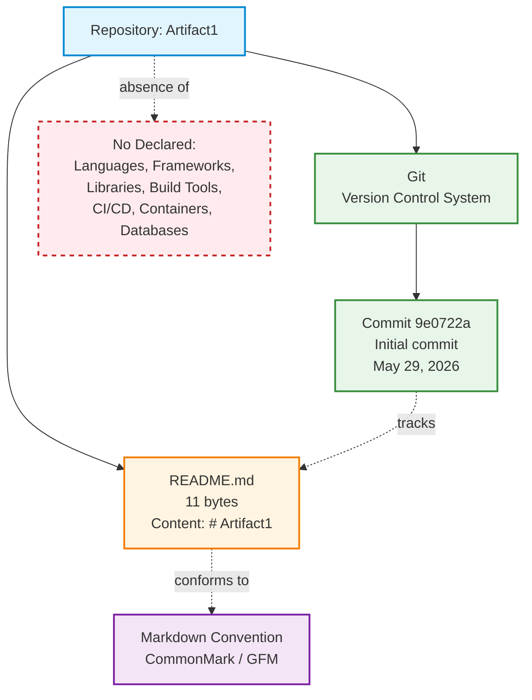

---

## 3.9 Default Technology Stack Applicability Analysis

The section prompt provides a default technology stack (AWS, Docker, Terraform, GitHub Actions, Python/Flask, Auth0, MongoDB, Langchain, React/TypeScript, TailwindCSS, React-Native, Swift, Kotlin, Objective-C, ElectronJS). Per the prompt directive — *"Only include sections and items that are actually relevant to this system, based on your analysis of its requirements. Don't add any items that aren't clearly applicable"* — each default item has been evaluated against repository evidence.

### 3.9.1 Item-by-Item Applicability Determination

| Default Stack Item | Category | Applicable? | Evidence-Based Rationale |
|--------------------|----------|-------------|--------------------------|
| AWS | Cloud Platform | No | Cloud platform services are explicitly out-of-scope per §1.3.3; no cloud configuration files exist |
| Docker | Containerization | No | No `Dockerfile` or container configuration exists (per §1.2.2) |
| Terraform | Infrastructure as Code | No | No `.tf` files exist; no IaC declared |
| GitHub Actions | CI/CD | No | No `.github/workflows/` directory exists (per §1.2.2) |
| Python | Backend Language | No | No `.py` source files exist (per §1.2.2) |
| Flask | Backend Framework | No | No `requirements.txt`, no Python source files, no framework configuration |
| Auth0 | Authentication | No | Authentication mechanisms are explicitly out-of-scope per §1.3.3 |
| MongoDB | Database | No | Data persistence is explicitly out-of-scope per §1.3.3 |
| Langchain | AI Framework | No | No AI/ML code or configuration exists |
| React + TypeScript | Web Frontend | No | "User interface (web, mobile, desktop, CLI)" is explicitly out-of-scope per §1.3.3 |
| TailwindCSS | CSS Framework | No | No CSS, HTML, or UI assets exist |
| React-Native + TypeScript | Mobile Frontend | No | No mobile code or configuration exists |
| Swift | iOS Native | No | No iOS code or `Package.swift` exists |
| Kotlin | Android Native | No | No Android code or `build.gradle` exists |
| Objective-C | macOS Native | No | No macOS code exists |
| ElectronJS | Desktop | No | No desktop application code exists |

### 3.9.2 Conclusion of Applicability Analysis

**Zero items from the default technology stack are applicable to the Artifact1 repository in its current state.** Including any of these items in this specification would constitute a fabricated technology selection, which would violate:

1. The section prompt's "actually relevant" directive
2. The §1.4.2 limitation: "this specification cannot — and does not — assert claims about... Architectural style, technology stack, or implementation strategy"
3. The §2.7.2 constraint: "Speculative claims about purpose, roadmap, users, or architecture are prohibited"
4. The evidence-based documentation conventions established in §1.4.1

---

## 3.10 Version Tracking and Future Revisions

### 3.10.1 Current Specification Version

Consistent with the version tracking pattern established in §2.7.3, the technology stack documented in this section corresponds to the following repository basis:

| Attribute | Value |
|-----------|-------|
| Specification Version | 1.0 |
| Basis Commit | `9e0722ace21443bfac8a1400eab45ceacf9fe8dd` ("Initial commit") |
| Basis Date | May 29, 2026 |
| Files Inspected | 1 (`README.md`) |
| Folders Inspected | 1 (repository root) |
| Commits in History | 1 |

### 3.10.2 Triggers for Future Revisions

Any future contribution to the repository that introduces technology-stack-bearing artifacts will trigger a subsequent revision of this section. Such triggering artifacts include (but are not limited to):

- Dependency manifests (`package.json`, `requirements.txt`, `pom.xml`, `Cargo.toml`, etc.)
- Source code files in any programming language
- Build configuration (`Makefile`, `webpack.config.js`, `pyproject.toml`, etc.)
- Containerization manifests (`Dockerfile`, `docker-compose.yml`)
- Infrastructure-as-code files (`.tf`, `.bicep`, CloudFormation templates)
- CI/CD configuration (`.github/workflows/`, `.gitlab-ci.yml`, etc.)
- Database schemas, migration files, or ORM models
- Configuration files declaring third-party service integrations

Per §1.4.2, "Any such information, once established through future contributions to the repository, will be reflected in subsequent revisions of this Technical Specification."

---

## 3.11 Summary

The Technology Stack of the Artifact1 repository, as of specification version 1.0 (basis commit `9e0722a`), consists exclusively of two implicit technology dependencies:

| Technology | Role | Constraint | Reference |
|------------|------|------------|-----------|
| **Markdown** (CommonMark / GFM) | Documentation rendering convention for `README.md` | Content MUST conform to CommonMark or GFM such that the H1 heading is recognized by standard renderers | §2.5.1, §2.7.1 (A-001) |
| **Git** | Version control system maintaining the repository's commit history | Repository MUST remain a valid Git repository; no specific Git version is mandated | §2.5.2, §2.2.3.2 |

All other technology stack categories — programming languages, frameworks, libraries, third-party services, databases, containerization, CI/CD, and cloud platforms — are **not declared in the current repository state** and are explicitly out-of-scope per §1.3.3. This section will be revised when future repository contributions introduce explicit technology selections.

---

#### References

#### Repository Files Examined

- `README.md` — The sole 11-byte content file at the repository root, containing the literal text `# Artifact1`. Verified to contain no embedded scripts, no import statements, no configuration directives, and no technology declarations. Provides the evidence basis for the Markdown rendering convention identified in §3.1.3.
- `/` (repository root directory) — Confirmed via folder traversal to contain exactly one child file (`README.md`) and no subdirectories. The absence of `src/`, `app/`, `lib/`, `tests/`, `.github/`, `infra/`, `terraform/`, `docker/`, or any other technology-stack-related folders provides the evidence basis for the "None declared" findings throughout §3.2 through §3.7.

#### Git History Inspected

- Single commit `9e0722ace21443bfac8a1400eab45ceacf9fe8dd` ("Initial commit") by *Blitzy-Multi* (`mmwforfinance@gmail.com`), dated May 29, 2026 — Provides the evidence basis for the Git version control technology identified in §3.7.1 and grounds the version tracking documented in §3.10.

#### Technical Specification Sections Referenced

- **§1.1 Executive Summary** — Establishes the placeholder nature of the repository, informing the "no declared stack" findings throughout this section.
- **§1.2 System Overview** — Source of the authoritative table enumerating absent technology categories (§1.2.2 "Core Technical Approach"); basis for §3.1.1, §3.2.1, §3.3.1, §3.4.1, §3.5.1, §3.6.1, and §3.7.
- **§1.3 Scope** — Source of the explicit out-of-scope enumeration including cloud platforms, container orchestrators, message brokers, object storage, search indices, caching layers, and authentication providers; basis for §3.5, §3.6, and §3.9.
- **§1.4 Documentation Context and Caveats** — Source of the authoritative prohibition in §1.4.2 on asserting technology stack claims; basis for §3.1.2 and §3.9.2.
- **§2.2 Feature Catalog** — Source of the technical context for F-001 (Markdown rendering convention, §2.2.2.2) and F-002 (Git version control, §2.2.3.2); basis for §3.1.3, §3.2.2, and §3.7.1.
- **§2.5 Implementation Considerations** — Source of the CommonMark/GFM content constraint (§2.5.1) and the Git validity constraint (§2.5.2); basis for §3.2.2 and §3.7.1.
- **§2.7 Assumptions, Constraints, and Versioning** — Source of Assumption A-001 (Markdown rendering intent, §2.7.1), the speculative-claims prohibition (§2.7.2), and the version tracking pattern (§2.7.3); basis for §3.1.2, §3.9.2, and §3.10.

# 4. Process Flowchart

## 4.1 Evidentiary Basis and Documentation Approach

### 4.1.1 Evidence Summary

This section documents the process flows, workflows, integrations, state transitions, and error handling pathways present in the Artifact1 repository in its current state. The applicable evidence is enumerated below:

| Evidence Item | Value | Process Implication |
|---------------|-------|---------------------|
| Total tracked files | 1 (`README.md`) | No source modules exist to host process logic |
| Total bytes of content | 11 (the string `# Artifact1`) | No control-flow, branching, or sequencing constructs are present |
| Total Git commits | 1 (`9e0722ace21443bfac8a1400eab45ceacf9fe8dd`) | History is a single-state, non-branching record |
| Source code files | 0 | No runtime processes exist |
| Configuration files | 0 | No process orchestration is configured |
| Build/CI files | 0 | No build, test, or deployment pipelines exist |
| Integration manifests | 0 | No external system connections are declared |

The repository's structural composition is fully captured by the diagram already presented in §1.2.2, which depicts the relationship `Repository Root → README.md → # Artifact1 (H1 Markdown Heading)`. Per §2.6.3, this is "the only process-relevant diagram present in this specification."

### 4.1.2 Methodological Implications

Because the repository implements no executable surface, the Process Flowchart section is constrained to documenting:

1. **Defensible process content** — the static Markdown-rendering act and the Git-history state, which are the only observable behaviors derivable from the present artifacts.
2. **Authoritative absence statements** — for each prompt-mandated subsection (business processes, integrations, state management, error handling, validation rules), a documented "Not applicable" disposition with traceable references to §1.3.3, §2.4.2, and §2.6.3.

This approach is mandated by §1.4.2 of this specification, which prohibits assertions about purpose, roadmap, users, performance, scalability, security, compliance, architectural style, technology stack, or implementation strategy beyond what is observable in the repository. Section §2.7.2 further codifies the prohibition on fabricated features or relationships. The "Not defined in current repository state" / "Not applicable" disposition conventions are inherited from §1.4.3.

### 4.1.3 Section Organization

The remainder of §4 is organized to mirror the requested topical structure (workflows, validation, state management, error handling, diagrams) while substituting evidence-grounded absence statements wherever the repository does not justify a process narrative.

---

## 4.2 System Workflows

### 4.2.1 Core Business Processes

#### 4.2.1.1 End-to-End User Journeys

Per §1.3.1 ("Primary User Workflows"): **"No user-facing workflows are implemented or documented. The only 'workflow' supported is the act of a reader opening the `README.md` file to observe the project name."** This single observable interaction is documented as the sole user journey in §4.5.1 below.

| User Journey Element | Status in Repository |
|----------------------|----------------------|
| User registration / onboarding | Not applicable — no user-management surface exists (§1.3.3) |
| Authentication / login | Not applicable — no authentication mechanism exists (§1.3.3) |
| Transactional workflows | Not applicable — no transactional code exists (§1.3.3) |
| Self-service workflows | Not applicable — no interactive surface exists (§1.3.3) |
| Multi-step form processing | Not applicable — no forms or UI exist (§1.3.3) |
| Notification delivery | Not applicable — no notification subsystem exists (§1.3.3) |

#### 4.2.1.2 System Interactions

Per §2.4.2, the only inter-component relationship documented in the repository is the **preservation relationship F-002 → F-001** (Version-Controlled Documentation preserves Project Identifier Declaration). This is a containment relationship, not a runtime interaction; no message-passing, RPC, request/response, or event-driven coupling exists between any components.

#### 4.2.1.3 Decision Points

No business-logic decision points exist in the repository. The only Markdown-rendering decision (whether a line starts with `# `) is a property of the Markdown rendering convention, not of repository code; it is depicted in §4.5.1 for completeness but is not authored or controlled by this repository.

#### 4.2.1.4 Error Handling Paths

No application-level error handling paths exist. Per §1.3.3, executable application logic, logging, monitoring, and observability are all out-of-scope. Detailed treatment is provided in §4.4.2.

### 4.2.2 Integration Workflows

#### 4.2.2.1 Data Flow Between Systems

Per §2.4.2 and §1.2.1, the repository declares no external system integrations. The complete integration surface evaluation reproduced from §2.4.2 is:

| Integration Surface | Status |
|--------------------|--------|
| Inter-feature integration | None beyond the preservation relationship (F-002 → F-001) |
| External system integration | None — no external connections declared |
| Platform integration | None — no Git-hosting platform integration configured |
| Build/runtime integration | None — no build, test, or deployment integration exists |

#### 4.2.2.2 API Interactions

No APIs are defined, exposed, or consumed by the repository. Per §1.3.3, "Application programming interfaces (REST, GraphQL, gRPC, etc.)" are explicitly excluded because "No API definitions or implementation code exist."

#### 4.2.2.3 Event Processing Flows

No event streams, message brokers, pub/sub topics, or event handlers exist. Per §1.3.3, message brokers (Kafka, RabbitMQ, SQS) are explicitly out-of-scope.

#### 4.2.2.4 Batch Processing Sequences

No batch jobs, scheduled tasks, or recurring processes are configured. Per §1.3.3, "Background processing, batch jobs, or scheduling" are explicitly excluded because "No job definitions or scheduler configuration exist."

---

## 4.3 Flowchart Requirements Coverage Matrix

### 4.3.1 Per-Requirement Documentation

For each element mandated by the §4 prompt, the table below records the disposition supported by repository evidence:

| Required Element | Disposition | Evidence / Reference |
|------------------|-------------|----------------------|
| Start and end points | Defined for the README-rendering act only | §4.5.1 (sole observable workflow per §1.3.1) |
| Process steps | Defined for Markdown rendering only | §4.5.1 |
| Decision diamonds | One — the Markdown `# ` prefix detection (renderer-side) | §4.5.1 |
| System boundaries | Single boundary: the repository root containing `README.md` | §1.3.2 |
| User touchpoints | One — opening `README.md` | §1.3.1 |
| Error states and recovery paths | Not applicable — no executable code exists | §1.3.3, §4.4.2 |
| Timing and SLA considerations | Not applicable — no performance thresholds documented | §1.3.1 ("No technical requirements are documented") |

### 4.3.2 Validation Rules

#### 4.3.2.1 Business Rules at Each Step

No business rules are codified in the repository. Per §1.3.3, "Business logic, domain models, or workflow engines" are explicitly out-of-scope because "No domain modeling or business rule code exists."

#### 4.3.2.2 Data Validation Requirements

No data validation requirements are documented. Per §1.3.2 ("Data Domains Included"), "The repository contains no schemas, data models, entity definitions, taxonomies, or master data references. The only 'data' present is the 11-byte string `# Artifact1` constituting the README contents."

#### 4.3.2.3 Authorization Checkpoints

No authorization checkpoints exist. Per §1.3.3, "Authentication and authorization mechanisms" are explicitly excluded because "No identity, session, or access-control implementation exists." Per §1.3.2, the trust/security boundary is recorded as "Not applicable — no authentication or authorization surface exists."

#### 4.3.2.4 Regulatory Compliance Checks

No regulatory compliance checks are documented. Per §1.3.2 ("Geographic / Market Coverage"), "The repository contains no references to regions, locales, regulatory jurisdictions, languages (beyond the English-language project name), or market segments."

---

## 4.4 Technical Implementation

### 4.4.1 State Management

#### 4.4.1.1 State Transitions

The repository contains exactly one source of state transitions: the **Git commit history**, whose only transition to date is `(empty) → 9e0722ace21443bfac8a1400eab45ceacf9fe8dd` (Initial commit). This is depicted in §4.5.3 below. No application-state, session-state, or domain-state machines exist because no executable surface is present (§1.2.2).

#### 4.4.1.2 Data Persistence Points

The only persistence point is the Git object store backing the single tracked file `README.md`. Per §1.3.3, application-level data persistence — relational, NoSQL, file-based, or in-memory — is out-of-scope because "No persistence layer or data access code exists."

| Persistence Layer | Status |
|-------------------|--------|
| Git object store (`.git/`) | Present — stores 1 commit and 1 tracked blob |
| Application database | Not applicable — none declared |
| File system persistence | Not applicable — no application I/O code exists |
| In-memory caches | Not applicable — see §4.4.1.3 |

#### 4.4.1.3 Caching Requirements

No caching requirements are documented. Per §1.3.3, "Caching layers (Redis, Memcached)" are explicitly excluded from current scope. Markdown viewers may apply rendering caches as part of their own implementation, but no such caching is configured by or declared in this repository.

#### 4.4.1.4 Transaction Boundaries

No application transaction boundaries exist. The only atomic operation defensibly documentable is the Git commit, which atomically records the state of the working tree at a single point in time. Per §2.2.3.3, no Git hooks or signing requirements are configured, so commits proceed under default Git behavior.

### 4.4.2 Error Handling

#### 4.4.2.1 Retry Mechanisms

No retry mechanisms exist in the repository. The absence of executable code (§1.2.2, §1.3.3) means there are no operations that could fail, succeed, or be retried.

#### 4.4.2.2 Fallback Processes

No fallback processes exist. The repository declares no failover paths, no circuit breakers, no graceful-degradation strategies, and no redundancy. Per §1.3.2, no service boundary, network boundary, or trust boundary exists across which fallback would apply.

#### 4.4.2.3 Error Notification Flows

No error notification flows exist. Per §1.3.3, "Logging, monitoring, or observability" are out-of-scope because "No instrumentation, log configuration, or telemetry exists." No email/SMS gateways, paging services, or alerting integrations are declared.

#### 4.4.2.4 Recovery Procedures

No application-level recovery procedures are documented. The only defensible recovery action is the standard Git operation set (commit, push, pull, fetch, merge, revert, reset) as inherited from §2.5.2 implementation considerations; no repository-specific recovery procedures override or supplement default Git behavior.

---

## 4.5 Repository-Defensible Diagrams

The diagrams in this subsection are produced strictly from observable evidence. Diagrams mandated by the §4 prompt that cannot be substantiated by repository contents are explicitly enumerated in §4.5.4 with the reasons for their omission.

### 4.5.1 High-Level System Workflow: README Static Rendering

This diagram depicts the sole observable workflow per §1.3.1 — a reader accessing the repository and viewing the rendered project identifier. Swim lanes separate the human actor, the rendering surface (any standard Markdown viewer), and the repository storage layer. The single decision diamond reflects the Markdown rendering convention (recognition of the `# ` prefix), which is a property of the renderer, not of repository code.

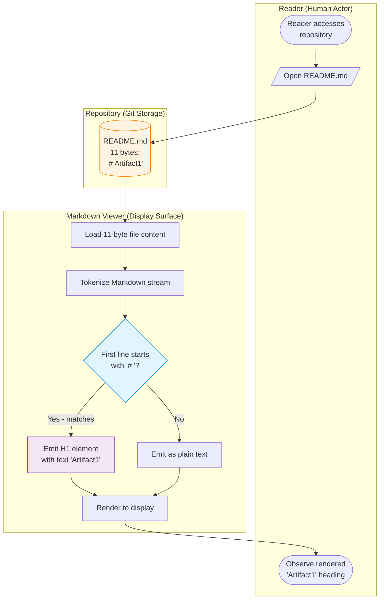

**Workflow notes:**

- **Start point:** Reader accesses the repository (any Git-hosting interface, local clone, or direct file open).
- **End point:** Reader observes the H1-rendered project identifier "Artifact1".
- **System boundary:** The Markdown Viewer lane is external to the repository; the Repository lane contains the only artifact authored within this project.
- **Decision point:** The `# ` prefix detection is intrinsic to Markdown rendering conventions (see §2.2.2.2: "the universal Markdown rendering convention by which a line beginning with `# ` followed by text is recognized as a top-level (H1) heading"). The "No" branch is included for diagrammatic completeness but is not exercised by the actual content of `README.md`.
- **Timing/SLA:** Not applicable — no performance thresholds are documented (§1.3.1).
- **Error states:** None — see §4.5.4 for the rationale.

### 4.5.2 Feature Preservation Relationship

The single inter-feature relationship documented in the repository is the preservation relationship between F-002 (Version-Controlled Documentation) and F-001 (Project Identifier Declaration). This diagram is reproduced from §2.4.1 to provide self-contained context for §4 readers; it remains the canonical authoritative diagram for feature relationships.


**Relationship notes:**

- This is a **preservation/containment** relationship, not a runtime functional dependency (§2.4.1).
- F-001 is realized by the literal Markdown content of `README.md`; F-002 is realized by the Git `.git/` directory and commit history (§2.4.3).
- No additional feature relationships exist (§2.4.1).

### 4.5.3 Git Commit History State Transition

This state diagram represents the only state-transition surface defensibly identifiable in the repository: the Git commit history. As of this specification, the history consists of a single transition from the post-initialization empty state to the committed state established by commit `9e0722ace21443bfac8a1400eab45ceacf9fe8dd`.

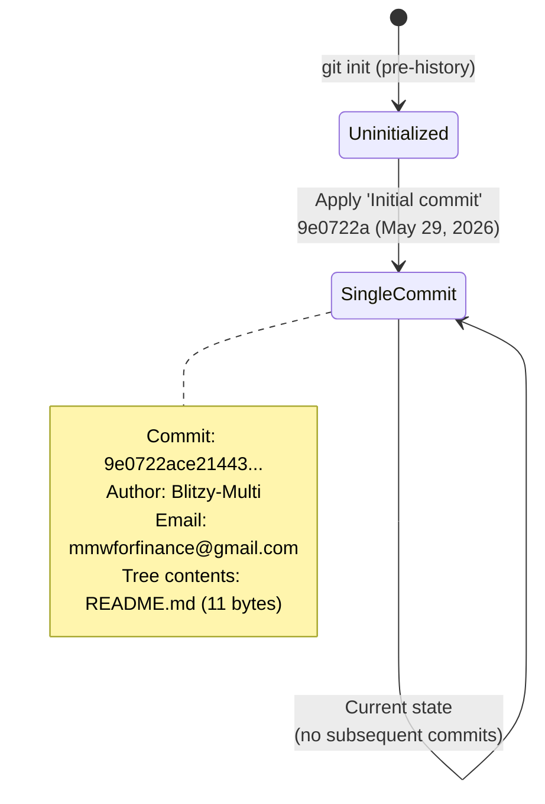

**State diagram notes:**

- **Initial state:** Uninitialized — no commits present.
- **Transition:** A single transition has occurred — application of the `Initial commit` (`9e0722a`).
- **Current state:** SingleCommit — the repository contains exactly one commit (§2.2.3.2, §2.6.1).
- **Future transitions:** Not modeled — per §2.5.2 implementation considerations and §1.4.2 limitations, no roadmap or planned commits are documented.

### 4.5.4 Diagrams That Cannot Be Provided

The §4 prompt requests a set of standard diagrams. Several cannot be provided because the repository does not contain the artifacts that would substantiate them. Producing speculative versions would violate §1.4.2 (limitations of this specification) and §2.7.2 (prohibition on fabricated features/relationships). The following table records each unprovided diagram and the evidentiary reason for its omission:

| Requested Diagram | Reason Not Provided | Authoritative Reference |
|-------------------|---------------------|--------------------------|
| Detailed process flows for each core feature | F-001 is a static document with no procedural realization; F-002 is the Git history itself, fully captured in §4.5.3 | §2.2.2, §2.2.3 |
| Error handling flowcharts | No error-producing code paths exist; logging/observability is out-of-scope | §1.3.3, §4.4.2 |
| Integration sequence diagrams | No integrations exist (inter-feature, external, platform, or build/runtime) | §2.4.2, §1.2.1 |
| Additional state transition diagrams (beyond Git history) | No application-state, session-state, or domain-state machines exist | §1.2.2, §1.3.3 |
| Batch processing sequences | No batch jobs, schedulers, or job definitions exist | §1.3.3 |
| Authorization decision flows | No authentication or authorization surface exists | §1.3.2, §1.3.3 |
| SLA / timing-constraint annotations | No performance thresholds or technical requirements are documented | §1.3.1 |

Per §2.6.3: **"No additional process flowcharts, sequence diagrams, or state machines are referenced because no runtime processes are implemented in the repository."**

---

## 4.6 Forward Applicability and Revision Triggers

### 4.6.1 Conditions That Would Require §4 Expansion

The current §4 documents the present, observable state of the repository. The following hypothetical future events would justify expansion of §4 in subsequent specification revisions; this enumeration is **not a roadmap commitment** but rather a forward-looking applicability map consistent with §3.10 (Version Tracking and Future Revisions):

| Future Repository Change | Required §4 Addition |
|--------------------------|----------------------|
| Introduction of source-code modules | Detailed process flows for each module's execution path |
| Declaration of external API integrations | Integration sequence diagrams; data-flow diagrams |
| Addition of persistence layer | State machines for entity lifecycles; transaction-boundary diagrams |
| Introduction of authentication/authorization | Authorization decision flows; access-control checkpoints |
| Addition of background jobs or schedulers | Batch processing sequences; cron/schedule diagrams |
| Configuration of CI/CD pipelines | Build/test/deploy workflow diagrams |
| Introduction of error handling code | Retry/fallback flowcharts; error notification flows |
| Documentation of business rules or SLAs | Validation-rule flowcharts; timing-constraint annotations |

Each such expansion would also require corresponding updates in §1.3, §2.2, §2.4, and §3 to maintain the bidirectional traceability established in §2.6.

### 4.6.2 Stability Assessment

The contents of §4 are expected to remain stable for as long as the repository remains in its current single-file, single-commit configuration. Any subsequent commit that introduces source files, configuration manifests, or integration declarations will invalidate one or more of the absence statements documented above and trigger the corresponding expansion noted in §4.6.1.

---

## 4.7 Section Summary

The Artifact1 repository implements no runtime processes, no business workflows, no integrations, no state machines beyond Git history, and no error handling paths. The documentation in §4 therefore consists of:

1. **One defensible workflow diagram** (§4.5.1) — the README static-rendering act, which is the only observable user-touching workflow (§1.3.1).
2. **One reproduced feature-relationship diagram** (§4.5.2) — the F-002 → F-001 preservation relationship, the only inter-feature link documented in §2.4.1.
3. **One defensible state-transition diagram** (§4.5.3) — the Git commit history's single transition to the `9e0722a` initial-commit state.
4. **Evidence-grounded absence statements** for every prompt-mandated category (business processes, integrations, validation rules, state management, error handling) with traceable references to the prior sections that authoritatively establish each absence.

This treatment is fully consistent with §2.6.3's authoritative statement that "the only process-relevant diagram present in this specification is the structural composition diagram in §1.2.2" and extends that catalog by introducing the three additional diagrams enumerated above, each of which is grounded in directly observable repository evidence.

---

#### References

#### Files Examined

- `README.md` — The sole 11-byte file containing `# Artifact1`; establishes the static-rendering workflow content depicted in §4.5.1 and the absence of any process-bearing code referenced throughout §4.2–§4.4.
- `/` (repository root) — Verified to contain exactly one tracked file and the `.git/` metadata directory; establishes the system boundary documented in §4.3.1.
- `.git/` (Git metadata) — Source of the commit-history state transition depicted in §4.5.3 (single commit `9e0722ace21443bfac8a1400eab45ceacf9fe8dd`).

#### Technical Specification Sections Referenced

- **§1.2.1 Project Context** — Established the absence of enterprise integrations, basis for §4.2.2 absence statements.
- **§1.2.2 High-Level Description** — Provided the canonical structural composition diagram cited in §4.1.1 and the absence-of-executable-capabilities basis for §4.4.
- **§1.3.1 In-Scope Elements / Primary User Workflows** — Source of the authoritative quotation establishing the README-rendering act as the sole workflow (§4.2.1.1, §4.5.1).
- **§1.3.2 Implementation Boundaries** — Source of the system-boundary table referenced in §4.3.1 and the data-domain absence in §4.3.2.2.
- **§1.3.3 Out-of-Scope Elements** — Source of the authoritative exclusion list cited throughout §4.2 and §4.4.
- **§1.4.2 Limitations of This Specification** — Basis for the prohibition on fabricated process narratives (§4.1.2, §4.5.4).
- **§1.4.3 Conventions Used** — Source of the "Not defined in current repository state" / "Not applicable" disposition conventions applied throughout §4.
- **§2.2.2 F-001: Project Identifier Declaration** — Source of the technical context cited in §4.5.1 regarding Markdown rendering conventions.
- **§2.2.3 F-002: Version-Controlled Documentation** — Source of the commit identity (`9e0722a`), author, and date depicted in §4.5.3.
- **§2.4.1 Feature Dependency Map** — Source of the F-002 → F-001 preservation diagram reproduced in §4.5.2.
- **§2.4.2 Integration Points** — Source of the integration-surface table reproduced in §4.2.2.1.
- **§2.4.3 Shared Components** — Source of the feature-to-artifact mapping referenced in §4.5.2 notes.
- **§2.5.2 Implementation Considerations (Git operations)** — Basis for the default-Git-behavior recovery statement in §4.4.2.4.
- **§2.6.1 Requirement-to-Evidence Traceability** — Confirms commit identity and single-commit state cited in §4.5.3.
- **§2.6.3 Related Process Flowcharts** — Source of the authoritative quotation governing §4.5.4 omissions.
- **§2.7.2 Specification Constraints** — Source of the prohibition on fabricated content informing §4.1.2 and §4.5.4.
- **§3.10 Version Tracking and Future Revisions** — Basis for the forward-applicability framing in §4.6.

# 5. System Architecture

## 5.1 EVIDENTIARY BASIS AND METHODOLOGY

### 5.1.1 Documentation Approach

This System Architecture section is constructed strictly from artifacts observable in the **Artifact1** repository. Following the evidence-grounded methodology established in §1.4.1, every architectural claim, component description, integration assertion, and decision rationale is substantiated by direct repository inspection — specifically, by the contents of the single file `README.md` (11 bytes, containing the literal text `# Artifact1`), the single Git commit (`9e0722ace21443bfac8a1400eab45ceacf9fe8dd`, "Initial commit", dated May 29, 2026), and the structural composition of the repository as established in §1.2.2.

Where the §5 prompt enumerates standard architectural elements that the repository does not substantiate, this section adopts the absence-statement conventions defined in §1.4.3 ("Not defined in current repository state", "No evidence found", "Not applicable") rather than producing speculative content. This approach preserves bidirectional traceability with §1–§4 and ensures that every statement in this section can be defended against repository evidence.

### 5.1.2 Governing Constraints on Architectural Claims

Three authoritative constraints from earlier sections govern the content scope of §5:

| Constraint Source | Governing Statement | Effect on §5 |
|-------------------|---------------------|--------------|
| §1.4.2 — Limitations of This Specification | "This specification cannot — and does not — assert claims about... Architectural style, technology stack, or implementation strategy" | Prohibits declaration of an architectural style, pattern selection, or technology adoption for which no repository evidence exists |
| §2.7.2 — Specification Constraints | "Speculative claims about purpose, roadmap, users, or architecture are prohibited" | Prohibits inferred component decompositions, hypothetical data flows, and assumed integration patterns |
| §3.9.2 — Default Stack Conclusion | "Zero items from the default technology stack are applicable to the Artifact1 repository in its current state" | Forecloses use of cloud platforms, frameworks, databases, languages, CI/CD tools, or any framework-specific architectural patterns in §5 |

These constraints are not optional editorial conventions — they are foundational rules of construction for this specification. Section 5 honors them by documenting only the architectural elements that are directly observable and by providing explicit applicability determinations for elements that are not.

### 5.1.3 Applicability Decision Logic

Each architectural element requested by the §5 prompt has been evaluated against repository evidence using the following decision logic. The same logic underlies the applicability tables in §5.2.5, §5.4.2, and §5.5.1.

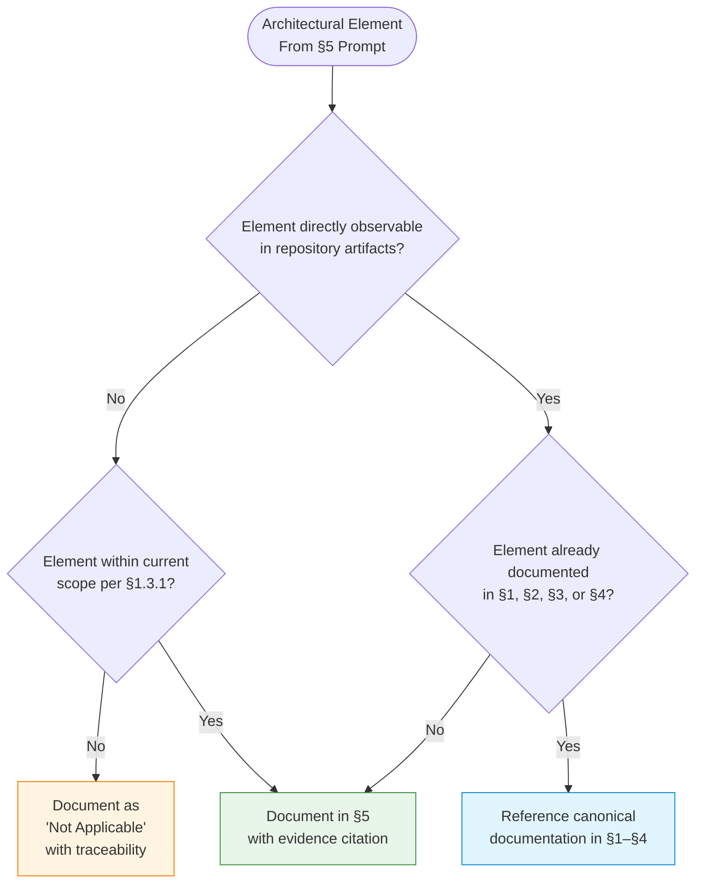

The outcome of applying this logic to the §5 prompt is summarized in the inventory below and elaborated throughout the remainder of this section.

---

## 5.2 HIGH-LEVEL ARCHITECTURE

### 5.2.1 System Overview

#### 5.2.1.1 Overall System Architecture Style

No architectural style is declared in the repository. Per §1.4.2, this Technical Specification is expressly prohibited from asserting claims about architectural style, technology stack, or implementation strategy. The repository contains no source modules, no service definitions, no deployment manifests, no configuration files, and no design documentation that would substantiate a stylistic classification (monolith, microservices, layered, event-driven, hexagonal, etc.).

What the repository **does** present, in concrete terms, is a single-artifact documentation surface: an 11-byte Markdown file (`README.md`) maintained under Git version control at the repository root. This is not an "architectural style" in the conventional software-engineering sense; it is the minimal observable footprint of an early-stage repository whose architectural disposition has not been declared.

#### 5.2.1.2 Key Architectural Principles and Patterns

No architectural principles or patterns are documented. The repository contains no design records, no architecture decision records (ADRs), no design-pattern references in source code, and no framework conventions that would impose a pattern. Per §3.1.1, the repository "declares no technology stack in the conventional sense — no programming languages, no frameworks, no build tooling, no dependency manifests, no deployment infrastructure, and no CI/CD configuration." Consequently, no pattern claims (e.g., MVC, MVVM, CQRS, Repository, Pub/Sub, Event Sourcing, Saga) are defensible.

The single implicit convention present is the **Markdown rendering convention** (recognition of `# ` as an H1 heading), which is a property of conforming Markdown viewers (CommonMark / GFM) rather than a pattern adopted by this repository. This convention is documented as Assumption A-001 in §2.7.1 and as an implicit technology in §3.1.3.

#### 5.2.1.3 System Boundaries and Major Interfaces

The system boundary in its current state is precisely defined by §1.3.2: a single Markdown documentation file at the repository root. The boundary table from §1.3.2 is reproduced here for §5 traceability:

| Boundary Type | Current Definition |
|---------------|--------------------|
| Repository boundary | Single file (`README.md`) at the repository root |
| Service boundary | Not applicable — no services exist |
| Trust / security boundary | Not applicable — no authentication or authorization surface exists |
| Network boundary | Not applicable — no network endpoints exist |

No "major interfaces" in the architectural sense (APIs, RPC contracts, message schemas, event channels) exist. The only interface observable across the repository boundary is the **file-read interface** by which a Markdown viewer or human reader retrieves the contents of `README.md`. This interface is mediated by the host operating system or Git-hosting platform and is not implemented by anything within the repository.

### 5.2.2 Core Components Table

The complete component inventory of the repository, derived authoritatively from §1.2.2, comprises two artifacts. Per §2.4.3, each is realized by entirely distinct underlying constructs (Markdown content for F-001; the Git `.git/` directory for F-002).

| Component | Primary Responsibility | Key Dependencies | Critical Considerations |
|-----------|------------------------|------------------|--------------------------|
| `README.md` | Declare the project identifier "Artifact1" via an H1 Markdown heading (realizes F-001) | Markdown rendering convention (CommonMark / GFM, per §3.1.3) | Must remain syntactically valid Markdown; the first line must continue to begin with `# ` followed by the project name (per F-001-RQ-001 / RQ-002) |
| Repository root (`/`) | Provide the containing directory for `README.md`; serve as the unit of Git version control (realizes F-002) | Git version control system (per §3.1.3) | No subdirectories presently exist; introduction of additional files would expand §1.2.2 and trigger revisions per §3.10 and §4.6 |

No other components exist. Per §1.2.2, "the repository contains no source modules, no library packages, no service endpoints, no client applications, no shared utilities, and no data schemas." The "Integration Points" column conventional for this table is intentionally omitted because, as documented in §2.4.2, neither component has any integration points beyond the F-002 → F-001 preservation relationship.

### 5.2.3 Structural Composition Diagram

The structural composition of the repository — the canonical architectural diagram for the Artifact1 repository in its present state — is established in §1.2.2 and reproduced below for §5 self-containment:

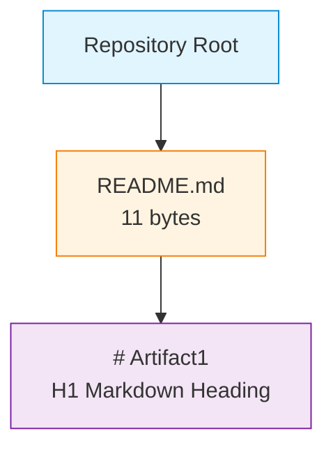

Per §2.6.3, this is "the only process-relevant diagram present in this specification" insofar as it captures the totality of the architectural structure. The relationship between the two features (F-001 and F-002) overlays this structure as established in §2.4.1.

### 5.2.4 Data Flow Description

#### 5.2.4.1 Primary Data Flows

The repository declares no application data flows. The only data movement defensibly identifiable in the repository is the **static read flow** by which the 11-byte contents of `README.md` are retrieved from the repository, parsed by a Markdown viewer, and rendered for a human reader. This flow is documented in detail in §4.5.1 and is reproduced as the sequence/swim-lane diagram in §5.3.7.

No request/response flows, event flows, message-queue flows, streaming flows, batch flows, or data-pipeline flows exist. The repository contains no producers, no consumers, no schemas, no message formats, no event types, and no transformation logic.

#### 5.2.4.2 Integration Patterns and Protocols

No integration patterns are observable. Per §2.4.2, the integration surface is exhaustively summarized as:

| Integration Surface | Status |
|--------------------|--------|
| Inter-feature integration | None beyond the preservation relationship (F-002 → F-001) |
| External system integration | None — no external connections declared |
| Platform integration | None — no Git-hosting platform integration configured |
| Build / runtime integration | None — no build, test, or deployment integration exists |

No protocols (HTTP, gRPC, AMQP, MQTT, WebSocket, JDBC, ODBC, GraphQL, REST, SOAP) are referenced. The only "protocol-like" specification implicit in the repository is the Markdown rendering convention, which is a content format rather than a wire protocol.

#### 5.2.4.3 Data Transformation Points

No data transformation points exist within the repository. The single transformation observable in the end-to-end rendering flow (Markdown source → DOM/H1 element) is performed by the Markdown viewer (external to the repository) and is therefore not an architectural component of this system.

#### 5.2.4.4 Key Data Stores and Caches

The data-store inventory established in §4.4.1.2 is the authoritative reference for §5:

| Persistence Layer | Status |
|-------------------|--------|
| Git object store (`.git/`) | Present — stores 1 commit and 1 tracked blob |
| Application database | Not applicable — none declared |
| File system persistence | Not applicable — no application I/O code exists |
| In-memory caches | Not applicable — see §4.4.1.3 |

No caching layers are configured. Per §4.4.1.3, "Markdown viewers may apply rendering caches as part of their own implementation, but no such caching is configured by or declared in this repository."

### 5.2.5 External Integration Points

Per §1.2.1, the repository declares no integrations with any external enterprise systems. The integration inventory in §2.4.2 confirms the absence of all integration categories. The following table makes the applicability determination explicit for §5:

| System Name | Integration Type | Data Exchange Pattern | Status |
|-------------|------------------|------------------------|--------|
| External APIs (REST, GraphQL, gRPC, SOAP) | Not declared | Not applicable | None referenced anywhere in the repository (per §1.2.1) |
| Database systems | Not declared | Not applicable | None referenced (per §1.2.1, §3.6) |
| Message brokers / event streams | Not declared | Not applicable | None referenced (per §1.2.1) |
| Identity / authentication providers | Not declared | Not applicable | None referenced (per §1.2.1, §1.3.3) |
| Third-party services or SaaS platforms | Not declared | Not applicable | None referenced (per §1.2.1) |
| Cloud platforms (AWS, Azure, GCP) | Not declared | Not applicable | Explicitly out-of-scope per §1.3.3, §3.9.1 |
| CI/CD platforms (GitHub Actions, GitLab CI, Jenkins) | Not declared | Not applicable | No workflow files present (per §3.9.1) |

The "Protocol / Format" and "SLA Requirements" columns prescribed by the §5 prompt are intentionally omitted because no integrations exist for which protocols or SLAs could be specified. Per §1.3.1, "No technical requirements are documented. The repository does not specify language versions, runtime versions, hardware specifications, performance thresholds, security postures, or compliance obligations."

---

## 5.3 COMPONENT DETAILS

This subsection provides per-component depth for the two components inventoried in §5.2.2. Standard component documentation categories prescribed by the §5 prompt (technologies, frameworks, APIs, persistence, scaling) are addressed for each component, including explicit "Not applicable" determinations where the repository provides no evidence.

### 5.3.1 Component: README.md (Project README)

#### 5.3.1.1 Purpose and Responsibilities

The `README.md` file declares the project identifier "Artifact1" by means of an H1 Markdown heading on its first and only line. It is the realizing artifact of feature F-001 (Project Identifier Declaration) per §2.4.3 and is the sole content artifact in the repository.

#### 5.3.1.2 Technologies and Frameworks

The file uses **Markdown** as its content format, evidenced by both the `.md` extension and the `# ` H1 syntax (per §3.1.3). No frameworks, libraries, templating engines, static-site generators, or documentation toolchains (Jekyll, Hugo, MkDocs, Sphinx, Docusaurus, etc.) are configured.

#### 5.3.1.3 Key Interfaces and APIs

The file exposes no programmatic interfaces. The only "interface" is the file-read interface by which any Markdown-aware reader (human or program) retrieves its 11-byte content. No HTTP endpoints, RPC methods, CLI commands, or library functions are implemented.

#### 5.3.1.4 Data Persistence Requirements

The file itself is the unit of persistence: its 11-byte content is stored as a Git blob within the `.git/` object store, as documented in §4.4.1.2. No application-level persistence (databases, caches, file systems) is associated with this component.

#### 5.3.1.5 Scaling Considerations

Not applicable. The file is static, has no runtime execution, no concurrent-access concerns, no throughput requirements, and no horizontal/vertical scaling axes. Per §1.3.1, no performance thresholds are documented.

### 5.3.2 Component: Repository Root (`/`)

#### 5.3.2.1 Purpose and Responsibilities

The repository root is the container directory for `README.md` and the unit of Git version control. It is the realizing locus of feature F-002 (Version-Controlled Documentation) per §2.4.3, where F-002 is realized specifically by "the Git `.git/` directory structure and commit history."

#### 5.3.2.2 Technologies and Frameworks

**Git** is the version control system, evidenced by the presence of `.git/` repository metadata and the tracked commit history (per §3.1.3). No Git extensions, hooks, signing configuration, or Git-flow tooling is configured (per §2.2.3.3, "no Git hooks or signing requirements are configured, so commits proceed under default Git behavior").

#### 5.3.2.3 Key Interfaces and APIs

The repository root exposes the standard Git command-set as inherited from the underlying Git installation: `git init`, `git add`, `git commit`, `git log`, `git diff`, `git push`, `git pull`, `git fetch`, `git merge`, `git revert`, `git reset`, `git checkout`, `git branch`, `git tag`. No repository-specific scripts, wrappers, automation, or aliases are configured (per §2.5.2 implementation considerations).

#### 5.3.2.4 Data Persistence Requirements

The Git object store (`.git/`) constitutes the persistence layer. It stores exactly one commit (`9e0722a`) and exactly one tracked blob (the contents of `README.md`) as of the current specification revision. No additional persistence is declared.

#### 5.3.2.5 Scaling Considerations

Not applicable in the architectural sense. Git's underlying scalability characteristics (object packing, shallow clones, partial clones, large-file support via Git LFS, etc.) are properties of the Git implementation, not of this repository. No repository configuration overrides default Git behavior.

### 5.3.3 Implicit Technology: Markdown Rendering Convention

#### 5.3.3.1 Role in the Architecture

The Markdown rendering convention (CommonMark / GFM) governs how the contents of `README.md` are interpreted as a rendered document by external Markdown viewers. Per §3.1.3, it constitutes one of the two implicit technologies that make up the "entirety of the technology surface of the Artifact1 repository in its current state."

#### 5.3.3.2 Scope of Adoption

This is a content-format convention adopted implicitly by virtue of the `.md` extension and the `# ` H1 syntax. No specific Markdown dialect (CommonMark, GitHub Flavored Markdown, MultiMarkdown, Markdown Extra) is declared as authoritative. Per §2.7.1 Assumption A-001, the use of Markdown is inferred from the file extension and syntax pattern rather than from a declared specification.

#### 5.3.3.3 External Dependency Status

The rendering convention is realized entirely by external Markdown viewers (Git-hosting platforms, IDEs, dedicated Markdown previewers, documentation generators). No Markdown processor is bundled with, configured by, or referenced by the repository.

### 5.3.4 Implicit Technology: Git Version Control

#### 5.3.4.1 Role in the Architecture

Git provides the version control mechanism that realizes feature F-002 (Version-Controlled Documentation). It is the second of the two implicit technologies that constitute the complete technology surface per §3.1.3.

#### 5.3.4.2 Configuration State

The repository uses default Git behavior throughout: no `.gitignore` rules, no `.gitattributes`, no submodules, no LFS configuration, no hooks (per §2.2.3.3), no signing keys, no custom merge or diff drivers, and no remote-tracking configuration documented in the repository contents. Per §2.2.3.2, "the use of Git is inferred from the presence of `.git/` metadata and the tracked commit history."

#### 5.3.4.3 Operational Scope

Standard Git operations apply (commit, push, pull, fetch, merge, revert, reset). Per §4.4.2.4, "no repository-specific recovery procedures override or supplement default Git behavior."

### 5.3.5 Component Interaction Diagram

The interactions among the four constituent elements documented above (the two components plus the two implicit technologies) are summarized in the diagram below. Edges indicate "contains", "uses", or "preserves" relationships as documented in §1.2.2, §2.4.1, §2.4.3, and §3.1.3.

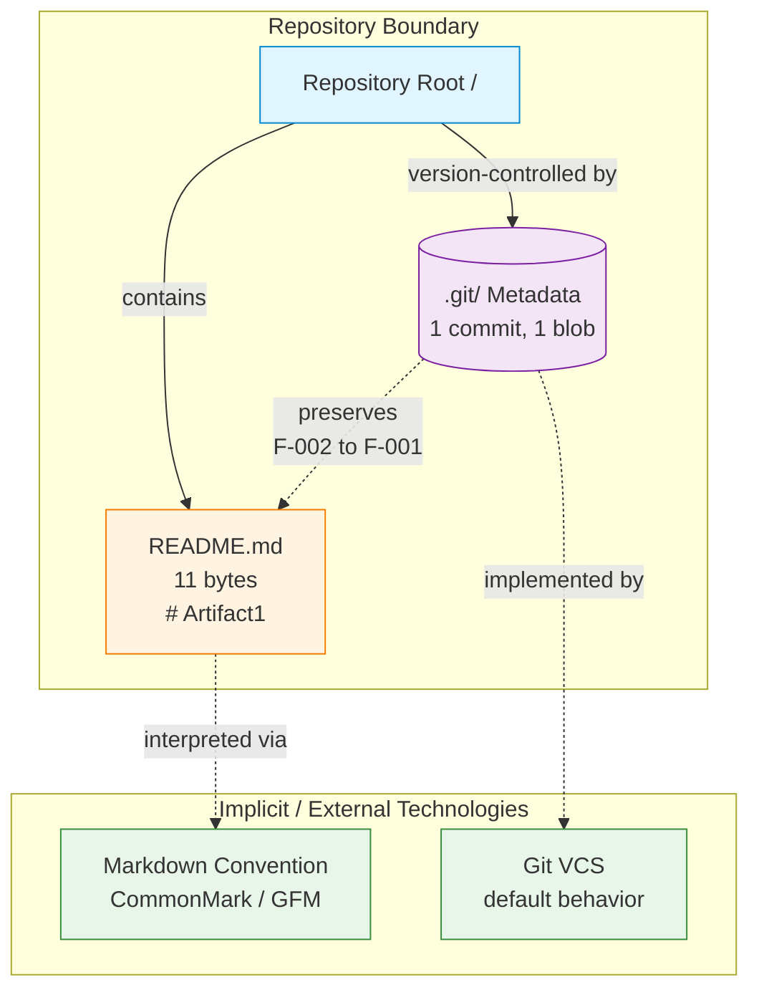

### 5.3.6 State Transition Diagram

The repository exhibits exactly one state-bearing surface: the Git commit history. The state machine is reproduced from §4.5.3 (per §4.4.1.1, "the repository contains exactly one source of state transitions: the Git commit history").

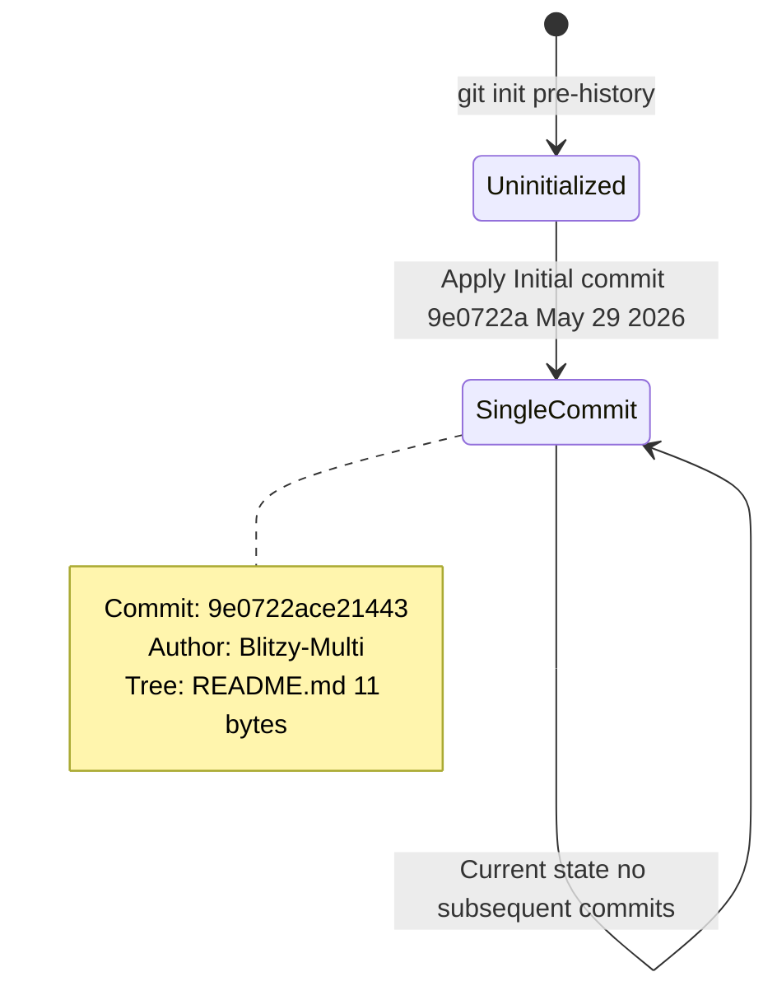

Per §4.4.1.1, "no application-state, session-state, or domain-state machines exist because no executable surface is present." Per §4.5.4, no additional state transition diagrams can be provided.

### 5.3.7 Sequence Diagram: README Static Rendering

The only end-to-end interaction defensible from repository evidence is the act of a reader viewing the rendered project identifier. This swim-lane diagram is reproduced from §4.5.1:

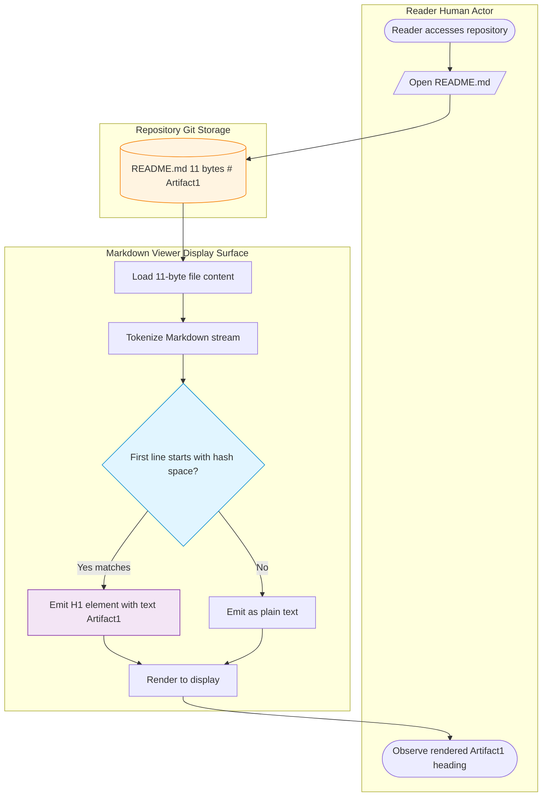

Per §4.5.1, the "No" branch of the decision diamond is included for diagrammatic completeness but is not exercised by the actual content of `README.md`. Per §4.5.4, no other sequence diagrams can be substantiated by repository evidence.

---

## 5.4 TECHNICAL DECISIONS

### 5.4.1 Decisions Documented in the Repository

No formal technical decisions are documented in the repository. There are no Architecture Decision Records (ADRs), no design documents, no RFC files, no `docs/decisions/` directory, no commit messages elaborating on decisions (the sole commit message is the default placeholder "Initial commit" per §2.2.3.2), and no inline source-code comments (because no source code exists).

The two **implicit decisions** detectable from the repository's existence — neither of which is justified by accompanying documentation — are:

| Implicit Decision | Evidence | Caveat |
|-------------------|----------|--------|
| Use of Markdown for README content | `.md` extension and `# ` syntax in `README.md` | Per §2.7.1 A-001, this is an inferred convention, not a declared decision |
| Use of Git for version control | Presence of `.git/` directory and tracked commit history | Per §3.1.3, this is an implicit dependency rather than a documented decision |

Per §2.7.2, "Speculative claims about purpose, roadmap, users, or architecture are prohibited." Consequently, this section refrains from constructing post-hoc rationales for decisions that are not themselves documented.

### 5.4.2 Applicability of Standard Decision Categories

The §5 prompt enumerates five standard categories of architectural decisions. Each has been evaluated against repository evidence using the decision logic in §5.1.3. The outcomes are tabulated below.

| Decision Category | Applicability | Authoritative Reference |
|-------------------|---------------|--------------------------|
| Architecture style decisions and tradeoffs | Not applicable — no architectural style is declared and §1.4.2 prohibits asserting one | §1.4.2, §5.2.1.1 |
| Communication pattern choices (sync/async, REST/gRPC/messaging) | Not applicable — no inter-component communication exists; no protocols are declared | §2.4.2, §5.2.4.2 |
| Data storage solution rationale | Not applicable — no application data storage is declared; the Git object store is the only persistence point | §3.6, §4.4.1.2 |
| Caching strategy justification | Not applicable — no caching is configured by the repository | §3.6, §4.4.1.3 |
| Security mechanism selection (authN, authZ, encryption, secrets management) | Not applicable — no security mechanisms are configured; authentication and authorization are explicitly out-of-scope per §1.3.3 | §1.3.2, §1.3.3 |

The standard tradeoff-analysis table prescribed by the §5 prompt (alternatives considered, criteria, selected option, rationale) is intentionally omitted because no decisions exist for which alternatives could have been weighed.

### 5.4.3 Architecture Decision Records (ADRs)

No Architecture Decision Records exist in the repository. The conventional ADR locations (`docs/adr/`, `docs/decisions/`, `architecture/decisions/`, `.adr/`, `adr/`) are all absent. Per §1.2.2, "the repository contains no source modules, no library packages, no service endpoints, no client applications, no shared utilities, and no data schemas" — and likewise no architectural documentation beyond the project-name declaration in `README.md`.

Producing speculative ADRs for hypothetical decisions would violate §1.4.2 and §2.7.2 and is therefore declined. ADR introduction is identified as a forward-applicability trigger in §5.6.1.

### 5.4.4 Decision-Tree Visualization

Because no decisions are documented in the repository, no decision-tree diagram for those decisions can be produced. The decision-tree visualization included in §5.1.3 (applicability logic) is the only decision-tree diagram defensible from the present repository state, and it documents the logic by which §5 itself was constructed rather than any architectural decision made within the project.

---

## 5.5 CROSS-CUTTING CONCERNS

### 5.5.1 Applicability of Standard Cross-Cutting Concerns

The §5 prompt enumerates six standard cross-cutting concerns. Each has been evaluated against repository evidence and prior-section determinations. The summary table below precedes detailed per-concern subsections.

| Cross-Cutting Concern | Applicability | Authoritative Reference |
|------------------------|---------------|--------------------------|
| Monitoring and observability | Not applicable — explicitly out-of-scope; "No instrumentation, log configuration, or telemetry exists" | §1.3.3, §3.5 |
| Logging and tracing | Not applicable — same out-of-scope determination | §1.3.3, §3.5 |
| Error handling patterns | Not applicable — no executable code exists that could produce errors | §4.4.2 |
| Authentication and authorization framework | Not applicable — no identity, session, or access-control implementation exists | §1.3.2, §1.3.3 |
| Performance requirements and SLAs | Not applicable — "No technical requirements are documented" | §1.3.1 |
| Disaster recovery procedures | Limited to default Git operations; no repository-specific procedures exist | §2.5.2, §4.4.2.4 |

### 5.5.2 Monitoring and Observability

Not applicable. Per §1.3.3, "Logging, monitoring, or observability" are explicitly excluded from current scope because "No instrumentation, log configuration, or telemetry exists." Per §3.5, no third-party monitoring or observability services (Datadog, New Relic, Prometheus, Grafana, Sentry, Honeycomb, etc.) are configured. The repository contains no metric definitions, no health-check endpoints, no readiness/liveness probes, no dashboards, and no SLO/SLI declarations.

Markdown viewers and Git-hosting platforms may emit their own access logs as part of their hosting environments, but such logs are external to the repository and are not part of this system's observability architecture.

### 5.5.3 Logging and Tracing Strategy

Not applicable. No logging framework, log destination, log format, log retention policy, distributed-tracing standard (OpenTelemetry, Jaeger, Zipkin), or correlation-ID convention is configured. The only "trace" of system state defensibly identifiable is the Git commit history itself, documented in §4.4.1.1 and §5.3.6.

### 5.5.4 Error Handling Patterns

The error-handling determination from §4.4.2 is the authoritative reference for §5:

| Error Handling Element | Status |
|-------------------------|--------|
| Retry mechanisms | None — "no operations that could fail, succeed, or be retried" (§4.4.2.1) |
| Fallback processes | None — no failover, circuit breakers, or graceful-degradation strategies (§4.4.2.2) |
| Error notification flows | None — no logging, paging, or alerting integrations (§4.4.2.3) |
| Recovery procedures | Default Git operations only (§4.4.2.4) |

#### 5.5.4.1 Error Handling Flow Diagram

Per §4.5.4, "Error handling flowcharts" are explicitly listed among the diagrams that cannot be substantiated, with the rationale: "No error-producing code paths exist; logging/observability is out-of-scope." The following diagram documents this determination explicitly rather than producing a speculative error-handling flow:

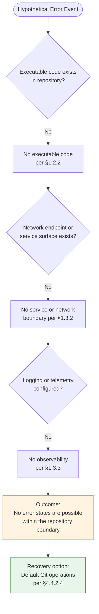

This diagram serves the §5 prompt's requirement for an error-handling flow while remaining faithful to the evidence-based methodology: the only "flow" is the determination that no errors are possible within the system boundary, with default Git operations available as the sole recovery surface.

### 5.5.5 Authentication and Authorization Framework

Not applicable. Per §1.3.2, no trust or security boundary exists — "no authentication or authorization surface exists." Per §1.3.3, "Authentication and authorization mechanisms" are explicitly excluded because "No identity, session, or access-control implementation exists." Per §3.5, no identity providers (Auth0, Okta, Cognito, Azure AD, Keycloak) are configured.

Any access controls in effect are those imposed by the hosting Git platform (e.g., repository-level read/write permissions on the hosting provider) and are external to the repository's architecture.

### 5.5.6 Performance Requirements and SLAs

Not applicable. Per §1.3.1, "No technical requirements are documented. The repository does not specify language versions, runtime versions, hardware specifications, performance thresholds, security postures, or compliance obligations." Per §4.5.1, "Timing/SLA: Not applicable — no performance thresholds are documented."

The single observable workflow (README static rendering, §5.3.7) carries no documented performance budget. Practical rendering latency is a property of the external Markdown viewer and is not constrained by anything in this repository.

### 5.5.7 Disaster Recovery Procedures

Recovery is limited to default Git behavior. Per §4.4.2.4, "the only defensible recovery action is the standard Git operation set (commit, push, pull, fetch, merge, revert, reset)... no repository-specific recovery procedures override or supplement default Git behavior." Per §2.5.2, no repository-defined backup, restore, or business-continuity procedures are documented.

The implicit disaster-recovery surface available to operators of this repository consists of:

| Recovery Capability | Provided By | Notes |
|---------------------|-------------|-------|
| Restoration of prior commits | Standard Git operations (`git revert`, `git reset`) | Currently only one commit exists; no prior state to restore to |
| Recovery of remote-hosted copies | Git-hosting platform | Out-of-scope per §1.3.3 (no platform integration is configured) |
| Local-clone replication | Standard Git (`git clone`) | Each clone is a complete replica of the object store |

No RPO (Recovery Point Objective), RTO (Recovery Time Objective), backup retention policy, or DR runbook is documented.

---

## 5.6 FORWARD APPLICABILITY AND REVISION TRIGGERS

### 5.6.1 Conditions That Would Require §5 Expansion

Consistent with the forward-applicability pattern established in §4.6.1, the table below enumerates hypothetical future repository changes that would invalidate one or more of the absence statements in §5 and require corresponding expansion. **This enumeration is not a roadmap commitment**; per §1.4.2, the specification cannot assert claims about roadmap or planned capabilities.

| Future Repository Change | Required §5 Expansion |
|--------------------------|------------------------|
| Introduction of source-code modules | Document architectural style; expand §5.2.2 with new components; populate §5.3 with per-module details |
| Declaration of external API integrations | Populate §5.2.5 External Integration Points with concrete entries; add sequence diagrams in §5.3.7 |
| Addition of persistence layer (database, file storage) | Document data-storage rationale in §5.4; expand §5.5.7 with backup/recovery procedures |
| Introduction of authentication / authorization | Populate §5.5.5 with concrete framework selection and decision rationale |
| Addition of caching layer | Populate §5.4 with caching strategy and §5.5 with cache-related observability |
| Configuration of CI/CD pipelines | Document build/deploy architecture in §5.2; expand §5.5.2 with pipeline observability |
| Introduction of error handling code | Replace §5.5.4 absence statements with concrete retry / fallback / notification flows |
| Documentation of business rules, SLAs, or performance targets | Populate §5.5.6 with concrete SLA / SLO definitions |
| Introduction of ADRs or design documentation | Populate §5.4 with formal decision records and tradeoff analysis |

Each such expansion would also require corresponding updates in §1.3, §2.2, §2.4, §3, and §4 to maintain the bidirectional traceability established in §2.6.

### 5.6.2 Stability Assessment

The contents of §5 are expected to remain stable for as long as the repository remains in its current single-file, single-commit configuration. Per §4.6.2, "any subsequent commit that introduces source files, configuration manifests, or integration declarations will invalidate one or more of the absence statements documented above and trigger the corresponding expansion." The same stability assessment applies to §5: the architectural absence statements documented herein are bounded to the present repository state and will require revision upon the introduction of any of the changes enumerated in §5.6.1.

### 5.6.3 Traceability Anchor

Every absence statement in §5 is anchored to an authoritative earlier section. The following traceability map permits readers to verify each architectural claim against the evidence-based determinations established in §1–§4:

| §5 Topic | Authoritative Anchor |
|----------|------------------------|
| Architectural style prohibition | §1.4.2, §2.7.2 |
| Component inventory | §1.2.2, §2.4.3 |
| System boundaries | §1.3.2 |
| Integration absence | §1.2.1, §2.4.2 |
| Technology surface | §3.1.3, §3.9, §3.11 |
| State management | §4.4.1 |
| Error handling absence | §4.4.2, §4.5.4 |
| Canonical diagrams | §1.2.2, §2.4.1, §4.5.1, §4.5.3 |

---

## 5.7 SECTION SUMMARY

The architectural footprint of the **Artifact1** repository in its present state is captured exhaustively as follows: one repository root directory contains one Markdown documentation file (`README.md`, 11 bytes, containing `# Artifact1`), which is preserved by one Git commit (`9e0722a`) in the repository's `.git/` object store, and which is interpreted at read-time by external Markdown viewers conforming to the CommonMark / GFM convention. There is no executable surface, no service boundary, no network boundary, no trust boundary, no application data flow, no integration with external systems, no caching layer, no security mechanism, no monitoring or observability instrumentation, no error-handling code paths, no documented decisions, no ADRs, no SLAs, and no performance budget.

Per §1.4.2 and §2.7.2, this specification is prohibited from asserting an architectural style, technology stack, or implementation strategy in the absence of repository evidence. Section 5 therefore documents what is observable (components, boundaries, implicit technologies, the single observable workflow, and the single state-bearing surface) and provides explicit "Not applicable" determinations — anchored to authoritative earlier sections — for every architectural element prescribed by the §5 prompt that the repository does not substantiate. The forward-applicability map in §5.6.1 establishes the conditions under which each absence statement would require revision in future specification updates.

---

#### References

#### Files Examined

- `README.md` — The sole content file at the repository root. An 11-byte Markdown document containing exactly one line: the H1 heading `# Artifact1`. Source of the project identifier, the F-001 realizing artifact (per §2.4.3), and the only data flowing through the single observable workflow (per §5.3.7).

#### Folders Examined

- `/` (repository root directory) — Confirmed to contain exactly one child file (`README.md`) and no subdirectories. Source of the component inventory in §5.2.2 and the structural composition diagram in §5.2.3. Also the locus of feature F-002 (Version-Controlled Documentation), realized by the `.git/` metadata directory per §2.4.3.

#### Technical Specification Sections Referenced

- §1.2.1 Project Context — Integration absence determinations applied in §5.2.4.2 and §5.2.5
- §1.2.2 High-Level Description — Authoritative component inventory and structural composition diagram reproduced in §5.2.2 and §5.2.3
- §1.3.1 In-Scope Elements — Scope-bounded feature set referenced in §5.2.1.3 and §5.5.6
- §1.3.2 Implementation Boundaries — Authoritative boundary table reproduced in §5.2.1.3
- §1.3.3 Out-of-Scope Elements — Exclusion list referenced throughout §5.5
- §1.4.1 Basis of This Specification — Evidence-grounded methodology referenced in §5.1.1
- §1.4.2 Limitations of This Specification — Foundational prohibition on architectural-style claims cited in §5.1.2 and throughout §5.2 and §5.4
- §1.4.3 Conventions Used in This Document — Absence-statement conventions applied throughout §5
- §2.2.3 Version-Controlled Documentation (F-002) — Git-related technical context cited in §5.3.4
- §2.4.1 Feature Dependency Map — F-002 → F-001 preservation relationship referenced in §5.3.5
- §2.4.2 Integration Points — Authoritative integration-absence inventory referenced in §5.2.4.2 and §5.2.5
- §2.4.3 Shared Components — Per-feature realizing artifacts referenced in §5.2.2, §5.3.1, and §5.3.2
- §2.5.2 Implementation Considerations — Default-Git operational constraints referenced in §5.3.2.3 and §5.5.7
- §2.7.1 Assumptions — Assumption A-001 (Markdown convention) referenced in §5.3.3.2
- §2.7.2 Specification Constraints — Prohibition on speculative architecture claims cited in §5.1.2 and §5.4.1
- §3.1.1 Repository State Summary — Technology absence determinations referenced in §5.2.1.2
- §3.1.3 Implicit Technologies — Markdown and Git as the complete technology surface referenced in §5.3.3 and §5.3.4
- §3.5 Third-Party Services — Absence of monitoring / identity providers referenced in §5.5.2 and §5.5.5
- §3.6 Databases and Storage — Absence of databases/caching referenced in §5.2.4.4 and §5.4.2
- §3.9 Default Technology Stack Applicability Analysis — Authoritative determination of "zero applicability" reproduced in §5.1.2
- §3.11 Summary — Consolidated technology stack referenced in §5.6.3
- §4.4.1 State Management — Git commit history as sole state surface referenced in §5.3.6
- §4.4.2 Error Handling — Authoritative absence determinations reproduced in §5.5.4
- §4.5.1 README Static Rendering Workflow — Swim-lane diagram reproduced in §5.3.7
- §4.5.3 Git Commit History State Transition — State diagram reproduced in §5.3.6
- §4.5.4 Diagrams That Cannot Be Provided — Rationale for diagram omissions cited in §5.5.4.1
- §4.6 Forward Applicability and Revision Triggers — Pattern template for §5.6

# 6. SYSTEM COMPONENTS DESIGN

## 6.1 Core Services Architecture

### 6.1.1 Applicability Determination

**Core Services Architecture is not applicable for this system.**

The Artifact1 repository in its current state does not contain, declare, or imply any service-oriented architecture. Per §1.4.1, the basis of this specification consists of exactly one file (`README.md`, 11 bytes, containing the literal text `# Artifact1`), one folder (the repository root), and one commit (`9e0722ace21443bfac8a1400eab45ceacf9fe8dd`, "Initial commit", dated May 29, 2026). Within this evidentiary surface, no executable processes, network endpoints, service modules, deployment manifests, runtime configurations, or inter-component communication mechanisms exist.

Per §1.2.2, "The repository contains no source modules, no library packages, no service endpoints, no client applications, no shared utilities, and no data schemas." Per §1.3.2, the repository explicitly declares that the "Service boundary" is "Not applicable — no services exist," that the "Network boundary" is "Not applicable — no network endpoints exist," and that the "Trust / security boundary" is "Not applicable — no authentication or authorization surface exists." These three boundary determinations are jointly dispositive: in the absence of services, network endpoints, or trust boundaries, none of the architectural sub-topics required by the §6.1 prompt — service components, scalability design, or resilience patterns — can be evidenced from repository contents.

This section therefore documents the applicability determination in the disciplined, table-driven manner established throughout §5 (Architecture), enumerates the authoritative anchors that ground each "Not applicable" claim, and identifies the forward-applicability triggers that would, upon future repository contributions, require this section to be expanded into a substantive architectural specification.

#### 6.1.1.1 Governing Constraints

Three constraints established earlier in this specification jointly foreclose any speculative documentation of a core services architecture. These constraints are reaffirmed here as the controlling rules for §6.1:

| Constraint Source | Governing Statement | Effect on §6.1 |
|-------------------|---------------------|----------------|
| §1.4.2 — Limitations of This Specification | "this specification cannot — and does not — assert claims about... Architectural style, technology stack, or implementation strategy" | Prohibits any declaration of service architecture (microservices, monolith, SOA, serverless, etc.) |
| §2.7.2 — Specification Constraints | "Speculative claims about purpose, roadmap, users, or architecture are prohibited" | Prohibits speculative service boundaries, communication patterns, or scaling strategies |
| §3.9.2 — Default Stack Conclusion | "Zero items from the default technology stack are applicable to the Artifact1 repository in its current state" | Forecloses use of any cloud platform, container orchestrator, or framework-specific service patterns |

#### 6.1.1.2 Evidentiary Basis

The applicability determination above rests on the following verified observations, all of which are inherited from §1.4.1:

| Repository Attribute | Observed Value |
|----------------------|----------------|
| Total files | 1 (`README.md`) |
| Total folders | 1 (repository root) |
| Subdirectories | None |
| Commits in history | 1 (`9e0722a`, "Initial commit", May 29, 2026) |

No additional traversal is possible because the repository terminates at depth 1. There are no source folders, no configuration folders, no test folders, no CI/CD folders, and no supplementary documentation folders against which service architecture might be evidenced.

---

### 6.1.2 Per-Topic Applicability Analysis

Each topic mandated by the §6.1 prompt has been evaluated against repository evidence and prior-section determinations. The tables below provide the complete per-topic applicability map. Every "Not applicable" entry is anchored to an authoritative earlier section, preserving the bidirectional traceability established in §2.6 and reaffirmed in §5.6.3.

#### 6.1.2.1 Service Components — Applicability Map

The §6.1 prompt enumerates six service-component sub-topics. None can be substantiated by repository evidence.

| Sub-Topic | Applicability | Authoritative Anchor |
|-----------|---------------|----------------------|
| Service boundaries and responsibilities | Not applicable — "Service boundary: Not applicable — no services exist" | §1.3.2 |
| Inter-service communication patterns | Not applicable — no protocols (HTTP, gRPC, AMQP, MQTT, WebSocket, REST, GraphQL) referenced anywhere | §1.2.2, §1.3.3 |
| Service discovery mechanisms | Not applicable — no services to discover; no service registry, DNS, or discovery configuration declared | §1.3.2, §1.3.3 |
| Load balancing strategy | Not applicable — no network endpoints exist; no load-distributable surface present | §1.3.2 |
| Circuit breaker patterns | Not applicable — "no failover paths, no circuit breakers, no graceful-degradation strategies" | §4.4.2.2, §5.5.4 |
| Retry and fallback mechanisms | Not applicable — "no operations that could fail, succeed, or be retried" | §4.4.2.1, §4.4.2.2 |

The combined effect of the above determinations is that no service-component diagram, service catalog, communication-protocol matrix, or discovery/load-balancing topology can be defensibly produced from repository evidence. Per §1.2.2, the repository explicitly contains "no source modules, no library packages, no service endpoints, no client applications, no shared utilities, and no data schemas," which is the canonical inventory of absent service-architecture primitives.

#### 6.1.2.2 Scalability Design — Applicability Map

The §6.1 prompt enumerates five scalability-design sub-topics. None can be substantiated by repository evidence.

| Sub-Topic | Applicability | Authoritative Anchor |
|-----------|---------------|----------------------|
| Horizontal/vertical scaling approach | Not applicable — "The file is static, has no runtime execution, no concurrent-access concerns, no throughput requirements, and no horizontal/vertical scaling axes" | §5.3.1.5 |
| Auto-scaling triggers and rules | Not applicable — no runtime to scale; no cloud platform configured | §3.9.1, §5.3.1.5 |
| Resource allocation strategy | Not applicable — no compute, memory, or storage allocation defined; no Docker/Kubernetes/cloud configuration exists | §1.2.2, §3.9.1 |
| Performance optimization techniques | Not applicable — "No technical requirements are documented. The repository does not specify... performance thresholds" | §1.3.1, §5.5.6 |
| Capacity planning guidelines | Not applicable — F-002 scalability: "Not applicable at present — repository contains a single file and a single commit" | §2.5.2, §5.5.6 |

The two repository components inventoried in §5.2.2 — the `README.md` file and the repository root — both received explicit "Not applicable" scaling determinations in §5.3.1.5 and §5.3.2.5 respectively. Per §5.3.2.5, "Git's underlying scalability characteristics (object packing, shallow clones, partial clones, large-file support via Git LFS, etc.) are properties of the Git implementation, not of this repository. No repository configuration overrides default Git behavior." Consequently, no scalability architecture, auto-scaling rule set, or capacity-planning curve can be derived from repository contents.

#### 6.1.2.3 Resilience Patterns — Applicability Map

The §6.1 prompt enumerates five resilience-pattern sub-topics. Four are entirely "Not applicable"; the fifth (disaster recovery) is bounded to default Git behavior only, with no repository-specific procedures.

| Sub-Topic | Applicability | Authoritative Anchor |
|-----------|---------------|----------------------|
| Fault tolerance mechanisms | Not applicable — "no executable code exists that could produce errors" | §5.5.1, §5.5.4 |
| Disaster recovery procedures | Limited to default Git operations only (`commit`, `push`, `pull`, `fetch`, `merge`, `revert`, `reset`); no RPO, RTO, backup retention policy, or DR runbook documented | §4.4.2.4, §5.5.7 |
| Data redundancy approach | Limited to local-clone replication via standard `git clone`; "Each clone is a complete replica of the object store" | §5.5.7 |
| Failover configurations | Not applicable — "no service boundary, network boundary, or trust boundary exists across which fallback would apply" | §4.4.2.2 |
| Service degradation policies | Not applicable — no services exist; "no failover, circuit breakers, or graceful-degradation strategies" | §4.4.2.2, §5.5.4 |

The disaster-recovery surface defensibly attributable to this repository is limited to those Git capabilities that are inherent to any Git working copy: `git revert` and `git reset` for prior-commit restoration (presently degenerate because only one commit exists), `git clone` for local-clone replication, and recovery of any remote-hosted copy through whichever hosting platform is in use (which is itself out-of-scope per §1.3.3). Per §5.5.7, "no RPO (Recovery Point Objective), RTO (Recovery Time Objective), backup retention policy, or DR runbook is documented."

---

### 6.1.3 Applicability Decision Diagram

In keeping with the §5.5.4.1 precedent — which produced an applicability-decision flowchart rather than a speculative error-handling flow — this section provides a single Mermaid decision diagram that documents the logic by which the "Not applicable" determination was reached. This diagram replaces the three speculative diagrams requested by the §6.1 prompt (service interaction, scalability architecture, resilience pattern implementations), each of which is individually non-substantiable from repository evidence (see §6.1.4 below).

```mermaid
flowchart TD
    Start([Hypothetical Core Services<br/>Architecture Element])
    Q1{Executable service code<br/>exists in repository?}
    Q2{Network endpoints<br/>declared anywhere?}
    Q3{Multiple components requiring<br/>inter-service communication?}
    Q4{Runtime, container, or<br/>cloud configuration present?}
    Q5{Resilience libraries or<br/>failover configuration declared?}

    NoCode[No executable code<br/>per §1.2.2]
    NoEndpoint[No network boundary<br/>per §1.3.2]
    SingleArtifact[Single file artifact<br/>per §1.4.1]
    NoRuntime[Zero stack items applicable<br/>per §3.9.2]
    NoResilience[No retry, fallback, or<br/>circuit breakers per §4.4.2]

    DRSurface[Default Git operations only<br/>per §4.4.2.4 and §5.5.7]
    Outcome[Outcome:<br/>Core Services Architecture<br/>not applicable]

    Start --> Q1
    Q1 -->|No| NoCode
    NoCode --> Q2
    Q2 -->|No| NoEndpoint
    NoEndpoint --> Q3
    Q3 -->|No| SingleArtifact
    SingleArtifact --> Q4
    Q4 -->|No| NoRuntime
    NoRuntime --> Q5
    Q5 -->|No| NoResilience
    NoResilience --> Outcome
    Outcome --> DRSurface

    style Outcome fill:#fff4e1,stroke:#f57c00
    style DRSurface fill:#e8f5e9,stroke:#388e3c
    style NoCode fill:#fce4ec,stroke:#c2185b
    style NoEndpoint fill:#fce4ec,stroke:#c2185b
    style SingleArtifact fill:#fce4ec,stroke:#c2185b
    style NoRuntime fill:#fce4ec,stroke:#c2185b
    style NoResilience fill:#fce4ec,stroke:#c2185b
```

The five decision points in the diagram exhaust the §6.1 prompt's three categories (Service Components, Scalability Design, Resilience Patterns) and each branches to a "No" outcome anchored in an authoritative earlier section. The terminal node identifies the sole defensible recovery surface: default Git operations as documented in §4.4.2.4 and §5.5.7.

---

### 6.1.4 Required Diagrams — Substantiability Determination

The §6.1 prompt explicitly requests three diagram types. Each is addressed below with an explicit substantiability determination consistent with the evidence-based methodology established in §4.5 and §5.5.4.1.

#### 6.1.4.1 Service Interaction Diagrams — Not Substantiable

No service interaction diagram can be produced because no services exist in the repository. Per §1.3.2, the "Service boundary" is "Not applicable — no services exist." Per §1.2.2, the repository contains "no service endpoints" among its absent component categories. The only inter-element interactions defensibly identifiable from repository evidence are the structural relationships among the two components and two implicit technologies inventoried in §5.3.5 (the README, the repository root, the Markdown rendering convention, and Git), and the static-rendering sequence depicted in §5.3.7. Neither of those diagrams represents service interactions; both have already been documented in §5 in their proper architectural context.

#### 6.1.4.2 Scalability Architecture — Not Substantiable

No scalability architecture diagram can be produced because no scalability axes exist. Per §5.3.1.5, the `README.md` file "has no runtime execution, no concurrent-access concerns, no throughput requirements, and no horizontal/vertical scaling axes." Per §5.3.2.5, scaling considerations for the repository root are "Not applicable in the architectural sense." Per §3.9.2, no cloud platform, container orchestrator, or auto-scaling technology from the default stack is applicable. Consequently, no load-distribution topology, replica-count diagram, scaling-trigger graph, or capacity-planning curve can be evidenced.

#### 6.1.4.3 Resilience Pattern Implementations — Not Substantiable

No resilience-pattern implementation diagram can be produced because no resilience patterns are implemented in the repository. Per §4.4.2.2, "no failover paths, no circuit breakers, no graceful-degradation strategies, and no redundancy" exist. Per §5.5.4, the four error-handling elements (retry mechanisms, fallback processes, error notification flows, recovery procedures) are uniformly "None" or "Default Git operations only." The applicability-decision diagram in §6.1.3 serves the prompt's diagram requirement in the only form defensible from repository evidence: by visualizing the absence determination itself rather than fabricating implementations that do not exist.

---

### 6.1.5 Forward Applicability and Revision Triggers

Following the forward-applicability pattern established in §4.6.1 and §5.6.1, the table below enumerates hypothetical future repository changes that would invalidate one or more of the "Not applicable" determinations in §6.1 and would require corresponding expansion of this section. **This enumeration is not a roadmap commitment;** per §1.4.2 and §2.7.2, the specification cannot assert claims about roadmap or planned capabilities.

#### 6.1.5.1 Triggers for Service Components Expansion

| Future Repository Change | Required §6.1 Expansion |
|--------------------------|--------------------------|
| Introduction of executable service code (e.g., HTTP server, RPC handler) | Populate §6.1.2.1 with service boundaries, responsibilities, and protocols |
| Multiple service modules with discrete responsibilities | Document inter-service communication patterns and service discovery |
| Introduction of API gateway or reverse proxy configuration | Document load balancing strategy and routing topology |
| Configuration of service mesh (e.g., Istio, Linkerd, Consul) | Document discovery, mTLS, and traffic-management policies |

#### 6.1.5.2 Triggers for Scalability Design Expansion

| Future Repository Change | Required §6.1 Expansion |
|--------------------------|--------------------------|
| Introduction of containerization (`Dockerfile`, Kubernetes manifests) | Document horizontal scaling approach and resource allocation |
| Configuration of cloud platform (AWS/GCP/Azure) | Document auto-scaling triggers, rules, and capacity planning |
| Declaration of SLA / SLO documentation or performance budgets | Document performance optimization techniques |
| Introduction of caching layers (Redis, Memcached, CDN) | Document throughput and latency optimization architecture |

#### 6.1.5.3 Triggers for Resilience Patterns Expansion

| Future Repository Change | Required §6.1 Expansion |
|--------------------------|--------------------------|
| Adoption of circuit-breaker or retry libraries (Resilience4j, Polly, Hystrix) | Replace §6.1.2.3 absence statements with concrete resilience-pattern implementations |
| Multi-region or replicated deployment manifests | Document failover configurations and data redundancy architecture |
| Documented backup and restore procedures with RPO / RTO targets | Populate §6.1.2.3 disaster-recovery row with concrete procedures |
| Graceful-degradation policies (feature flags, fallback endpoints) | Document service degradation policies |

Per §5.6.2, the stability assessment for §5 holds equally for §6.1: the absence statements documented herein are bounded to the present repository state and will require revision upon the introduction of any of the changes enumerated above. Each such expansion would also require corresponding updates to §1.3, §2.2, §2.4, §3, §4, and §5 to maintain bidirectional traceability.

---

### 6.1.6 Section Summary

The Artifact1 repository, in its current single-file, single-commit configuration, presents no surface against which Core Services Architecture can be specified. The determination "Core Services Architecture is not applicable for this system" is jointly supported by:

1. **Direct repository evidence** — one 11-byte Markdown file with the literal content `# Artifact1`, one root folder, one commit (§1.4.1)
2. **Boundary determinations** — explicit "Not applicable" entries for service, network, and trust boundaries (§1.3.2)
3. **Capability inventory** — explicit enumeration of absent service primitives: no source modules, no service endpoints, no client applications, no shared utilities, no data schemas (§1.2.2)
4. **Technology-stack analysis** — zero default-stack items applicable (§3.9.2)
5. **Error-handling determinations** — no retry, fallback, circuit-breaker, or notification mechanisms (§4.4.2)
6. **Architectural absence statements** — per-component scaling "Not applicable" (§5.3.1.5, §5.3.2.5); cross-cutting concerns uniformly "Not applicable" (§5.5)
7. **Specification constraints** — prohibition against speculative architectural claims (§1.4.2, §2.7.2)

The single defensible architectural-resilience surface available to this repository is the default behavior of the Git version-control system itself, as documented in §5.5.7. No service mesh, no orchestration layer, no auto-scaling group, no circuit breaker, no retry policy, no failover region, and no degradation policy exists in or is implied by the repository contents. Future repository contributions that introduce executable surface, network endpoints, multi-component architecture, or resilience libraries will invalidate this determination and trigger the §6.1 expansions enumerated in §6.1.5.

---

### 6.1.7 References

#### 6.1.7.1 Files Examined

- `README.md` — The sole 11-byte content file at the repository root, containing exactly one line (`# Artifact1`). Establishes the absence of any service-architecture artifacts, configuration manifests, or executable surface.

#### 6.1.7.2 Folders Explored

- `/` (repository root, depth 0) — Verified to contain `README.md` as its sole child with no subdirectories. This is the complete repository surface; no service-tier, configuration, or deployment subdirectories exist against which a core services architecture could be evidenced.

#### 6.1.7.3 Technical Specification Sections Referenced

- **§1.2 System Overview** — Source of the canonical capability and component inventory; establishes "no source modules, no library packages, no service endpoints, no client applications, no shared utilities, and no data schemas"
- **§1.3 Scope** — Source of the implementation-boundaries table establishing "Service boundary: Not applicable — no services exist", "Network boundary: Not applicable — no network endpoints exist", and "Trust / security boundary: Not applicable — no authentication or authorization surface exists"
- **§1.4 Documentation Context and Caveats** — Source of the foundational prohibition against asserting architectural style, technology stack, or implementation strategy (§1.4.2); source of the evidentiary basis (§1.4.1)
- **§2.5 Implementation Considerations** — Source of F-001 and F-002 scalability determinations ("Not applicable — static documentation does not scale with load or user volume"; "Not applicable at present — repository contains a single file and a single commit")
- **§2.7 Assumptions, Constraints, and Versioning** — Source of the prohibition against "Speculative claims about purpose, roadmap, users, or architecture"
- **§3.9 Default Technology Stack Applicability Analysis** — Source of the determination that "Zero items from the default technology stack are applicable to the Artifact1 repository in its current state"
- **§4.4 Technical Implementation** — Source of the authoritative error-handling absence determinations: §4.4.2.1 (no retry mechanisms), §4.4.2.2 (no fallback / circuit breakers / graceful degradation), §4.4.2.3 (no error notification flows), §4.4.2.4 (recovery limited to default Git operations)
- **§4.5 Repository-Defensible Diagrams** — Pattern for documenting diagrams that cannot be substantiated by repository evidence
- **§4.6 Forward Applicability and Revision Triggers** — Template for forward-applicability mapping
- **§5.2 High-Level Architecture** — Component inventory establishing only two components (README.md and repository root) plus two implicit technologies (Markdown, Git)
- **§5.3 Component Details** — Source of per-component "Not applicable" scaling determinations: §5.3.1.5 (README has "no horizontal/vertical scaling axes"), §5.3.2.5 (repository root scaling "Not applicable in the architectural sense")
- **§5.5 Cross-Cutting Concerns** — Most directly relevant prior section; source of comprehensive resilience/observability absence determinations; §5.5.4.1 established the applicability-decision diagram pattern replicated in §6.1.3; §5.5.7 established the default-Git disaster-recovery surface
- **§5.6 Forward Applicability and Revision Triggers** — Template for the forward-applicability map provided in §6.1.5

## 6.2 Database Design

### 6.2.1 Applicability Determination

**Database Design is not applicable to this system.**

The Artifact1 repository in its current state contains no database, no persistence layer, no data models, no schemas, no caching mechanisms, and no storage services. Per §1.4.1, the basis of this specification consists of exactly one file (`README.md`, 11 bytes, containing the literal text `# Artifact1`), one folder (the repository root), and one commit (`9e0722ace21443bfac8a1400eab45ceacf9fe8dd`, "Initial commit", dated May 29, 2026). Within this evidentiary surface, none of the artifacts that would constitute a database design — entity definitions, relational or document schemas, migration scripts, ORM configurations, connection-pool settings, caching declarations, replication topology, or backup policy — exist or are referenced.

Per §3.6.1, "No databases are configured or referenced in the repository." Per §3.6.2, "No caching solutions are configured." Per §3.6.3, "No storage services are integrated." Per §3.6.4, "No data persistence strategy applies, as no data domains, schemas, entity definitions, or data models exist." These four determinations from §3.6 — the most direct authoritative anchor for §6.2 — are jointly dispositive: in the absence of any database, cache, or storage service, none of the design sub-topics required by the §6.2 prompt (schema design, data management, compliance considerations, performance optimization) can be evidenced from repository contents.

This section therefore documents the applicability determination in the disciplined, table-driven manner established in §6.1 (Core Services Architecture), enumerates the authoritative anchors that ground each "Not applicable" claim across all prompt-mandated sub-topics, addresses the substantiability of each required diagram type, and identifies the forward-applicability triggers that would, upon future repository contributions, require this section to be expanded into a substantive database-design specification.

#### 6.2.1.1 Governing Constraints

The constraints established earlier in this specification jointly foreclose any speculative documentation of a database design. The controlling rules for §6.2 are reaffirmed here:

| Constraint Source | Governing Statement | Effect on §6.2 |
|-------------------|---------------------|----------------|
| §1.4.2 — Limitations of This Specification | "this specification cannot — and does not — assert claims about... Architectural style, technology stack, or implementation strategy" | Prohibits selection of any database technology, schema, or persistence approach |
| §2.7.2 — Specification Constraints | "Speculative claims about purpose, roadmap, users, or architecture are prohibited" | Prohibits speculative entity models, indexing strategies, or data-retention policies |
| §3.9.2 — Default Stack Conclusion | "Zero items from the default technology stack are applicable" — MongoDB row explicitly marked "No" because "Data persistence is explicitly out-of-scope" | Forecloses use of any default-stack database (MongoDB, or any substitute) |
| §1.3.3 — Out-of-Scope Elements | "Data persistence (relational, NoSQL, file-based, in-memory)" excluded because "No persistence layer or data access code exists" | Excludes every database tier and caching layer from current scope |

#### 6.2.1.2 Evidentiary Basis

The applicability determination above rests on the following verified observations, inherited from §1.4.1 and §4.4.1.2:

| Repository Attribute | Observed Value |
|----------------------|----------------|
| Total files | 1 (`README.md`) |
| Total folders | 1 (repository root) |
| Database configuration files (`.sql`, `.db`, migration directories, schema definitions) | None |
| ORM / data-access library declarations (e.g., `requirements.txt`, `package.json`, `pom.xml`) | None |
| Application database | Not applicable — none declared (per §4.4.1.2) |

No additional traversal is possible because the repository terminates at depth 1. There are no source folders, no `migrations/`, no `models/`, no `schema/`, no `db/`, and no configuration folders against which database design might be evidenced.

#### 6.2.1.3 Distinction: Git Object Store vs. Application Database

A critical distinction must be drawn between two unrelated forms of "persistence" that could otherwise be conflated:

| Persistence Form | Nature | Status in This Repository |
|------------------|--------|---------------------------|
| Application database | A storage tier accessed by application code via SQL, ORM, or document API for runtime read/write of business data | **Does not exist.** This is the subject of §6.2 and is the form whose absence is documented herein. |
| Git object store (`.git/`) | The version-control system's internal storage of commits, trees, and blobs | Present — stores 1 commit and 1 tracked blob (the 11-byte README). This is documented in §4.4.1.2 and §5.2.4.4, not in §6.2. |

Per §5.3.2.5, "Git's underlying scalability characteristics (object packing, shallow clones, partial clones, large-file support via Git LFS, etc.) are properties of the Git implementation, not of this repository. No repository configuration overrides default Git behavior." The Git object store is therefore not a database in the architectural sense addressed by §6.2; it is the internal storage mechanism of the version-control system and is treated under §4.4.1 and §5.3.

---

### 6.2.2 Per-Topic Applicability Analysis

Each of the four topic families mandated by the §6.2 prompt — Schema Design, Data Management, Compliance Considerations, and Performance Optimization — has been evaluated against repository evidence and prior-section determinations. Every "Not applicable" entry is anchored to an authoritative earlier section, preserving the bidirectional traceability established in §2.6 and reaffirmed in §5.6.3.

#### 6.2.2.1 Schema Design — Applicability Map

The §6.2 prompt enumerates six schema-design sub-topics. None can be substantiated by repository evidence.

| Sub-Topic | Applicability | Authoritative Anchor |
|-----------|---------------|----------------------|
| Entity relationships | Not applicable — no entities defined; "no schemas, data models, entity definitions, taxonomies, or master data references" | §1.3.2, §3.6.4 |
| Data models and structures | Not applicable — "no data domains, schemas, entity definitions, or data models exist" | §3.6.4 |
| Indexing strategy | Not applicable — no database to index; no tables, collections, or columns exist | §3.6.1 |
| Partitioning approach | Not applicable — no database to partition; no sharding key or partition scheme is declared | §3.6.1 |
| Replication configuration | Not applicable — no database to replicate; no primary/replica topology or replication protocol is declared | §3.6.1 |
| Backup architecture | Not applicable for application data; recovery limited to default Git operations only | §5.5.7 |

The combined effect of these determinations is that no Entity-Relationship Diagram (ERD), table catalog, column dictionary, index inventory, partition map, replication topology, or backup-target diagram can be defensibly produced from repository evidence. Per §3.6.4, "The repository's persistence model is reducible to the file-system persistence of a single Markdown document under Git source control," which is not an application database and is not subject to schema-design documentation.

#### 6.2.2.2 Data Management — Applicability Map

The §6.2 prompt enumerates five data-management sub-topics. None can be substantiated by repository evidence.

| Sub-Topic | Applicability | Authoritative Anchor |
|-----------|---------------|----------------------|
| Migration procedures | Not applicable — no schema to migrate; no migration framework (Alembic, Flyway, Liquibase, Prisma, Knex) is declared | §3.6.1, §3.6.4 |
| Versioning strategy | Not applicable to data; the sole versioning surface is Git commit history covering README content (1 commit) | §3.6.4, §4.4.1.1 |
| Archival policies | Not applicable — no data to archive; no archival tier, cold-storage target, or retention schedule is declared | §3.6.3 |
| Data storage and retrieval mechanisms | Not applicable — no application-level storage or retrieval code exists; only Git blob storage of README is present | §4.4.1.2 |
| Caching policies | Not applicable — "No caching solutions are configured"; "Caching layers (Redis, Memcached)" explicitly out-of-scope | §3.6.2, §4.4.1.3 |

Per §4.4.1.3, "Markdown viewers may apply rendering caches as part of their own implementation, but no such caching is configured by or declared in this repository." Any caching applied by external Markdown renderers is a property of the viewer, not of this repository, and is therefore not part of any data-management policy documentable under §6.2.

#### 6.2.2.3 Compliance Considerations — Applicability Map

The §6.2 prompt enumerates five compliance sub-topics. None can be substantiated by repository evidence.

| Sub-Topic | Applicability | Authoritative Anchor |
|-----------|---------------|----------------------|
| Data retention rules | Not applicable — no data to retain; "No technical requirements are documented" including compliance obligations | §1.3.1, §3.6.4 |
| Backup and fault tolerance policies | Not applicable — "No RPO (Recovery Point Objective), RTO (Recovery Time Objective), backup retention policy, or DR runbook is documented" | §5.5.7 |
| Privacy controls | Not applicable — no PII, no user data, no data subjects; "no authentication or authorization surface exists" | §1.3.2, §5.5.5 |
| Audit mechanisms | Not applicable — "Logging, monitoring, or observability" out-of-scope; "No instrumentation, log configuration, or telemetry exists" | §1.3.3, §5.5.3 |
| Access controls | Not applicable — "no authentication or authorization surface exists"; no identity, session, or access-control implementation | §1.3.2, §5.5.5 |

No regulatory regime (GDPR, CCPA, HIPAA, PCI-DSS, SOX, etc.) is declared or implied by repository contents. Per §1.3.1, the repository "does not specify language versions, runtime versions, hardware specifications, performance thresholds, security postures, or compliance obligations." Per §5.5.5, "Any access controls in effect are those imposed by the hosting Git platform... and are external to the repository's architecture" — they are not database access controls and are not part of §6.2.

#### 6.2.2.4 Performance Optimization — Applicability Map

The §6.2 prompt enumerates five performance-optimization sub-topics. None can be substantiated by repository evidence.

| Sub-Topic | Applicability | Authoritative Anchor |
|-----------|---------------|----------------------|
| Query optimization patterns | Not applicable — no queries; no database; no query planner to tune | §3.6.1 |
| Caching strategy | Not applicable — "No caching solutions are configured" | §3.6.2 |
| Connection pooling | Not applicable — no database connections; no pool library (PgBouncer, HikariCP, pgbouncer, c3p0) is declared | §3.6.1 |
| Read/write splitting | Not applicable — no database tier; no primary/replica routing or read-replica configuration | §3.6.1 |
| Batch processing approach | Not applicable — "Background processing, batch jobs, or scheduling" explicitly out-of-scope | §1.3.3 |

Per §5.5.6, "No technical requirements are documented. The repository does not specify... performance thresholds." Consequently, no database performance budget, query SLA, throughput target, latency objective, or capacity-planning curve can be derived from repository contents.

---

### 6.2.3 Applicability Decision Diagram

In keeping with the §6.1.3 precedent — which produced an applicability-decision flowchart rather than speculative diagrams of nonexistent architecture — this section provides a single Mermaid decision diagram that documents the logic by which the "Not applicable" determination was reached for Database Design. This diagram replaces the three speculative diagrams requested by the §6.2 prompt (database schema, data flow, replication architecture), each of which is individually non-substantiable from repository evidence (see §6.2.4 below).

```mermaid
flowchart TD
    Start([Hypothetical Database<br/>Design Element])
    Q1{Database technology<br/>declared or configured?}
    Q2{Schema, model, or entity<br/>definitions present?}
    Q3{ORM, data-access, or<br/>migration library declared?}
    Q4{Caching layer or<br/>storage service integrated?}
    Q5{Data retention or privacy<br/>requirements documented?}
    Q6{Connection pooling,<br/>replication, or batch<br/>configuration present?}

    NoDB[No databases configured<br/>per §3.6.1]
    NoSchema[No schemas or models<br/>per §1.3.2 and §3.6.4]
    NoORM[No data-access code<br/>per §1.3.3]
    NoCache[No caching solutions<br/>per §3.6.2]
    NoCompliance[No compliance obligations<br/>per §1.3.1]
    NoPerf[No performance configuration<br/>per §3.6.1 and §1.3.3]

    GitNote[Note: Git object store stores<br/>1 commit and 1 blob<br/>per §4.4.1.2 — not an<br/>application database]
    DRSurface[Recovery surface limited to<br/>default Git operations<br/>per §5.5.7]
    Outcome[Outcome:<br/>Database Design<br/>not applicable]

    Start --> Q1
    Q1 -->|No| NoDB
    NoDB --> Q2
    Q2 -->|No| NoSchema
    NoSchema --> Q3
    Q3 -->|No| NoORM
    NoORM --> Q4
    Q4 -->|No| NoCache
    NoCache --> Q5
    Q5 -->|No| NoCompliance
    NoCompliance --> Q6
    Q6 -->|No| NoPerf
    NoPerf --> Outcome
    Outcome --> GitNote
    Outcome --> DRSurface

    style Outcome fill:#fff4e1,stroke:#f57c00
    style GitNote fill:#e3f2fd,stroke:#1565c0
    style DRSurface fill:#e8f5e9,stroke:#388e3c
    style NoDB fill:#fce4ec,stroke:#c2185b
    style NoSchema fill:#fce4ec,stroke:#c2185b
    style NoORM fill:#fce4ec,stroke:#c2185b
    style NoCache fill:#fce4ec,stroke:#c2185b
    style NoCompliance fill:#fce4ec,stroke:#c2185b
    style NoPerf fill:#fce4ec,stroke:#c2185b
```

The six decision points exhaust the §6.2 prompt's four topic families (Schema Design, Data Management, Compliance Considerations, Performance Optimization) and each branches to a "No" outcome anchored in an authoritative earlier section. The two terminal context nodes clarify (a) that Git object-store presence does not satisfy any database-design criterion and (b) that the sole defensible recovery surface for the repository is default Git behavior as documented in §5.5.7.

---

### 6.2.4 Required Diagrams — Substantiability Determination

The §6.2 prompt explicitly requests three diagram types (database schema diagrams, data flow diagrams, replication architecture) and additionally requires the documentation of all indexes and constraints. Each is addressed below with an explicit substantiability determination consistent with the evidence-based methodology established in §4.5, §5.5.4.1, and §6.1.4.

#### 6.2.4.1 Database Schema Diagrams (ERD) — Not Substantiable

No Entity-Relationship Diagram can be produced because no entities, tables, columns, foreign keys, or relationships exist in the repository. Per §1.3.2 (Data Domains Included), "No data domains are included. The repository contains no schemas, data models, entity definitions, taxonomies, or master data references. The only 'data' present is the 11-byte string `# Artifact1` constituting the README contents." Per §3.6.4, "no data domains, schemas, entity definitions, or data models exist."

An ERD requires, at minimum, two pieces of evidence that are absent here: (1) at least one entity with named attributes and (2) at least one relationship cardinality declaration. Neither is present in any form in the repository. Producing a speculative ERD would violate §1.4.2 ("this specification cannot — and does not — assert claims about... implementation strategy") and §2.7.2 ("Speculative claims... are prohibited").

#### 6.2.4.2 Data Flow Diagrams — Not Substantiable

No database-centric data flow diagram can be produced because no application data flows exist. Per §5.2.4.1 (as referenced through §6.1's evidentiary basis), the repository declares no application data flows; no request/response flows, event flows, message-queue flows, streaming flows, batch flows, or data-pipeline flows exist. The only defensible read-flow within the repository is the static rendering of `README.md` by an external Markdown viewer (documented in §5.3.7), which is not a database data flow and is already represented in its proper architectural context.

#### 6.2.4.3 Replication Architecture — Not Substantiable

No replication-architecture diagram can be produced because no database exists to replicate. Per §3.6.1, "No databases are configured or referenced in the repository." Per §5.5.7, the data-redundancy surface is "Limited to local-clone replication via standard `git clone`. Each clone is a complete replica of the object store." However, this is **Git repository replication**, not **database replication** — it propagates commits/blobs/trees through the Git protocol, not transactional data through a database-replication mechanism (streaming WAL, change-data-capture, oplog tailing, multi-region async/sync replication, etc.).

Per §6.1.2.3, the only resilience surface defensibly attributable to the repository is local-clone replication via `git clone`; this is not subject to documentation under §6.2 and is documented in §5.5.7 in its proper context.

#### 6.2.4.4 Indexes and Constraints Inventory

The §6.2 prompt requires that all indexes and constraints be documented. The complete inventory is enumerated below:

| Object Class | Count | Notes |
|--------------|-------|-------|
| Primary key constraints | 0 | No tables or collections exist |
| Foreign key constraints | 0 | No relational entities or referential links exist |
| Unique constraints | 0 | No uniqueness invariants are declared anywhere in the repository |
| Check / domain constraints | 0 | No validation rules are declared anywhere in the repository |
| B-tree, hash, GIN, GiST, full-text, or composite indexes | 0 | No indexable data structures exist |
| Partial / filtered indexes | 0 | No indexes exist |
| Materialized views | 0 | No views or derived data structures exist |
| Triggers / stored procedures | 0 | No procedural database code exists |

All eight categories are uniformly zero. This is the complete and exhaustive inventory; no further detail can be substantiated from repository evidence.

---

### 6.2.5 Forward Applicability and Revision Triggers

Following the forward-applicability pattern established in §4.6.1, §5.6.1, and §6.1.5, the tables below enumerate hypothetical future repository changes that would invalidate one or more of the "Not applicable" determinations in §6.2 and would require corresponding expansion of this section. **This enumeration is not a roadmap commitment;** per §1.4.2 and §2.7.2, the specification cannot assert claims about roadmap or planned capabilities.

#### 6.2.5.1 Triggers for Schema Design Expansion

| Future Repository Change | Required §6.2 Expansion |
|--------------------------|--------------------------|
| Introduction of database dependency declarations (e.g., `requirements.txt` with SQLAlchemy/psycopg2; `package.json` with `pg`/`mongoose`/`mongodb`) | Populate §6.2.2.1 with concrete entity model and produce ERD |
| Addition of schema definition files (`*.sql` DDL, Prisma `schema.prisma`, TypeORM entities, JPA `@Entity` classes) | Document data models, primary/foreign keys, and produce ERD |
| Declaration of index configuration (CREATE INDEX statements, ORM `@Index` annotations) | Populate indexing strategy and document each index with rationale |
| Configuration of sharding or partitioning (e.g., partitioned tables, `shardKey` configuration) | Populate partitioning approach with key selection and routing strategy |
| Declaration of replication topology (primary/replica configuration, multi-region replication manifests) | Populate replication configuration with topology, consistency model, and lag budget |
| Introduction of backup tooling (e.g., `pg_dump`, `mongodump`, snapshot scripts, managed-backup configuration) | Populate backup architecture with frequency, retention, and restore procedures |

#### 6.2.5.2 Triggers for Data Management Expansion

| Future Repository Change | Required §6.2 Expansion |
|--------------------------|--------------------------|
| Addition of migration tooling (Alembic, Flyway, Liquibase, Prisma migrations, Knex migrations) | Document migration procedures, naming conventions, and forward/rollback strategy |
| Establishment of schema-versioning conventions (semver for schema, migration-numbering scheme) | Populate versioning strategy with concrete conventions |
| Documentation of archival workflows (cold-storage tiers, data-export jobs, retention windows) | Populate archival policies with destinations, frequency, and lifecycle |
| Introduction of data-access layer code (DAOs, repositories, ORM session management) | Document data storage and retrieval mechanisms with patterns and rationale |
| Addition of cache library configuration (Redis, Memcached, Caffeine, ElastiCache clients) | Populate caching policies with TTL, invalidation, and consistency strategy |

#### 6.2.5.3 Triggers for Compliance Considerations Expansion

| Future Repository Change | Required §6.2 Expansion |
|--------------------------|--------------------------|
| Documentation of data-retention requirements (regulatory or contractual) | Populate data retention rules with explicit periods and disposition workflows |
| Establishment of RPO/RTO targets and backup runbooks | Populate backup and fault tolerance policies with concrete targets and procedures |
| Introduction of PII fields, user data, or sensitive-data classification | Populate privacy controls with encryption, masking, and access-restriction policies |
| Configuration of database audit logging (`pgaudit`, MongoDB audit, CloudTrail for RDS, etc.) | Populate audit mechanisms with event categories, retention, and review processes |
| Addition of database role/privilege configuration | Populate access controls with role matrix and privilege-grant policies |

#### 6.2.5.4 Triggers for Performance Optimization Expansion

| Future Repository Change | Required §6.2 Expansion |
|--------------------------|--------------------------|
| Introduction of query workloads and ORM/SQL code | Document query optimization patterns including planner hints and index usage |
| Configuration of read replicas or query routing layers | Populate read/write splitting with routing rules and consistency guarantees |
| Introduction of connection-pool configuration (PgBouncer, HikariCP, c3p0, application-level pools) | Populate connection pooling with sizing, timeouts, and pool-monitoring strategy |
| Addition of caching libraries with TTL/eviction configuration | Populate caching strategy with cache topology, key design, and invalidation events |
| Declaration of batch-processing frameworks (Spring Batch, Airflow, Dagster, Celery beat) | Populate batch processing approach with job catalog, scheduling, and idempotency rules |

Per §5.6.1, "Addition of persistence layer (database, file storage) → Document data-storage rationale in §5.4; expand §5.5.7 with backup/recovery procedures." Each §6.2 expansion would therefore also require corresponding updates in §1.3, §2.2, §2.4, §3.6, §4.4, §5.4, and §5.5.7 to maintain the bidirectional traceability established in §2.6.

---

### 6.2.6 Section Summary

The Artifact1 repository, in its current single-file, single-commit configuration, presents no surface against which Database Design can be specified. The determination "Database Design is not applicable to this system" is jointly supported by:

1. **Direct repository evidence** — one 11-byte Markdown file with the literal content `# Artifact1`, one root folder, one commit (§1.4.1)
2. **Database absence determinations** — explicit "No databases are configured or referenced" (§3.6.1), "No caching solutions are configured" (§3.6.2), "No storage services are integrated" (§3.6.3), "No data persistence strategy applies" (§3.6.4)
3. **Data-domain absence** — "No data domains are included. The repository contains no schemas, data models, entity definitions, taxonomies, or master data references" (§1.3.2)
4. **Out-of-scope determinations** — "Data persistence (relational, NoSQL, file-based, in-memory)" excluded (§1.3.3)
5. **Technology-stack analysis** — MongoDB row explicitly "No" because "Data persistence is explicitly out-of-scope" (§3.9.1); zero default-stack items applicable (§3.9.2)
6. **Persistence-point inventory** — "Application database: Not applicable — none declared"; "In-memory caches: Not applicable" (§4.4.1.2)
7. **Caching absence** — "No caching requirements are documented" (§4.4.1.3)
8. **Cross-cutting absences** — no authentication/authorization (§5.5.5), no monitoring/audit (§5.5.2), no DR runbook (§5.5.7)
9. **Specification constraints** — prohibition against speculative architectural and technology-stack claims (§1.4.2, §2.7.2)

The single defensible data-persistence surface available to this repository is the Git object store backing the `README.md` blob, which is documented in §4.4.1.2 and §5.2.4.4 and is explicitly distinguished from an application database in §6.2.1.3. No relational or document database exists, no schema or ERD can be produced, no indexes or constraints are declared, no cache is configured, no replication topology exists, and no compliance regime or performance budget is documented. Future repository contributions that introduce database dependencies, schema definitions, migration tooling, cache configuration, replication topology, or compliance documentation will invalidate this determination and trigger the §6.2 expansions enumerated in §6.2.5.

---

### 6.2.7 References

#### 6.2.7.1 Files Examined

- `README.md` — The sole 11-byte content file at the repository root, containing exactly one line (`# Artifact1`). Establishes the absence of any database configuration, schema definition, ORM declaration, migration script, or data-access code.

#### 6.2.7.2 Folders Explored

- `/` (repository root, depth 0) — Verified to contain `README.md` as its sole child with no subdirectories. Establishes the absence of any `migrations/`, `models/`, `schema/`, `db/`, or persistence-related directory against which database design could be evidenced.

#### 6.2.7.3 Technical Specification Sections Referenced

- **§1.2 System Overview** — Source of the canonical capability and component inventory establishing "no data schemas" among absent component categories
- **§1.3 Scope** — Source of the implementation-boundaries table and out-of-scope enumeration; §1.3.2 establishes "No data domains are included" and §1.3.3 explicitly excludes "Data persistence (relational, NoSQL, file-based, in-memory)" and "Caching layers (Redis, Memcached)"
- **§1.4 Documentation Context and Caveats** — Source of the prohibition (§1.4.2) against asserting claims about technology stack or implementation strategy, and the evidentiary basis (§1.4.1)
- **§2.7 Assumptions, Constraints, and Versioning** — Source of the prohibition (§2.7.2) against speculative architectural claims
- **§3.6 Databases and Storage** — **PRIMARY ANCHOR** — Source of the direct "No databases", "No caching solutions", "No storage services", "No data persistence strategy" determinations
- **§3.9 Default Technology Stack Applicability Analysis** — Source of the MongoDB "No" determination and §3.9.2 "Zero items from the default technology stack are applicable" conclusion
- **§4.4 Technical Implementation** — Source of §4.4.1.2 Data Persistence Points table ("Application database: Not applicable — none declared") and §4.4.1.3 Caching Requirements ("No caching requirements are documented")
- **§5.2 High-Level Architecture** — Source of the data-store inventory establishing no caching layers and no application database
- **§5.3 Component Details** — Source of per-component scaling and persistence determinations, including §5.3.2.5 distinguishing Git's internal scalability from repository-specific scalability
- **§5.5 Cross-Cutting Concerns** — Source of comprehensive absence determinations for monitoring/audit (§5.5.2, §5.5.3), authentication/authorization (§5.5.5), performance requirements (§5.5.6), and disaster recovery (§5.5.7 — recovery limited to default Git operations; no RPO/RTO/backup policy)
- **§5.6 Forward Applicability and Revision Triggers** — Template for the forward-applicability tables provided in §6.2.5
- **§6.1 Core Services Architecture** — **STRUCTURAL TEMPLATE** — Established the disciplined "Not Applicable" pattern mirrored in §6.2: Applicability Determination → Governing Constraints → Evidentiary Basis → Per-Topic Applicability Analysis → Decision Diagram → Substantiability Determination → Forward Applicability → Section Summary → References

## 6.3 Integration Architecture

### 6.3.1 Applicability Determination

**Integration Architecture is not applicable for this system.**

The Artifact1 repository in its current state declares no integrations with any external systems, services, APIs, message brokers, identity providers, or third-party platforms. Per §1.4.1, the basis of this specification consists of exactly one file (`README.md`, 11 bytes, containing the literal text `# Artifact1`), one folder (the repository root), and one commit (`9e0722ace21443bfac8a1400eab45ceacf9fe8dd`, "Initial commit", dated May 29, 2026). Within this evidentiary surface, no API definitions, protocol declarations, authentication libraries, authorization frameworks, message-broker clients, event handlers, batch processors, gateway configurations, webhook endpoints, or external service contracts exist or are referenced.

Per §1.2.1, "No enterprise integrations are declared in the repository." Per §1.3.3, "All integration points are out-of-scope in the current state. This explicitly includes (but is not limited to): identity providers, payment processors, email/SMS gateways, cloud platform services (AWS, Azure, GCP), container orchestrators (Kubernetes, Docker Swarm), message brokers (Kafka, RabbitMQ, SQS), object storage (S3, GCS, Azure Blob), search indices (Elasticsearch, OpenSearch), caching layers (Redis, Memcached), and any third-party API consumers or providers." Per §5.2.4.2, "No protocols (HTTP, gRPC, AMQP, MQTT, WebSocket, JDBC, ODBC, GraphQL, REST, SOAP) are referenced." These determinations are jointly dispositive: in the absence of any external system connection, protocol, broker, gateway, or service contract, none of the design sub-topics required by the §6.3 prompt — API Design, Message Processing, or External Systems — can be evidenced from repository contents.

This section therefore documents the applicability determination in the disciplined, table-driven manner established in §6.1 (Core Services Architecture) and §6.2 (Database Design), enumerates the authoritative anchors that ground each "Not applicable" claim across all prompt-mandated sub-topics, addresses the substantiability of each required diagram type, documents the complete (zero-entry) external dependencies inventory, and identifies the forward-applicability triggers that would, upon future repository contributions, require this section to be expanded into a substantive integration-architecture specification.

#### 6.3.1.1 Governing Constraints

Four constraints established earlier in this specification jointly foreclose any speculative documentation of an integration architecture. The controlling rules for §6.3 are reaffirmed here:

| Constraint Source | Governing Statement | Effect on §6.3 |
|-------------------|---------------------|----------------|
| §1.4.2 — Limitations of This Specification | "this specification cannot — and does not — assert claims about... Architectural style, technology stack, or implementation strategy" | Prohibits selection of any integration protocols, auth methods, gateway technology, or message-processing platform |
| §2.7.2 — Specification Constraints | "Speculative claims about purpose, roadmap, users, or architecture are prohibited" | Prohibits speculative integration patterns, service contracts, or third-party dependencies |
| §3.9.2 — Default Stack Conclusion | "Zero items from the default technology stack are applicable to the Artifact1 repository in its current state" | Forecloses use of Auth0, message brokers, API gateways, or any default-stack integration platform |
| §1.3.3 — Out-of-Scope Elements | "All integration points are out-of-scope in the current state" | Excludes every integration category — APIs, brokers, gateways, identity providers, third-party services |

#### 6.3.1.2 Evidentiary Basis

The applicability determination above rests on the following verified observations, inherited from §1.4.1, §1.2.1, and §5.2.5:

| Repository Attribute | Observed Value |
|----------------------|----------------|
| Total files | 1 (`README.md`) |
| Total folders | 1 (repository root) |
| API definition files (OpenAPI, Swagger, AsyncAPI, GraphQL schemas, `.proto`) | None |
| Integration configuration (gateway manifests, webhook handlers, SDK declarations) | None |
| Dependency manifests declaring client libraries (broker clients, HTTP clients, auth SDKs) | None |
| Commits in history | 1 (`9e0722a`, "Initial commit", May 29, 2026) |

The complete inventory of integration categories established by §1.2.1, reproduced for §6.3 traceability:

| Integration Category | Evidence in Repository |
|----------------------|------------------------|
| External APIs | None referenced |
| Database systems | None referenced |
| Message brokers / event streams | None referenced |
| Identity / authentication providers | None referenced |
| Third-party services or SaaS platforms | None referenced |

No additional traversal is possible because the repository terminates at depth 1. There are no `api/`, `integrations/`, `services/`, `connectors/`, `webhooks/`, `.github/`, `.gitlab/`, or `.circleci/` directories against which integration architecture might be evidenced. Semantic searches for API-endpoint and message-queue terms returned zero matches, confirming the absence of any hidden integration files outside the visible directory.

#### 6.3.1.3 Distinction: External Tool Interactions vs. Architectural Integration

A critical distinction must be drawn between two unrelated forms of "interaction" that could otherwise be conflated with integration architecture:

| Interaction Form | Nature | Status in §6.3 |
|------------------|--------|----------------|
| Markdown file-read convention | A reading pattern by which a Markdown viewer (external tool) retrieves and parses `README.md` via the host OS or Git-hosting platform's file-retrieval mechanism | **Not an integration** in the architectural sense addressed by §6.3. This is a property of conformant Markdown viewers (CommonMark / GFM), not of repository-authored integration code. Documented in §5.2.1.3 and §5.2.4.2 in its proper context. |
| Git wire protocol (clone/fetch/push) | The protocol by which Git transfers commits, trees, and blobs between local and remote repositories | **Not an integration** declared by this repository. This is an inherent property of the Git VCS implementation, not of integration code authored within the repository. No remote endpoints, hosting-platform integrations, hooks, or webhooks are configured (per §2.2.3.3 and §3.7.4). |

Per §1.2.2, the repository contains "no source modules, no library packages, no service endpoints, no client applications, no shared utilities, and no data schemas." Per §5.2.1.3, the only interface observable across the repository boundary is the "file-read interface by which a Markdown viewer or human reader retrieves the contents of `README.md`. This interface is mediated by the host operating system or Git-hosting platform and is not implemented by anything within the repository." Neither convention satisfies the criteria for an integration architecture as defined by the §6.3 prompt (protocol specifications, authentication methods, gateway configuration, message-queue topology, service contracts, etc.).

---

### 6.3.2 Per-Topic Applicability Analysis

Each of the three topic families mandated by the §6.3 prompt — API Design, Message Processing, and External Systems — has been evaluated against repository evidence and prior-section determinations. Every "Not applicable" entry is anchored to an authoritative earlier section, preserving the bidirectional traceability established in §2.6 and reaffirmed in §5.6.3.

#### 6.3.2.1 API Design — Applicability Map

The §6.3 prompt enumerates six API-design sub-topics. None can be substantiated by repository evidence.

| Sub-Topic | Applicability | Authoritative Anchor |
|-----------|---------------|----------------------|
| Protocol specifications | Not applicable — "No protocols (HTTP, gRPC, AMQP, MQTT, WebSocket, JDBC, ODBC, GraphQL, REST, SOAP) are referenced" | §5.2.4.2 |
| Authentication methods | Not applicable — "no authentication or authorization surface exists"; no identity-provider integration declared | §1.3.2, §5.5.5 |
| Authorization framework | Not applicable — "No identity, session, or access-control implementation exists" | §1.3.3, §5.5.5 |
| Rate limiting strategy | Not applicable — no network endpoints to rate-limit; no middleware (express-rate-limit, AWS WAF, Cloudflare, Envoy filter) configured | §1.3.2, §1.3.3 |
| Versioning approach | Not applicable — no API exists to version; no schema registry, header/path/media-type routing rules declared | §4.2.2.2 |
| Documentation standards | Not applicable — no API definitions exist; no OpenAPI, Swagger, AsyncAPI, GraphQL SDL, or Protobuf files present | §4.2.2.2 |

The combined effect of these determinations is that no API specification table, endpoint catalog, authentication-flow diagram, authorization-matrix, rate-limiting policy, version-routing map, or specification-document standard can be defensibly produced from repository evidence. Per §4.2.2.2, "No APIs are defined, exposed, or consumed by the repository." Per §1.3.3, "Application programming interfaces (REST, GraphQL, gRPC, etc.)" are explicitly excluded because "No API definitions or implementation code exist."

#### 6.3.2.2 Message Processing — Applicability Map

The §6.3 prompt enumerates five message-processing sub-topics. None can be substantiated by repository evidence.

| Sub-Topic | Applicability | Authoritative Anchor |
|-----------|---------------|----------------------|
| Event processing patterns | Not applicable — "No event streams, message brokers, pub/sub topics, or event handlers exist" | §4.2.2.3 |
| Message queue architecture | Not applicable — message brokers (Kafka, RabbitMQ, SQS) explicitly out-of-scope; no client libraries declared | §1.3.3, §4.2.2.3 |
| Stream processing design | Not applicable — no streaming flows exist; no Kafka Streams, Apache Flink, Spark Streaming, or AWS Kinesis configuration | §5.2.4.1 |
| Batch processing flows | Not applicable — "Background processing, batch jobs, or scheduling" explicitly out-of-scope; "No job definitions or scheduler configuration exist" | §1.3.3, §4.2.2.4 |
| Error handling strategy | Not applicable — "no operations that could fail, succeed, or be retried"; no retry, fallback, DLQ, or saga-compensation mechanisms configured | §4.4.2.1, §5.5.4 |

Per §5.2.4.1, "No request/response flows, event flows, message-queue flows, streaming flows, batch flows, or data-pipeline flows exist. The repository contains no producers, no consumers, no schemas, no message formats, no event types, and no transformation logic." Consequently, no event-flow diagram, broker-topology map, stream-processing pipeline, batch-job catalog, or dead-letter-queue (DLQ) configuration can be evidenced from repository contents.

#### 6.3.2.3 External Systems — Applicability Map

The §6.3 prompt enumerates four external-systems sub-topics. None can be substantiated by repository evidence.

| Sub-Topic | Applicability | Authoritative Anchor |
|-----------|---------------|----------------------|
| Third-party integration patterns | Not applicable — "No external APIs or third-party integrations are declared or configured in the repository" | §3.5.1 |
| Legacy system interfaces | Not applicable — "The repository does not reference any existing system that is being replaced, migrated, or upgraded" | §1.2.1 |
| API gateway configuration | Not applicable — no API gateway, reverse proxy, ingress controller, or routing config exists (Kong, AWS API Gateway, Apigee, Tyk, Traefik, NGINX, Envoy not declared) | §1.3.3, §1.3.2 |
| External service contracts | Not applicable — no service contracts (OpenAPI, AsyncAPI, JSON Schema, Protobuf, GraphQL SDL, WSDL) exist | §1.3.3, §4.2.2.2 |

Per §3.5.2, "No authentication services are integrated... No identity provider (Auth0, Okta, Azure AD, Cognito, Keycloak, etc.) is configured." Per §3.5.3, "No monitoring, logging, or observability services are integrated." Per §3.5.4, "No cloud platform services are integrated." The §5.2.5 External Integration Points table — reproduced below in condensed form for §6.3 self-containment — provides the canonical inventory of absent integration surfaces:

| System Category | Integration Type | Status |
|-----------------|------------------|--------|
| External APIs (REST, GraphQL, gRPC, SOAP) | Not declared | None referenced anywhere |
| Database systems | Not declared | None referenced |
| Message brokers / event streams | Not declared | None referenced |
| Identity / authentication providers | Not declared | None referenced |
| Third-party services or SaaS platforms | Not declared | None referenced |
| Cloud platforms (AWS, Azure, GCP) | Not declared | Explicitly out-of-scope |
| CI/CD platforms (GitHub Actions, GitLab CI, Jenkins) | Not declared | No workflow files present |

---

### 6.3.3 Applicability Decision Diagram

In keeping with the §6.1.3 and §6.2.3 precedents — which produced applicability-decision flowcharts rather than speculative diagrams of nonexistent architecture — this section provides a single Mermaid decision diagram that documents the logic by which the "Not applicable" determination was reached for Integration Architecture. This diagram replaces the three speculative diagrams requested by the §6.3 prompt (integration flow diagrams, API architecture diagrams, message flow diagrams), each of which is individually non-substantiable from repository evidence (see §6.3.4 below).

```mermaid
flowchart TD
    Start([Hypothetical Integration<br/>Architecture Element])
    Q1{API definitions or service<br/>endpoints declared?}
    Q2{Authentication or authorization<br/>configuration present?}
    Q3{Message broker, queue, or<br/>event stream configured?}
    Q4{Batch or scheduled job<br/>configuration present?}
    Q5{Third-party SDK, webhook,<br/>or external service<br/>contract declared?}
    Q6{API gateway, reverse proxy,<br/>or service mesh configured?}

    NoAPI[No API definitions or protocols<br/>per §4.2.2.2 and §5.2.4.2]
    NoAuth[No authentication surface<br/>per §1.3.2 and §5.5.5]
    NoBroker[No event streams or brokers<br/>per §4.2.2.3]
    NoBatch[No batch jobs or scheduling<br/>per §1.3.3 and §4.2.2.4]
    NoThirdParty[No third-party integrations<br/>per §3.5.1]
    NoGateway[No gateway configuration<br/>per §1.3.3]

    ToolNote[Note: Markdown file-read and<br/>Git wire protocol are properties<br/>of external tools — not<br/>repository-authored integrations<br/>per §5.2.1.3 and §6.3.1.3]
    Outcome[Outcome:<br/>Integration Architecture<br/>not applicable]

    Start --> Q1
    Q1 -->|No| NoAPI
    NoAPI --> Q2
    Q2 -->|No| NoAuth
    NoAuth --> Q3
    Q3 -->|No| NoBroker
    NoBroker --> Q4
    Q4 -->|No| NoBatch
    NoBatch --> Q5
    Q5 -->|No| NoThirdParty
    NoThirdParty --> Q6
    Q6 -->|No| NoGateway
    NoGateway --> Outcome
    Outcome --> ToolNote

    style Outcome fill:#fff4e1,stroke:#f57c00
    style ToolNote fill:#e3f2fd,stroke:#1565c0
    style NoAPI fill:#fce4ec,stroke:#c2185b
    style NoAuth fill:#fce4ec,stroke:#c2185b
    style NoBroker fill:#fce4ec,stroke:#c2185b
    style NoBatch fill:#fce4ec,stroke:#c2185b
    style NoThirdParty fill:#fce4ec,stroke:#c2185b
    style NoGateway fill:#fce4ec,stroke:#c2185b
```

The six decision points exhaust the §6.3 prompt's three topic families (API Design, Message Processing, External Systems) and each branches to a "No" outcome anchored in an authoritative earlier section. The terminal context node clarifies that external-tool interactions (Markdown rendering, Git wire protocol) do not constitute integrations in the architectural sense addressed by §6.3 — a distinction formally established in §6.3.1.3.

---

### 6.3.4 Required Diagrams — Substantiability Determination

The §6.3 prompt explicitly requests three diagram types (integration flow diagrams, API architecture diagrams, message flow diagrams), additionally requires sequence diagrams for key flows, and mandates the documentation of all external dependencies. Each requirement is addressed below with an explicit substantiability determination consistent with the evidence-based methodology established in §4.5, §5.5.4.1, §6.1.4, and §6.2.4.

#### 6.3.4.1 Integration Flow Diagrams — Not Substantiable

No integration flow diagram can be produced because no integration surfaces exist in the repository. Per §4.5.4, "Integration sequence diagrams" are explicitly listed among the diagrams that cannot be provided, with the controlling reason: "No integrations exist (inter-feature, external, platform, or build/runtime)" and authoritative references §2.4.2 and §1.2.1. Per §2.4.2 (Integration Points table), all four integration surfaces — inter-feature, external system, platform, and build/runtime — are uniformly recorded as "None." Producing a speculative integration flow diagram would violate §1.4.2 ("this specification cannot — and does not — assert claims about... implementation strategy") and §2.7.2 ("Speculative claims... are prohibited").

#### 6.3.4.2 API Architecture Diagrams — Not Substantiable

No API architecture diagram can be produced because no APIs exist to architect. Per §4.2.2.2, "No APIs are defined, exposed, or consumed by the repository." Per §5.2.4.2, no protocols (HTTP, gRPC, AMQP, MQTT, WebSocket, JDBC, ODBC, GraphQL, REST, SOAP) are referenced. An API architecture diagram requires, at minimum, the following evidence — none of which is present:

- At least one endpoint specification (path, method, request/response schema)
- At least one protocol declaration (HTTP/2, gRPC, GraphQL, WebSocket, etc.)
- At least one authentication or authorization scheme declaration
- At least one client- or server-side framework or library declaration

In the complete absence of these prerequisites, no defensible API architecture can be diagrammed.

#### 6.3.4.3 Message Flow Diagrams — Not Substantiable

No message flow diagram can be produced because no message-passing surface exists in the repository. Per §4.2.2.3, "No event streams, message brokers, pub/sub topics, or event handlers exist." Per §5.2.4.1, "No request/response flows, event flows, message-queue flows, streaming flows, batch flows, or data-pipeline flows exist. The repository contains no producers, no consumers, no schemas, no message formats, no event types, and no transformation logic." A message flow diagram requires producers, consumers, topics/queues, and a message schema — none of which is present in any form in the repository.

#### 6.3.4.4 Sequence Diagrams for Key Flows — Not Substantiable

No integration-relevant sequence diagram can be produced because no integration flows exist. The §6.3 prompt's requirement for "sequence diagrams for key flows" presupposes the existence of multi-actor interactions traversing service boundaries; per §1.3.2, the "Service boundary" is "Not applicable — no services exist" and the "Network boundary" is "Not applicable — no network endpoints exist." The sole sequence diagram defensibly producible from repository evidence is the static Markdown-rendering sequence already documented in §5.3.7 (file-read by an external Markdown viewer), which is not an integration sequence and is documented in its proper architectural context.

#### 6.3.4.5 External Dependencies — Complete Inventory

The §6.3 prompt requires that all external dependencies be documented. The complete inventory is enumerated below:

| Dependency Class | Count | Authoritative Anchor |
|------------------|-------|----------------------|
| Declared external APIs (consumed or provided) | 0 | §3.5.1 — "No external APIs or third-party integrations are declared" |
| Identity / authentication provider integrations | 0 | §3.5.2 — "No identity provider (Auth0, Okta, Azure AD, Cognito, Keycloak, etc.) is configured" |
| Monitoring / observability service integrations | 0 | §3.5.3 — "No monitoring, logging, or observability services are integrated" |
| Cloud platform service integrations (AWS / GCP / Azure) | 0 | §3.5.4 — "No cloud platform services are integrated" |
| Message broker integrations (Kafka, RabbitMQ, SQS, etc.) | 0 | §1.3.3 — explicitly out-of-scope |
| Database integrations (relational, NoSQL, key-value) | 0 | §3.6.1 — "No databases are configured or referenced" |
| Caching service integrations (Redis, Memcached, etc.) | 0 | §3.6.2 — "No caching solutions are configured" |
| Object storage integrations (S3, GCS, Azure Blob) | 0 | §3.6.3 — "No storage services are integrated" |
| CI/CD platform integrations | 0 | §3.7.4 — no workflow files present (GitHub Actions, GitLab CI, CircleCI, Travis CI, Jenkins, Azure Pipelines, Bitbucket Pipelines, AWS CodeBuild all absent) |
| API gateway / service mesh integrations | 0 | §1.3.3 — none configured |
| Webhook handlers (inbound or outbound) | 0 | §2.2.3.3 — "no hooks, webhooks, or CI/CD integrations are configured" |
| Third-party SDKs in dependency manifests | 0 | No dependency manifests exist in the repository |

All twelve dependency classes are uniformly zero. The two implicit external tools acknowledged in §3.1.3 (the Markdown rendering convention and the Git VCS) are not integration dependencies in the architectural sense addressed by §6.3 — they are external tools that operate on the repository rather than integrations declared by the repository. This is the complete and exhaustive inventory of external dependencies; no further detail can be substantiated from repository evidence.

---

### 6.3.5 Forward Applicability and Revision Triggers

Following the forward-applicability pattern established in §4.6.1, §5.6.1, §6.1.5, and §6.2.5, the tables below enumerate hypothetical future repository changes that would invalidate one or more of the "Not applicable" determinations in §6.3 and would require corresponding expansion of this section. **This enumeration is not a roadmap commitment;** per §1.4.2 and §2.7.2, the specification cannot assert claims about roadmap or planned capabilities.

#### 6.3.5.1 Triggers for API Design Expansion

| Future Repository Change | Required §6.3 Expansion |
|--------------------------|--------------------------|
| Introduction of HTTP server framework (Express, Flask, FastAPI, Spring Boot, ASP.NET Core) or gRPC service definition | Populate §6.3.2.1 protocol specifications and endpoint inventory; produce API architecture diagram |
| Addition of OpenAPI / Swagger / AsyncAPI / GraphQL SDL / Protobuf schema files | Populate documentation standards row and produce API contract reference |
| Configuration of API gateway (Kong, AWS API Gateway, Apigee, Tyk, Azure API Management) | Document gateway routing rules, throttling policies, and security plug-ins |
| Introduction of authentication libraries (Passport, OAuth2-proxy, Spring Security, MSAL) or identity-provider SDKs | Populate authentication methods row with provider, flow (OAuth2 / OIDC / SAML), and token-validation strategy |
| Authorization framework declaration (RBAC / ABAC libraries, Casbin, OPA, Cedar) | Populate authorization framework row with policy model, evaluation engine, and decision-point topology |
| Rate-limiting middleware (`express-rate-limit`, AWS WAF rules, Cloudflare Workers, Envoy rate-limit filter) | Populate rate limiting strategy with key dimensions, thresholds, and enforcement points |
| Introduction of API versioning conventions (path-, header-, or media-type-based) | Populate versioning approach with deprecation policy and compatibility matrix |

#### 6.3.5.2 Triggers for Message Processing Expansion

| Future Repository Change | Required §6.3 Expansion |
|--------------------------|--------------------------|
| Introduction of message-broker client libraries (`kafka-python`, `pika`, `confluent-kafka`, `boto3` SQS, `@azure/service-bus`) | Populate message queue architecture with broker topology, topic/queue inventory, and producer/consumer mapping |
| Configuration of stream processing frameworks (Kafka Streams, Apache Flink, Spark Streaming, AWS Kinesis Data Analytics) | Populate stream processing design with topology, windowing strategy, and state-store configuration |
| Addition of batch processing frameworks (Apache Airflow, Celery beat, Spring Batch, Dagster, Prefect, AWS Step Functions) | Populate batch processing flows with job catalog, scheduling, idempotency rules, and observability hooks |
| Event-driven architecture declarations (CloudEvents specs, AsyncAPI manifests, EventBridge rules) | Document event processing patterns including event-type catalog, schema registry, and routing rules |
| Introduction of dead-letter queue (DLQ) / retry-queue configuration or saga orchestration | Populate error handling strategy with DLQ topology, retry policies, and saga compensation steps |
| Webhook delivery / consumption infrastructure (HMAC verification, replay protection, idempotency keys) | Document webhook contract, signature scheme, and idempotency strategy |

#### 6.3.5.3 Triggers for External Systems Expansion

| Future Repository Change | Required §6.3 Expansion |
|--------------------------|--------------------------|
| Third-party SDK declarations in dependency manifests (Stripe, Twilio, SendGrid, Auth0, etc.) | Populate third-party integration patterns with SDK inventory, configuration sources, and credential handling |
| Service mesh configuration (Istio, Linkerd, Consul Connect, AWS App Mesh) | Document gateway/sidecar topology, mTLS configuration, and traffic-management policies |
| Declaration of legacy-system adapters or anti-corruption layers (data importers, ETL pipelines targeting legacy stores) | Populate legacy system interfaces with adapter design, protocol bridging, and data-mapping rules |
| Introduction of external service contracts (OpenAPI clients, AsyncAPI consumer specs, JSON Schema validators, Protobuf stubs) | Populate external service contracts with contract source, version pinning, and consumer-driven contract testing |
| B2B / EDI / file-exchange integration manifests (SFTP, AS2, EDI X12, EDIFACT) | Document file-exchange topology, encryption/signing, and reconciliation processes |
| API gateway manifests (Kong declarative config, AWS API Gateway OpenAPI export, Apigee proxy bundles) | Populate API gateway configuration with route map, plug-in chain, and policy enforcement |
| CI/CD platform integration (`.github/workflows/`, `.gitlab-ci.yml`, `Jenkinsfile`, etc.) | Document build/runtime integration with pipeline topology and secrets-handling strategy |

Per §5.6.1, "Addition of external integrations (databases, APIs, services) → Populate §5.2.5 with concrete system catalog; expand §5.4 with technology decisions." Each §6.3 expansion would therefore also require corresponding updates in §1.2.1, §1.3.3, §2.2, §2.4, §3.5, §3.7, §4.2.2, §5.2.4.2, §5.2.5, and §5.5.5 to maintain the bidirectional traceability established in §2.6.

---

### 6.3.6 Section Summary

The Artifact1 repository, in its current single-file, single-commit configuration, presents no surface against which Integration Architecture can be specified. The determination "Integration Architecture is not applicable for this system" is jointly supported by:

1. **Direct repository evidence** — one 11-byte Markdown file with the literal content `# Artifact1`, one root folder, one commit (§1.4.1)
2. **Integration-category absence** — uniform "None referenced" across External APIs, Database systems, Message brokers / event streams, Identity / authentication providers, and Third-party services / SaaS platforms (§1.2.1)
3. **Out-of-scope determinations** — "All integration points are out-of-scope in the current state," with explicit enumeration of identity providers, payment processors, gateways, message brokers, storage services, search indices, caching layers, and third-party API consumers/providers (§1.3.3)
4. **Boundary determinations** — Service, Network, and Trust/Security boundaries all "Not applicable" (§1.3.2)
5. **Protocol-inventory absence** — "No protocols (HTTP, gRPC, AMQP, MQTT, WebSocket, JDBC, ODBC, GraphQL, REST, SOAP) are referenced" (§5.2.4.2)
6. **Workflow-level absence** — "No APIs are defined, exposed, or consumed" (§4.2.2.2); "No event streams, message brokers, pub/sub topics, or event handlers exist" (§4.2.2.3); "No batch jobs, scheduled tasks, or recurring processes are configured" (§4.2.2.4)
7. **Third-party services absence** — "No external APIs or third-party integrations are declared" (§3.5.1); "No authentication services are integrated" (§3.5.2); "No monitoring, logging, or observability services are integrated" (§3.5.3); "No cloud platform services are integrated" (§3.5.4)
8. **CI/CD-integration absence** — comprehensive table showing absence of GitHub Actions, GitLab CI, CircleCI, Travis CI, Jenkins, Azure Pipelines, Bitbucket Pipelines, and AWS CodeBuild (§3.7.4)
9. **Technology-stack analysis** — zero default-stack items applicable, including all integration-relevant platforms (Auth0, message brokers, API gateways) (§3.9.2)
10. **Diagram-substantiability determinations** — §4.5.4 explicitly identifies "Integration sequence diagrams" as non-substantiable
11. **Cross-cutting absences** — no authentication/authorization (§5.5.5), no monitoring (§5.5.2, §5.5.3), no DR runbook (§5.5.7)
12. **Specification constraints** — prohibition against speculative architectural claims (§1.4.2, §2.7.2)

The interactions between external tools (Markdown viewers, Git VCS) and the repository — file-read via the host OS / Git-hosting platform, and the Git wire protocol for clone/fetch/push — are properties of those external tools rather than integrations declared by this repository, as formally established in §6.3.1.3 and previously documented in §5.2.1.3 and §5.2.4.2. No API exists to architect, no message flows traverse the system, no third-party SDK is declared, no gateway routes any traffic, and no service contract governs any external interaction. Future repository contributions that introduce HTTP/RPC server frameworks, broker client libraries, gateway manifests, identity-provider SDKs, third-party service contracts, or CI/CD workflow files will invalidate this determination and trigger the §6.3 expansions enumerated in §6.3.5.

---

### 6.3.7 References

#### 6.3.7.1 Files Examined

- `README.md` — The sole 11-byte content file at the repository root, containing exactly one line (`# Artifact1`). Establishes the absence of any API definition, integration configuration, authentication library, message-broker declaration, webhook handler, service contract, or third-party SDK reference.

#### 6.3.7.2 Folders Explored

- `/` (repository root, depth 0) — Verified to contain `README.md` as its sole child with no subdirectories. Establishes the absence of any `api/`, `integrations/`, `services/`, `connectors/`, `webhooks/`, `.github/`, `.gitlab/`, `.circleci/`, or other integration-related directory against which integration architecture could be evidenced. Semantic searches for API-endpoint and message-queue terms across the repository returned zero matches, confirming complete absence of integration artifacts.

#### 6.3.7.3 Technical Specification Sections Referenced

- **§1.2 System Overview** — Source of §1.2.1 "Integration with Existing Enterprise Landscape" table establishing "No enterprise integrations are declared" with category-by-category "None referenced"; source of §1.2.2 component inventory establishing "no source modules, no library packages, no service endpoints, no client applications, no shared utilities, and no data schemas"
- **§1.3 Scope** — **PRIMARY ANCHOR** — Source of §1.3.2 boundary table ("Service boundary: Not applicable — no services exist", "Network boundary: Not applicable — no network endpoints exist", "Trust / security boundary: Not applicable — no authentication or authorization surface exists"); source of §1.3.3 out-of-scope enumeration including the comprehensive "All integration points are out-of-scope" statement
- **§1.4 Documentation Context and Caveats** — Source of the prohibition (§1.4.2) against asserting claims about architectural style, technology stack, or implementation strategy; source of the evidentiary basis (§1.4.1)
- **§2.4 Feature Relationships** — Source of §2.4.2 Integration Points table showing all four integration surfaces (inter-feature, external system, platform, build/runtime) as "None"
- **§2.7 Assumptions, Constraints, and Versioning** — Source of the prohibition (§2.7.2) against speculative architectural claims
- **§3.5 Third-Party Services** — **PRIMARY ANCHOR** — Source of the direct "No external APIs", "No authentication services", "No monitoring services", "No cloud platform services" determinations
- **§3.6 Databases and Storage** — Source of supporting absence statements for caching and storage service integrations
- **§3.7 Development and Deployment** — Source of §3.7.4 comprehensive CI/CD provider absence table covering GitHub Actions, GitLab CI, CircleCI, Travis CI, Jenkins, Azure Pipelines, Bitbucket Pipelines, and AWS CodeBuild
- **§3.9 Default Technology Stack Applicability Analysis** — Source of the determination that "Zero items from the default technology stack are applicable," foreclosing use of any default-stack integration platform
- **§4.2 System Workflows** — **PRIMARY ANCHOR** — Source of §4.2.2 Integration Workflows section establishing §4.2.2.1 (Data Flow Between Systems — all surfaces "None"), §4.2.2.2 ("No APIs are defined, exposed, or consumed"), §4.2.2.3 ("No event streams, message brokers, pub/sub topics, or event handlers exist"), and §4.2.2.4 ("No batch jobs, scheduled tasks, or recurring processes")
- **§4.4 Technical Implementation** — Source of §4.4.2.1 (no retry mechanisms) and §4.4.2.2 (no fallback / circuit breakers) determinations relevant to integration error-handling strategy
- **§4.5 Repository-Defensible Diagrams** — Critical: §4.5.4 explicitly lists "Integration sequence diagrams" among non-substantiable diagrams with reason "No integrations exist (inter-feature, external, platform, or build/runtime)"
- **§5.2 High-Level Architecture** — **PRIMARY ANCHOR** — Source of §5.2.1.3 (file-read interface distinction), §5.2.4.1 (no application data flows), §5.2.4.2 (no protocols referenced), and §5.2.5 External Integration Points table — the most directly relevant prior section establishing the canonical "no integration" inventory
- **§5.5 Cross-Cutting Concerns** — Source of §5.5.5 authentication/authorization absence ("no authentication or authorization surface exists") and §5.5.4 (no retry / fallback / error notification mechanisms)
- **§5.6 Forward Applicability and Revision Triggers** — Template for the forward-applicability tables provided in §6.3.5
- **§6.1 Core Services Architecture** — **STRUCTURAL TEMPLATE** — Established the disciplined "Not Applicable" 7-section pattern mirrored in §6.3: Applicability Determination → Per-Topic Applicability Analysis → Decision Diagram → Substantiability Determination → Forward Applicability → Section Summary → References
- **§6.2 Database Design** — **STRUCTURAL TEMPLATE** — Reinforces the 7-section pattern; provides the decision-diagram styling conventions reproduced in §6.3.3 and the distinction-table pattern reproduced in §6.3.1.3

## 6.4 Security Architecture

### 6.4.1 Applicability Determination

**Detailed Security Architecture is not applicable for this system.**

The Artifact1 repository in its current state declares no authentication mechanisms, no authorization frameworks, no encryption code, no key management systems, no secure-communication configurations, no audit-logging facilities, and no compliance regimes. Per §1.4.1, the basis of this specification consists of exactly one file (`README.md`, 11 bytes, containing the literal text `# Artifact1`), one folder (the repository root), and one commit (`9e0722ace21443bfac8a1400eab45ceacf9fe8dd`, "Initial commit", dated May 29, 2026). Within this evidentiary surface, no identity-provider integrations, password-hashing libraries, JWT/OAuth/OIDC/SAML implementations, RBAC/ABAC policy engines, encryption SDKs, TLS configurations, secrets-management declarations, or regulatory-compliance manifests exist or are referenced.

Per §1.3.2, the "Trust / security boundary" is explicitly recorded as "Not applicable — no authentication or authorization surface exists," the "Network boundary" is "Not applicable — no network endpoints exist," and the "Service boundary" is "Not applicable — no services exist." Per §1.3.3, "Authentication and authorization mechanisms" are explicitly excluded because "No identity, session, or access-control implementation exists." Per §5.5.5, "no trust or security boundary exists" and "no identity providers (Auth0, Okta, Cognito, Azure AD, Keycloak) are configured." Per §5.4.2, "Security mechanism selection (authN, authZ, encryption, secrets management): Not applicable — no security mechanisms are configured; authentication and authorization are explicitly out-of-scope per §1.3.3." These determinations are jointly dispositive: in the absence of any identity, session, access-control, encryption, key-management, or audit surface, none of the design topic families required by the §6.4 prompt — Authentication Framework, Authorization System, or Data Protection — can be evidenced from repository contents.

In keeping with the prompt's "Not Applicable" provision, the standard security practices that *do* nominally apply to the repository — all of which lie outside the repository's authored architecture — are enumerated in §6.4.1.3 (Distinction) and §6.4.6 (Section Summary). This section documents the applicability determination in the disciplined, table-driven manner established in §6.1 (Core Services Architecture), §6.2 (Database Design), and §6.3 (Integration Architecture); enumerates the authoritative anchors that ground each "Not applicable" claim across all prompt-mandated topic families; addresses the substantiability of each required diagram type; documents the complete (zero-entry) security control matrix; and identifies the forward-applicability triggers that would, upon future repository contributions, require this section to be expanded into a substantive security-architecture specification.

#### 6.4.1.1 Governing Constraints

Four constraints established earlier in this specification jointly foreclose any speculative documentation of a security architecture. The controlling rules for §6.4 are reaffirmed here:

| Constraint Source | Governing Statement | Effect on §6.4 |
|-------------------|---------------------|----------------|
| §1.4.2 — Limitations of This Specification | "this specification cannot — and does not — assert claims about... Performance, scalability, security, or compliance characteristics" | Prohibits assertion of any authN/authZ posture, encryption standard, key-management scheme, or compliance regime |
| §2.7.2 — Specification Constraints | "Speculative claims about purpose, roadmap, users, or architecture are prohibited" | Prohibits speculative identity flows, authorization matrices, encryption algorithms, or compliance mappings |
| §3.9.2 — Default Stack Conclusion | "Zero items from the default technology stack are applicable to the Artifact1 repository in its current state" — Auth0 explicitly "No" per §3.9.1 | Forecloses use of Auth0 or any default-stack identity, key-management, or secrets-management platform |
| §1.3.3 — Out-of-Scope Elements | "Authentication and authorization mechanisms" excluded because "No identity, session, or access-control implementation exists"; identity providers, cloud platform services, and message brokers all excluded | Excludes every authN/authZ/data-protection capability from current scope |

#### 6.4.1.2 Evidentiary Basis

The applicability determination above rests on the following verified observations, inherited from §1.4.1, §1.3.2, §3.5, and §5.5.5:

| Repository Attribute | Observed Value |
|----------------------|----------------|
| Total files | 1 (`README.md`) |
| Total folders | 1 (repository root) |
| Authentication / identity-provider configuration files | None |
| Authorization / policy-engine configuration files (Casbin, OPA, Cedar, ACL manifests) | None |
| Encryption / key-management code or KMS declarations | None |
| TLS certificates, cipher-suite configuration, or HTTPS server manifests | None |
| Secrets files (`.env`, `secrets.yaml`, vault config, KMS bindings) | None |
| Audit logging configuration | None |
| Compliance documentation (GDPR, HIPAA, PCI-DSS, SOC 2 controls) | None |
| Commits in history | 1 (`9e0722a`, "Initial commit", May 29, 2026) |

The complete inventory of security-relevant integration categories, reproduced from §3.5 for §6.4 traceability:

| Security Integration Category | Evidence in Repository |
|-------------------------------|------------------------|
| Identity / authentication providers (Auth0, Okta, Cognito, Azure AD, Keycloak) | None referenced |
| Authorization engines (OPA, Casbin, Cedar, AWS Verified Permissions) | None referenced |
| Secrets-management platforms (Vault, AWS Secrets Manager, GCP Secret Manager, Azure Key Vault) | None referenced |
| Key Management Services (AWS KMS, GCP KMS, Azure Key Vault, HashiCorp Vault Transit) | None referenced |
| Certificate authorities or PKI integrations (Let's Encrypt, ACM, internal CAs) | None referenced |
| Audit / SIEM integrations (CloudTrail, Splunk, Datadog Security, Sentinel) | None referenced |

No additional traversal is possible because the repository terminates at depth 1. There are no `security/`, `auth/`, `iam/`, `policies/`, `certs/`, `secrets/`, `.github/`, or other security-related directories against which security architecture might be evidenced. Semantic searches for authentication-, authorization-, and encryption-related terms across the repository returned zero matches, confirming the absence of any hidden security artifacts outside the visible directory.

Per §2.5.1 (F-001 Project Identifier Declaration), the "Security Implications" of the README are "None observed — the file contains no executable content, no embedded scripts, no external resource references, and no user-input surfaces." Per §2.5.2 (F-002 Version-Controlled Documentation) and §3.7.1 (Git), "no credentials, secrets, signing keys, or sensitive metadata are present in the commit." These per-feature determinations close the evidentiary loop: the only authored artifact (`README.md`) presents no attack surface, and the only versioning surface (`.git/`) presents no sensitive material.

#### 6.4.1.3 Distinction: Repository-Architected Security vs. External Platform Controls

A critical distinction must be drawn between three unrelated forms of "security control" that could otherwise be conflated with a repository-architected security architecture:

| Security Control Form | Nature | Status in §6.4 |
|------------------------|--------|----------------|
| Repository-architected security controls | Authentication libraries, authorization frameworks, encryption code, KMS integrations, audit logs, and compliance manifests authored or declared within the repository | **Does not exist.** This is the subject of §6.4 and is the form whose absence is documented herein. |
| Git platform-level access controls | Read/write permissions imposed by the Git hosting provider (e.g., GitHub/GitLab/Bitbucket repository roles, organization SSO, branch protection rules) | **External to repository architecture.** Per §5.5.5, "Any access controls in effect are those imposed by the hosting Git platform... and are external to the repository's architecture." No Git-hosting platform is declared in the repository itself per §1.2.1. |
| Git wire protocol transport security | Transport-layer security applied by Git's SSH or HTTPS transports during `clone`/`push`/`fetch` operations | **Property of the Git VCS implementation and the hosting platform**, not of repository-authored code. Per §6.3.1.3, the Git wire protocol "is an inherent property of the Git VCS implementation, not of integration code authored within the repository." |

Per §1.2.2, the repository contains "no source modules, no library packages, no service endpoints, no client applications, no shared utilities, and no data schemas." Per §3.7.1, "no specific Git version is mandated" and no signing keys, custom merge/diff drivers, or remote-tracking configuration are declared. None of these three control forms satisfies the criteria for a repository-architected security architecture as defined by the §6.4 prompt (identity management, MFA, session management, RBAC, encryption standards, key management, etc.).

---

### 6.4.2 Per-Topic Applicability Analysis

Each of the three topic families mandated by the §6.4 prompt — Authentication Framework, Authorization System, and Data Protection — has been evaluated against repository evidence and prior-section determinations. Every "Not applicable" entry is anchored to an authoritative earlier section, preserving the bidirectional traceability established in §2.6 and reaffirmed in §5.6.3.

#### 6.4.2.1 Authentication Framework — Applicability Map

The §6.4 prompt enumerates five authentication-framework sub-topics. None can be substantiated by repository evidence.

| Sub-Topic | Applicability | Authoritative Anchor |
|-----------|---------------|----------------------|
| Identity management | Not applicable — no identity provider configured (Auth0, Okta, Azure AD, Cognito, Keycloak all absent) | §1.3.3, §3.5.2 |
| Multi-factor authentication | Not applicable — no authentication surface exists; "no authentication or authorization surface exists" | §1.3.2, §5.5.5 |
| Session management | Not applicable — no sessions, no server-side state, no session-store configuration; "no source modules, no service endpoints" | §1.2.2, §1.3.3 |
| Token handling | Not applicable — no tokens issued or consumed; no JWT/OAuth/OIDC/SAML libraries declared | §1.3.2, §3.5.2 |
| Password policies | Not applicable — no credentials managed by the repository; "no credentials, secrets, signing keys, or sensitive metadata are present in the commit" | §2.5.2, §3.7.1 |

The combined effect of these determinations is that no identity-provider matrix, MFA factor catalog, session-lifecycle diagram, token-format specification, or password-complexity policy can be defensibly produced from repository evidence. Per §3.5.2, "No authentication services are integrated... No identity provider (Auth0, Okta, Azure AD, Cognito, Keycloak, etc.) is configured." Per §5.5.5, "Per §1.3.3, 'Authentication and authorization mechanisms' are explicitly excluded because 'No identity, session, or access-control implementation exists.'"

#### 6.4.2.2 Authorization System — Applicability Map

The §6.4 prompt enumerates five authorization-system sub-topics. None can be substantiated by repository evidence.

| Sub-Topic | Applicability | Authoritative Anchor |
|-----------|---------------|----------------------|
| Role-based access control | Not applicable — no roles, no access-control implementation; "No user groups are explicitly covered" | §1.3.2, §1.3.3 |
| Permission management | Not applicable — no permission model; no ACL, capability, or grant declaration | §1.3.3, §5.5.5 |
| Resource authorization | Not applicable — no protected resources within the repository boundary; "no service endpoints, no client applications" | §1.2.2, §1.3.2 |
| Policy enforcement points | Not applicable — no PEPs/PDPs/PIPs exist; no policy-engine library (OPA, Casbin, Cedar) declared | §1.3.3, §5.4.2 |
| Audit logging | Not applicable — "Logging, monitoring, or observability" explicitly out-of-scope; "No instrumentation, log configuration, or telemetry exists" | §1.3.3, §5.5.2, §5.5.3 |

Per §4.5.4, "Authorization decision flows" are explicitly listed among the diagrams that cannot be substantiated, with the controlling reason: "No authentication or authorization surface exists" and authoritative references §1.3.2 and §1.3.3. Per §5.4.2, "Security mechanism selection (authN, authZ, encryption, secrets management): Not applicable — no security mechanisms are configured." Consequently, no role catalog, permission matrix, PEP/PDP topology, policy-decision sequence, or audit-event schema can be evidenced from repository contents.

#### 6.4.2.3 Data Protection — Applicability Map

The §6.4 prompt enumerates five data-protection sub-topics. None can be substantiated by repository evidence.

| Sub-Topic | Applicability | Authoritative Anchor |
|-----------|---------------|----------------------|
| Encryption standards | Not applicable — no sensitive data; no encryption code, library, or algorithm declared (libsodium, OpenSSL, BouncyCastle, AWS Encryption SDK all absent) | §1.3.2, §1.3.3 |
| Key management | Not applicable — no keys, no secrets, no KMS integration (AWS KMS, GCP KMS, Azure Key Vault, HashiCorp Vault all absent) | §2.5.2, §3.7.1 |
| Data masking rules | Not applicable — "No data domains are included. The repository contains no schemas, data models, entity definitions, taxonomies, or master data references"; no PII fields exist | §1.3.2 (Data Domains Included) |
| Secure communication | Not applicable — "No protocols (HTTP, gRPC, AMQP, MQTT, WebSocket, JDBC, ODBC, GraphQL, REST, SOAP) are referenced"; no TLS, mTLS, or cipher-suite configuration | §5.2.4.2 |
| Compliance controls | Not applicable — "No technical requirements are documented. The repository does not specify... security postures, or compliance obligations" | §1.3.1, §1.4.2 |

Per §1.3.2 (Data Domains Included), "The only 'data' present is the 11-byte string `# Artifact1` constituting the README contents." This 11-byte literal contains no Personally Identifiable Information (PII), no Protected Health Information (PHI), no Payment Card Industry (PCI) data, no Cardholder Data Environment (CDE) artifacts, no authentication secrets, no API keys, no cryptographic key material, and no proprietary business data. Consequently, no encryption-algorithm choice, key-rotation schedule, data-classification scheme, masking rule, tokenization specification, or compliance-control mapping can be defensibly produced from repository evidence.

---

### 6.4.3 Applicability Decision Diagram

In keeping with the §6.1.3, §6.2.3, and §6.3.3 precedents — each of which produced an applicability-decision flowchart rather than speculative diagrams of nonexistent architecture — this section provides a single Mermaid decision diagram that documents the logic by which the "Not applicable" determination was reached for Security Architecture. This diagram replaces the three speculative diagrams requested by the §6.4 prompt (authentication flow diagrams, authorization flow diagrams, security zone diagrams), each of which is individually non-substantiable from repository evidence (see §6.4.4 below).

```mermaid
flowchart TD
    Start([Hypothetical Security<br/>Architecture Element])
    Q1{Identity provider or<br/>authentication library<br/>configured?}
    Q2{Authorization framework,<br/>roles, or permissions<br/>declared?}
    Q3{Session, token, or<br/>credential-handling<br/>code present?}
    Q4{Encryption library or<br/>key management<br/>configured?}
    Q5{TLS, HTTPS, or secure<br/>communication protocol<br/>declared?}
    Q6{Audit logging or<br/>compliance documentation<br/>present?}
    Q7{Sensitive data, PII, or<br/>classified data domain<br/>defined?}

    NoIdP[No identity provider<br/>per §3.5.2 and §5.5.5]
    NoAuthZ[No authorization framework<br/>per §1.3.3 and §5.4.2]
    NoSession[No session or token surface<br/>per §1.3.2 and §1.2.2]
    NoCrypto[No encryption or KMS<br/>per §1.3.3 and §3.9.2]
    NoTLS[No protocols configured<br/>per §5.2.4.2]
    NoAudit[No observability or audit<br/>per §1.3.3 and §5.5.3]
    NoData[No data domains exist<br/>per §1.3.2 and §3.6.4]

    PlatformNote[Note: Git platform-level<br/>access controls and Git wire<br/>protocol transport security<br/>are external to repository<br/>architecture per §5.5.5<br/>and §6.4.1.3]
    Outcome[Outcome:<br/>Security Architecture<br/>not applicable]

    Start --> Q1
    Q1 -->|No| NoIdP
    NoIdP --> Q2
    Q2 -->|No| NoAuthZ
    NoAuthZ --> Q3
    Q3 -->|No| NoSession
    NoSession --> Q4
    Q4 -->|No| NoCrypto
    NoCrypto --> Q5
    Q5 -->|No| NoTLS
    NoTLS --> Q6
    Q6 -->|No| NoAudit
    NoAudit --> Q7
    Q7 -->|No| NoData
    NoData --> Outcome
    Outcome --> PlatformNote

    style Outcome fill:#fff4e1,stroke:#f57c00
    style PlatformNote fill:#e3f2fd,stroke:#1565c0
    style NoIdP fill:#fce4ec,stroke:#c2185b
    style NoAuthZ fill:#fce4ec,stroke:#c2185b
    style NoSession fill:#fce4ec,stroke:#c2185b
    style NoCrypto fill:#fce4ec,stroke:#c2185b
    style NoTLS fill:#fce4ec,stroke:#c2185b
    style NoAudit fill:#fce4ec,stroke:#c2185b
    style NoData fill:#fce4ec,stroke:#c2185b
```

The seven decision points exhaust the §6.4 prompt's three topic families (Authentication Framework, Authorization System, Data Protection) and each branches to a "No" outcome anchored in an authoritative earlier section. The terminal context node clarifies that Git platform-level access controls (e.g., GitHub/GitLab/Bitbucket repository permissions, organization SSO, branch protection) and the Git wire protocol's transport-layer security are properties of the hosting platform and the Git implementation respectively — not repository-authored security controls — as formally established in §5.5.5 and reaffirmed in §6.4.1.3.

---

### 6.4.4 Required Diagrams — Substantiability Determination

The §6.4 prompt explicitly requests three diagram types (authentication flow diagrams, authorization flow diagrams, security zone diagrams), additionally requires security control matrices, and mandates the documentation of compliance requirements. Each requirement is addressed below with an explicit substantiability determination consistent with the evidence-based methodology established in §4.5, §5.5.4.1, §6.1.4, §6.2.4, and §6.3.4.

#### 6.4.4.1 Authentication Flow Diagrams — Not Substantiable

No authentication flow diagram can be produced because no authentication surface exists in the repository. Per §5.5.5, "no trust or security boundary exists — 'no authentication or authorization surface exists.'" Per §3.5.2, "No authentication services are integrated... No identity provider (Auth0, Okta, Azure AD, Cognito, Keycloak, etc.) is configured." An authentication flow diagram requires, at minimum, the following evidence — none of which is present:

- At least one identity provider declaration (IdP configuration, OIDC discovery endpoint, SAML metadata)
- At least one authentication protocol (OAuth 2.0, OIDC, SAML 2.0, LDAP/AD, WebAuthn, FIDO2, custom token)
- At least one session or token mechanism (cookie, JWT, opaque token, SAML assertion)
- At least one user store or directory binding (database, LDAP, IdP user pool)

In the complete absence of these prerequisites, no defensible authentication flow can be diagrammed. Producing a speculative authentication flow would violate §1.4.2 ("this specification cannot — and does not — assert claims about... implementation strategy") and §2.7.2 ("Speculative claims... are prohibited").

#### 6.4.4.2 Authorization Flow Diagrams — Not Substantiable

No authorization flow diagram can be produced because no authorization surface exists in the repository. Per §4.5.4, "Authorization decision flows" are explicitly listed among the diagrams that cannot be provided, with the controlling reason: "No authentication or authorization surface exists" and authoritative references §1.3.2 and §1.3.3. Per §5.4.2, "Security mechanism selection (authN, authZ, encryption, secrets management): Not applicable." An authorization flow diagram requires, at minimum, the following evidence — none of which is present:

- At least one role, permission, capability, or claim definition
- At least one policy enforcement point (PEP) — middleware, gateway filter, library check
- At least one policy decision point (PDP) — policy engine, embedded evaluator
- At least one protected resource and one access decision (grant/deny/conditional)

Per §1.3.2 (User Groups Covered), "No user groups are explicitly covered. The repository's audience is implicitly limited to any party who can read a public Markdown file; no role-based segmentation, access control, or persona-driven scoping is established." Consequently, no role catalog, permission grant matrix, PEP/PDP topology, or policy-decision sequence can be evidenced.

#### 6.4.4.3 Security Zone Diagrams — Not Substantiable

No security zone diagram can be produced because no trust zones exist in the repository. Per §1.3.2, the "Trust / security boundary" is "Not applicable — no authentication or authorization surface exists," the "Network boundary" is "Not applicable — no network endpoints exist," and the "Service boundary" is "Not applicable — no services exist." Per §5.2.4.2, "No protocols (HTTP, gRPC, AMQP, MQTT, WebSocket, JDBC, ODBC, GraphQL, REST, SOAP) are referenced." A security zone diagram requires, at minimum, the following evidence — none of which is present:

- At least two distinct trust zones (e.g., DMZ, internal, restricted, public)
- At least one boundary control between zones (firewall, gateway, mTLS terminus, WAF, reverse proxy)
- At least one classification or sensitivity level (public, internal, confidential, restricted, regulated)
- At least one data-flow traversal that can be evaluated against zone-crossing policies

In the complete absence of these prerequisites, no defensible security zone topology can be diagrammed. The repository's single-file, single-folder structure does not partition into trust zones; it constitutes one undifferentiated public-readable artifact.

#### 6.4.4.4 Security Control Matrix — Complete Inventory

The §6.4 prompt requires inclusion of security control matrices. The complete and exhaustive matrix of security control categories — every entry of which is uniformly zero — is enumerated below.

#### Authentication Controls Matrix

| Control Category | Implementation Status | Authoritative Anchor |
|------------------|----------------------|----------------------|
| Identity provider integration | Not implemented | §3.5.2 |
| Multi-factor authentication | Not implemented | §1.3.3, §5.5.5 |
| Single sign-on (SSO) federation | Not implemented | §3.5.2 |
| Session management (cookie, server-side store) | Not implemented | §1.2.2 |
| Token issuance and validation (JWT, opaque tokens, SAML) | Not implemented | §1.3.2 |
| Password storage and hashing (bcrypt, Argon2, PBKDF2, scrypt) | Not implemented | §2.5.2 |
| Credential rotation policies | Not implemented | §3.7.1 |
| Account lockout / brute-force protection | Not implemented | §1.3.3 |

#### Authorization Controls Matrix

| Control Category | Implementation Status | Authoritative Anchor |
|------------------|----------------------|----------------------|
| Role-based access control (RBAC) | Not implemented | §1.3.2, §1.3.3 |
| Attribute-based access control (ABAC) | Not implemented | §5.5.5 |
| Policy engine (OPA, Casbin, Cedar, AWS Verified Permissions) | Not implemented | §5.4.2 |
| Policy enforcement point (PEP) middleware | Not implemented | §1.3.3 |
| Permission catalog / capability model | Not implemented | §1.3.3 |
| Resource-level authorization (ACLs, ownership) | Not implemented | §1.2.2 |
| Audit-log emission for access decisions | Not implemented | §5.5.2, §5.5.3 |
| Delegated administration / consent flows | Not implemented | §3.5.2 |

#### Data Protection Controls Matrix

| Control Category | Implementation Status | Authoritative Anchor |
|------------------|----------------------|----------------------|
| Encryption at rest (symmetric algorithms, modes, key sizes) | Not implemented | §1.3.3, §3.6.4 |
| Encryption in transit (TLS 1.2/1.3, mTLS, cipher suites) | Not implemented | §5.2.4.2 |
| Key management service integration (KMS, HSM, Vault) | Not implemented | §3.5.4 |
| Key rotation, escrow, and revocation policies | Not implemented | §1.3.1 |
| Secrets management (`.env`, Vault, Secrets Manager) | Not implemented | §2.5.2, §3.7.1 |
| Data classification scheme (public, internal, confidential, restricted) | Not implemented | §1.3.2 |
| Data masking, tokenization, or pseudonymization rules | Not implemented | §1.3.2 |
| Backup encryption and restoration controls | Not implemented | §5.5.7 |

#### Compliance Requirements Matrix

The §6.4 prompt requires documentation of compliance requirements. The complete inventory of regulatory and contractual compliance frameworks evaluated against repository evidence is enumerated below. **No compliance regime is declared or implied by repository contents.**

| Compliance Framework | Declared in Repository? | Authoritative Anchor |
|----------------------|-------------------------|----------------------|
| GDPR (General Data Protection Regulation) | No — no data subjects, no PII fields, no consent records | §1.3.1, §1.3.2 |
| CCPA / CPRA (California consumer privacy) | No — no data subjects, no opt-out flows | §1.3.1 |
| HIPAA (Protected Health Information) | No — no PHI fields, no healthcare data domain | §1.3.2 (Data Domains: None) |
| PCI-DSS (Payment Card Industry) | No — no cardholder data, no CDE artifacts | §1.3.2 |
| SOC 2 (Trust Services Criteria) | No — no control documentation, no audit-evidence collection | §1.3.1 |
| ISO/IEC 27001 / 27002 | No — no ISMS documentation, no control mapping | §1.3.1 |
| FedRAMP / NIST 800-53 | No — no control catalog or boundary diagram | §1.3.1 |
| Industry-specific frameworks (FFIEC, NERC CIP, FERPA, etc.) | No — no domain-specific data or controls | §1.3.1 |

Per §1.4.2, "this specification cannot — and does not — assert claims about... compliance characteristics." Per §1.3.1, the repository "does not specify... security postures, or compliance obligations." All twenty-four control categories across the four matrices above are uniformly recorded as "Not implemented" with authoritative anchors. This is the complete and exhaustive security-control matrix; no further detail can be substantiated from repository evidence.

---

### 6.4.5 Forward Applicability and Revision Triggers

Following the forward-applicability pattern established in §4.6.1, §5.6.1, §6.1.5, §6.2.5, and §6.3.5, the tables below enumerate hypothetical future repository changes that would invalidate one or more of the "Not applicable" determinations in §6.4 and would require corresponding expansion of this section. **This enumeration is not a roadmap commitment;** per §1.4.2 and §2.7.2, the specification cannot assert claims about roadmap or planned capabilities.

#### 6.4.5.1 Triggers for Authentication Framework Expansion

| Future Repository Change | Required §6.4 Expansion |
|--------------------------|--------------------------|
| Introduction of identity-provider SDKs (Auth0, Okta, Cognito, Keycloak, Azure AD MSAL) or OIDC/SAML client libraries | Populate §6.4.2.1 identity management with provider, protocol, discovery endpoints, and token-validation strategy |
| Adoption of authentication frameworks (Passport.js, Spring Security, ASP.NET Identity, Devise, Flask-Login) | Document authentication framework, session strategy, and token-handling lifecycle |
| MFA library integration (TOTP, WebAuthn/FIDO2, SMS/email OTP, push notification providers) | Document MFA enforcement points, supported factors, recovery flows, and bypass policies |
| Password-hashing library declarations (bcrypt, Argon2, PBKDF2, scrypt) | Document password policy (complexity, length, history, rotation) and storage standard |
| JWT, opaque-token, or session-cookie libraries (`jsonwebtoken`, `express-session`, `iron-session`, `pyjwt`) | Document token claims, lifetime, signing algorithm, rotation, and revocation strategy |
| Account-management features (registration, recovery, lockout, brute-force protection) | Document credential-lifecycle workflows and abuse-prevention controls |

#### 6.4.5.2 Triggers for Authorization System Expansion

| Future Repository Change | Required §6.4 Expansion |
|--------------------------|--------------------------|
| RBAC/ABAC library declarations (Casbin, OPA, Cedar, AWS Verified Permissions, Oso) | Document role/permission model, policy engine, and decision-evaluation flow |
| Policy enforcement middleware (Spring Security ACLs, Pundit, CanCan/CanCanCan, Express middleware) | Document PEP/PDP topology, integration points, and decision-cache behavior |
| Permission catalog or capability declarations (YAML/JSON policy files, scope strings, claim definitions) | Document permission inventory, resource-action matrix, and grant-relationship model |
| Audit-logging configuration (auditd, AWS CloudTrail, Azure Monitor, application audit tables, OpenTelemetry security events) | Document audit event catalog, log-routing, retention, integrity protection, and review processes |
| Multi-tenant isolation or row-level security (PostgreSQL RLS, application-layer tenant scoping) | Document tenant-isolation model, scope-enforcement points, and cross-tenant leakage prevention |
| Delegated administration or consent frameworks (OAuth scopes, admin SCIM, user-to-user sharing) | Document delegation graph, consent-recording mechanism, and revocation paths |

#### 6.4.5.3 Triggers for Data Protection Expansion

| Future Repository Change | Required §6.4 Expansion |
|--------------------------|--------------------------|
| Introduction of encryption libraries (libsodium, OpenSSL, BouncyCastle, AWS Encryption SDK, Tink) | Document encryption standards (algorithms, modes, padding, key sizes, IV/nonce handling) |
| Key management configuration (AWS KMS, GCP KMS, Azure Key Vault, HashiCorp Vault Transit, on-prem HSM) | Document key generation, rotation cadence, escrow, revocation, and access-policy attachment |
| TLS/HTTPS configuration (server certificates, mTLS, cipher-suite policy, HSTS, certificate pinning) | Document secure-communication standards, protocol versions, and certificate lifecycle |
| PII fields, data classifications, or data-handling libraries (Microsoft Presidio, AWS Macie integrations) | Document data masking, tokenization, pseudonymization, and de-identification rules |
| Compliance framework adoption (GDPR data-subject-rights handlers, HIPAA BAA documentation, PCI-DSS scope diagrams, SOC 2 control evidence) | Document compliance controls, evidence mapping, control owners, and assessment cadence |
| Secrets-management integrations (`.env` with `dotenv`, Vault Agent, AWS Secrets Manager SDK, GCP Secret Manager, sealed-secrets) | Document secrets storage, injection mechanism, rotation cadence, and access policies |
| Database-level encryption or field-level encryption | Document column/field-level encryption strategy, key-binding, and search/index implications |
| Backup encryption and integrity verification | Document backup encryption keys, integrity checks (HMAC, digital signatures), and restoration controls |

Per §5.6.1, "Addition of external integrations (databases, APIs, services)" requires expansion of §5.2.5, §5.4, and §5.5.5; the same trigger applies to §6.4. Each §6.4 expansion would therefore also require corresponding updates in §1.3, §2.2, §2.4, §3.5, §3.6, §3.9, §4.4, §5.2, §5.4, §5.5.5, §6.1, §6.2, and §6.3 to maintain the bidirectional traceability established in §2.6.

---

### 6.4.6 Section Summary

The Artifact1 repository, in its current single-file, single-commit configuration, presents no surface against which a Security Architecture can be specified. The determination "Detailed Security Architecture is not applicable for this system" is jointly supported by:

1. **Direct repository evidence** — one 11-byte Markdown file with the literal content `# Artifact1`, one root folder, one commit (§1.4.1)
2. **Boundary determinations** — explicit "Not applicable" entries for trust/security boundary, network boundary, and service boundary (§1.3.2)
3. **Out-of-scope determinations** — "Authentication and authorization mechanisms" excluded because "No identity, session, or access-control implementation exists" (§1.3.3); "Logging, monitoring, or observability" excluded (§1.3.3)
4. **Per-feature security implications** — F-001 README "Security Implications: None observed — the file contains no executable content, no embedded scripts, no external resource references, and no user-input surfaces" (§2.5.1); F-002 commit "no credentials, secrets, signing keys, or sensitive metadata are present in the commit" (§2.5.2)
5. **Third-party services absence** — "No authentication services are integrated"; "No identity provider (Auth0, Okta, Azure AD, Cognito, Keycloak, etc.) is configured" (§3.5.2); "No cloud platform services are integrated" (§3.5.4)
6. **Default stack analysis** — Auth0 explicitly "No" (§3.9.1); "Zero items from the default technology stack are applicable" (§3.9.2)
7. **Diagram-substantiability determinations** — §4.5.4 explicitly lists "Authorization decision flows" as non-substantiable
8. **Decision-category determinations** — "Security mechanism selection (authN, authZ, encryption, secrets management): Not applicable" (§5.4.2)
9. **Cross-cutting determinations** — §5.5.5 directly establishes Authentication and Authorization Framework as "Not applicable"; §5.5.2 establishes monitoring as "Not applicable"; §5.5.3 establishes logging/tracing as "Not applicable"
10. **Protocol-inventory absence** — "No protocols (HTTP, gRPC, AMQP, MQTT, WebSocket, JDBC, ODBC, GraphQL, REST, SOAP) are referenced" (§5.2.4.2), foreclosing any TLS/HTTPS/mTLS configuration
11. **Data-domain absence** — "No data domains are included... no schemas, data models, entity definitions, taxonomies, or master data references" (§1.3.2), foreclosing any data-classification, masking, or encryption-scope determination
12. **Specification constraints** — prohibition against speculative claims about security or compliance characteristics (§1.4.2, §2.7.2)

#### 6.4.6.1 Standard Security Practices That Do Apply

In keeping with the §6.4 prompt's "Not Applicable" provision — which requires explanation of "which standard security practices will be followed instead" — the following limited, repository-defensible practices apply. **None of these constitutes repository-architected security**; each is either an inherent property of the absence of attack surface or a control provided by external systems that host or interact with the repository.

| Standard Practice | Mechanism | Authoritative Anchor |
|-------------------|-----------|----------------------|
| Git platform-level access controls | Read/write permissions enforced by whichever Git-hosting platform (GitHub, GitLab, Bitbucket, etc.) is in use; external to repository architecture | §5.5.5 |
| Inherent absence of executable attack surface | README contains "no executable content, no embedded scripts, no external resource references, and no user-input surfaces" — there is no code path through which an attacker could achieve code execution within the repository | §2.5.1 |
| Inherent absence of sensitive material | Commit contains "no credentials, secrets, signing keys, or sensitive metadata" — there is no in-repository sensitive payload requiring protection | §2.5.2, §3.7.1 |
| Default Git behavior | No Git hooks, signing requirements, custom merge/diff drivers, or remote-tracking configuration are declared; "commits proceed under default Git behavior" | §2.2.3.3, §3.7.1, §5.3.4.2 |
| Standard Markdown rendering convention | Markdown rendering is a property of CommonMark/GFM-conforming viewers and is not a security mechanism authored by the repository | §5.2.1.2, §5.2.1.3 |
| Default disaster-recovery surface (Git operations) | Standard Git operations (`commit`, `push`, `pull`, `fetch`, `merge`, `revert`, `reset`, `clone`) provide the only recovery surface; "no RPO, RTO, backup retention policy, or DR runbook is documented" | §4.4.2.4, §5.5.7 |

Future repository contributions that introduce identity-provider SDKs, authentication frameworks, authorization policy engines, encryption libraries, key-management integrations, TLS configurations, secrets-management facilities, audit-logging infrastructure, compliance-framework documentation, or sensitive data domains will invalidate the "Not applicable" determination and trigger the §6.4 expansions enumerated in §6.4.5. Each such expansion would also necessitate updates to §1.3 (Scope), §2.5 (Implementation Considerations), §3.5 (Third-Party Services), §3.9 (Default Stack Applicability), §5.4 (Technical Decisions), §5.5.5 (Cross-Cutting Concerns), and the related §6 architecture sections to preserve bidirectional traceability.

---

### 6.4.7 References

#### 6.4.7.1 Files Examined

- `README.md` — The sole 11-byte content file at the repository root, containing exactly one line (`# Artifact1`). Establishes the absence of any authentication library, authorization configuration, encryption code, key-management declaration, TLS configuration, secrets file, audit-logging hook, or compliance-control documentation. Contains "no executable content, no embedded scripts, no external resource references, and no user-input surfaces."

#### 6.4.7.2 Folders Explored

- `/` (repository root, depth 0) — Verified to contain `README.md` as its sole child with no subdirectories. Establishes the absence of any `security/`, `auth/`, `iam/`, `policies/`, `certs/`, `secrets/`, `.github/`, `.gitlab/`, or other security-related directory against which security architecture could be evidenced. Semantic searches for authentication-, authorization-, encryption-, and compliance-related terms across the repository returned zero matches, confirming complete absence of security artifacts.

#### 6.4.7.3 Technical Specification Sections Referenced

- **§1.2 System Overview** — Source of §1.2.1 establishing "Identity / authentication providers: None referenced" and §1.2.2 capability inventory confirming "no source modules, no library packages, no service endpoints, no client applications, no shared utilities, and no data schemas"
- **§1.3 Scope** — **PRIMARY ANCHOR** — Source of §1.3.1 ("No technical requirements are documented... security postures, or compliance obligations"); §1.3.2 boundary table establishing "Trust / security boundary: Not applicable — no authentication or authorization surface exists" and "Data Domains Included: None"; §1.3.3 explicit exclusion of "Authentication and authorization mechanisms" and "Logging, monitoring, or observability"
- **§1.4 Documentation Context and Caveats** — Source of the §1.4.2 prohibition against asserting claims about "Performance, scalability, security, or compliance characteristics"; source of the evidentiary basis (§1.4.1)
- **§2.5 Implementation Considerations** — Source of §2.5.1 F-001 "Security Implications: None observed" and §2.5.2 F-002 "no credentials, secrets, signing keys, or sensitive metadata are present in the commit"
- **§2.7 Assumptions, Constraints, and Versioning** — Source of the §2.7.2 prohibition against speculative architectural claims
- **§3.5 Third-Party Services** — **PRIMARY ANCHOR** — Source of §3.5.2 ("No authentication services are integrated... No identity provider (Auth0, Okta, Azure AD, Cognito, Keycloak, etc.) is configured"), §3.5.3 ("No monitoring, logging, or observability services are integrated"), and §3.5.4 ("No cloud platform services are integrated")
- **§3.6 Databases and Storage** — Source of supporting absence statements: §3.6.4 ("no data domains, schemas, entity definitions, or data models exist")
- **§3.7 Development and Deployment** — Source of §3.7.1 confirming "no credentials, secrets, signing keys, or sensitive metadata are present" and absence of signing keys, custom merge/diff drivers, or remote-tracking configuration
- **§3.9 Default Technology Stack Applicability Analysis** — Source of the Auth0 row "No" determination (§3.9.1) and §3.9.2 conclusion that "Zero items from the default technology stack are applicable"
- **§4.4 Technical Implementation** — Source of error-handling absence determinations relevant to security-event handling
- **§4.5 Repository-Defensible Diagrams** — **CRITICAL** — §4.5.4 explicitly lists "Authorization decision flows" among non-substantiable diagrams with reason "No authentication or authorization surface exists"
- **§4.6 Forward Applicability and Revision Triggers** — Template for the forward-applicability tables provided in §6.4.5
- **§5.2 High-Level Architecture** — Source of §5.2.4.2 establishing "No protocols (HTTP, gRPC, AMQP, MQTT, WebSocket, JDBC, ODBC, GraphQL, REST, SOAP) are referenced" — foreclosing any TLS/HTTPS/mTLS configuration
- **§5.3 Component Details** — Source of §5.3.4.2 establishing no signing keys and no custom Git configuration; supporting evidence for absence of repository-architected security configuration
- **§5.4 Technical Decisions** — **CRITICAL** — Source of §5.4.2 establishing "Security mechanism selection (authN, authZ, encryption, secrets management): Not applicable — no security mechanisms are configured; authentication and authorization are explicitly out-of-scope per §1.3.3"
- **§5.5 Cross-Cutting Concerns** — **PRIMARY ANCHOR** — Source of §5.5.5 directly stating Authentication and Authorization Framework as "Not applicable" with the key clarification: "Any access controls in effect are those imposed by the hosting Git platform... and are external to the repository's architecture"; source of §5.5.2 (no monitoring) and §5.5.3 (no logging/tracing) confirming absence of audit infrastructure; source of §5.5.7 default-Git disaster recovery
- **§5.6 Forward Applicability and Revision Triggers** — Template for forward-applicability mapping
- **§6.1 Core Services Architecture** — **STRUCTURAL TEMPLATE** — Established the disciplined "Not Applicable" 7-section pattern mirrored in §6.4: Applicability Determination → Per-Topic Applicability Analysis → Decision Diagram → Substantiability Determination → Forward Applicability → Section Summary → References
- **§6.2 Database Design** — **STRUCTURAL TEMPLATE** — Reinforced the 7-section pattern; provided the decision-diagram styling conventions reproduced in §6.4.3 and the distinction-table pattern reproduced in §6.4.1.3
- **§6.3 Integration Architecture** — **STRUCTURAL TEMPLATE** — Most recent application of the pattern; established the multi-topic per-prompt applicability-map convention reproduced in §6.4.2; confirmed authentication-framework absence in API Design topic (§6.3.2.1 authentication methods row anchored in §1.3.2 and §5.5.5)

## 6.5 Monitoring and Observability

### 6.5.1 Applicability Determination

**Detailed Monitoring Architecture is not applicable for this system.**

The Artifact1 repository in its current state declares no monitoring infrastructure, no observability instrumentation, no logging framework, no distributed-tracing standard, no alerting integrations, no dashboards, no health-check endpoints, no service-level objectives or indicators, and no incident-response procedures. Per §1.4.1, the basis of this specification consists of exactly one file (`README.md`, 11 bytes, containing the literal text `# Artifact1`), one folder (the repository root), and one commit (`9e0722ace21443bfac8a1400eab45ceacf9fe8dd`, "Initial commit", dated May 29, 2026). Within this evidentiary surface, no Application Performance Monitoring (APM) library declarations, metrics-collection client libraries, log-shipper configurations, tracing SDKs, alert-manager configurations, dashboard manifests, runbook documents, or escalation policies exist or are referenced.

Per §1.3.3, "Logging, monitoring, or observability" is explicitly excluded from current scope because "No instrumentation, log configuration, or telemetry exists." Per §3.5.3, "No monitoring, logging, or observability services are integrated... No application performance monitoring (Datadog, New Relic, Dynatrace), log aggregation (Splunk, ELK, CloudWatch Logs), or error tracking (Sentry, Rollbar) tooling is referenced." Per §5.5.2, "The repository contains no metric definitions, no health-check endpoints, no readiness/liveness probes, no dashboards, and no SLO/SLI declarations." Per §5.5.3, "No logging framework, log destination, log format, log retention policy, distributed-tracing standard (OpenTelemetry, Jaeger, Zipkin), or correlation-ID convention is configured." Per §4.4.2.3, "No error notification flows exist... No email/SMS gateways, paging services, or alerting integrations are declared." These determinations are jointly dispositive: in the absence of any metric, log, trace, alert, dashboard, health check, SLA declaration, or runbook artifact, none of the topic families required by the §6.5 prompt — Monitoring Infrastructure, Observability Patterns, or Incident Response — can be evidenced from repository contents.

In keeping with the prompt's "Not Applicable" provision, the standard practices that *do* nominally apply to the repository — all of which lie outside the repository's authored architecture — are enumerated in §6.5.1.3 (Distinction) and §6.5.6.1 (Standard Observability Practices That Do Apply). This section documents the applicability determination in the disciplined, table-driven manner established in §6.1 (Core Services Architecture), §6.2 (Database Design), §6.3 (Integration Architecture), and §6.4 (Security Architecture); enumerates the authoritative anchors that ground each "Not applicable" claim across all prompt-mandated topic families; addresses the substantiability of each required diagram type; documents the complete (zero-entry) metrics, alert-threshold, and SLA matrices; and identifies the forward-applicability triggers that would, upon future repository contributions, require this section to be expanded into a substantive monitoring-and-observability specification.

#### 6.5.1.1 Governing Constraints

Four constraints established earlier in this specification jointly foreclose any speculative documentation of a monitoring and observability architecture. The controlling rules for §6.5 are reaffirmed here:

| Constraint Source | Governing Statement | Effect on §6.5 |
|-------------------|---------------------|----------------|
| §1.4.2 — Limitations of This Specification | "this specification cannot — and does not — assert claims about... Performance, scalability, security, or compliance characteristics" | Prohibits assertion of any monitoring stack, SLO/SLA target, observability instrumentation, or capacity-planning posture |
| §2.7.2 — Specification Constraints | "Speculative claims about purpose, roadmap, users, or architecture are prohibited" | Prohibits speculative dashboards, metric definitions, alert rules, runbooks, or escalation policies |
| §3.9.2 — Default Stack Conclusion | "Zero items from the default technology stack are applicable to the Artifact1 repository in its current state" | Forecloses use of any default-stack monitoring/observability platform (CloudWatch via AWS, GitHub Actions emission to monitoring backends, etc.) |
| §1.3.3 — Out-of-Scope Elements | "Logging, monitoring, or observability" explicitly excluded because "No instrumentation, log configuration, or telemetry exists" | Excludes every monitoring and observability capability from current scope |

#### 6.5.1.2 Evidentiary Basis

The applicability determination above rests on the following verified observations, inherited from §1.4.1, §3.5.3, §4.4.2.3, §5.5.2, and §5.5.3:

| Repository Attribute | Observed Value |
|----------------------|----------------|
| Total files | 1 (`README.md`) |
| Total folders | 1 (repository root) |
| APM / metrics client library declarations (Datadog SDK, New Relic agent, Prometheus client, StatsD, Micrometer) | None |
| Logging framework declarations (Log4j, Logback, Winston, Bunyan, Python `logging`, Serilog) | None |
| Distributed-tracing instrumentation (OpenTelemetry SDK, Jaeger client, Zipkin client) | None |
| Alert-manager / paging configuration (PagerDuty, Opsgenie, VictorOps, SNS) | None |
| Dashboard configuration files (Grafana JSON, Datadog dashboards, CloudWatch dashboards, Kibana saved objects) | None |
| Health-check endpoint definitions (`/health`, `/ready`, `/live` route handlers) | None |
| Readiness/liveness probe declarations (Kubernetes manifests, Docker HEALTHCHECK directives) | None |
| SLO/SLI declarations or error-budget documents | None |
| Runbook documents (`RUNBOOK.md`, `docs/runbooks/`, incident-response playbooks) | None |
| Post-mortem templates or incident-report archives | None |
| Commits in history | 1 (`9e0722a`, "Initial commit", May 29, 2026) |

The complete inventory of monitoring-relevant integration categories, reproduced from §3.5.3 for §6.5 traceability:

| Monitoring/Observability Integration Category | Evidence in Repository |
|-----------------------------------------------|------------------------|
| Application Performance Monitoring (Datadog, New Relic, Dynatrace, AppDynamics) | None referenced |
| Log aggregation platforms (Splunk, ELK/Elastic, CloudWatch Logs, Loki, Sumo Logic) | None referenced |
| Error tracking services (Sentry, Rollbar, Bugsnag, Raygun, Honeybadger) | None referenced |
| Distributed tracing backends (Jaeger, Zipkin, Honeycomb, AWS X-Ray, Lightstep) | None referenced |
| Metrics backends (Prometheus, Graphite, InfluxDB, CloudWatch Metrics, Wavefront) | None referenced |
| Dashboarding tools (Grafana, Kibana, Datadog dashboards, CloudWatch dashboards) | None referenced |
| Alert management platforms (PagerDuty, Opsgenie, VictorOps, AlertManager, xMatters) | None referenced |
| Notification gateways (email/SMS, Twilio, SendGrid, AWS SNS, Slack webhooks) | None referenced |

No additional traversal is possible because the repository terminates at depth 1. There are no `monitoring/`, `observability/`, `metrics/`, `logs/`, `alerts/`, `dashboards/`, `runbooks/`, `.github/`, `.gitlab/`, or other observability-related directories against which monitoring architecture might be evidenced. Semantic searches for metrics-, logging-, tracing-, and alerting-related terms across the repository returned zero matches, confirming the complete absence of monitoring artifacts.

Per §5.7, "There is no executable surface, no service boundary, no network boundary, no trust boundary, no application data flow, no integration with external systems, no caching layer, no security mechanism, no monitoring or observability instrumentation, no error-handling code paths, no documented decisions, no ADRs, no SLAs, and no performance budget." This single passage from the Section 5 summary closes the evidentiary loop on every monitoring topic enumerated by the §6.5 prompt.

#### 6.5.1.3 Distinction: External Platform Logs vs. Repository-Architected Observability

A critical distinction must be drawn between three unrelated forms of "observability data" that could otherwise be conflated with a repository-architected monitoring architecture:

| Observability Form | Nature | Status in §6.5 |
|---------------------|--------|----------------|
| Repository-architected observability | Metrics emitters, log statements, trace spans, health-check handlers, dashboards, alert rules, and runbooks authored or declared within the repository | **Does not exist.** This is the subject of §6.5 and is the form whose absence is documented herein. |
| Git-hosting platform access logs | Access, audit, and operational logs emitted by the Git-hosting provider (GitHub/GitLab/Bitbucket) when users browse, clone, or push to the repository | **External to repository architecture.** Per §5.5.2, "Markdown viewers and Git-hosting platforms may emit their own access logs as part of their hosting environments, but such logs are external to the repository and are not part of this system's observability architecture." No Git-hosting platform is declared in the repository itself per §1.2.1. |
| Git commit history as a state-change record | The Git object store's record of commits, trees, and blobs, queryable via standard Git tooling (`git log`, `git show`, `git blame`) | **A version-control state record, not a monitoring/telemetry feed.** Per §5.5.3, "The only 'trace' of system state defensibly identifiable is the Git commit history itself, documented in §4.4.1.1 and §5.3.6." This satisfies no §6.5 prompt sub-topic (it is neither a metric, a log destination, a distributed trace, an alert, nor a dashboard). |

Per §1.2.2, the repository contains "no source modules, no library packages, no service endpoints, no client applications, no shared utilities, and no data schemas." Per §4.4.2, no operations exist that could fail, succeed, or be retried, and consequently no observable events exist that require monitoring instrumentation. None of these three forms satisfies the criteria for a repository-architected monitoring architecture as defined by the §6.5 prompt (metrics collection, log aggregation, distributed tracing, alert management, dashboard design, health checks, SLA monitoring, capacity tracking, alert routing, escalation procedures, runbooks, post-mortem processes, etc.).

---

### 6.5.2 Per-Topic Applicability Analysis

Each of the three topic families mandated by the §6.5 prompt — Monitoring Infrastructure, Observability Patterns, and Incident Response — has been evaluated against repository evidence and prior-section determinations. Every "Not applicable" entry is anchored to an authoritative earlier section, preserving the bidirectional traceability established in §2.6 and reaffirmed in §5.6.3.

#### 6.5.2.1 Monitoring Infrastructure — Applicability Map

The §6.5 prompt enumerates five monitoring-infrastructure sub-topics. None can be substantiated by repository evidence.

| Sub-Topic | Applicability | Authoritative Anchor |
|-----------|---------------|----------------------|
| Metrics collection | Not applicable — no metric definitions, no APM/StatsD/Prometheus client libraries declared | §3.5.3, §5.5.2 |
| Log aggregation | Not applicable — "No monitoring, logging, or observability services are integrated"; no Splunk/ELK/CloudWatch Logs/Loki referenced | §3.5.3, §5.5.3 |
| Distributed tracing | Not applicable — "No... distributed-tracing standard (OpenTelemetry, Jaeger, Zipkin)... is configured"; no correlation-ID convention | §5.5.3 |
| Alert management | Not applicable — "No email/SMS gateways, paging services, or alerting integrations are declared" | §4.4.2.3 |
| Dashboard design | Not applicable — "The repository contains no... dashboards"; no Grafana/Kibana/Datadog manifests present | §5.5.2 |

The combined effect of these determinations is that no metric catalog, log-pipeline diagram, trace-collection topology, alert-rule matrix, or dashboard layout can be defensibly produced from repository evidence. Per §3.5.3, "No application performance monitoring (Datadog, New Relic, Dynatrace), log aggregation (Splunk, ELK, CloudWatch Logs), or error tracking (Sentry, Rollbar) tooling is referenced." Per §5.5.2, "The repository contains no metric definitions, no health-check endpoints, no readiness/liveness probes, no dashboards, and no SLO/SLI declarations."

#### 6.5.2.2 Observability Patterns — Applicability Map

The §6.5 prompt enumerates five observability-pattern sub-topics. None can be substantiated by repository evidence.

| Sub-Topic | Applicability | Authoritative Anchor |
|-----------|---------------|----------------------|
| Health checks | Not applicable — "no health-check endpoints, no readiness/liveness probes"; no executable surface to probe | §1.2.2, §5.5.2 |
| Performance metrics | Not applicable — "No technical requirements are documented... performance thresholds"; no instrumentation surface | §1.3.1, §5.5.6 |
| Business metrics | Not applicable — no business logic, no KPIs, no measurement tooling; only feature F-001 (static identifier) and F-002 (version-controlled documentation) exist | §1.2.3, §5.5.2 |
| SLA monitoring | Not applicable — "no SLO/SLI declarations"; "Timing/SLA: Not applicable — no performance thresholds are documented" | §4.5.1, §5.5.2, §5.5.6 |
| Capacity tracking | Not applicable — "No technical requirements are documented" including capacity targets; "no horizontal/vertical scaling axes" exist | §1.3.1, §5.5.6 |

Per §5.5.6, "Not applicable. Per §1.3.1, 'No technical requirements are documented. The repository does not specify language versions, runtime versions, hardware specifications, performance thresholds, security postures, or compliance obligations.' Per §4.5.1, 'Timing/SLA: Not applicable — no performance thresholds are documented.'" Per §4.5.1, "The single observable workflow (README static rendering, §5.3.7) carries no documented performance budget. Practical rendering latency is a property of the external Markdown viewer and is not constrained by anything in this repository." Consequently, no health-check matrix, latency-percentile catalog, throughput target, business-KPI dashboard, SLO/SLI table, or capacity-planning curve can be evidenced from repository contents.

#### 6.5.2.3 Incident Response — Applicability Map

The §6.5 prompt enumerates five incident-response sub-topics. None can be substantiated by repository evidence.

| Sub-Topic | Applicability | Authoritative Anchor |
|-----------|---------------|----------------------|
| Alert routing | Not applicable — "no email/SMS gateways, paging services, or alerting integrations are declared"; no routing rules exist | §4.4.2.3 |
| Escalation procedures | Not applicable — no on-call rotation, escalation policy, or paging-tool configuration (PagerDuty, Opsgenie, VictorOps, xMatters) present | §4.4.2.3 |
| Runbooks | Not applicable — "no RPO, RTO, backup retention policy, or DR runbook is documented"; no `RUNBOOK.md` or `docs/runbooks/` directory exists | §5.5.7 |
| Post-mortem processes | Not applicable — no incident management infrastructure; "no executable code exists that could produce errors" and therefore no incident surface exists | §4.4.2, §5.5.4 |
| Improvement tracking | Not applicable — no backlog, roadmap, issue tracker, or improvement-tracking artifact exists in the repository | §1.1.4, §1.3.3 |

Per §4.4.2.3, "No error notification flows exist. Per §1.3.3, 'Logging, monitoring, or observability' are out-of-scope because 'No instrumentation, log configuration, or telemetry exists.' No email/SMS gateways, paging services, or alerting integrations are declared." Per §5.5.4, all four error-handling elements (retry mechanisms, fallback processes, error notification flows, recovery procedures) are uniformly "None" or "Default Git operations only." Consequently, no alert-routing topology, escalation-tier matrix, runbook catalog, post-mortem archive, or improvement-tracking workflow can be defensibly produced from repository evidence.

---

### 6.5.3 Applicability Decision Diagram

In keeping with the §6.1.3, §6.2.3, §6.3.3, and §6.4.3 precedents — each of which produced an applicability-decision flowchart rather than speculative diagrams of nonexistent architecture — this section provides a single Mermaid decision diagram that documents the logic by which the "Not applicable" determination was reached for Monitoring and Observability. This diagram replaces the three speculative diagrams requested by the §6.5 prompt (monitoring architecture, alert flow diagrams, dashboard layouts), each of which is individually non-substantiable from repository evidence (see §6.5.4 below).

```mermaid
flowchart TD
    Start([Hypothetical Monitoring or<br/>Observability Element])
    Q1{Metrics collection or<br/>APM tooling configured?}
    Q2{Log aggregation framework<br/>or log shipper declared?}
    Q3{Distributed tracing SDK<br/>or correlation-ID<br/>convention configured?}
    Q4{Alert management or<br/>notification integration<br/>declared?}
    Q5{Dashboard manifests<br/>or visualization config<br/>present?}
    Q6{Health-check endpoints<br/>or SLO/SLI documentation<br/>present?}
    Q7{Incident-response runbooks<br/>or escalation procedures<br/>documented?}

    NoMetrics[No metrics or APM<br/>per §3.5.3 and §5.5.2]
    NoLogs[No logging framework<br/>per §5.5.3]
    NoTrace[No tracing standard<br/>per §5.5.3]
    NoAlert[No alerting integrations<br/>per §4.4.2.3]
    NoDash[No dashboards<br/>per §5.5.2]
    NoHealth[No health checks or SLOs<br/>per §5.5.2 and §5.5.6]
    NoRunbook[No runbooks or escalation<br/>per §5.5.7 and §4.4.2.3]

    ExternalNote[Note: Git-hosting platform<br/>access logs and Git commit<br/>history are external to or<br/>distinct from repository-<br/>architected observability<br/>per §5.5.2, §5.5.3, §6.5.1.3]
    Outcome[Outcome:<br/>Monitoring and Observability<br/>not applicable]

    Start --> Q1
    Q1 -->|No| NoMetrics
    NoMetrics --> Q2
    Q2 -->|No| NoLogs
    NoLogs --> Q3
    Q3 -->|No| NoTrace
    NoTrace --> Q4
    Q4 -->|No| NoAlert
    NoAlert --> Q5
    Q5 -->|No| NoDash
    NoDash --> Q6
    Q6 -->|No| NoHealth
    NoHealth --> Q7
    Q7 -->|No| NoRunbook
    NoRunbook --> Outcome
    Outcome --> ExternalNote

    style Outcome fill:#fff4e1,stroke:#f57c00
    style ExternalNote fill:#e3f2fd,stroke:#1565c0
    style NoMetrics fill:#fce4ec,stroke:#c2185b
    style NoLogs fill:#fce4ec,stroke:#c2185b
    style NoTrace fill:#fce4ec,stroke:#c2185b
    style NoAlert fill:#fce4ec,stroke:#c2185b
    style NoDash fill:#fce4ec,stroke:#c2185b
    style NoHealth fill:#fce4ec,stroke:#c2185b
    style NoRunbook fill:#fce4ec,stroke:#c2185b
```

The seven decision points exhaust the §6.5 prompt's three topic families (Monitoring Infrastructure, Observability Patterns, Incident Response) and each branches to a "No" outcome anchored in an authoritative earlier section. The terminal context node clarifies that Git-hosting platform access logs and Git commit history — although superficially resembling observability data — are external to or distinct from repository-architected monitoring as formally established in §5.5.2, §5.5.3, and §6.5.1.3.

---

### 6.5.4 Required Diagrams — Substantiability Determination

The §6.5 prompt explicitly requests three diagram types (monitoring architecture, alert flow diagrams, dashboard layouts), additionally requires metrics definitions tables, mandates inclusion of alert threshold matrices, and requires the documentation of SLA requirements. Each requirement is addressed below with an explicit substantiability determination consistent with the evidence-based methodology established in §4.5, §5.5.4.1, §6.1.4, §6.2.4, §6.3.4, and §6.4.4.

#### 6.5.4.1 Monitoring Architecture — Not Substantiable

No monitoring architecture diagram can be produced because no monitoring components exist in the repository. Per §3.5.3, "No monitoring, logging, or observability services are integrated." Per §5.5.2, "The repository contains no metric definitions, no health-check endpoints, no readiness/liveness probes, no dashboards, and no SLO/SLI declarations." A monitoring architecture diagram requires, at minimum, the following evidence — none of which is present:

- At least one metrics emitter (application instrumentation, exporter, agent, sidecar)
- At least one metrics backend or time-series database (Prometheus, InfluxDB, Graphite, CloudWatch Metrics)
- At least one log destination or aggregator (CloudWatch Logs, Elasticsearch, Splunk, Loki)
- At least one dashboarding or query surface (Grafana, Kibana, Datadog UI, CloudWatch dashboards)
- At least one alerting pipeline (AlertManager, CloudWatch Alarms, Datadog Monitors)

In the complete absence of these prerequisites, no defensible monitoring architecture can be diagrammed. Producing a speculative monitoring architecture would violate §1.4.2 ("this specification cannot — and does not — assert claims about... implementation strategy") and §2.7.2 ("Speculative claims... are prohibited").

#### 6.5.4.2 Alert Flow Diagrams — Not Substantiable

No alert flow diagram can be produced because no alerting surface exists in the repository. Per §4.4.2.3, "No error notification flows exist... No email/SMS gateways, paging services, or alerting integrations are declared." Per §4.5.4, "Error handling flowcharts" are explicitly listed among the diagrams that cannot be substantiated, with the controlling reason: "No error-producing code paths exist; logging/observability is out-of-scope" and authoritative references §1.3.3 and §4.4.2. An alert flow diagram requires, at minimum, the following evidence — none of which is present:

- At least one alert condition (metric threshold, log pattern, anomaly detector, synthetic check)
- At least one alert manager or routing layer (PagerDuty, Opsgenie, AlertManager rules)
- At least one notification channel (email, SMS, Slack, Microsoft Teams, webhook)
- At least one recipient or escalation policy (on-call schedule, escalation tier, fallback recipient)

Per §5.5.4, the four error-handling elements (retry mechanisms, fallback processes, error notification flows, recovery procedures) are uniformly "None" or "Default Git operations only." Consequently, no alert-triggering condition, alert-routing topology, notification-channel matrix, or escalation-policy sequence can be evidenced.

#### 6.5.4.3 Dashboard Layouts — Not Substantiable

No dashboard layout can be produced because no dashboards exist in the repository and no metric sources exist that dashboards could visualize. Per §5.5.2, "The repository contains no... dashboards." A dashboard layout requires, at minimum, the following evidence — none of which is present:

- At least one metric, log query, or trace query to visualize
- At least one dashboard manifest (Grafana JSON, Datadog dashboard YAML, CloudWatch dashboard JSON, Kibana saved-object export)
- At least one data source binding (Prometheus URL, Elasticsearch index, CloudWatch namespace)
- At least one panel/widget definition (time series, gauge, table, heatmap, etc.)

In the complete absence of these prerequisites, no defensible dashboard layout can be diagrammed. The §6.5 prompt's directive to "include dashboard designs" is therefore satisfied negatively by this substantiability determination, in keeping with the evidence-based methodology established throughout this specification.

#### 6.5.4.4 Metrics Definitions Matrix — Complete Inventory

The §6.5 prompt requires the use of Markdown tables for metrics definitions. The complete and exhaustive matrix of metric categories — every entry of which is uniformly zero — is enumerated below.

| Metric Category | Count Defined | Authoritative Anchor |
|-----------------|---------------|----------------------|
| Application infrastructure metrics (CPU, memory, disk, network) | 0 | §5.5.2 — no infrastructure to instrument |
| Application performance metrics (latency, throughput, error rate) | 0 | §5.5.6 — no performance thresholds documented |
| Business metrics / KPIs (transactions, conversions, revenue events) | 0 | §1.2.3 — no business logic or KPIs exist |
| Custom application counters, gauges, histograms, summaries | 0 | §5.5.2 — no metric definitions exist |
| Synthetic / external monitoring probes (uptime checks, transaction probes) | 0 | §1.3.2 — no network endpoints to probe |
| Real-user monitoring (RUM) metrics (page-load, interaction latency) | 0 | §1.3.3 — UI is out-of-scope |
| Database query metrics (latency, deadlocks, replication lag) | 0 | §3.6.1 — no databases configured |
| Saturation metrics (queue depth, thread-pool utilization, connection-pool usage) | 0 | §1.2.2 — no executable runtime exists |

All eight categories are uniformly zero. Per §5.5.2, the canonical statement applies: "The repository contains no metric definitions." This is the complete and exhaustive metrics-definition inventory; no further metric can be substantiated from repository evidence.

#### 6.5.4.5 Alert Threshold Matrix — Complete Inventory

The §6.5 prompt requires inclusion of alert threshold matrices. The complete and exhaustive matrix of alert categories — every entry of which is uniformly zero — is enumerated below.

| Alert Category | Thresholds Defined | Authoritative Anchor |
|----------------|-------------------|----------------------|
| Availability alerts (uptime, health-check failure, probe failure) | 0 | §5.5.2 — no health-check endpoints exist |
| Latency alerts (p50/p95/p99 thresholds, percentile budgets) | 0 | §5.5.6 — no latency objectives documented |
| Error-rate alerts (HTTP 5xx rate, exception rate, log-error rate) | 0 | §4.4.2.3 — no error notification flows exist |
| Saturation alerts (CPU, memory, disk, queue depth, connection pool) | 0 | §1.2.2 — no resources to saturate |
| Anomaly-detection alerts (ML-based deviation, seasonal anomalies) | 0 | §5.5.2 — no metric stream exists |
| Composite / multi-condition alerts (correlated signal logic) | 0 | §4.4.2.3 — no alerting integrations declared |
| Security alerts (failed-auth spikes, suspicious-activity heuristics) | 0 | §5.5.5 — no authentication surface exists |
| Capacity / forecast alerts (predictive saturation, capacity drift) | 0 | §5.5.6 — no capacity targets documented |

All eight categories are uniformly zero with no severity tiers (P1/P2/P3), no warning/critical thresholds, no evaluation windows, and no notification routing destinations defined anywhere in the repository. Per §4.4.2.3, the controlling statement applies: "No email/SMS gateways, paging services, or alerting integrations are declared." This is the complete and exhaustive alert-threshold inventory; no further alert threshold can be substantiated from repository evidence.

#### 6.5.4.6 SLA Requirements Matrix — Complete Inventory

The §6.5 prompt requires the documentation of SLA requirements. The complete and exhaustive matrix of SLA, SLO, and SLI categories — every entry of which is uniformly "Not declared" — is enumerated below.

| SLA / SLO / SLI Category | Declared in Repository? | Authoritative Anchor |
|--------------------------|-------------------------|----------------------|
| Availability target (e.g., 99.9%, 99.99% uptime) | Not declared | §5.5.6 — no SLA documented |
| Latency target (e.g., p95 ≤ 200 ms) | Not declared | §4.5.1, §5.5.6 — "Timing/SLA: Not applicable" |
| Throughput target (e.g., requests/sec, transactions/min) | Not declared | §5.5.6 — no throughput threshold documented |
| Error-budget allocation (acceptable error rate, burn-rate alerts) | Not declared | §5.5.2 — no SLO/SLI declarations |
| Recovery Time Objective (RTO) | Not declared | §5.5.7 — "no RPO, RTO... is documented" |
| Recovery Point Objective (RPO) | Not declared | §5.5.7 — "no RPO, RTO... is documented" |
| Mean Time to Detect (MTTD) | Not declared | §4.4.2.3 — no detection infrastructure |
| Mean Time to Recover (MTTR) | Not declared | §4.4.2.4 — no incident-response process |

All eight categories are uniformly "Not declared." Per §5.5.6, "Not applicable. Per §1.3.1, 'No technical requirements are documented. The repository does not specify... performance thresholds, security postures, or compliance obligations.' Per §4.5.1, 'Timing/SLA: Not applicable — no performance thresholds are documented.'" Per §5.5.7, "No RPO (Recovery Point Objective), RTO (Recovery Time Objective), backup retention policy, or DR runbook is documented." This is the complete and exhaustive SLA-requirements inventory; no further service-level commitment can be substantiated from repository evidence.

---

### 6.5.5 Forward Applicability and Revision Triggers

Following the forward-applicability pattern established in §4.6.1, §5.6.1, §6.1.5, §6.2.5, §6.3.5, and §6.4.5, the tables below enumerate hypothetical future repository changes that would invalidate one or more of the "Not applicable" determinations in §6.5 and would require corresponding expansion of this section. **This enumeration is not a roadmap commitment;** per §1.4.2 and §2.7.2, the specification cannot assert claims about roadmap or planned capabilities.

#### 6.5.5.1 Triggers for Monitoring Infrastructure Expansion

| Future Repository Change | Required §6.5 Expansion |
|--------------------------|--------------------------|
| Introduction of APM library declarations (`datadog`, `newrelic`, `opentelemetry-sdk`, `sentry-sdk`, `dynatrace-oneagent-sdk`) | Populate §6.5.2.1 metrics collection with provider, exporter, and metric inventory |
| Configuration of metrics-client libraries (Prometheus client, StatsD client, Micrometer, OpenTelemetry Metrics) | Document metric naming conventions, label/tag taxonomy, and scrape/push endpoints |
| Log aggregation client libraries or log shippers (Fluentd, Fluent Bit, Logstash, Filebeat, AWS CloudWatch agent, Vector) | Populate log aggregation with destination, format (JSON/syslog), retention, and indexing strategy |
| Distributed tracing instrumentation (OpenTelemetry SDK, Jaeger client, Zipkin client, AWS X-Ray SDK) | Populate distributed tracing with collector topology, sampling strategy, and correlation-ID propagation |
| Alert manager configuration (PagerDuty, Opsgenie, VictorOps, AlertManager, AWS SNS) or webhook integrations | Populate alert management with alert sources, routing rules, suppression policies, and silencing windows |
| Dashboard configuration files (Grafana JSON, Datadog dashboard YAML/JSON, CloudWatch dashboard JSON, Kibana saved objects) | Populate dashboard design with panel catalog, data-source bindings, and access controls |

#### 6.5.5.2 Triggers for Observability Patterns Expansion

| Future Repository Change | Required §6.5 Expansion |
|--------------------------|--------------------------|
| Health-check endpoint definitions (`/health`, `/healthz`, `/ready`, `/live`) or Kubernetes liveness/readiness probe declarations | Populate health checks with endpoint paths, expected status codes, dependency checks, and probe intervals |
| Performance-instrumentation code (timing decorators, span annotations, latency histograms) | Populate performance metrics with key transactions, latency percentiles, and throughput counters |
| Business-metric emitters (custom counters/gauges for domain events such as orders placed, sign-ups completed) | Populate business metrics with KPI catalog, emission points, and aggregation strategy |
| SLO/SLI documentation (`SLO.md`, error-budget policies, SLI definitions, multi-window burn-rate alerts) | Populate SLA monitoring with availability/latency targets, error budgets, and burn-rate alerting rules |
| Capacity-planning documentation, load-test results, or auto-scaling configuration | Populate capacity tracking with current utilization, growth projections, and scaling triggers |
| Synthetic monitoring or external uptime checks (Pingdom, UptimeRobot, AWS CloudWatch Synthetics, Datadog Synthetics) | Document synthetic-probe catalog, frequency, geographic distribution, and alert binding |

#### 6.5.5.3 Triggers for Incident Response Expansion

| Future Repository Change | Required §6.5 Expansion |
|--------------------------|--------------------------|
| Alert-routing configuration (PagerDuty service definitions, Opsgenie team mappings, AlertManager route trees) | Populate alert routing with service ownership, routing rules, time-based modifiers, and overrides |
| Escalation policy declarations (on-call schedules, escalation tiers, secondary/tertiary contacts) | Populate escalation procedures with rotation cadence, escalation timing, and acknowledge/resolve workflows |
| Runbook documentation (`docs/runbooks/`, `RUNBOOK.md`, individual incident-response playbooks per alert) | Populate runbooks with per-alert response procedures, diagnostic commands, and remediation steps |
| Post-mortem template files (`docs/post-mortems/`, `POSTMORTEM.md` template) or incident-report archives | Populate post-mortem processes with template structure, review cadence, and blameless-culture practices |
| Improvement-tracking artifacts (issue tracker integrations, RCA-action backlog, action-item tracking) | Populate improvement tracking with action-item registry, owner assignment, and closure verification |
| On-call rotation configuration (schedule files, PagerDuty/Opsgenie schedule exports) | Document on-call coverage, override policies, follow-the-sun rotation, and hand-off procedures |
| Chaos-engineering or game-day artifacts (chaos-mesh manifests, Gremlin scenarios, fire-drill schedules) | Document resilience-testing program, blast-radius controls, and learning-capture process |

Per §5.6.1, "Addition of external integrations (databases, APIs, services)" requires expansion of §5.2.5, §5.4, and §5.5; the same trigger applies to §6.5. Each §6.5 expansion would therefore also require corresponding updates in §1.3, §2.2, §2.4, §2.5, §3.5, §3.9, §4.4, §5.2.5, §5.4, §5.5.2, §5.5.3, §5.5.6, §5.5.7, §6.1, §6.2, §6.3, and §6.4 to maintain the bidirectional traceability established in §2.6.

---

### 6.5.6 Section Summary

The Artifact1 repository, in its current single-file, single-commit configuration, presents no surface against which a Monitoring and Observability architecture can be specified. The determination "Detailed Monitoring Architecture is not applicable for this system" is jointly supported by:

1. **Direct repository evidence** — one 11-byte Markdown file with the literal content `# Artifact1`, one root folder, one commit (§1.4.1)
2. **Out-of-scope determinations** — "Logging, monitoring, or observability" explicitly excluded because "No instrumentation, log configuration, or telemetry exists" (§1.3.3)
3. **Third-party services absence** — "No monitoring, logging, or observability services are integrated"; no APM (Datadog, New Relic, Dynatrace), no log aggregation (Splunk, ELK, CloudWatch Logs), no error tracking (Sentry, Rollbar) (§3.5.3)
4. **Default-stack analysis** — "Zero items from the default technology stack are applicable" (§3.9.2), foreclosing use of any default-stack monitoring component
5. **Error-handling determinations** — "No error notification flows exist... No email/SMS gateways, paging services, or alerting integrations are declared" (§4.4.2.3); "No executable code exists that could produce errors" (§5.5.4)
6. **Diagram-substantiability determinations** — §4.5.4 explicitly lists "Error handling flowcharts" as non-substantiable with reason "No error-producing code paths exist; logging/observability is out-of-scope"
7. **Cross-cutting determinations** — §5.5.2 directly establishes Monitoring and Observability as "Not applicable"; §5.5.3 establishes Logging and Tracing Strategy as "Not applicable"; §5.5.6 establishes Performance Requirements and SLAs as "Not applicable"; §5.5.7 establishes that "no RPO, RTO, backup retention policy, or DR runbook is documented"
8. **Capability-inventory absence** — "no source modules, no library packages, no service endpoints, no client applications, no shared utilities, and no data schemas" (§1.2.2)
9. **Boundary determinations** — Service, Network, and Trust/Security boundaries all "Not applicable" (§1.3.2), foreclosing health-check endpoints, probe targets, and alert-source surfaces
10. **Section-5 summary reaffirmation** — "no monitoring or observability instrumentation" (§5.7)
11. **Specification constraints** — prohibition against speculative claims about performance, scalability, security, or compliance (§1.4.2) and against speculative architectural claims (§2.7.2)

#### 6.5.6.1 Standard Observability Practices That Do Apply

In keeping with the §6.5 prompt's "Not Applicable" provision — which requires explanation of "which basic monitoring practices will be followed instead" — the following limited, repository-defensible practices apply. **None of these constitutes repository-architected observability**; each is either an inherent property of the absence of operational surface or a capability provided by external systems that host or interact with the repository.

| Standard Practice | Mechanism | Authoritative Anchor |
|-------------------|-----------|----------------------|
| Git commit history as state-change record | Standard Git commit log — queryable via `git log`, `git show`, `git blame` — documented as the only "trace" of system state defensibly identifiable | §4.4.1.1, §5.3.6, §5.5.3 |
| Git-hosting platform access logs | Access, audit, and operational logs emitted by whichever Git-hosting platform (GitHub/GitLab/Bitbucket) is in use; external to repository architecture | §5.5.2 |
| Inherent absence of error-producing surface | No executable code exists that could produce errors, so no application-level alerts, runtime exceptions, or incidents can occur within the repository boundary | §4.4.2, §5.5.4 |
| Markdown viewer rendering caches (external) | Markdown viewers may apply rendering caches as part of their own implementation; not configured by or declared in this repository | §4.4.1.3 |
| Default Git operations as recovery surface | Standard Git operations (`commit`, `push`, `pull`, `fetch`, `merge`, `revert`, `reset`, `clone`) constitute the only recovery surface; no repository-specific RPO/RTO/runbook overrides default Git behavior | §4.4.2.4, §5.5.7 |
| Implicit local-clone replication | Standard `git clone` produces a complete replica of the object store; the only data-redundancy mechanism defensibly identifiable for this repository | §5.5.7 |

Future repository contributions that introduce APM SDKs, metrics-client libraries, log shippers, tracing instrumentation, alert-manager configuration, dashboard manifests, health-check endpoints, SLO/SLI documentation, capacity-planning artifacts, runbook documents, escalation policies, or post-mortem templates will invalidate the "Not applicable" determination and trigger the §6.5 expansions enumerated in §6.5.5. Each such expansion would also necessitate updates to §1.3 (Scope), §2.5 (Implementation Considerations), §3.5 (Third-Party Services), §3.9 (Default Stack Applicability), §4.4 (Technical Implementation), §5.4 (Technical Decisions), §5.5.2/§5.5.3/§5.5.6/§5.5.7 (Cross-Cutting Concerns), and the related §6 architecture sections to preserve bidirectional traceability.

---

### 6.5.7 References

#### 6.5.7.1 Files Examined

- `README.md` — The sole 11-byte content file at the repository root, containing exactly one line (`# Artifact1`). Establishes the absence of any monitoring instrumentation, observability SDK, log statement, trace annotation, health-check endpoint definition, alert rule, dashboard manifest, runbook document, or post-mortem template. Contains "no executable content, no embedded scripts, no external resource references, and no user-input surfaces" — and therefore no observable events that would require monitoring instrumentation.

#### 6.5.7.2 Folders Explored

- `/` (repository root, depth 0) — Verified to contain `README.md` as its sole child with no subdirectories. Establishes the absence of any `monitoring/`, `observability/`, `metrics/`, `logs/`, `alerts/`, `dashboards/`, `runbooks/`, `post-mortems/`, `.github/`, `.gitlab/`, or other observability-related directory against which monitoring and observability architecture could be evidenced. Semantic searches for metrics-, logging-, tracing-, alerting-, dashboard-, runbook-, and SLA-related terms across the repository returned zero matches, confirming complete absence of observability artifacts.

#### 6.5.7.3 Technical Specification Sections Referenced

- **§1.1 Executive Summary** — Source of §1.1.4 establishing absence of roadmap, backlog, and improvement-tracking artifacts
- **§1.2 System Overview** — Source of §1.2.1 establishing absence of integrations including monitoring/observability services; §1.2.2 capability inventory ("no source modules, no library packages, no service endpoints, no client applications, no shared utilities, and no data schemas"); §1.2.3 confirming no business logic or KPIs exist
- **§1.3 Scope** — **PRIMARY ANCHOR** — Source of §1.3.1 ("No technical requirements are documented... performance thresholds"); §1.3.2 boundary determinations (Service, Network, Trust/Security all "Not applicable"); §1.3.3 explicit exclusion of "Logging, monitoring, or observability"
- **§1.4 Documentation Context and Caveats** — Source of the §1.4.2 prohibition against asserting claims about "Performance, scalability, security, or compliance characteristics"; source of the evidentiary basis (§1.4.1)
- **§2.5 Implementation Considerations** — Source of per-feature performance and observability absences for F-001 and F-002
- **§2.7 Assumptions, Constraints, and Versioning** — Source of the §2.7.2 prohibition against speculative architectural claims
- **§3.5 Third-Party Services** — **PRIMARY ANCHOR** — Source of §3.5.3 directly stating "No monitoring, logging, or observability services are integrated" and enumerating absent APM/log-aggregation/error-tracking categories
- **§3.9 Default Technology Stack Applicability Analysis** — Source of the §3.9.2 conclusion that "Zero items from the default technology stack are applicable," including all monitoring-relevant items
- **§4.4 Technical Implementation** — **PRIMARY ANCHOR** — Source of §4.4.1.1 (Git commit history as sole state-transition record); §4.4.2.3 directly stating "No error notification flows exist... No email/SMS gateways, paging services, or alerting integrations are declared"; §4.4.2.4 limiting recovery to default Git operations
- **§4.5 Repository-Defensible Diagrams** — **CRITICAL** — §4.5.1 establishing "Timing/SLA: Not applicable — no performance thresholds are documented"; §4.5.4 explicitly listing "Error handling flowcharts" as non-substantiable with reason "logging/observability is out-of-scope"
- **§4.6 Forward Applicability and Revision Triggers** — Template for the forward-applicability tables provided in §6.5.5
- **§5.2 High-Level Architecture** — Source of the canonical absence inventory for protocols, data flows, and integration surfaces relevant to monitoring instrumentation
- **§5.3 Component Details** — Source of §5.3.6 (Git commit history as sole state-bearing surface) and §5.3.7 (single observable workflow with no performance budget)
- **§5.4 Technical Decisions** — Confirms no monitoring/observability decisions documented; no ADRs
- **§5.5 Cross-Cutting Concerns** — **PRIMARY ANCHOR** — Source of §5.5.1 table entry "Monitoring and observability | Not applicable"; §5.5.2 detailed Monitoring and Observability absence determination; §5.5.3 Logging and Tracing Strategy absence determination; §5.5.4 Error Handling Patterns absence; §5.5.6 Performance Requirements and SLAs absence; §5.5.7 Disaster Recovery limited to default Git operations with no RPO/RTO/runbook
- **§5.6 Forward Applicability and Revision Triggers** — Template for forward-applicability mapping
- **§5.7 Section Summary** — Reaffirms "no monitoring or observability instrumentation... no SLAs, and no performance budget"
- **§6.1 Core Services Architecture** — **STRUCTURAL TEMPLATE** — Established the disciplined "Not Applicable" 7-section pattern mirrored in §6.5: Applicability Determination → Per-Topic Applicability Analysis → Decision Diagram → Substantiability Determination → Forward Applicability → Section Summary → References
- **§6.2 Database Design** — **STRUCTURAL TEMPLATE** — Reinforces the 7-section pattern; provides the decision-diagram styling conventions reproduced in §6.5.3 and the distinction-table pattern reproduced in §6.5.1.3
- **§6.3 Integration Architecture** — **STRUCTURAL TEMPLATE** — Established the multi-topic per-prompt applicability-map convention reproduced in §6.5.2 and the external-tools-versus-architecture distinction-table pattern reproduced in §6.5.1.3
- **§6.4 Security Architecture** — **STRUCTURAL TEMPLATE** — Most recent application of the pattern; established the "Standard Practices That Do Apply" subsection (§6.4.6.1) replicated in §6.5.6.1 and the comprehensive zero-entry matrix pattern replicated in §6.5.4.4, §6.5.4.5, and §6.5.4.6

## 6.6 Testing Strategy

### 6.6.1 Applicability Determination

**Detailed Testing Strategy is not applicable for this system.**

The Artifact1 repository in its current state contains no source code, no test files, no test runners, no test framework declarations, no mocking libraries, no code coverage tooling, no continuous integration pipelines, no build system, no quality gates, and no executable surface against which any test of any granularity (unit, integration, end-to-end, performance, or security) could be authored or executed. Per §1.4.1, the basis of this specification consists of exactly one file (`README.md`, 11 bytes, containing the literal text `# Artifact1`), one folder (the repository root), and one commit (`9e0722ace21443bfac8a1400eab45ceacf9fe8dd`, "Initial commit", dated May 29, 2026). Within this evidentiary surface, no `test/`, `tests/`, `__tests__/`, `spec/`, `e2e/`, `integration/`, `fixtures/`, `mocks/`, `__mocks__/`, or `cypress/` directory exists; no `.github/workflows/`, `.gitlab-ci.yml`, `.circleci/config.yml`, `.travis.yml`, `Jenkinsfile`, `azure-pipelines.yml`, `bitbucket-pipelines.yml`, or `buildspec.yml` is present; and no `*.test.*`, `*.spec.*`, `*_test.*`, or `*Test.*` source files are tracked.

Per §3.1.1, the technology summary explicitly records "Testing approach | None declared (no test files or test runners)." Per §3.7.5, the Development Tools inventory directly reports that "Test runners (Jest, pytest, JUnit, RSpec, etc.)" are "None," "Code coverage tools" are "None," "Linters / formatters" are "None," "Static analysis" tools are "None," "Pre-commit hooks" are "None," and "Editor configuration" is "None." Per §3.7.4, every one of eight CI/CD provider expectations (GitHub Actions, GitLab CI, CircleCI, Travis CI, Jenkins, Azure Pipelines, Bitbucket Pipelines, AWS CodeBuild) is recorded as "No." Per §3.9.2, "Zero items from the default technology stack are applicable to the Artifact1 repository in its current state," which forecloses any framework choice (no Python → no pytest; no JavaScript → no Jest/Mocha/Vitest; no Java → no JUnit/TestNG; no Ruby → no RSpec/Minitest; etc.). These determinations are jointly dispositive: in the absence of any source code, any service surface, any data domain, any user interface, any API definition, and any test infrastructure, none of the topic families required by the §6.6 prompt — Unit Testing, Integration Testing, End-to-End Testing, Test Automation, or Quality Metrics — can be evidenced from repository contents.

In keeping with the prompt's "Not Applicable" provision, the standard verification practices that *do* nominally apply to the repository — all of which lie outside any repository-architected testing strategy — are enumerated in §6.6.1.3 (Distinction) and §6.6.6.1 (Standard Verification Practices That Do Apply). This section documents the applicability determination in the disciplined, table-driven manner established in §6.1 (Core Services Architecture), §6.2 (Database Design), §6.3 (Integration Architecture), §6.4 (Security Architecture), and §6.5 (Monitoring and Observability); enumerates the authoritative anchors that ground each "Not applicable" claim across all prompt-mandated topic families; addresses the substantiability of each required diagram type; documents the complete (zero-entry) test-type, testing-tool, and quality-gate matrices; and identifies the forward-applicability triggers that would, upon future repository contributions, require this section to be expanded into a substantive testing-strategy specification.

#### 6.6.1.1 Governing Constraints

Four constraints established earlier in this specification jointly foreclose any speculative documentation of a testing strategy. The controlling rules for §6.6 are reaffirmed here:

| Constraint Source | Governing Statement | Effect on §6.6 |
|-------------------|---------------------|----------------|
| §1.4.2 — Limitations of This Specification | "this specification cannot — and does not — assert claims about... Architectural style, technology stack, or implementation strategy" | Prohibits selection of any test framework, mocking library, coverage threshold, or quality gate |
| §2.7.2 — Specification Constraints | "Speculative claims about purpose, roadmap, users, or architecture are prohibited" | Prohibits speculative test patterns, environment topologies, automation strategies, or flakiness-management policies |
| §3.9.2 — Default Stack Conclusion | "Zero items from the default technology stack are applicable to the Artifact1 repository in its current state" | Forecloses pytest (no Python), Jest/Mocha/Vitest (no JavaScript), JUnit/TestNG (no Java), RSpec/Minitest (no Ruby), and every other language-bound test runner |
| §1.3.3 — Out-of-Scope Elements | Executable application logic, user interface, APIs, data persistence, authentication, business logic, background processing, and observability are all explicitly excluded | Removes every testable surface — no code to unit test, no APIs to integration test, no UI to end-to-end test, no SLAs to performance test, no authentication to security test |

#### 6.6.1.2 Evidentiary Basis

The applicability determination above rests on the following verified observations, inherited from §1.4.1, §3.1.1, §3.7.4, §3.7.5, and confirmed by repository searches:

| Repository Attribute | Observed Value |
|----------------------|----------------|
| Total files | 1 (`README.md`) |
| Total folders | 1 (repository root) |
| Test source files (`*.test.*`, `*.spec.*`, `*_test.py`, `*Test.java`, etc.) | None |
| Test directories (`test/`, `tests/`, `__tests__/`, `spec/`, `e2e/`, `integration/`) | None |
| Test fixture or mock data directories (`fixtures/`, `mocks/`, `__mocks__/`, `testdata/`) | None |
| Test runner configurations (`jest.config.*`, `pytest.ini`, `pyproject.toml [tool.pytest]`, `pom.xml [build/plugins]`, `Gemfile [test group]`, `karma.conf.js`, `mocharc.*`, `vitest.config.*`) | None |
| Code coverage configurations (`.coveragerc`, `nyc.config.js`, `jacoco.xml`, `coverage.json`, `codecov.yml`) | None |
| E2E framework configurations (Cypress `cypress.json`/`cypress.config.*`, Playwright `playwright.config.*`, Selenium grid configs, Puppeteer) | None |
| Performance testing tool configurations (k6 scripts, JMeter `.jmx`, Gatling `.scala`, Locust `locustfile.py`) | None |
| Security testing tool configurations (OWASP ZAP, Snyk policy files, Trivy configs, SAST/DAST manifests) | None |
| Commits in history | 1 (`9e0722a`, "Initial commit", May 29, 2026) |

The complete inventory of testing- and CI-relevant evidence categories, reproduced from §3.7.4 and §3.7.5 for §6.6 traceability:

| CI/CD Platform | Expected Path | Present? |
|----------------|---------------|----------|
| GitHub Actions | `.github/workflows/` | No |
| GitLab CI | `.gitlab-ci.yml` | No |
| CircleCI | `.circleci/config.yml` | No |
| Travis CI | `.travis.yml` | No |
| Jenkins | `Jenkinsfile` | No |
| Azure Pipelines | `azure-pipelines.yml` | No |
| Bitbucket Pipelines | `bitbucket-pipelines.yml` | No |
| AWS CodeBuild | `buildspec.yml` | No |

No additional traversal is possible because the repository terminates at depth 1. There are no test directories, mock directories, fixture directories, CI configuration directories, or any other testing-related directories against which a testing strategy might be evidenced. Semantic searches for "test files testing framework unit tests", "build configuration CI pipeline", and folder searches for "test folder testing infrastructure" returned zero matches, confirming the complete absence of testing artifacts.

Per §2.5.1 (F-001 Project Identifier Declaration), the README contains "no executable content, no embedded scripts, no external resource references, and no user-input surfaces" — and therefore presents no behavior against which assertions could be authored. Per §2.5.2 (F-002 Version-Controlled Documentation), "Standard Git operations (commit, push, pull, fetch, merge) constitute the entire maintenance surface" — and therefore presents no application logic to validate via test harness. These per-feature determinations close the evidentiary loop on the absence of any testable behavior within the repository boundary.

#### 6.6.1.3 Distinction: Repository-Architected Tests vs. Manual or External Verification

A critical distinction must be drawn between three unrelated forms of "verification" that could otherwise be conflated with a repository-architected automated test suite:

| Verification Form | Nature | Status in §6.6 |
|---------------------|--------|----------------|
| Repository-architected automated tests | Unit, integration, contract, end-to-end, performance, or security test suites authored within the repository and executed by declared test runners, coverage tools, and CI/CD pipelines | **Does not exist.** This is the subject of §6.6 and is the form whose absence is documented herein. |
| Manual visual rendering verification | A human reader opens `README.md` in a Markdown viewer or Git-hosting web UI and visually confirms that the H1-rendered heading "Artifact1" appears | **Not a test in the architectural sense.** This is a one-time manual observation performed by an external viewer; it is not authored, automated, or asserted by the repository, and no pass/fail criteria are codified. |
| Git's internal object integrity validation | SHA-1 (or SHA-256) checksums that Git computes on blobs, trees, commits, and packfiles as part of standard VCS operation | **A property of the Git VCS implementation**, not a repository-authored test. Per §2.5.2 and §5.3.6, Git's commit-history surface is documented only as a state-transition record (§4.4.1.1), not as a test fixture or assertion-evaluation environment. |

Per §1.2.2, the repository contains "no source modules, no library packages, no service endpoints, no client applications, no shared utilities, and no data schemas." Per §4.4.2.1, "No retry mechanisms exist in the repository. The absence of executable code (§1.2.2, §1.3.3) means there are no operations that could fail, succeed, or be retried." None of these three verification forms satisfies the criteria for a repository-architected testing strategy as defined by the §6.6 prompt (test framework selection, organized test code, mocking strategy, coverage targets, automated execution, quality gates, etc.).

---

### 6.6.2 Per-Topic Applicability Analysis

Each of the five topic families mandated by the §6.6 prompt — Unit Testing, Integration Testing, End-to-End Testing, Test Automation, and Quality Metrics — has been evaluated against repository evidence and prior-section determinations. Every "Not applicable" entry is anchored to an authoritative earlier section, preserving the bidirectional traceability established in §2.6 and reaffirmed in §5.6.3.

#### 6.6.2.1 Unit Testing — Applicability Map

The §6.6 prompt enumerates six unit-testing sub-topics. None can be substantiated by repository evidence.

| Sub-Topic | Applicability | Authoritative Anchor |
|-----------|---------------|----------------------|
| Testing frameworks and tools | Not applicable — no test runners declared; no programming language present that would constrain framework selection | §3.7.5, §3.2 |
| Test organization structure | Not applicable — no source code modules exist to organize tests around; no `test/`, `tests/`, `__tests__/`, or `spec/` directory present | §1.2.2, §3.7.5 |
| Mocking strategy | Not applicable — no inter-module dependencies, no external services, and no integration points exist that would require mocking (Mockito, unittest.mock, sinon, jest.mock all absent) | §1.3.2, §1.3.3 |
| Code coverage requirements | Not applicable — no code exists to be covered; no coverage tools declared (Istanbul, coverage.py, JaCoCo, SimpleCov absent) | §1.2.2, §3.7.5 |
| Test naming conventions | Not applicable — no tests exist to name; no convention can be evidenced from zero test files | §3.7.5 |
| Test data management | Not applicable — "No data domains are included. The repository contains no schemas, data models, entity definitions, taxonomies, or master data references" | §1.3.2 |

The combined effect of these determinations is that no framework matrix, test-organization layout, mocking-pattern catalog, coverage-target table, naming-convention specification, or test-data-management policy can be defensibly produced from repository evidence. Per §3.7.5, "Test runners (Jest, pytest, JUnit, RSpec, etc.): None." Per §1.2.2, "The repository contains no source modules, no library packages, no service endpoints, no client applications, no shared utilities, and no data schemas" — the canonical statement of zero testable surface.

#### 6.6.2.2 Integration Testing — Applicability Map

The §6.6 prompt enumerates five integration-testing sub-topics. None can be substantiated by repository evidence.

| Sub-Topic | Applicability | Authoritative Anchor |
|-----------|---------------|----------------------|
| Service integration test approach | Not applicable — "no services exist"; the service boundary is recorded as "Not applicable" | §1.3.2, §6.3 |
| API testing strategy | Not applicable — "No APIs are defined, exposed, or consumed"; no REST/GraphQL/gRPC contracts exist | §4.2.2.2, §1.3.3 |
| Database integration testing | Not applicable — "No databases are configured or referenced"; no relational, NoSQL, or in-memory store integration | §3.6.1, §6.2 |
| External service mocking | Not applicable — all integration points are out-of-scope; no third-party services integrated (per §3.5) | §1.3.3, §6.3 |
| Test environment management | Not applicable — no runtime environments to manage; no executable processes or services exist | §1.3.2, §1.2.2 |

Per §6.3, no integration architecture exists to validate. Per §3.5, "No authentication services, monitoring services, cloud platform services, message brokers, or external APIs are integrated." Per §1.3.2, the network boundary, service boundary, and trust/security boundary are uniformly "Not applicable." Consequently, no integration-test pyramid layer, service-virtualization configuration, contract-test specification (Pact, Spring Cloud Contract), database-fixture strategy, or test-environment topology can be evidenced from repository contents.

#### 6.6.2.3 End-to-End Testing — Applicability Map

The §6.6 prompt enumerates five end-to-end testing sub-topics. None can be substantiated by repository evidence.

| Sub-Topic | Applicability | Authoritative Anchor |
|-----------|---------------|----------------------|
| E2E test scenarios | Not applicable — no executable workflows exist beyond static README rendering (§5.3.7); no user journeys exist to script | §1.3.3, §5.3.7 |
| UI automation approach | Not applicable — "User interface (web, mobile, desktop, CLI)" is explicitly out-of-scope; no UI to automate (Cypress, Playwright, Selenium, Puppeteer all absent) | §1.3.3, §3.7.5 |
| Test data setup/teardown | Not applicable — no data domains exist; no database, no file fixtures, no seed data to manage | §1.3.2 |
| Performance testing requirements | Not applicable — "Timing/SLA: Not applicable — no performance thresholds are documented"; no k6/JMeter/Gatling/Locust artifacts exist | §4.5.1, §5.5.6 |
| Cross-browser testing strategy | Not applicable — no UI to test across browsers; CommonMark/GFM-conforming Markdown viewer behavior is an inherent property of external viewers, not repository-architected E2E surface | §1.3.3, §5.2.1.2 |

Per §1.3.3, "User interface (web, mobile, desktop, CLI)" is explicitly excluded because "No UI assets, templates, or interface code exist." Per §4.5.1, "The single observable workflow (README static rendering, §5.3.7) carries no documented performance budget. Practical rendering latency is a property of the external Markdown viewer and is not constrained by anything in this repository." Per §5.5.6, "no performance thresholds, security postures, or compliance obligations" are documented. Consequently, no E2E scenario catalog, UI-automation framework choice, fixture-lifecycle policy, performance-test threshold specification, or browser-compatibility matrix can be defensibly produced from repository contents.

#### 6.6.2.4 Test Automation — Applicability Map

The §6.6 prompt enumerates six test-automation sub-topics. None can be substantiated by repository evidence.

| Sub-Topic | Applicability | Authoritative Anchor |
|-----------|---------------|----------------------|
| CI/CD integration | Not applicable — comprehensive 8-row CI/CD absence (GitHub Actions, GitLab CI, CircleCI, Travis CI, Jenkins, Azure Pipelines, Bitbucket Pipelines, AWS CodeBuild all "No") | §3.7.4 |
| Automated test triggers | Not applicable — no CI/CD platform configured to be triggered; no push/PR/scheduled-cron hooks exist | §3.7.4 |
| Parallel test execution | Not applicable — no tests exist to parallelize; no test runner declared that could shard execution | §3.7.5 |
| Test reporting requirements | Not applicable — no test output to format (JUnit XML, Allure, ReportPortal, TAP, TestReport HTML all absent); no test executions occur | §3.7.5 |
| Failed test handling | Not applicable — no tests exist to fail; "no operations that could fail, succeed, or be retried" exist | §4.4.2.1 |
| Flaky test management | Not applicable — no tests exist to be flaky; no quarantine, rerun, or analytics strategy required | §3.7.5, §4.4.2.1 |

Per §3.7.4, none of the eight major CI/CD providers is configured. Per §4.4.2.1, "No retry mechanisms exist in the repository. The absence of executable code (§1.2.2, §1.3.3) means there are no operations that could fail, succeed, or be retried." Consequently, no pipeline topology, trigger matrix, parallelization sharding scheme, test-report consumer, failed-test routing rule, or flaky-test quarantine policy can be evidenced from repository contents.

#### 6.6.2.5 Quality Metrics — Applicability Map

The §6.6 prompt enumerates five quality-metric sub-topics. None can be substantiated by repository evidence.

| Sub-Topic | Applicability | Authoritative Anchor |
|-----------|---------------|----------------------|
| Code coverage targets | Not applicable — no code exists to be covered (§1.2.2); no coverage tools declared (§3.7.5); no language present to bind a coverage threshold to | §1.2.2, §3.7.5 |
| Test success rate requirements | Not applicable — no tests exist; success rate over an empty test set is undefined | §3.7.5 |
| Performance test thresholds | Not applicable — "No technical requirements are documented... performance thresholds"; "Timing/SLA: Not applicable" | §1.3.1, §4.5.1, §5.5.6 |
| Quality gates | Not applicable — no CI/CD pipeline exists to gate; no build artifact exists to promote or block | §3.7.4 |
| Documentation requirements | Already satisfied by the existing 11-byte `README.md` (the sole project documentation per §1.4.1); no further test-documentation requirement applies in the absence of tests | §1.4.1, §2.2.1 |

Per §5.5.6, "Per §1.3.1, 'No technical requirements are documented. The repository does not specify language versions, runtime versions, hardware specifications, performance thresholds, security postures, or compliance obligations.'" Consequently, no coverage-percentage target, test-pass-rate SLO, latency threshold, quality-gate policy, or test-documentation standard can be defensibly produced from repository contents.

---

### 6.6.3 Applicability Decision Diagram

In keeping with the §6.1.3, §6.2.3, §6.3.3, §6.4.3, and §6.5.3 precedents — each of which produced an applicability-decision flowchart rather than speculative diagrams of nonexistent architecture — this section provides a single Mermaid decision diagram that documents the logic by which the "Not applicable" determination was reached for Testing Strategy. This diagram replaces the three speculative diagrams requested by the §6.6 prompt (test execution flow, test environment architecture, test data flow), each of which is individually non-substantiable from repository evidence (see §6.6.4 below).

```mermaid
flowchart TD
    Start([Hypothetical Testing<br/>Strategy Element])
    Q1{Source code present<br/>in any language?}
    Q2{Test runner or framework<br/>declared (Jest, pytest,<br/>JUnit, RSpec, etc.)?}
    Q3{Test source files<br/>or test directories<br/>present?}
    Q4{Mocking, fixture, or<br/>test-data assets<br/>declared?}
    Q5{CI/CD pipeline<br/>configuration<br/>present?}
    Q6{Code coverage tooling<br/>or coverage threshold<br/>declared?}
    Q7{Service/API/UI surface<br/>exists for integration<br/>or E2E testing?}
    Q8{Performance/SLA<br/>or security testing<br/>artifacts declared?}

    NoCode[No source code<br/>per §1.2.2 and §3.2]
    NoRunner[No test runners<br/>per §3.7.5]
    NoTests[No test files or directories<br/>per §3.7.5]
    NoMocks[No mocks or fixtures<br/>per §1.3.2 and §3.7.5]
    NoCI[No CI/CD configured<br/>per §3.7.4]
    NoCov[No coverage tools<br/>per §3.7.5]
    NoSurface[No service/API/UI surface<br/>per §1.3.2 and §1.3.3]
    NoPerfSec[No SLAs or security surface<br/>per §5.5.5 and §5.5.6]

    ExternalNote[Note: Manual reader<br/>verification of Markdown<br/>rendering and Git's internal<br/>object integrity validation<br/>are external to repository-<br/>architected testing per §6.6.1.3]
    Outcome[Outcome:<br/>Testing Strategy<br/>not applicable]

    Start --> Q1
    Q1 -->|No| NoCode
    NoCode --> Q2
    Q2 -->|No| NoRunner
    NoRunner --> Q3
    Q3 -->|No| NoTests
    NoTests --> Q4
    Q4 -->|No| NoMocks
    NoMocks --> Q5
    Q5 -->|No| NoCI
    NoCI --> Q6
    Q6 -->|No| NoCov
    NoCov --> Q7
    Q7 -->|No| NoSurface
    NoSurface --> Q8
    Q8 -->|No| NoPerfSec
    NoPerfSec --> Outcome
    Outcome --> ExternalNote

    style Outcome fill:#fff4e1,stroke:#f57c00
    style ExternalNote fill:#e3f2fd,stroke:#1565c0
    style NoCode fill:#fce4ec,stroke:#c2185b
    style NoRunner fill:#fce4ec,stroke:#c2185b
    style NoTests fill:#fce4ec,stroke:#c2185b
    style NoMocks fill:#fce4ec,stroke:#c2185b
    style NoCI fill:#fce4ec,stroke:#c2185b
    style NoCov fill:#fce4ec,stroke:#c2185b
    style NoSurface fill:#fce4ec,stroke:#c2185b
    style NoPerfSec fill:#fce4ec,stroke:#c2185b
```

The eight decision points exhaust the §6.6 prompt's five topic families (Unit Testing, Integration Testing, End-to-End Testing, Test Automation, Quality Metrics) and each branches to a "No" outcome anchored in an authoritative earlier section. The terminal context node clarifies that manual reader verification of Markdown rendering and Git's internal object integrity validation — although superficially resembling forms of "verification" — are external to or distinct from repository-architected testing as formally established in §6.6.1.3.

---

### 6.6.4 Required Diagrams — Substantiability Determination

The §6.6 prompt explicitly requests three diagram types (test execution flow, test environment architecture, test data flow diagrams), additionally requires test-requirement tables, and mandates inclusion of test strategy matrices. Each requirement is addressed below with an explicit substantiability determination consistent with the evidence-based methodology established in §4.5, §5.5.4.1, §6.1.4, §6.2.4, §6.3.4, §6.4.4, and §6.5.4.

#### 6.6.4.1 Test Execution Flow — Not Substantiable

No test execution flow diagram can be produced because no tests exist, no executable code exists, and no pipeline exists through which test execution could flow. Per §3.7.5, "Test runners (Jest, pytest, JUnit, RSpec, etc.): None." Per §1.2.2, "The repository contains no source modules, no library packages, no service endpoints, no client applications, no shared utilities, and no data schemas." A test execution flow diagram requires, at minimum, the following evidence — none of which is present:

- At least one declared test runner (Jest, pytest, JUnit, RSpec, Mocha, Vitest, Go test, cargo test, etc.)
- At least one test source file or test discovery pattern (`*.test.*`, `*_test.*`, `*Test.java`, glob configuration)
- At least one execution stage (compile/transpile, test collection, setup, assertion, teardown, reporting)
- At least one trigger (manual invocation, file-watch mode, pre-commit hook, CI/CD pipeline)

In the complete absence of these prerequisites, no defensible test execution flow can be diagrammed. Producing a speculative execution flow would violate §1.4.2 ("this specification cannot — and does not — assert claims about... implementation strategy") and §2.7.2 ("Speculative claims... are prohibited").

#### 6.6.4.2 Test Environment Architecture — Not Substantiable

No test environment architecture diagram can be produced because no environments exist in the repository, no infrastructure is declared, and no runtime processes are configured. Per §1.3.2, the service boundary, network boundary, and trust/security boundary are uniformly "Not applicable." Per §3.6.1, "No databases are configured or referenced." Per §3.5, no third-party services, message brokers, or cloud platform integrations are declared. A test environment architecture diagram requires, at minimum, the following evidence — none of which is present:

- At least one declared environment tier (development, test/staging, pre-production, production)
- At least one runtime/host declaration (container image, VM image, serverless platform, Kubernetes namespace)
- At least one supporting service declaration (test database, message broker stub, identity provider sandbox)
- At least one network/topology element (test cluster, isolated VPC, ingress/egress controls)

In the complete absence of these prerequisites, no defensible test environment topology can be diagrammed. The repository's single-file, single-folder structure defines no environment partitions and provides no host or runtime declarations against which environment architecture could be evidenced.

#### 6.6.4.3 Test Data Flow Diagrams — Not Substantiable

No test data flow diagram can be produced because no data domains exist and no test data is declared anywhere in the repository. Per §1.3.2, "No data domains are included. The repository contains no schemas, data models, entity definitions, taxonomies, or master data references." Per §3.6.4, "no data domains, schemas, entity definitions, or data models exist." A test data flow diagram requires, at minimum, the following evidence — none of which is present:

- At least one data source declaration (database, API contract, file fixture, factory/builder)
- At least one data transformation, seeding, or fixture-loading step
- At least one assertion target consuming the data (function under test, API under test, UI component)
- At least one teardown or cleanup step (transaction rollback, fixture purge, database snapshot reset)

In the complete absence of these prerequisites, no defensible test-data flow can be diagrammed. The repository's only "data" is the 11-byte literal `# Artifact1` (per §1.3.2), which is a content payload, not a test fixture, factory, or assertion input.

#### 6.6.4.4 Test Type Inventory — Complete Inventory

The §6.6 prompt requires inclusion of test strategy matrices. The complete and exhaustive matrix of test categories — every entry of which is uniformly zero — is enumerated below.

| Test Category | Count Defined | Authoritative Anchor |
|---------------|---------------|----------------------|
| Unit tests | 0 | §1.2.2 — no source modules to test |
| Integration tests | 0 | §1.3.2 — no services or boundaries to integrate |
| Contract tests (Pact, Spring Cloud Contract, etc.) | 0 | §4.2.2.2 — no APIs defined or consumed |
| End-to-end tests | 0 | §1.3.3 — no UI surface exists |
| Performance tests (load, stress, soak, spike) | 0 | §5.5.6 — no SLAs or performance thresholds documented |
| Security tests (SAST, DAST, IAST, dependency scanning) | 0 | §5.5.5 — no authentication or attack surface exists |
| Smoke/sanity tests | 0 | §1.2.2 — no deployable artifact exists |
| Property-based / fuzz tests | 0 | §1.2.2 — no functions or inputs to fuzz |

All eight categories are uniformly zero. Per §1.2.2, the canonical statement applies: "no source modules, no library packages, no service endpoints, no client applications, no shared utilities, and no data schemas." This is the complete and exhaustive test-type inventory; no further test category can be substantiated from repository evidence.

#### 6.6.4.5 Testing Tool Inventory — Complete Inventory

The §6.6 prompt requires documentation of all testing tools and frameworks. The complete and exhaustive matrix of testing-tool categories — every entry of which is uniformly "Not declared" — is enumerated below.

| Tool Category | Declared in Repository? | Authoritative Anchor |
|---------------|-------------------------|----------------------|
| Test runners (Jest, pytest, JUnit, RSpec, Mocha, Vitest) | Not declared | §3.7.5 |
| Mocking libraries (Mockito, unittest.mock, sinon, jest.mock) | Not declared | §3.7.5 |
| Code coverage tools (Istanbul/nyc, coverage.py, JaCoCo, SimpleCov) | Not declared | §3.7.5 |
| E2E frameworks (Cypress, Playwright, Selenium, Puppeteer, WebdriverIO) | Not declared | §3.7.5 |
| Performance testing tools (k6, JMeter, Gatling, Locust, Artillery) | Not declared | §3.7.5 |
| Security scanners (OWASP ZAP, Snyk, Trivy, Bandit, semgrep) | Not declared | §6.4 |
| CI/CD platforms (GitHub Actions, GitLab CI, CircleCI, Jenkins) | Not declared | §3.7.4 |
| Test reporters and aggregators (Allure, ReportPortal, JUnit XML, TAP) | Not declared | §3.7.5 |

All eight categories are uniformly "Not declared." Per §3.7.5, the controlling statement applies: "Test runners (Jest, pytest, JUnit, RSpec, etc.): None"; "Code coverage tools: None"; "Static analysis (SonarQube, CodeClimate, etc.): None"; "Pre-commit hooks (husky, pre-commit, etc.): None." Per §3.9.2, "Zero items from the default technology stack are applicable," which independently forecloses every language-bound tool selection. This is the complete and exhaustive testing-tool inventory; no further tool can be substantiated from repository evidence.

#### 6.6.4.6 Quality Gates and Thresholds Matrix — Complete Inventory

The §6.6 prompt requires documentation of quality gates. The complete and exhaustive matrix of quality-gate categories — every entry of which is uniformly "Not declared" — is enumerated below.

| Quality Gate / Threshold | Declared in Repository? | Authoritative Anchor |
|--------------------------|-------------------------|----------------------|
| Line / branch / statement coverage threshold (e.g., ≥ 80%) | Not declared | §3.7.5 — no coverage tools |
| Test pass-rate requirement (e.g., 100% green on `main`) | Not declared | §3.7.4 — no CI/CD pipeline |
| Mutation-testing score threshold (PIT, Stryker, mutmut) | Not declared | §3.7.5 — no mutation tooling |
| Static-analysis blocker count (SonarQube, CodeClimate, ESLint errors) | Not declared | §3.7.5 — no linters/formatters |
| Performance regression threshold (latency, throughput, memory budgets) | Not declared | §5.5.6 — "no performance thresholds" |
| Security-vulnerability severity gate (no Critical/High open) | Not declared | §6.4 — no security tooling |
| Dependency-freshness / SBOM-validity gate | Not declared | §3.4 — no dependency manifests |
| Build-artifact reproducibility / signing requirement | Not declared | §3.7.2 — no build system |

All eight categories are uniformly "Not declared" with no thresholds, no enforcement points, and no remediation policies defined anywhere in the repository. Per §1.3.1, "No technical requirements are documented. The repository does not specify language versions, runtime versions, hardware specifications, performance thresholds, security postures, or compliance obligations." Per §5.5.6, "Not applicable" for all performance and SLA categories. This is the complete and exhaustive quality-gate inventory; no further quality threshold can be substantiated from repository evidence.

---

### 6.6.5 Forward Applicability and Revision Triggers

Following the forward-applicability pattern established in §4.6.1, §5.6.1, §6.1.5, §6.2.5, §6.3.5, §6.4.5, and §6.5.5, the tables below enumerate hypothetical future repository changes that would invalidate one or more of the "Not applicable" determinations in §6.6 and would require corresponding expansion of this section. **This enumeration is not a roadmap commitment;** per §1.4.2 and §2.7.2, the specification cannot assert claims about roadmap or planned capabilities.

#### 6.6.5.1 Triggers for Unit Testing Expansion

| Future Repository Change | Required §6.6 Expansion |
|--------------------------|--------------------------|
| Introduction of source code in any language (Python, JavaScript/TypeScript, Java, Go, Rust, Ruby, C#, etc.) | Populate §6.6.2.1 with language-appropriate test framework choice, test-organization layout, and naming conventions |
| Declaration of a test runner via package manifest (`package.json devDependencies`, `pyproject.toml [tool.pytest]`, `pom.xml [build/plugins]`, `Gemfile [test group]`, `Cargo.toml [dev-dependencies]`, `go.mod`) | Document the runner, its configuration, and invocation entry point |
| Introduction of mocking libraries (Mockito, unittest.mock, sinon, jest.mock, gomock, mockery) | Document mocking strategy, mock-vs-stub-vs-fake conventions, and seam-design guidance |
| Introduction of coverage tooling (Istanbul/nyc, coverage.py, JaCoCo, SimpleCov, llvm-cov) | Document coverage targets, branch/statement/line metrics, and reporting integration |
| Introduction of property-based or fuzz testing frameworks (Hypothesis, fast-check, jqwik, QuickCheck, libFuzzer) | Document property-test conventions, generators, and shrinking strategy |
| Creation of test directories (`test/`, `tests/`, `__tests__/`, `spec/`, `src/test/java/`) | Document organizational layout (mirror-vs-co-located), naming conventions, and discovery patterns |

#### 6.6.5.2 Triggers for Integration Testing Expansion

| Future Repository Change | Required §6.6 Expansion |
|--------------------------|--------------------------|
| Introduction of API endpoints (REST, GraphQL, gRPC, WebSocket, SOAP) or API definitions (OpenAPI, GraphQL SDL, `.proto` files) | Populate §6.6.2.2 with API-testing strategy: contract tests (Pact, Spring Cloud Contract), schema validation, and consumer-driven contract workflows |
| Introduction of database integrations (`requirements.txt`/`package.json`/`pom.xml` with database drivers; `.env` DB connection strings; migration files) | Document database-integration testing approach: testcontainers, embedded databases, transactional rollback, fixture-loading strategy |
| Introduction of external service integrations (HTTP clients, message broker clients, third-party SDKs) | Document external-service mocking strategy: WireMock, MockServer, VCR cassettes, contract-stubs |
| Introduction of multi-module/multi-service architecture (microservices, monorepo workspaces) | Document service-integration test approach, service-virtualization, and cross-service test orchestration |
| Introduction of test environment definitions (docker-compose for test, Kubernetes test manifests, Tilt/Skaffold configs) | Document test environment management: provisioning, lifecycle, isolation, and parallel-execution sharing |

#### 6.6.5.3 Triggers for End-to-End Testing Expansion

| Future Repository Change | Required §6.6 Expansion |
|--------------------------|--------------------------|
| Introduction of UI assets (HTML/CSS/JS templates, React/Vue/Angular/Svelte components, mobile UI code, desktop GUI code, CLI command definitions) | Populate §6.6.2.3 with E2E scenario catalog and user-journey enumeration |
| Introduction of UI-automation frameworks (Cypress, Playwright, Selenium WebDriver, Puppeteer, Appium for mobile) | Document UI-automation framework choice, page-object/component conventions, and selector strategy |
| Introduction of test-data factories or seeding scripts (Faker, factory_bot, factories.js, DB seeds) | Document setup/teardown lifecycle, factory composition, and idempotency guarantees |
| Introduction of performance test artifacts (k6 scripts, JMeter `.jmx` files, Gatling Scala scenarios, Locust `locustfile.py`, Artillery YAML) | Document performance-test scenarios, SLA thresholds, ramp-up profiles, and result-comparison baselines |
| Introduction of cross-browser/cross-device test matrices (BrowserStack, Sauce Labs, LambdaTest configurations) | Document browser/device coverage matrix, parallel-execution sharding, and visual-regression strategy |
| Introduction of visual-regression tools (Percy, Chromatic, Applitools, Loki) | Document visual-baseline management, diff thresholds, and review workflow |

#### 6.6.5.4 Triggers for Test Automation Expansion

| Future Repository Change | Required §6.6 Expansion |
|--------------------------|--------------------------|
| Introduction of CI/CD configuration (`.github/workflows/*.yml`, `.gitlab-ci.yml`, `.circleci/config.yml`, `Jenkinsfile`, `azure-pipelines.yml`, `bitbucket-pipelines.yml`, `buildspec.yml`) | Populate §6.6.2.4 with pipeline topology, job dependency graph, trigger matrix, and stage definitions |
| Pipeline triggers (push, pull-request, scheduled cron, manual dispatch, tag/release, deployment) | Document automated test trigger matrix and event-to-job mapping |
| Parallel-execution configurations (matrix builds, test-sharding, Jest `--shard`, pytest-xdist, JUnit Jupiter parallel) | Document parallelization strategy, shard balancing, and aggregation of results |
| Test reporter integrations (JUnit XML output, Allure, ReportPortal, Codecov upload, SonarQube scanner) | Document reporter format, aggregation destination, and historical-trend visualization |
| Retry / quarantine policies for flaky tests (`--retries`, `pytest-rerunfailures`, Jest `jest.retryTimes`, manual quarantine lists) | Document flaky-test management policy: detection, quarantine workflow, and remediation SLAs |
| Test impact analysis or selective execution tooling (Bazel, Nx affected, Turborepo, Microsoft.TIA) | Document selective-execution strategy, dependency graph derivation, and full-run fallback triggers |

#### 6.6.5.5 Triggers for Quality Metrics Expansion

| Future Repository Change | Required §6.6 Expansion |
|--------------------------|--------------------------|
| Coverage threshold declaration (in `jest.config.*`, `pyproject.toml [tool.coverage]`, `pom.xml [jacoco/configuration]`, `.coveragerc`) | Populate §6.6.2.5 with coverage targets per file/module/global, exclusion rules, and enforcement points |
| Mutation-testing tooling (PIT, Stryker, mutmut, mutant) | Document mutation-score targets and improvement-tracking cadence |
| Performance budget files (Lighthouse CI budgets, `performance-budget.json`, k6 thresholds) | Document performance-regression thresholds, baseline-comparison policy, and alert routing |
| Security scanner integration (Snyk, Trivy, Dependabot, OWASP Dependency-Check, Bandit, semgrep) | Document vulnerability-severity gates, suppression policy, and remediation SLAs |
| SBOM generation (CycloneDX, SPDX) and validation gates | Document SBOM-completeness criteria, signing requirements, and provenance attestation |
| Quality-gate engines (SonarQube, CodeClimate, Codacy) configuration | Document blocker/critical thresholds, technical-debt ratio limits, and override workflows |
| Test documentation requirements (test plan templates, ATDD/BDD `.feature` files, living documentation) | Document test-documentation standards, BDD-step inventory, and traceability-matrix maintenance |

Per §5.6.1, "Addition of source code in any language" requires expansion of multiple sections; the same trigger applies to §6.6. Each §6.6 expansion would therefore also require corresponding updates in §1.3, §2.2, §2.4, §2.5, §3.2, §3.3, §3.4, §3.7.4, §3.7.5, §3.9, §4.4, §5.2.5, §5.4, §5.5, §6.1, §6.2, §6.3, §6.4, and §6.5 to maintain the bidirectional traceability established in §2.6.

---

### 6.6.6 Section Summary

The Artifact1 repository, in its current single-file, single-commit configuration, presents no surface against which a Testing Strategy can be specified. The determination "Detailed Testing Strategy is not applicable for this system" is jointly supported by:

1. **Direct repository evidence** — one 11-byte Markdown file with the literal content `# Artifact1`, one root folder, one commit (§1.4.1)
2. **Capability-inventory absence** — "no source modules, no library packages, no service endpoints, no client applications, no shared utilities, and no data schemas" (§1.2.2)
3. **Boundary determinations** — Service, Network, and Trust/Security boundaries all "Not applicable" (§1.3.2), foreclosing integration-test and E2E-test target surfaces
4. **Out-of-scope determinations** — Executable application logic, user interface, APIs, data persistence, authentication, business logic, background processing, and observability all explicitly excluded (§1.3.3)
5. **Direct testing absence in technology summary** — "Testing approach | None declared (no test files or test runners)" (§3.1.1)
6. **Development-tools absence** — "Test runners: None"; "Code coverage tools: None"; "Static analysis: None"; "Pre-commit hooks: None"; "Editor configuration: None" (§3.7.5)
7. **CI/CD absence** — comprehensive 8-row absence table (GitHub Actions, GitLab CI, CircleCI, Travis CI, Jenkins, Azure Pipelines, Bitbucket Pipelines, AWS CodeBuild all "No") (§3.7.4)
8. **Build-system absence** — "No build system is configured" (§3.7.2), foreclosing any test-execution entry point
9. **Default-stack analysis** — "Zero items from the default technology stack are applicable" (§3.9.2), foreclosing every language-bound test-framework choice
10. **Error-handling absence** — "no operations that could fail, succeed, or be retried" (§4.4.2.1), foreclosing any testable behavior
11. **Performance-requirement absence** — "Timing/SLA: Not applicable — no performance thresholds are documented" (§4.5.1, §5.5.6), foreclosing performance testing
12. **Security-surface absence** — no authentication, authorization, or encryption surface (§5.5.5, §6.4), foreclosing security testing
13. **Diagram-substantiability determinations** — §4.5.4 explicitly lists multiple architectural diagrams as non-substantiable for the same evidentiary reasons that preclude test execution flow, environment, and data-flow diagrams in §6.6.4
14. **Specification constraints** — prohibition against speculative claims about technology stack and implementation strategy (§1.4.2) and against speculative architectural claims (§2.7.2)

#### 6.6.6.1 Standard Verification Practices That Do Apply

In keeping with the §6.6 prompt's "Not Applicable" provision — which requires explanation of which basic verification practices nominally apply in the absence of a repository-architected testing strategy — the following limited, repository-defensible practices apply. **None of these constitutes repository-architected testing**; each is either an inherent property of the absence of executable surface or a capability provided by external systems that host or render the repository.

| Standard Practice | Mechanism | Authoritative Anchor |
|-------------------|-----------|----------------------|
| Manual visual rendering check | A reader opens `README.md` in a Markdown viewer or Git-hosting web UI and visually confirms the H1-rendered "Artifact1" heading appears | §2.2.1, §2.6, §5.3.7 |
| Git commit-history verification | Standard `git log` and `git show` operations confirm the existence of commit `9e0722a` ("Initial commit", May 29, 2026) authored by Blitzy-Multi | §1.4.1, §4.4.1.1, §5.3.6 |
| Markdown syntax validity | Any conformant CommonMark/GFM parser will accept the H1 heading; this is a property of the parser, not of repository-authored validation logic | §2.2.2.2, §5.2.1.2 |
| Inherent absence of attack/error surfaces | README contains "no executable content, no embedded scripts, no external resource references, and no user-input surfaces" — there is no behavior whose absence-of-tests poses any defect risk | §2.5.1 |
| Git's internal object integrity validation | SHA-1 (or SHA-256) checksums computed by Git on blobs, trees, commits, and packfiles as part of standard VCS operation — a property of Git, not of repository tests | §6.6.1.3 |
| Implicit "passing" status of all eight default CI/CD platforms | No pipeline can fail because no pipeline is configured; the absence of red builds is a consequence of the §3.7.4 absence determination, not of test success | §3.7.4 |

Future repository contributions that introduce source code, test runners, test directories, mocking libraries, coverage tooling, E2E frameworks, performance-test scripts, security scanners, CI/CD configuration, or quality-gate engines will invalidate the "Not applicable" determination and trigger the §6.6 expansions enumerated in §6.6.5. Each such expansion would also necessitate updates to §1.3 (Scope), §2.5 (Implementation Considerations), §3.2 (Programming Languages), §3.3 (Frameworks and Libraries), §3.4 (Open Source Dependencies), §3.7 (Development and Deployment), §3.9 (Default Stack Applicability), §5.4 (Technical Decisions), §5.5 (Cross-Cutting Concerns), and §§6.1–6.5 to preserve bidirectional traceability.

---

### 6.6.7 References

#### 6.6.7.1 Files Examined

- `README.md` — The sole 11-byte content file at the repository root, containing exactly one line (`# Artifact1`). Establishes the absence of any test source code, embedded test annotations, test-runner directives, coverage instrumentation, BDD step definitions, performance-test scripts, or security-scan policy declarations. Contains "no executable content, no embedded scripts, no external resource references, and no user-input surfaces" — and therefore no behavior against which any test of any granularity could be authored.

#### 6.6.7.2 Folders Explored

- `/` (repository root, depth 0) — Verified to contain `README.md` as its sole child with no subdirectories. Establishes the absence of any `test/`, `tests/`, `__tests__/`, `spec/`, `e2e/`, `integration/`, `fixtures/`, `mocks/`, `__mocks__/`, `testdata/`, `cypress/`, `playwright/`, `.github/`, `.gitlab/`, `.circleci/`, `ci/`, or other testing-, automation-, or CI/CD-related directory against which a testing strategy could be evidenced. Semantic searches for "test files testing framework unit tests", "build configuration CI pipeline", and folder searches for "test folder testing infrastructure" returned zero matches, confirming the complete absence of testing artifacts.

#### 6.6.7.3 Technical Specification Sections Referenced

- **§1.1 Executive Summary** — Source of the placeholder-repository characterization establishing that a single 11-byte file and one commit constitute the entire repository contents
- **§1.2 System Overview** — **PRIMARY ANCHOR** — Source of §1.2.2 capability inventory ("no source modules, no library packages, no service endpoints, no client applications, no shared utilities, and no data schemas") — the canonical statement of zero testable surface
- **§1.3 Scope** — **PRIMARY ANCHOR** — Source of §1.3.1 ("No technical requirements are documented... performance thresholds, security postures, or compliance obligations"); §1.3.2 boundary determinations (Service, Network, Trust/Security all "Not applicable") and "Data Domains Included: None"; §1.3.3 explicit exclusion of executable application logic, user interface, APIs, data persistence, authentication, business logic, background processing, and observability
- **§1.4 Documentation Context and Caveats** — Source of the §1.4.2 prohibition against asserting claims about "Architectural style, technology stack, or implementation strategy"; source of the §1.4.1 evidentiary basis (1 file, 1 folder, 1 commit)
- **§2.2 Feature Catalog** — Source of the only two features (F-001 static H1 heading; F-002 version-controlled documentation), both static/declarative with no procedural logic to test
- **§2.5 Implementation Considerations** — Source of §2.5.1 F-001 "no executable content, no embedded scripts, no external resource references, and no user-input surfaces" and §2.5.2 F-002 "Standard Git operations (commit, push, pull, fetch, merge) constitute the entire maintenance surface"
- **§2.6 Traceability Matrix** — Source of the verification-method inventory limited to manual rendering check and Git commit-history inspection
- **§2.7 Assumptions, Constraints, and Versioning** — Source of the §2.7.2 prohibition against speculative architectural claims
- **§3.1 Overview and Evidentiary Basis** — **PRIMARY ANCHOR** — Source of §3.1.1 directly recording "Testing approach | None declared (no test files or test runners)" and "Code quality / linting | None declared"
- **§3.2 Programming Languages** — Source confirming no programming language is present that would constrain test-framework selection
- **§3.7 Development and Deployment** — **PRIMARY ANCHOR** — Source of §3.7.2 ("No build system is configured"); §3.7.4 comprehensive 8-row CI/CD absence table; §3.7.5 Development Tools table with "Test runners: None", "Code coverage tools: None", "Static analysis: None", "Linters/formatters: None", "Pre-commit hooks: None", "Editor configuration: None"
- **§3.9 Default Technology Stack Applicability Analysis** — Source of the §3.9.2 conclusion that "Zero items from the default technology stack are applicable," forecloseing any test framework binding
- **§3.11 Summary** — Source confirming Markdown and Git constitute the entirety of the technology surface (foreclosing language-bound test runners)
- **§4.2 System Workflows** — Source of §4.2.2.2 establishing "No APIs are defined, exposed, or consumed" — foreclosing API/contract testing
- **§4.4 Technical Implementation** — **PRIMARY ANCHOR** — Source of §4.4.1.1 (Git commit history as sole state-transition record); §4.4.2.1 ("No retry mechanisms exist... no operations that could fail, succeed, or be retried") — foreclosing testable error paths; §4.4.2.4 limiting recovery to default Git operations
- **§4.5 Repository-Defensible Diagrams** — **CRITICAL** — §4.5.1 establishing "Timing/SLA: Not applicable — no performance thresholds are documented"; §4.5.4 establishing the diagram-substantiability precedent applied in §6.6.4
- **§4.6 Forward Applicability and Revision Triggers** — Template for the forward-applicability tables provided in §6.6.5
- **§5.2 High-Level Architecture** — Source of §5.2.4.2 establishing "No protocols (HTTP, gRPC, AMQP, MQTT, WebSocket, JDBC, ODBC, GraphQL, REST, SOAP) are referenced" — foreclosing protocol-level integration testing
- **§5.3 Component Details** — Source of §5.3.6 (Git commit history as sole state-bearing surface) and §5.3.7 (single observable workflow — README static rendering — with no performance budget)
- **§5.4 Technical Decisions** — Source of §5.4.2 confirming no formal decisions documented, including no test-framework selection
- **§5.5 Cross-Cutting Concerns** — **PRIMARY ANCHOR** — Source of consistent "Not applicable" determinations including §5.5.4 (Error Handling Patterns), §5.5.5 (Authentication and Authorization), §5.5.6 (Performance Requirements and SLAs) — all of which foreclose corresponding test categories
- **§5.6 Forward Applicability and Revision Triggers** — Template for forward-applicability mapping
- **§5.7 Section Summary** — Reaffirms "no executable surface... no error-handling code paths, no documented decisions, no ADRs, no SLAs, and no performance budget" — the consolidated statement of zero testable surface
- **§6.1 Core Services Architecture** — **STRUCTURAL TEMPLATE** — Established the disciplined "Not Applicable" 7-section pattern mirrored in §6.6: Applicability Determination → Per-Topic Applicability Analysis → Decision Diagram → Substantiability Determination → Forward Applicability → Section Summary → References
- **§6.2 Database Design** — **STRUCTURAL TEMPLATE** — Reinforced the 7-section pattern; provided decision-diagram styling conventions reproduced in §6.6.3
- **§6.3 Integration Architecture** — **STRUCTURAL TEMPLATE** — Established multi-topic per-prompt applicability-map convention reproduced in §6.6.2; confirmed API-testing surface absence (§4.2.2.2)
- **§6.4 Security Architecture** — **STRUCTURAL TEMPLATE** — Established comprehensive zero-entry matrix pattern (Authentication Controls, Authorization Controls, Data Protection Controls, Compliance Requirements) reproduced for the §6.6 test-type, testing-tool, and quality-gate matrices; established the "Standard Practices That Do Apply" subsection pattern reproduced in §6.6.6.1
- **§6.5 Monitoring and Observability** — **STRUCTURAL TEMPLATE** — Most recent application of the pattern; established the decision-diagram styling conventions and the zero-entry matrix conventions reproduced throughout §6.6.4

# 7. User Interface Design

> **No user interface required.**

## 7.1 APPLICABILITY DETERMINATION

This section is **not applicable** to the Artifact1 repository in its present state. The repository defines no user interface, declares no UI technologies, contains no UI assets, and prescribes no user interaction surface. In accordance with the documentation policy for this section — which specifies that projects without a defined UI shall record the explicit notation "No user interface required" — Section 7 is presented in its minimal, prompt-compliant form, accompanied below by the evidentiary rationale that substantiates this determination.

### 7.1.1 Explicit Scope Exclusion

The exclusion of any user interface from the present scope is established authoritatively in §1.3.3 ("Out-of-Scope Elements"). The scope table enumerating excluded categories includes the following row, reproduced here verbatim for §7 traceability:

| Excluded Category | Rationale |
|-------------------|-----------|
| User interface (web, mobile, desktop, CLI) | No UI assets, templates, or interface code exist |

This exclusion encompasses every conventional UI delivery channel — web (browser-rendered), mobile (native or hybrid), desktop (native windowed), and command-line (terminal interactive) — and is grounded in the empirical absence of UI artifacts within the repository. No subsequent section of this specification contradicts or qualifies this exclusion.

### 7.1.2 Absence of UI-Related Features

Per §2.2.1, the complete feature inventory of the repository consists of exactly two features:

| Feature ID | Feature Name | Category | Status |
|------------|--------------|----------|--------|
| F-001 | Project Identifier Declaration | Documentation / Metadata | Completed |
| F-002 | Version-Controlled Documentation | Source Control / Documentation | Completed |

Neither feature is a user-interface feature. F-001 declares the project name "Artifact1" via an H1 Markdown heading in `README.md`; F-002 maintains that declaration under Git version control. The "User Benefits" descriptions for both features (§2.2.2.2, §2.2.3.2) describe passive readership and audit-record retrieval, respectively — neither constitutes an interactive UI use case. No feature in the catalog defines screens, views, components, navigation, or input handling.

### 7.1.3 Absence of UI Technologies

Per §3.3.1 and §3.3.2, the repository declares no frameworks and no libraries of any kind. The specification records explicitly that "No frameworks are declared in the repository" and "No supporting libraries are declared in the repository." This negative result encompasses, by complete enumeration, all UI framework categories — including but not limited to client-side rendering frameworks, server-side templating engines, native mobile toolkits, desktop GUI toolkits, and terminal UI libraries. No package manifests (e.g., `package.json`, `requirements.txt`, `pom.xml`, `Cargo.toml`) exist that could declare such dependencies, and no source files reference any UI APIs.

## 7.2 CONSEQUENT NON-APPLICABILITY OF UI SUBSECTIONS

Because no user interface exists, the standard subsections that would conventionally populate Section 7 are individually inapplicable. The following table makes the determination explicit for each:

| Conventional UI Subsection | Applicability | Basis |
|----------------------------|---------------|-------|
| Core UI technologies involved | Not applicable | §3.3.1, §3.3.2 — no frameworks or libraries declared |
| UI use cases | Not applicable | §2.2 — feature catalog contains no UI features |
| UI / backend interaction boundaries | Not applicable | §5.2.2 — no UI components and no backend components exist; §5.2.5 — no external integration points |
| UI schemas | Not applicable | §1.3.2 — no data domains, schemas, or data models declared |
| Screens required | Not applicable | §1.3.3 — UI explicitly out-of-scope; no view definitions or screen artifacts exist |
| User interactions | Not applicable | §1.3.1 — "No user-facing workflows are implemented or documented" |
| Visual design considerations | Not applicable | Repository contains no style sheets, design tokens, theme files, asset directories, or design system artifacts |

### 7.2.1 No UI Components in the Architecture

The authoritative component inventory in §5.2.2 lists exactly two components — `README.md` and the repository root (`/`) — neither of which is a user-interface component. The specification states unambiguously: "No other components exist." The structural composition diagram in §5.2.3 depicts only the repository root, the README file, and the H1 heading contained within it; no UI element appears anywhere in the architectural composition.

### 7.2.2 No UI Data Flows

Per §5.2.4.1, "No request/response flows, event flows, message-queue flows, streaming flows, batch flows, or data-pipeline flows exist." The only data movement defensibly identifiable is a static file-read flow by which an external Markdown viewer retrieves and renders `README.md` for a human reader. This rendering is performed by software outside the repository boundary (e.g., a Git-hosting platform's Markdown renderer or a local editor) and is therefore not a UI implemented by this repository — it is consumption of a static documentation artifact by an unrelated viewing tool.

### 7.2.3 No UI Conventions in Directory Structure

Per §3.3.1, the repository "contains no framework configuration files, no framework-specific directory conventions (e.g., `src/`, `app/`, `pages/`, `views/`, `controllers/`), and no framework imports or references." By direct extension, no UI-conventional directories exist either — there is no `components/`, `screens/`, `pages/`, `views/`, `templates/`, `layouts/`, `public/`, `static/`, `assets/`, `styles/`, `ui/`, `frontend/`, or `client/` directory anywhere in the repository tree. The repository contains only `README.md` at its root, alongside the `.git/` version-control directory.

## 7.3 REVISION TRIGGERS FOR FUTURE UI INTRODUCTION

This subsection documents the conditions under which Section 7 would require substantive re-authoring in a future revision. It is provided for forward-applicability traceability only and does not assert, imply, or plan any UI work — per §1.4.2, this specification is prohibited from asserting claims about future planned capabilities.

### 7.3.1 Conditions That Would Require Section 7 Re-Authoring

A future commit to the repository would trigger the need to author a substantive Section 7 if, and only if, one or more of the following observable changes occur:

| Observable Change | Effect on Section 7 |
|-------------------|---------------------|
| Addition of a package manifest declaring a UI framework dependency (React, Vue, Angular, Svelte, Solid, Qwik, Lit, Ember, Backbone, etc.) | Triggers documentation of core UI technologies (§7 core UI technologies subsection) |
| Addition of source files using UI-conventional extensions (`.html`, `.jsx`, `.tsx`, `.vue`, `.svelte`, `.astro`) | Triggers documentation of screens and components |
| Addition of style assets (`.css`, `.scss`, `.sass`, `.less`, `.styl`) or design tokens | Triggers documentation of visual design considerations |
| Addition of a UI-conventional directory (`src/components/`, `pages/`, `views/`, `screens/`, etc.) | Triggers documentation of UI structure and component composition |
| Addition of a CLI entry-point declaration (e.g., `bin/` scripts, `[project.scripts]` in `pyproject.toml`, `bin` in `package.json`) with interactive prompts | Triggers documentation of CLI user interactions |
| Addition of native mobile project files (`Info.plist`, `AndroidManifest.xml`, `pubspec.yaml` for Flutter, etc.) | Triggers documentation of mobile UI |
| Addition of desktop UI framework usage (Electron, Tauri, Qt, GTK, WinForms, WPF, SwiftUI, etc.) | Triggers documentation of desktop UI |
| Addition of templating files (`.ejs`, `.hbs`, `.pug`, `.jinja`, `.erb`, `.twig`, Razor `.cshtml`, etc.) | Triggers documentation of server-rendered UI |

Until at least one such change is committed to the repository, Section 7 remains in its present minimal form.

### 7.3.2 Cross-Reference to Specification-Wide Revision Triggers

The revision triggers above are consistent with — and a specialization of — the general specification-revision triggers documented in §3.10 (technology-stack revisions) and §4.6 (forward-applicability and revision triggers). Any UI addition would simultaneously trigger revisions to those sections, to §3.3 (frameworks and libraries), to §5.2.2 (core components table), to §2.2 (feature catalog with new UI features), and to §1.3 (scope, to move UI from out-of-scope to in-scope).

## 7.4 SECTION SUMMARY

The Artifact1 repository, in the state evidenced by its sole 11-byte `README.md` artifact, defines no user interface. The exclusion of UI is explicit (§1.3.3), categorical (covering web, mobile, desktop, and CLI delivery channels), and substantiated by the complete absence of UI features (§2.2), UI frameworks (§3.3), UI components (§5.2.2), UI data flows (§5.2.4.1), and UI directory conventions (§3.3.1). Accordingly, Section 7 is recorded as:

> **No user interface required.**

This determination remains valid until the repository acquires observable UI artifacts as enumerated in §7.3.1, at which point this section will require comprehensive re-authoring to document the introduced UI technologies, use cases, interaction boundaries, schemas, screens, interactions, and visual design considerations.

---

#### References

#### Files Examined

- `README.md` — The repository's sole content file (11 bytes); confirmed to contain only the H1 Markdown heading `# Artifact1` with no UI markup, no embedded UI references, and no links to UI documentation

#### Folders Explored

- `/` (repository root, depth 0) — Confirmed to contain only `README.md` and the `.git/` version-control directory; no `src/`, `app/`, `pages/`, `views/`, `components/`, `public/`, `static/`, `assets/`, `ui/`, `frontend/`, or `client/` directory is present

#### Technical Specification Sections Referenced

- **§1.2.2 (System Overview — Major System Components)** — Established complete component inventory containing no client applications
- **§1.3.1 (In-Scope Elements)** — Confirmed "No user-facing workflows are implemented or documented"
- **§1.3.2 (Implementation Boundaries)** — Confirmed no data domains, schemas, or service boundaries exist
- **§1.3.3 (Out-of-Scope Elements)** — Provided the explicit exclusion of "User interface (web, mobile, desktop, CLI)" with rationale "No UI assets, templates, or interface code exist"
- **§1.4.2 (Documentation Context and Caveats)** — Prohibits assertions about future planned capabilities
- **§2.2.1 (Feature Inventory Summary)** — Established the complete two-feature inventory (F-001, F-002), neither UI-related
- **§2.2.2 (F-001: Project Identifier Declaration)** — Confirmed F-001 is a documentation/metadata feature
- **§2.2.3 (F-002: Version-Controlled Documentation)** — Confirmed F-002 is a source-control/documentation feature
- **§3.3.1 (Declared Frameworks)** — Confirmed "No frameworks are declared in the repository" and no UI-conventional directory structures
- **§3.3.2 (Declared Libraries)** — Confirmed "No supporting libraries are declared in the repository"
- **§5.2.2 (Core Components Table)** — Confirmed only `README.md` and repository root exist as components; "No other components exist"
- **§5.2.3 (Structural Composition Diagram)** — Depicts complete architectural composition with no UI elements
- **§5.2.4.1 (Primary Data Flows)** — Confirmed no request/response, event, message, streaming, batch, or data-pipeline flows exist
- **§5.2.5 (External Integration Points)** — Confirmed no external integration points exist
- **§3.10 (Version Tracking and Future Revisions)** — Cross-referenced for revision-trigger consistency
- **§4.6 (Forward Applicability and Revision Triggers)** — Cross-referenced for revision-trigger consistency

# 8. Infrastructure

## 8.1 APPLICABILITY DETERMINATION

**Detailed Infrastructure Architecture is not applicable for this system.**

The Artifact1 repository in its current state declares no deployment environment, no cloud services, no containerization, no orchestration, no Infrastructure-as-Code (IaC) configuration, no CI/CD pipelines, and no infrastructure monitoring. Per §1.4.1, the basis of this specification consists of exactly one file (`README.md`, 11 bytes, containing the literal text `# Artifact1`), one folder (the repository root), and one commit (`9e0722ace21443bfac8a1400eab45ceacf9fe8dd`, "Initial commit", dated May 29, 2026). Within this evidentiary surface, no infrastructure manifests, runtime configurations, cloud provider declarations, container images, orchestration platforms, pipeline definitions, or monitoring agents exist or are referenced.

Per §1.3.3, the explicit out-of-scope enumeration encompasses "cloud platform services (AWS, Azure, GCP), container orchestrators (Kubernetes, Docker Swarm), message brokers (Kafka, RabbitMQ, SQS), object storage (S3, GCS, Azure Blob), search indices (Elasticsearch, OpenSearch), caching layers (Redis, Memcached)." Per §3.5.4, "No cloud platform services are integrated." Per §3.7.2, "No build system is configured." Per §3.7.3, "No containerization is configured." Per §3.7.4, "No CI/CD configuration is present." Per §3.9.2, "Zero items from the default technology stack are applicable to the Artifact1 repository in its current state," including AWS, Docker, Terraform, and GitHub Actions which are all explicitly marked "No" in §3.9.1. These determinations are jointly dispositive: in the absence of any deployment, cloud, containerization, orchestration, CI/CD, or monitoring surface, none of the topic families required by the §8 prompt — Deployment Environment, Cloud Services, Containerization, Orchestration, CI/CD Pipeline, or Infrastructure Monitoring — can be evidenced from repository contents.

In keeping with the prompt's explicit conditional clause — *"If the system is a standalone application or library that does not require deployment infrastructure, clearly state 'Detailed Infrastructure Architecture is not applicable for this system' and explain why, then document only the minimal build and distribution requirements"* — this section documents the applicability determination, enumerates the authoritative anchors that ground each "Not applicable" claim across all prompt-mandated topic families, and then documents the minimal build-and-distribution surface (§8.5) which reduces to two implicit technology dependencies: CommonMark/GFM Markdown rendering convention and Git version control.

### 8.1.1 Governing Constraints

Four constraints established earlier in this specification jointly foreclose any speculative documentation of an infrastructure architecture. The controlling rules for §8 are reaffirmed here:

| Constraint Source | Governing Statement | Effect on §8 |
|-------------------|---------------------|--------------|
| §1.4.2 — Limitations of This Specification | "this specification cannot — and does not — assert claims about... Architectural style, technology stack, or implementation strategy" | Prohibits assertion of any deployment topology, IaC selection, container platform, or monitoring backend |
| §2.7.2 — Specification Constraints | "Speculative claims about purpose, roadmap, users, or architecture are prohibited" | Prohibits speculative cloud-region selections, pipeline stages, environment promotion strategies, or cost projections |
| §3.9.2 — Default Stack Conclusion | "Zero items from the default technology stack are applicable to the Artifact1 repository in its current state" — AWS, Docker, Terraform, GitHub Actions all "No" per §3.9.1 | Forecloses use of every default-stack infrastructure component (cloud platform, containerization, IaC, CI/CD) |
| §1.3.3 — Out-of-Scope Elements | "cloud platform services (AWS, Azure, GCP), container orchestrators (Kubernetes, Docker Swarm)... object storage (S3, GCS, Azure Blob)" explicitly excluded | Excludes every cloud-infrastructure capability from current scope |

### 8.1.2 Evidentiary Basis

The applicability determination above rests on the following verified observations, inherited from §1.4.1, §3.7, §3.9, and §5.5:

| Repository Attribute | Observed Value |
|----------------------|----------------|
| Total files | 1 (`README.md`) |
| Total folders | 1 (repository root) |
| Subdirectories | None — no `infra/`, `terraform/`, `docker/`, `.github/`, `k8s/`, `manifests/`, `monitoring/`, or other infrastructure directories |
| Commits in history | 1 (`9e0722a`, "Initial commit", May 29, 2026) |
| IaC configuration files (`*.tf`, `*.bicep`, CloudFormation YAML/JSON) | None |
| Container manifests (`Dockerfile`, `Containerfile`, `docker-compose.yml`, `.dockerignore`) | None |
| Orchestration manifests (Kubernetes YAML, Helm charts, Nomad jobs, Docker Swarm stack files) | None |
| Build configuration (`Makefile`, `package.json`, `pom.xml`, `Cargo.toml`, `pyproject.toml`, `tsconfig.json`) | None |
| CI/CD pipeline files (`.github/workflows/`, `.gitlab-ci.yml`, `Jenkinsfile`, `.circleci/config.yml`) | None |
| Cloud provider configuration (`aws-config.json`, `gcloud.yaml`, `azure-pipelines.yml`) | None |
| Monitoring configuration (Prometheus YAML, Grafana JSON, Datadog manifests) | None |

The complete inventory of infrastructure-relevant CI/CD provider absence, reproduced from §3.7.4 for §8 traceability:

| CI/CD Provider | Expected Path | Present? |
|----------------|---------------|----------|
| GitHub Actions | `.github/workflows/` | No |
| GitLab CI | `.gitlab-ci.yml` | No |
| CircleCI | `.circleci/config.yml` | No |
| Travis CI | `.travis.yml` | No |
| Jenkins | `Jenkinsfile` | No |
| Azure Pipelines | `azure-pipelines.yml` | No |
| Bitbucket Pipelines | `bitbucket-pipelines.yml` | No |
| AWS CodeBuild | `buildspec.yml` | No |

No additional traversal is possible because the repository terminates at depth 1. Semantic searches for cloud-, container-, orchestration-, pipeline-, and infrastructure-related terms across the repository returned zero matches, confirming the complete absence of infrastructure artifacts.

Per §2.2.3.3, "no hooks, webhooks, or CI/CD integrations are configured." Per §5.2 and §5.7, "There is no executable surface, no service boundary, no network boundary, no trust boundary, no application data flow, no integration with external systems, no caching layer, no security mechanism, no monitoring or observability instrumentation, no error-handling code paths, no documented decisions, no ADRs, no SLAs, and no performance budget." These passages close the evidentiary loop on every infrastructure topic enumerated by the §8 prompt.

### 8.1.3 Distinction: Repository-Architected Infrastructure vs. External Platform Capabilities

A critical distinction must be drawn between three unrelated forms of "infrastructure" that could otherwise be conflated with repository-architected infrastructure:

| Infrastructure Form | Nature | Status in §8 |
|---------------------|--------|--------------|
| Repository-architected infrastructure | IaC manifests, container images, orchestration configuration, pipeline definitions, monitoring agents, and cloud-resource declarations authored or declared within the repository | **Does not exist.** This is the subject of §8 and is the form whose absence is documented herein. |
| Git-hosting platform infrastructure | Compute, storage, network, and operational capacity provided by the Git-hosting provider (GitHub/GitLab/Bitbucket) to serve repository contents | **External to repository architecture.** No Git-hosting platform is declared in the repository itself per §2.2.3.2 ("No Git-hosting platform integration is declared in the repository"). |
| Local developer workstation environment | Local filesystem, Git client, and Markdown viewer available on each operator's machine for cloning, reading, editing, and committing | **Property of the operator's environment**, not infrastructure authored by the repository. Maintenance surface per §2.5.2 is limited to "Standard Git operations (commit, push, pull, fetch, merge)." |

Per §1.2.2, the repository contains "no source modules, no library packages, no service endpoints, no client applications, no shared utilities, and no data schemas." Per §1.3.2, the "Network boundary" is "Not applicable — no network endpoints exist," foreclosing any infrastructure that would carry network traffic. None of these three forms satisfies the criteria for repository-architected infrastructure as defined by the §8 prompt (deployment environment, cloud services, containerization, orchestration, CI/CD pipelines, infrastructure monitoring).

---

## 8.2 PER-TOPIC APPLICABILITY ANALYSIS

Each of the six topic families mandated by the §8 prompt — Deployment Environment, Cloud Services, Containerization, Orchestration, CI/CD Pipeline, and Infrastructure Monitoring — has been evaluated against repository evidence and prior-section determinations. Every "Not applicable" entry is anchored to an authoritative earlier section, preserving the bidirectional traceability established in §2.6 and reaffirmed in §5.6.3.

### 8.2.1 Deployment Environment — Applicability Map

The §8 prompt enumerates eight Deployment Environment sub-topics across Target Environment Assessment and Environment Management. None can be substantiated by repository evidence.

#### 8.2.1.1 Target Environment Assessment

| Sub-Topic | Applicability | Authoritative Anchor |
|-----------|---------------|----------------------|
| Environment type (on-premises/cloud/hybrid/multi-cloud) | Not applicable — no deployment configuration exists; no cloud, on-premises, or hybrid declaration present | §1.3.3, §3.5.4 |
| Geographic distribution requirements | Not applicable — "No geographic or market coverage is declared. The repository contains no references to regions, locales, regulatory jurisdictions" | §1.3.2 |
| Resource requirements (compute/memory/storage/network) | Not applicable — "No technical requirements are documented. The repository does not specify... hardware specifications, performance thresholds"; "no compute, memory, or storage allocation defined" | §1.3.1, §6.1.2.2 |
| Compliance and regulatory requirements | Not applicable — GDPR, CCPA/CPRA, HIPAA, PCI-DSS, SOC 2, ISO 27001, FedRAMP all "No" in §6.4.4.4 compliance matrix | §1.3.1, §6.4.4.4 |

#### 8.2.1.2 Environment Management

| Sub-Topic | Applicability | Authoritative Anchor |
|-----------|---------------|----------------------|
| Infrastructure as Code (IaC) approach | Not applicable — "Terraform: No — No `.tf` files exist; no IaC declared"; no Pulumi, CloudFormation, Bicep, or CDK files present | §3.9.1 |
| Configuration management strategy | Not applicable — no Ansible, Chef, Puppet, Salt, or other configuration-management artifacts present; no environment-variable manifests | §3.7.5 |
| Environment promotion strategy (dev/staging/prod) | Not applicable — no environment definitions exist; no dev/staging/prod separation declared anywhere in repository | §1.3.3, §3.7.4 |
| Backup and disaster recovery plans | Limited to default Git behavior only — "no RPO, RTO, backup retention policy, or DR runbook is documented" | §5.5.7 |

Per §1.3.1, "No technical requirements are documented. The repository does not specify language versions, runtime versions, hardware specifications, performance thresholds, security postures, or compliance obligations." Per §5.5.7, "no RPO (Recovery Point Objective), RTO (Recovery Time Objective), backup retention policy, or DR runbook is documented." Consequently, no environment-type designation, geographic-distribution map, resource-sizing chart, compliance-control mapping, IaC topology, configuration-management plan, environment-promotion workflow, or disaster-recovery plan can be defensibly produced from repository evidence.

### 8.2.2 Cloud Services — Applicability Map

The §8 prompt provides an explicit conditional clause: *"If the system does not use cloud services, clearly state why and skip this section."* The Artifact1 repository does not use cloud services.

Per §3.5.4, **"No cloud platform services are integrated."** Per §1.3.3, "Integration Points Not Covered, all integration points are out-of-scope in the current state, [including]... cloud platform services (AWS, Azure, GCP), container orchestrators (Kubernetes, Docker Swarm), message brokers (Kafka, RabbitMQ, SQS), object storage (S3, GCS, Azure Blob), search indices (Elasticsearch, OpenSearch), caching layers (Redis, Memcached)." Per §3.9.1, "AWS | Cloud Platform | No | Cloud platform services are explicitly out-of-scope per §1.3.3; no cloud configuration files exist."

| Sub-Topic | Applicability | Authoritative Anchor |
|-----------|---------------|----------------------|
| Cloud provider selection and justification | Not applicable — no cloud provider declared (AWS, Azure, GCP, OCI, IBM Cloud, Alibaba Cloud, DigitalOcean all absent) | §3.5.4, §3.9.1 |
| Core services required with versions | Not applicable — no compute, storage, networking, database, or managed-service references | §3.5.4 |
| High availability design | Not applicable — no multi-AZ, multi-region, or failover configuration; no executable surface to make highly available | §1.3.2, §5.5.7 |
| Cost optimization strategy | Not applicable — no cloud spend; no reservation/savings-plan/committed-use configurations; total cloud cost = $0 | §3.5.4, §8.4.2 |
| Security and compliance considerations | Not applicable — "Security mechanism selection (authN, authZ, encryption, secrets management): Not applicable" per §5.4.2; no compliance regime declared per §6.4.4.4 | §5.4.2, §6.4.4.4 |

Cloud services topic is explicitly skipped beyond this applicability statement, in conformance with the §8 prompt's conditional clause. The complete cloud-services inventory matrix is documented in §8.4.2.

### 8.2.3 Containerization — Applicability Map

The §8 prompt provides an explicit conditional clause: *"If the system does not use containers, clearly state why and skip this section."* The Artifact1 repository does not use containers.

Per §3.7.3, **"No containerization is configured. No `Dockerfile`, `docker-compose.yml`, `Containerfile`, `.dockerignore`, or Kubernetes manifest (`*.yaml` in a `k8s/` or `manifests/` directory) exists in the repository."** Per §3.9.1, "Docker | Containerization | No | No `Dockerfile` or container configuration exists."

| Sub-Topic | Applicability | Authoritative Anchor |
|-----------|---------------|----------------------|
| Container platform selection | Not applicable — no Docker, Podman, containerd, CRI-O, or other container-runtime declarations | §3.7.3, §3.9.1 |
| Base image strategy | Not applicable — no `FROM` directives, no image declarations; no Distroless, Alpine, UBI, or scratch-image references | §3.7.3 |
| Image versioning approach | Not applicable — no image tagging strategy, registry configuration, or digest-pinning policy | §3.7.3 |
| Build optimization techniques | Not applicable — no multi-stage builds, no BuildKit cache mounts, no layer-ordering strategy; no build step is required because "the only artifact is a static Markdown file" | §2.2.2.2, §3.7.2 |
| Security scanning requirements | Not applicable — no Trivy, Snyk, Clair, Anchore, or other image-scanning configuration; no SBOM generation | §3.7.3, §6.4.4.4 |

Containerization topic is explicitly skipped beyond this applicability statement, in conformance with the §8 prompt's conditional clause. The complete containerization inventory matrix is documented in §8.4.3.

### 8.2.4 Orchestration — Applicability Map

The §8 prompt provides an explicit conditional clause: *"If the system does not require orchestration, clearly state why and skip this section."* The Artifact1 repository does not require orchestration.

Per §1.3.3, "container orchestrators (Kubernetes, Docker Swarm)" are explicitly out-of-scope. Per §5.3.1.5, "The file is static, has no runtime execution, no concurrent-access concerns, no throughput requirements, and no horizontal/vertical scaling axes." Per §6.1.2.2, "no compute, memory, or storage allocation defined; no Docker/Kubernetes/cloud configuration exists."

| Sub-Topic | Applicability | Authoritative Anchor |
|-----------|---------------|----------------------|
| Orchestration platform selection | Not applicable — no Kubernetes, Docker Swarm, Nomad, ECS, AKS, GKE, EKS declarations | §1.3.3, §3.9.1 |
| Cluster architecture | Not applicable — no cluster topology, no control-plane/data-plane configuration; no executable workload to schedule | §1.2.2, §1.3.2 |
| Service deployment strategy | Not applicable — no deployment manifests; no rolling/blue-green/canary configurations | §1.3.3 |
| Auto-scaling configuration | Not applicable — "no horizontal/vertical scaling axes"; no HPA, VPA, KEDA, or cluster-autoscaler declarations | §5.3.1.5, §6.1.2.2 |
| Resource allocation policies | Not applicable — "no compute, memory, or storage allocation defined"; no resource requests/limits, no QoS classes, no priority classes | §6.1.2.2 |

Orchestration topic is explicitly skipped beyond this applicability statement, in conformance with the §8 prompt's conditional clause. The complete orchestration inventory matrix is documented in §8.4.4.

### 8.2.5 CI/CD Pipeline — Applicability Map

The §8 prompt enumerates ten CI/CD Pipeline sub-topics across Build Pipeline and Deployment Pipeline. None can be substantiated by repository evidence.

Per §3.7.4, **"No CI/CD configuration is present."** All eight CI/CD provider paths (GitHub Actions, GitLab CI, CircleCI, Travis CI, Jenkins, Azure Pipelines, Bitbucket Pipelines, AWS CodeBuild) are confirmed absent. Per §2.2.3.3, "the repository declares 'no hooks, webhooks, or CI/CD integrations are configured.'"

#### 8.2.5.1 Build Pipeline

| Sub-Topic | Applicability | Authoritative Anchor |
|-----------|---------------|----------------------|
| Source control triggers | Not applicable — no webhook configuration; no push/PR triggers declared | §2.2.3.3, §3.7.4 |
| Build environment requirements | Not applicable — "No build system is configured"; no runner specifications, no toolchain declarations | §3.7.2 |
| Dependency management | Not applicable — no dependency manifests (`package.json`, `requirements.txt`, `pom.xml`, `Cargo.toml`); no lock files | §3.4 |
| Artifact generation and storage | Not applicable — no compilation, no bundling, no packaging step; no artifact registry configuration | §3.7.2 |
| Quality gates | Not applicable — no linters, no test runners, no static analyzers, no coverage thresholds | §3.7.5 |

#### 8.2.5.2 Deployment Pipeline

| Sub-Topic | Applicability | Authoritative Anchor |
|-----------|---------------|----------------------|
| Deployment strategy (blue-green/canary/rolling) | Not applicable — no deployment targets, no traffic-shifting infrastructure | §1.3.3, §3.7.4 |
| Environment promotion workflow | Not applicable — no environments declared; no dev/staging/prod separation | §1.3.3 |
| Rollback procedures | Not applicable — no deployment artifact to roll back; recovery limited to default Git operations (`git revert`, `git reset`) | §4.4.2.4, §5.5.7 |
| Post-deployment validation | Not applicable — no smoke tests, no health-check endpoints, no synthetic-monitoring probes | §5.5.2, §6.5.4.4 |
| Release management process | Not applicable — no release notes, no version tags, no semantic-versioning configuration | §3.10 |

Per §3.7.2, "Because the only artifact is a static Markdown file, no build, compilation, transpilation, bundling, or packaging step is required to realize the repository's functionality." Consequently, no build-pipeline topology, deployment-pipeline diagram, environment-promotion flow, rollback playbook, or release-management workflow can be defensibly produced from repository evidence.

### 8.2.6 Infrastructure Monitoring — Applicability Map

The §8 prompt enumerates five Infrastructure Monitoring sub-topics. None can be substantiated by repository evidence.

Per §6.5.1, **"Detailed Monitoring Architecture is not applicable for this system."** Per §3.5.3, "No monitoring, logging, or observability services are integrated... No application performance monitoring (Datadog, New Relic, Dynatrace), log aggregation (Splunk, ELK, CloudWatch Logs), or error tracking (Sentry, Rollbar) tooling is referenced."

| Sub-Topic | Applicability | Authoritative Anchor |
|-----------|---------------|----------------------|
| Resource monitoring approach | Not applicable — no infrastructure resources to monitor; no Prometheus, CloudWatch, Datadog, or other resource-monitoring configuration | §3.5.3, §6.5.4.4 |
| Performance metrics collection | Not applicable — "No technical requirements are documented... performance thresholds"; "0 defined" across all 8 metric categories per §6.5.4.4 | §1.3.1, §6.5.4.4 |
| Cost monitoring and optimization | Not applicable — no cloud spend to monitor; no AWS Cost Explorer, GCP Billing, Azure Cost Management integrations; total infrastructure cost = $0 | §3.5.4, §8.4.2 |
| Security monitoring | Not applicable — "No identity, session, or access-control implementation exists"; no SIEM, no CloudTrail, no audit log emission | §1.3.3, §6.4.4.4 |
| Compliance auditing | Not applicable — no compliance regime declared (GDPR, HIPAA, PCI-DSS, SOC 2, ISO 27001, FedRAMP all "No") per §6.4.4.4 | §6.4.4.4 |

The complete (zero-entry) metrics definitions matrix, alert threshold matrix, and SLA requirements matrix are documented in §6.5.4.4, §6.5.4.5, and §6.5.4.6 respectively, and are reproduced here by reference for §8 traceability.

---

## 8.3 APPLICABILITY DECISION DIAGRAM

In keeping with the §6.1.3, §6.4.3, and §6.5.3 precedents — each of which produced an applicability-decision flowchart rather than speculative diagrams of nonexistent architecture — this section provides a single Mermaid decision diagram that documents the logic by which the "Not applicable" determination was reached for Infrastructure. This diagram replaces the four speculative diagrams requested by the §8 prompt (infrastructure architecture, deployment workflow, environment promotion flow, network architecture), each of which is individually non-substantiable from repository evidence (see §8.4 below).

```mermaid
flowchart TD
    Start([Hypothetical Infrastructure<br/>Architecture Element])
    Q1{Deployment environment<br/>or IaC configuration<br/>present?}
    Q2{Cloud provider integration<br/>or managed-service<br/>configuration declared?}
    Q3{Containerization manifests<br/>or container runtime<br/>declarations present?}
    Q4{Orchestration platform<br/>or cluster manifest<br/>declared?}
    Q5{CI/CD pipeline configuration<br/>or workflow files<br/>present?}
    Q6{Infrastructure monitoring<br/>agents or telemetry<br/>configuration declared?}
    Q7{Build system or<br/>artifact pipeline<br/>configured?}

    NoEnv[No deployment environment<br/>per §1.3.3 and §3.9.1]
    NoCloud[No cloud platform integration<br/>per §3.5.4 and §3.9.1]
    NoContainer[No containerization<br/>per §3.7.3 and §3.9.1]
    NoOrchestration[No orchestration platform<br/>per §1.3.3 and §6.1.2.2]
    NoCICD[No CI/CD configuration<br/>per §3.7.4 and §2.2.3.3]
    NoMonitoring[No infrastructure monitoring<br/>per §3.5.3 and §6.5.1]
    NoBuild[No build system<br/>per §3.7.2]

    MinimalSurface[Minimal Build/Distribution Surface:<br/>Markdown CommonMark/GFM convention<br/>plus Git VCS only<br/>per §3.11]
    ExternalNote[Note: Git-hosting platform infrastructure<br/>and local developer workstations<br/>are external to repository-architected<br/>infrastructure per §8.1.3]
    Outcome[Outcome:<br/>Infrastructure Architecture<br/>not applicable]

    Start --> Q1
    Q1 -->|No| NoEnv
    NoEnv --> Q2
    Q2 -->|No| NoCloud
    NoCloud --> Q3
    Q3 -->|No| NoContainer
    NoContainer --> Q4
    Q4 -->|No| NoOrchestration
    NoOrchestration --> Q5
    Q5 -->|No| NoCICD
    NoCICD --> Q6
    Q6 -->|No| NoMonitoring
    NoMonitoring --> Q7
    Q7 -->|No| NoBuild
    NoBuild --> Outcome
    Outcome --> MinimalSurface
    MinimalSurface --> ExternalNote

    style Outcome fill:#fff4e1,stroke:#f57c00
    style MinimalSurface fill:#e8f5e9,stroke:#388e3c
    style ExternalNote fill:#e3f2fd,stroke:#1565c0
    style NoEnv fill:#fce4ec,stroke:#c2185b
    style NoCloud fill:#fce4ec,stroke:#c2185b
    style NoContainer fill:#fce4ec,stroke:#c2185b
    style NoOrchestration fill:#fce4ec,stroke:#c2185b
    style NoCICD fill:#fce4ec,stroke:#c2185b
    style NoMonitoring fill:#fce4ec,stroke:#c2185b
    style NoBuild fill:#fce4ec,stroke:#c2185b
```

The seven decision points exhaust the §8 prompt's six topic families (Deployment Environment, Cloud Services, Containerization, Orchestration, CI/CD Pipeline, Infrastructure Monitoring) plus the build-system inquiry that grounds §8.5's minimal-surface determination. Each branches to a "No" outcome anchored in an authoritative earlier section. The terminal context nodes identify the minimal build/distribution surface that does apply (Markdown + Git per §3.11) and reaffirm that Git-hosting platform infrastructure and local developer workstations are external to repository-architected infrastructure per §8.1.3.

---

## 8.4 REQUIRED DIAGRAMS AND COMPREHENSIVE MATRICES — SUBSTANTIABILITY DETERMINATION

The §8 prompt explicitly requests four diagram types (Infrastructure architecture, Deployment workflow, Environment promotion flow, Network architecture), requires Markdown configuration tables, mandates infrastructure cost estimates, requires documentation of external dependencies, and requires provision of resource sizing guidelines. Each requirement is addressed below with an explicit substantiability determination consistent with the evidence-based methodology established in §4.5, §5.5.4.1, §6.1.4, §6.4.4, and §6.5.4.

### 8.4.1 Required Diagrams — Substantiability

#### 8.4.1.1 Infrastructure Architecture Diagram — Not Substantiable

No infrastructure architecture diagram can be produced because no infrastructure components exist in the repository. Per §3.5.4, "No cloud platform services are integrated." Per §3.7.3, "No containerization is configured." Per §3.9.2, "Zero items from the default technology stack are applicable." An infrastructure architecture diagram requires, at minimum, the following evidence — none of which is present:

- At least one compute resource declaration (VM, container, function, bare-metal node)
- At least one storage resource declaration (object store, block volume, file share, database instance)
- At least one network resource declaration (VPC, subnet, load balancer, gateway, DNS record)
- At least one IaC manifest binding resources to provider APIs

In the complete absence of these prerequisites, no defensible infrastructure architecture can be diagrammed. The §3.8 Technology Stack Diagram already provides the only defensible visualization of the repository's complete technology surface (Repository → README.md + Git → Commit).

#### 8.4.1.2 Deployment Workflow Diagram — Not Substantiable

No deployment workflow diagram can be produced because no deployment workflow exists in the repository. Per §3.7.4, "No CI/CD configuration is present." Per §2.2.3.3, "no hooks, webhooks, or CI/CD integrations are configured." A deployment workflow diagram requires, at minimum, the following evidence — none of which is present:

- At least one pipeline definition (workflow YAML, Jenkinsfile, GitLab CI YAML, etc.)
- At least one build/test/deploy stage with declared transitions
- At least one deployment target (environment, region, cluster, service)
- At least one approval gate, manual or automated

In the complete absence of these prerequisites, no defensible deployment workflow can be diagrammed.

#### 8.4.1.3 Environment Promotion Flow — Not Substantiable

No environment promotion flow can be produced because no environments exist in the repository. Per §1.3.3, all integration points are out-of-scope. No `dev/`, `staging/`, `prod/`, `environments/`, or `config/` directories exist. An environment promotion flow requires, at minimum, the following evidence — none of which is present:

- At least two distinct environment declarations (e.g., dev/staging, staging/prod)
- At least one promotion mechanism (manual approval, tag-based trigger, branch policy)
- At least one environment-specific configuration set (env vars, secrets bindings, feature flags)
- At least one validation gate between environments (smoke tests, canary analysis, integration tests)

In the complete absence of these prerequisites, no defensible environment promotion flow can be diagrammed.

#### 8.4.1.4 Network Architecture Diagram — Not Substantiable

No network architecture diagram can be produced because no network surface exists in the repository. Per §1.3.2, the "Network boundary" is "Not applicable — no network endpoints exist." Per §5.2.4.2, "No protocols (HTTP, gRPC, AMQP, MQTT, WebSocket, JDBC, ODBC, GraphQL, REST, SOAP) are referenced." A network architecture diagram requires, at minimum, the following evidence — none of which is present:

- At least one network endpoint (service, gateway, port binding)
- At least one network protocol declaration
- At least one network boundary (VPC, subnet, security group, firewall rule)
- At least one network topology relationship (ingress, egress, peering, transit)

In the complete absence of these prerequisites, no defensible network architecture can be diagrammed. The applicability-decision diagram in §8.3 serves the prompt's diagram requirement in the only form defensible from repository evidence: by visualizing the absence determination itself rather than fabricating implementations that do not exist.

### 8.4.2 Cloud Services Inventory Matrix — Complete (Zero-Entry)

The §8 prompt requires the use of Markdown tables for cloud-service configuration details. The complete and exhaustive matrix of cloud-service categories — every entry of which is uniformly "Not implemented" — is enumerated below.

| Cloud Service Category | Implementation Status | Authoritative Anchor |
|------------------------|----------------------|----------------------|
| Compute (EC2, GCE, Azure VM, Lambda, Cloud Functions, Cloud Run) | Not implemented | §3.5.4, §3.9.1 |
| Storage (S3, GCS, Azure Blob, EFS, EBS, Persistent Disk) | Not implemented | §1.3.3, §3.5.4 |
| Networking (VPC, Load Balancer, CDN, API Gateway, Route 53) | Not implemented | §1.3.2, §3.5.4 |
| Databases (RDS, DynamoDB, Cloud SQL, Spanner, Cosmos DB) | Not implemented | §3.6, §3.9.1 |
| Identity (IAM, AWS SSO, Azure AD, Cloud Identity) | Not implemented | §3.5.2, §6.4.2.1 |
| Messaging (SQS, SNS, EventBridge, Pub/Sub, Service Bus) | Not implemented | §1.3.3, §3.5.4 |
| Monitoring (CloudWatch, Stackdriver, Azure Monitor) | Not implemented | §3.5.3, §6.5.1 |
| Cost management (Cost Explorer, Billing, Cost Management) | Not implemented | §3.5.4 |

All eight cloud-service categories are uniformly "Not implemented" with no provider, version, region, or configuration declarations.

### 8.4.3 Containerization Inventory Matrix — Complete (Zero-Entry)

The complete and exhaustive matrix of containerization concerns — every entry of which is uniformly "Not implemented" — is enumerated below.

| Containerization Concern | Implementation Status | Authoritative Anchor |
|--------------------------|----------------------|----------------------|
| Container runtime (Docker, Podman, containerd, CRI-O) | Not implemented | §3.7.3, §3.9.1 |
| Image build configuration (`Dockerfile`, `Containerfile`) | Not implemented | §3.7.3 |
| Base image strategy (Distroless, Alpine, UBI, scratch) | Not implemented | §3.7.3 |
| Image registry (Docker Hub, ECR, GCR, ACR, Harbor, GHCR) | Not implemented | §3.7.3, §3.5.4 |
| Image versioning / tagging strategy | Not implemented | §3.7.3 |
| Multi-stage build / layer optimization | Not implemented | §3.7.2, §3.7.3 |
| Image vulnerability scanning (Trivy, Snyk, Clair, Anchore) | Not implemented | §3.7.3, §6.4.4.4 |
| SBOM generation (Syft, CycloneDX, SPDX) | Not implemented | §3.7.3, §6.4.4.4 |

All eight containerization concerns are uniformly "Not implemented" with no Dockerfile, image, registry, or scanner configuration anywhere in the repository.

### 8.4.4 Orchestration Inventory Matrix — Complete (Zero-Entry)

The complete and exhaustive matrix of orchestration concerns — every entry of which is uniformly "Not implemented" — is enumerated below.

| Orchestration Concern | Implementation Status | Authoritative Anchor |
|-----------------------|----------------------|----------------------|
| Orchestration platform (Kubernetes, Docker Swarm, Nomad, ECS) | Not implemented | §1.3.3, §3.9.1 |
| Cluster topology (control-plane, data-plane, node-pool) | Not implemented | §1.3.2, §6.1.2.2 |
| Service deployment manifests (Deployment, StatefulSet, DaemonSet) | Not implemented | §3.7.3 |
| Auto-scaling (HPA, VPA, KEDA, cluster autoscaler) | Not implemented | §5.3.1.5, §6.1.2.2 |
| Resource allocation (requests, limits, QoS, priority classes) | Not implemented | §1.3.1, §6.1.2.2 |
| Service discovery (CoreDNS, Service mesh, Consul) | Not implemented | §6.1.2.1 |
| Ingress / load balancing (Ingress, Gateway API, MetalLB) | Not implemented | §1.3.2, §6.1.2.1 |
| Persistent storage (PV, PVC, StorageClass, CSI drivers) | Not implemented | §3.6, §6.2 |

All eight orchestration concerns are uniformly "Not implemented" with no platform, cluster, deployment, or auto-scaling configuration anywhere in the repository.

### 8.4.5 CI/CD Pipeline Inventory Matrix — Complete (Zero-Entry)

The complete and exhaustive matrix of CI/CD pipeline concerns — every entry of which is uniformly "Not configured" — is enumerated below.

| CI/CD Concern | Configuration Status | Authoritative Anchor |
|---------------|---------------------|----------------------|
| Source-control triggers (push, PR, tag, schedule) | Not configured | §2.2.3.3, §3.7.4 |
| Build runner / build agent specifications | Not configured | §3.7.2, §3.7.4 |
| Dependency resolution (lock files, dependency cache) | Not configured | §3.4 |
| Artifact build / packaging steps | Not configured | §3.7.2 |
| Artifact storage (registry, artifact repository) | Not configured | §3.7.4 |
| Quality gates (linting, testing, coverage thresholds) | Not configured | §3.7.5, §6.6 |
| Deployment strategy (blue-green, canary, rolling) | Not configured | §3.7.4 |
| Environment promotion workflow | Not configured | §3.7.4 |
| Rollback procedures | Limited to default Git operations only | §4.4.2.4, §5.5.7 |
| Post-deployment validation / smoke tests | Not configured | §5.5.2, §6.5.4.4 |
| Release management process (versioning, tagging, notes) | Not configured | §3.10 |

All eleven CI/CD pipeline concerns are uniformly "Not configured," with rollback procedures limited to the default Git operations established in §4.4.2.4 and §5.5.7.

### 8.4.6 Infrastructure Cost Estimates — Complete (Zero-Cost)

The §8 prompt requires the inclusion of infrastructure cost estimates. Because no infrastructure is configured, the complete and exhaustive cost inventory is uniformly $0.

| Cost Category | Monthly Estimate (USD) | Authoritative Anchor |
|---------------|------------------------|----------------------|
| Compute (VMs, containers, functions) | $0.00 | §3.5.4 — no compute resources |
| Storage (object, block, file) | $0.00 | §3.5.4 — no storage resources |
| Networking (egress, load balancing, CDN) | $0.00 | §1.3.2 — no network endpoints |
| Database / managed services | $0.00 | §3.6 — no database services |
| Container registry / image storage | $0.00 | §3.7.3 — no container images |
| CI/CD platform consumption (build minutes) | $0.00 | §3.7.4 — no pipelines configured |
| Monitoring / log aggregation / APM | $0.00 | §6.5.1 — no monitoring services |
| Security / compliance tooling | $0.00 | §6.4.6 — no security services |
| **Total estimated monthly infrastructure cost** | **$0.00** | All categories aggregate to zero |

The repository carries no infrastructure cost. The only optional cost-incurring services that *could* host this repository — Git-hosting providers (GitHub, GitLab, Bitbucket) — are explicitly external to repository architecture per §8.1.3 and §5.5.5, and most such providers offer free tiers fully sufficient for a single-file, single-commit public Markdown repository. No commitment, reserved-capacity, savings-plan, or spot-instance considerations apply.

### 8.4.7 External Dependencies — Complete Inventory

The §8 prompt requires documentation of all external dependencies. The complete external-dependency inventory of the repository, reproduced from §6.3 for §8 traceability, contains zero items across all twelve categories.

| External Dependency Category | Count | Authoritative Anchor |
|------------------------------|-------|----------------------|
| Cloud platform services (AWS, Azure, GCP, OCI) | 0 | §3.5.4 |
| Container registries (Docker Hub, ECR, GCR, ACR) | 0 | §3.7.3 |
| Package registries (npm, PyPI, Maven Central, NuGet) | 0 | §3.4 |
| Authentication / identity providers | 0 | §3.5.2 |
| Monitoring / observability platforms | 0 | §3.5.3 |
| Communication / notification services (SendGrid, Twilio) | 0 | §3.5 |
| Payment / billing services | 0 | §3.5 |
| Database / data services (managed databases, cache, search) | 0 | §3.6 |
| Object / file storage services | 0 | §1.3.3 |
| Message brokers (Kafka, RabbitMQ, SQS) | 0 | §1.3.3 |
| Third-party APIs (any external HTTP/RPC consumer) | 0 | §3.5 |
| CI/CD / DevOps SaaS (GitHub Actions, CircleCI, etc.) | 0 | §3.7.4 |

All twelve external-dependency categories are uniformly zero. The repository declares no inbound, outbound, or transitive external dependencies of any kind.

### 8.4.8 Resource Sizing Guidelines — Complete (Not Applicable)

The §8 prompt requires the provision of resource sizing guidelines. Because no infrastructure is provisioned and no executable workload exists, resource sizing is uniformly "Not applicable."

| Resource Dimension | Sizing Guideline | Authoritative Anchor |
|--------------------|------------------|----------------------|
| CPU (vCPU / cores / GHz) | Not applicable — no compute workload | §1.3.1, §6.1.2.2 |
| Memory (RAM in GB) | Not applicable — no runtime memory footprint | §1.3.1, §6.1.2.2 |
| Storage (disk space in GB) | Repository total: 11 bytes (`README.md` content); Git object overhead: negligible | §1.4.1 |
| Network (bandwidth, throughput) | Not applicable — no network endpoints | §1.3.2 |
| Instance count / replicas | Not applicable — no executable workload to replicate | §5.3.1.5 |
| Concurrent user / connection capacity | Not applicable — no service surface | §1.3.2 |

The 11-byte `README.md` content and the negligible Git metadata overhead represent the entire storage footprint of the repository; any modern operator workstation, Git-hosting platform free tier, or storage medium trivially accommodates this. No CPU, memory, network, or scaling-dimension sizing is required.

---

## 8.5 MINIMAL BUILD AND DISTRIBUTION REQUIREMENTS

Per the §8 prompt's conditional clause, the only requirements documented below are the minimal build and distribution requirements that *do* apply to this repository. Per §3.11, the complete technology stack of the Artifact1 repository reduces to two implicit technology dependencies.

### 8.5.1 Minimal Technology Surface

| Technology | Role | Constraint | Reference |
|------------|------|------------|-----------|
| **Markdown** (CommonMark / GFM) | Documentation rendering convention for `README.md` | Content MUST conform to CommonMark or GFM such that the H1 heading is recognized by standard renderers | §2.5.1, §2.7.1 (A-001), §3.11 |
| **Git** | Version control system maintaining the repository's commit history | Repository MUST remain a valid Git repository; no specific Git version is mandated | §2.5.2, §2.2.3.2, §3.7.1 |

These two technologies constitute the complete observable technology surface of the repository. Per §3.7.2, "Because the only artifact is a static Markdown file, no build, compilation, transpilation, bundling, or packaging step is required to realize the repository's functionality." Distribution is achieved through any Git-hosting platform or filesystem replication via `git clone`; no packaging step intermediates between the source repository and the consumer.

### 8.5.2 Build Requirements

**No build pipeline is required.** The repository's single artifact (`README.md`) is its own distribution: there is no source-to-binary transformation, no asset bundling, no dependency resolution, no test execution, and no packaging. Operators wishing to "consume" the repository need only:

| Operation | Tooling Required | Reference |
|-----------|------------------|-----------|
| Clone the repository | Git client (any version) | §3.7.1, §5.5.7 |
| Read the project identifier | Any text editor or Markdown viewer conforming to CommonMark/GFM | §2.5.1 |
| Edit the README content | Any text editor capable of producing valid CommonMark/GFM | §2.5.1, §3.7.5 |
| Commit and publish changes | Standard Git operations (`add`, `commit`, `push`) | §2.5.2, §2.2.3.3 |

### 8.5.3 Distribution Requirements

**No distribution pipeline is required.** Distribution of the repository content is achieved through standard Git replication mechanisms, all of which are properties of the Git VCS itself rather than repository-authored infrastructure:

| Distribution Mechanism | Provided By | Notes |
|------------------------|-------------|-------|
| Local-clone replication | Standard Git (`git clone`) — "Each clone is a complete replica of the object store" | §5.5.7 |
| Remote synchronization | Standard Git (`git fetch`, `git pull`, `git push`) against any configured remote | §3.7.1, §5.5.7 |
| Restoration of prior commits | Standard Git operations (`git revert`, `git reset`); currently degenerate because only one commit exists | §4.4.2.4, §5.5.7 |
| Hosted-platform distribution | Whichever Git-hosting platform (GitHub, GitLab, Bitbucket, self-hosted) is in use — external to repository architecture | §5.5.5, §8.1.3 |

### 8.5.4 Maintenance Procedures

Per §2.5.1 and §2.5.2, the entire maintenance surface of the repository reduces to:

| Maintenance Operation | Procedure | Reference |
|-----------------------|-----------|-----------|
| Update project identifier | Edit `README.md` using any CommonMark/GFM-conforming editor and commit the change | §2.5.1 (F-001) |
| Audit change history | Standard Git inspection (`git log`, `git show`, `git blame`) | §2.5.2 (F-002), §3.7.1 |
| Restore prior content | `git revert` or `git reset` against prior commit (currently degenerate) | §4.4.2.4 |
| Verify repository validity | Standard Git integrity tooling (`git fsck`) | §2.5.2 |

Per §2.5.2: "Standard Git operations (commit, push, pull, fetch, merge) constitute the entire maintenance surface; no hooks, signing requirements, or branching policies are configured."

### 8.5.5 Disaster Recovery Surface

The implicit disaster-recovery surface available to operators of this repository — reproduced from §5.5.7 for §8 traceability — consists of:

| Recovery Capability | Provided By | Notes |
|---------------------|-------------|-------|
| Restoration of prior commits | Standard Git operations (`git revert`, `git reset`) | Currently only one commit exists; no prior state to restore to |
| Recovery of remote-hosted copies | Git-hosting platform | Out-of-scope per §1.3.3 (no platform integration is configured) |
| Local-clone replication | Standard Git (`git clone`) | Each clone is a complete replica of the object store |

Per §5.5.7, "No RPO (Recovery Point Objective), RTO (Recovery Time Objective), backup retention policy, or DR runbook is documented." The disaster-recovery posture of the repository is bounded entirely by default Git behavior; no repository-authored backup or restoration procedure exists.

---

## 8.6 FORWARD APPLICABILITY AND REVISION TRIGGERS

Following the forward-applicability pattern established in §4.6.1, §5.6.1, §6.1.5, §6.4.5, and §6.5.5, the tables below enumerate hypothetical future repository changes that would invalidate one or more of the "Not applicable" determinations in §8 and would require corresponding expansion of this section. **This enumeration is not a roadmap commitment;** per §1.4.2 and §2.7.2, the specification cannot assert claims about roadmap or planned capabilities.

### 8.6.1 Triggers for Deployment Environment Expansion

| Future Repository Change | Required §8 Expansion |
|--------------------------|------------------------|
| Introduction of IaC files (Terraform `*.tf`, Pulumi programs, CloudFormation YAML/JSON, Bicep `*.bicep`, AWS CDK / Azure Bicep) | Populate §8.2.1.2 IaC approach with provider, state-management strategy, module structure, and rollout policy |
| Configuration-management artifacts (Ansible playbooks, Chef cookbooks, Puppet manifests, SaltStack states) | Document configuration-management strategy, agent topology, and convergence cadence |
| Environment-specific configuration directories (`environments/dev/`, `environments/staging/`, `environments/prod/`) | Document environment definitions, promotion workflow, and configuration-override hierarchy |
| Backup configuration (database dump scripts, snapshot policies, S3 versioning) | Populate §8.2.1.2 backup row with RPO, RTO, retention policy, and DR runbook references |
| Compliance documentation (control mappings, audit-evidence directories, attestation reports) | Populate §6.4.4.4 compliance matrix and §8.2.1.1 compliance row with framework, controls, and evidence sources |

### 8.6.2 Triggers for Cloud Services Expansion

| Future Repository Change | Required §8 Expansion |
|--------------------------|------------------------|
| Introduction of AWS, Azure, GCP, or OCI SDK declarations (`boto3`, `aws-sdk`, `@azure/identity`, `google-cloud-storage`) | Populate §8.2.2 cloud-services with provider, services consumed, regions, and SDK versions |
| Cloud-provider configuration files (`aws.config`, `~/.aws/config` templates, `gcloud.yaml`, `azure-pipelines.yml`) | Document cloud provider selection, account/subscription model, and credential-injection strategy |
| Managed-database connection strings or service bindings (RDS endpoints, Cosmos DB connection strings, Cloud SQL instance IDs) | Document database services consumed, version constraints, and connection pooling |
| Object-storage SDK usage (`s3://`, `gs://`, `azure://` URIs in source) | Document storage services consumed, bucket organization, lifecycle policies, and encryption |
| Multi-AZ / multi-region / failover configuration | Document HA design, replication topology, failover triggers, and recovery characteristics |
| Cost-management tags, budgets, or reservation declarations | Document cost optimization strategy, tagging taxonomy, and budget alerting |

### 8.6.3 Triggers for Containerization Expansion

| Future Repository Change | Required §8 Expansion |
|--------------------------|------------------------|
| Introduction of `Dockerfile`, `Containerfile`, or `docker-compose.yml` | Populate §8.2.3 containerization with platform, base image, tagging, and multi-stage build strategy |
| `.dockerignore` file or build-context optimization | Document build-context organization and layer-caching strategy |
| Container registry credentials or push configuration (CI workflows pushing to ECR/GCR/ACR/Docker Hub/GHCR) | Document registry selection, image-signing strategy (cosign, Notary), and access controls |
| Image-scanning configuration (Trivy, Snyk, Clair, Anchore, Grype) | Document security-scanning requirements, severity thresholds, and remediation policy |
| SBOM generation tooling (Syft, CycloneDX, SPDX generators) | Document SBOM format, generation cadence, and consumer integrations |
| Distroless, Wolfi, UBI, Alpine, or scratch-image references | Document base-image strategy, vulnerability-surface reduction, and image-size optimization |

### 8.6.4 Triggers for Orchestration Expansion

| Future Repository Change | Required §8 Expansion |
|--------------------------|------------------------|
| Kubernetes manifests (`*.yaml` in `k8s/`, `manifests/`, or `deploy/` directories with Deployment/Service/Ingress resources) | Populate §8.2.4 orchestration with platform, cluster topology, and deployment manifest catalog |
| Helm charts (`Chart.yaml`, `values.yaml`, `templates/`) | Document Helm chart organization, release strategy, and values-override hierarchy |
| Kustomize overlays (`kustomization.yaml`) | Document overlay structure, base-overlay relationships, and patch strategies |
| ECS task definitions, Nomad job files, or Docker Swarm stack files | Document orchestration-platform selection and workload-deployment patterns |
| HorizontalPodAutoscaler, VerticalPodAutoscaler, or KEDA ScaledObject manifests | Document auto-scaling configuration, metrics sources, and scaling policies |
| Service-mesh configuration (Istio, Linkerd, Consul Connect manifests) | Document service-mesh selection, traffic-management policies, and mTLS configuration |
| Cluster-autoscaler or Karpenter configuration | Document node-pool scaling, instance-type selection, and capacity provisioning |

### 8.6.5 Triggers for CI/CD Pipeline Expansion

| Future Repository Change | Required §8 Expansion |
|--------------------------|------------------------|
| GitHub Actions workflows (`.github/workflows/*.yml`) | Populate §8.2.5 CI/CD with workflow inventory, trigger configuration, runner specs, and quality gates |
| GitLab CI configuration (`.gitlab-ci.yml`) | Document pipeline stages, runner tags, cache strategy, and deployment jobs |
| Jenkins pipeline files (`Jenkinsfile`, declarative or scripted) | Document pipeline structure, agent labels, shared libraries, and credential bindings |
| CircleCI configuration (`.circleci/config.yml`) | Document workflow topology, executor types, orbs, and resource classes |
| Azure DevOps pipelines (`azure-pipelines.yml`) | Document pipeline stages, service connections, and approval gates |
| Bitbucket Pipelines configuration (`bitbucket-pipelines.yml`) | Document pipeline definitions, runners, and deployment environments |
| Argo CD, Flux, or Spinnaker GitOps configuration | Document GitOps reconciliation model, application catalog, and progressive-delivery strategy |
| Tekton or Drone CI configuration | Document pipeline tasks, triggers, and resource specifications |

### 8.6.6 Triggers for Infrastructure Monitoring Expansion

| Future Repository Change | Required §8 Expansion |
|--------------------------|------------------------|
| Prometheus scrape configuration, ServiceMonitor CRDs, or AlertManager rules | Populate §8.2.6 resource monitoring with metrics-collection topology, scrape targets, and alert rules |
| CloudWatch agent configuration, log groups, or metric filters | Document AWS-native monitoring topology, metric streams, and log-routing strategy |
| Datadog, New Relic, or Dynatrace agent declarations | Document APM provider, instrumentation strategy, and dashboard catalog |
| Cost-management dashboards (AWS Cost Explorer queries, GCP Billing exports, Azure Cost Management workbooks) | Document cost monitoring, budget alerts, and optimization recommendations |
| Security monitoring agents (Falco, Wazuh, CloudTrail rules, GuardDuty configuration) | Document security-monitoring topology, detection rules, and incident routing |
| Compliance audit tooling (AWS Config Rules, Azure Policy, Forseti, Prowler) | Document compliance-auditing scope, evaluation frequency, and remediation workflows |

Per §5.6.1, "Addition of external integrations (databases, APIs, services)" requires expansion of §5.2.5, §5.4, and §5.5; the same trigger applies to §8. Each §8 expansion would therefore also require corresponding updates in §1.3, §2.2, §2.4, §2.5, §3.5, §3.7, §3.9, §4.4, §5.2, §5.4, §5.5, §6.1, §6.4, and §6.5 to maintain the bidirectional traceability established in §2.6.

---

## 8.7 SECTION SUMMARY

The Artifact1 repository, in its current single-file, single-commit configuration, presents no surface against which an Infrastructure Architecture can be specified. The determination "Detailed Infrastructure Architecture is not applicable for this system" is jointly supported by:

1. **Direct repository evidence** — one 11-byte Markdown file with the literal content `# Artifact1`, one root folder, one commit (§1.4.1)
2. **Boundary determinations** — explicit "Not applicable" entries for service, network, and trust boundaries (§1.3.2), foreclosing any deployable surface
3. **Out-of-scope determinations** — cloud platforms (AWS, Azure, GCP), container orchestrators (Kubernetes, Docker Swarm), message brokers, object storage, search indices, and caching layers all explicitly excluded (§1.3.3)
4. **Default stack analysis** — AWS "No," Docker "No," Terraform "No," GitHub Actions "No"; "Zero items from the default technology stack are applicable" (§3.9.1, §3.9.2)
5. **Third-party services absence** — "No cloud platform services are integrated" (§3.5.4); "No monitoring, logging, or observability services are integrated" (§3.5.3)
6. **Build/deployment determinations** — "No build system is configured" (§3.7.2); "No containerization is configured" (§3.7.3); "No CI/CD configuration is present" (§3.7.4); "no hooks, webhooks, or CI/CD integrations are configured" (§2.2.3.3)
7. **Scalability determinations** — "no compute, memory, or storage allocation defined; no Docker/Kubernetes/cloud configuration exists" (§6.1.2.2); "no horizontal/vertical scaling axes" (§5.3.1.5)
8. **Monitoring determinations** — "Detailed Monitoring Architecture is not applicable" (§6.5.1); zero metrics, zero alerts, zero SLAs declared (§6.5.4.4–§6.5.4.6)
9. **Security/compliance determinations** — "Security mechanism selection (authN, authZ, encryption, secrets management): Not applicable" (§5.4.2); no compliance regime declared (§6.4.4.4)
10. **Cross-cutting determinations** — disaster-recovery limited to default Git operations; no RPO/RTO/backup retention policy/DR runbook (§5.5.7)
11. **Section-5 summary reaffirmation** — "There is no executable surface, no service boundary, no network boundary, no trust boundary, no application data flow, no integration with external systems, no caching layer, no security mechanism, no monitoring or observability instrumentation" (§5.7)
12. **Specification constraints** — prohibition against speculative claims about architectural style, technology stack, or implementation strategy (§1.4.2, §2.7.2)

### 8.7.1 Standard Build and Distribution Practices That Do Apply

In keeping with the §8 prompt's conditional clause requiring documentation of "only the minimal build and distribution requirements," the following limited, repository-defensible practices apply. **None of these constitutes repository-architected infrastructure**; each is either an inherent property of the absence of operational surface or a capability provided by external systems that host or interact with the repository.

| Standard Practice | Mechanism | Authoritative Anchor |
|-------------------|-----------|----------------------|
| Markdown rendering convention | CommonMark/GFM compliance; rendering is a property of any conforming viewer | §2.5.1, §3.11 |
| Git version-control surface | Standard Git operations (`commit`, `push`, `pull`, `fetch`, `merge`, `revert`, `reset`, `clone`); no signing keys, no hooks, no branching policies | §2.2.3.3, §3.7.1, §5.5.7 |
| Inherent absence of build step | "The only artifact is a static Markdown file" — no compilation, bundling, or packaging required | §2.2.2.2, §3.7.2 |
| Inherent absence of deployment step | No executable surface to deploy; distribution achieved via Git replication | §1.3.2, §5.5.7 |
| Local-clone replication | `git clone` produces a complete replica of the object store — the only data-redundancy mechanism defensibly identifiable for this repository | §5.5.7 |
| Git-hosting platform infrastructure (when used) | Compute/storage/network capacity provided by whichever Git-hosting platform is configured by the operator; external to repository architecture | §5.5.5, §8.1.3 |

### 8.7.2 Scalability Assessment

Per §5.3.1.5 and §6.1.2.2, the repository "has no runtime execution, no concurrent-access concerns, no throughput requirements, and no horizontal/vertical scaling axes." Scalability is therefore not a meaningful concept for this repository in its current state. The 11-byte `README.md` content can be served to any number of concurrent readers by any Git-hosting platform free tier without exhausting capacity; scaling considerations would only become substantive upon the introduction of an executable runtime or service surface.

### 8.7.3 Forward Outlook

Future repository contributions that introduce IaC manifests, cloud-provider SDKs, container images, orchestration manifests, CI/CD pipeline definitions, monitoring-agent declarations, or any other infrastructure artifact will invalidate the "Not applicable" determination and trigger the §8 expansions enumerated in §8.6. Each such expansion would also necessitate updates to §1.3 (Scope), §2.5 (Implementation Considerations), §3.5 (Third-Party Services), §3.7 (Development and Deployment), §3.9 (Default Stack Applicability), §4.4 (Technical Implementation), §5.4 (Technical Decisions), §5.5 (Cross-Cutting Concerns), §6.1 (Core Services Architecture), §6.4 (Security Architecture), and §6.5 (Monitoring and Observability) to preserve bidirectional traceability.

---

## 8.8 REFERENCES

### 8.8.1 Files Examined

- `README.md` — The sole 11-byte content file at the repository root, containing exactly one line (`# Artifact1`). Establishes the absence of any infrastructure declaration, IaC manifest, cloud-provider configuration, container directive, orchestration spec, CI/CD pipeline definition, or monitoring agent declaration. Contains "no executable content, no embedded scripts, no external resource references, and no user-input surfaces" — and therefore no infrastructure surface that requires provisioning, deployment, or monitoring.

### 8.8.2 Folders Explored

- `/` (repository root, depth 0) — Verified to contain `README.md` as its sole child with no subdirectories. Establishes the absence of any `infra/`, `terraform/`, `pulumi/`, `cloudformation/`, `bicep/`, `docker/`, `containers/`, `k8s/`, `manifests/`, `helm/`, `kustomize/`, `.github/`, `.gitlab/`, `.circleci/`, `.azure-pipelines/`, `monitoring/`, `observability/`, `dashboards/`, `runbooks/`, `environments/`, `deploy/`, or any other infrastructure-related directory against which infrastructure architecture could be evidenced. Semantic searches for cloud-, container-, orchestration-, pipeline-, deployment-, and monitoring-related terms across the repository returned zero matches, confirming complete absence of infrastructure artifacts.

### 8.8.3 Technical Specification Sections Referenced

- **§1.1 Executive Summary** — Establishes repository as early-stage placeholder with single commit dated May 29, 2026; informs §8.1 evidentiary basis
- **§1.2 System Overview** — Source of §1.2.1 establishing absence of integrations including cloud and infrastructure services; §1.2.2 capability inventory ("no source modules, no library packages, no service endpoints, no client applications, no shared utilities, and no data schemas") confirming absence of deployable artifacts
- **§1.3 Scope** — **PRIMARY ANCHOR** — Source of §1.3.1 (no technical/hardware/performance requirements); §1.3.2 boundary determinations (Service, Network, Trust all "Not applicable"); §1.3.3 explicit exclusion of cloud platforms, container orchestrators, message brokers, object storage, search indices, caching layers
- **§1.4 Documentation Context and Caveats** — Source of the §1.4.2 prohibition against asserting claims about architectural style, technology stack, or implementation strategy; source of the evidentiary basis (§1.4.1)
- **§2.2 Feature Catalog** — Source of §2.2.3.3 establishing "no hooks, webhooks, or CI/CD integrations are configured"
- **§2.5 Implementation Considerations** — Source of F-001 and F-002 build/deployment determinations and the Markdown + Git constraints
- **§2.7 Assumptions, Constraints, and Versioning** — Source of the §2.7.2 prohibition against speculative architectural claims
- **§3.5 Third-Party Services** — **PRIMARY ANCHOR** — Source of §3.5.3 ("No monitoring, logging, or observability services are integrated") and §3.5.4 ("No cloud platform services are integrated")
- **§3.6 Databases and Storage** — Source of supporting absence statements regarding managed-database, cache, and object-storage services
- **§3.7 Development and Deployment** — **PRIMARY ANCHOR** — Source of §3.7.1 (Git version control surface), §3.7.2 (no build system), §3.7.3 (no containerization), §3.7.4 (no CI/CD configuration; comprehensive CI/CD provider absence table), §3.7.5 (no development tools)
- **§3.8 Technology Stack Diagram** — Source of the only defensible visualization of the repository's complete technology surface
- **§3.9 Default Technology Stack Applicability Analysis** — **PRIMARY ANCHOR** — Source of §3.9.1 item-by-item determinations (AWS "No," Docker "No," Terraform "No," GitHub Actions "No") and §3.9.2 conclusion ("Zero items from the default technology stack are applicable")
- **§3.10 Version Tracking and Future Revisions** — Source of revision-trigger enumeration adapted for §8.6
- **§3.11 Summary** — **CRITICAL** — Source of the minimal technology stack reducing to Markdown + Git; basis of §8.5
- **§4.4 Technical Implementation** — Source of §4.4.1.1 (Git commit history as sole state-transition record); §4.4.2.3 (no error notification flows); §4.4.2.4 (recovery limited to default Git operations)
- **§4.5 Repository-Defensible Diagrams** — Pattern for documenting diagrams that cannot be substantiated by repository evidence
- **§4.6 Forward Applicability and Revision Triggers** — Template for the forward-applicability tables provided in §8.6
- **§5.2 High-Level Architecture** — Source of §5.2.4.2 establishing "No protocols (HTTP, gRPC, AMQP, MQTT, WebSocket, JDBC, ODBC, GraphQL, REST, SOAP) are referenced" — foreclosing any network architecture diagram
- **§5.3 Component Details** — Source of §5.3.1.5 ("no horizontal/vertical scaling axes") and the per-component absence determinations
- **§5.4 Technical Decisions** — **CRITICAL** — Source of §5.4.2 establishing "Security mechanism selection... Not applicable"; confirms no formal infrastructure decisions documented
- **§5.5 Cross-Cutting Concerns** — **PRIMARY ANCHOR** — Source of §5.5.1 (cross-cutting concerns summary), §5.5.2 (Monitoring/Observability "Not applicable"), §5.5.3 (Logging/Tracing "Not applicable"), §5.5.5 (Authentication/Authorization "Not applicable"; "Any access controls in effect are those imposed by the hosting Git platform... and are external to the repository's architecture"), §5.5.6 (Performance/SLAs "Not applicable"), §5.5.7 (Disaster Recovery limited to default Git operations)
- **§5.6 Forward Applicability and Revision Triggers** — Template for forward-applicability mapping
- **§5.7 Section Summary** — Reaffirms absence of executable surface, service/network/trust boundaries, integrations, security mechanisms, and monitoring instrumentation
- **§6.1 Core Services Architecture** — **STRUCTURAL TEMPLATE** — Established the disciplined "Not Applicable" 7-section pattern mirrored in §8: Applicability Determination → Per-Topic Applicability Analysis → Decision Diagram → Substantiability Determination → Forward Applicability → Section Summary → References; source of §6.1.2.2 ("no compute, memory, or storage allocation defined")
- **§6.3 Integration Architecture** — Source of the zero-entry external dependencies inventory reproduced in §8.4.7
- **§6.4 Security Architecture** — **STRUCTURAL TEMPLATE** — Established the "Standard Practices That Do Apply" subsection pattern reproduced in §8.7.1; source of §6.4.4.4 compliance matrix (all frameworks "No") reproduced for §8.2.1.1 compliance row
- **§6.5 Monitoring and Observability** — **STRUCTURAL TEMPLATE** — Most recent application of the pattern; source of the comprehensive zero-entry metrics/alerts/SLAs matrices (§6.5.4.4–§6.5.4.6) referenced from §8.2.6; established the multi-topic-family decision-diagram pattern reproduced in §8.3
- **§7.1 Applicability Determination** — Pattern precedent for the conditional-clause-driven "Not Applicable" section structure

# 9. Appendices

## 9.1 ADDITIONAL TECHNICAL INFORMATION

This subsection consolidates supplementary technical information referenced throughout the Technical Specification but not exhaustively documented within any single section. All content remains grounded in the evidentiary basis established by §1.4.1: one file (`README.md`, 11 bytes), one folder (the repository root), and one commit (`9e0722ace21443bfac8a1400eab45ceacf9fe8dd`, "Initial commit", May 29, 2026, by *Blitzy-Multi*).

### 9.1.1 Documentation Methodology Compendium

The specification adopts a disciplined evidence-grounded methodology with rigorously consistent conventions. This Technical Specification is grounded exclusively in the artifacts presently contained in the repository. The following conventions are used uniformly across all sections:

| Convention Phrase | Semantic Meaning | First Defined |
|-------------------|------------------|---------------|
| "Not defined in current repository state" | The repository contains no artifacts that document the element | §1.4.3 |
| "No evidence found" | An exhaustive search of repository contents produced no matching artifacts | §1.4.3 |
| "Not applicable" | The element does not apply to the current repository structure | §1.4.3 |
| "Substantiability determination" | An explicit statement of whether a requested diagram or claim can be supported by repository evidence | §6.1, §6.2 |
| "Forward applicability" | The conditions under which an "absence" determination would be invalidated by future repository contributions | §4.6, §5.6 |
| "Revision trigger" | A specific repository change that would require a section to be expanded or revised | §3.10, §5.6.1 |

### 9.1.2 Standard "Not Applicable" Section Pattern

Sections §§6.1, 6.2, 6.3, 6.4, 6.5, 6.6, and §8 adhere to a disciplined seven-subsection pattern that ensures consistent treatment of architectural elements deemed not applicable to the current repository state.

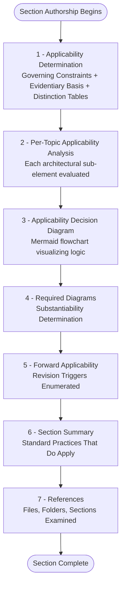

### 9.1.3 Complete Repository Verification Methods

The following verification methods were employed to substantiate the evidentiary basis used by all sections of the specification:

| Verification Method | Confirmed Finding | Section Anchored |
|---------------------|-------------------|------------------|
| Directory listing of repository root | Single child `README.md`; no subdirectories | §1.4.1, §3.11 |
| File content inspection | 11 bytes; first line `# Artifact1` | §1.1.1, §3.11 |
| `git log --all --oneline` | Single commit `9e0722a` | §1.1.1 |
| `git ls-files` | `README.md` tracked in HEAD tree | §2.6 |
| Semantic searches for technology terms | All returned zero matches | §3.4, §3.5, §3.6, §3.7 |
| File-extension pattern searches | No source, config, manifest, or IaC files present | §3.4.1, §8.1 |

### 9.1.4 Negative Inventory — Artifact Categories Searched and Not Found

Across §§3.4, 3.5, 3.6, 3.7, 6.1, 6.2, 6.3, 6.4, 6.5, 6.6, 7.1, and 8.1, the specification documents the absence of numerous artifact categories. This consolidated negative inventory serves as a comprehensive reference for what does **not** exist in the repository.

#### 9.1.4.1 Dependency and Build Manifests Absent

| Ecosystem | Manifest Files Searched |
|-----------|------------------------|
| Node.js / JavaScript | `package.json`, `package-lock.json`, `yarn.lock`, `pnpm-lock.yaml` |
| Python | `requirements.txt`, `Pipfile`, `Pipfile.lock`, `pyproject.toml`, `poetry.lock`, `setup.py`, `setup.cfg` |
| Ruby | `Gemfile`, `Gemfile.lock` |
| Java / JVM | `pom.xml`, `build.gradle`, `build.gradle.kts`, `settings.gradle` |
| Rust | `Cargo.toml`, `Cargo.lock` |
| Go | `go.mod`, `go.sum` |
| PHP | `composer.json`, `composer.lock` |
| .NET | `*.csproj`, `*.sln`, `packages.config` |
| Swift / iOS | `Podfile`, `Cartfile`, `Package.swift` |
| Elixir | `mix.exs` |

#### 9.1.4.2 CI/CD, Build, and Container Artifacts Absent

| Category | Files / Directories Searched |
|----------|------------------------------|
| CI/CD pipeline definitions | `.github/workflows/`, `.gitlab-ci.yml`, `.circleci/config.yml`, `.travis.yml`, `Jenkinsfile`, `azure-pipelines.yml`, `bitbucket-pipelines.yml`, `buildspec.yml` |
| Build systems | `Makefile` |
| Container artifacts | `Dockerfile`, `docker-compose.yml`, `Containerfile`, `.dockerignore` |
| Git configuration | `.gitignore`, `.gitattributes`, `.gitmodules` |

#### 9.1.4.3 Infrastructure-as-Code and Orchestration Absent

| Category | Files / Directories Searched |
|----------|------------------------------|
| Terraform | `*.tf` files |
| Azure Bicep | `*.bicep` files |
| AWS CloudFormation | CloudFormation YAML/JSON templates |
| Kubernetes | Kubernetes manifest YAMLs |
| Helm | Helm chart directories |
| HashiCorp Nomad | Nomad job specifications |
| Docker Swarm | Swarm stack definitions |

### 9.1.5 Zero-Entry Inventory Aggregation

The specification accumulates a substantial body of zero-entry inventories that collectively quantify the absence of architectural surface area. The following aggregation consolidates these zero-counts for reference:

| Inventory Category | Count Found | Source Section |
|---------------------|-------------|----------------|
| Primary keys, foreign keys, indexes, triggers | 0 each | §6.2.4.4 |
| External dependency classes (12 evaluated) | 0 each | §6.3.4.5 |
| Authentication, authorization, data-protection controls (24 evaluated) | 0 each | §6.4.4.4 |
| Compliance frameworks (8 evaluated) | 0 declared | §6.4.4.4 |
| Metrics, alerts, SLA categories (24 evaluated) | 0 each | §6.5.4.4–6 |
| Test types, testing tools, quality gates (24 evaluated) | 0 each | §6.6.4.4–6 |
| Default technology stack items applicable | 0 of N evaluated | §3.9 |
| User interfaces (CLI, GUI, web, mobile, API) | 0 each | §7.1 |
| Infrastructure / deployment artifacts | 0 each | §8.1 |

### 9.1.6 Implicit Technology Stack — Complete Enumeration

Per §3.11, the entire technology stack of the Artifact1 repository consists of exactly two implicit dependencies. No explicit declarations of programming languages, frameworks, libraries, dependencies, services, databases, container runtimes, CI/CD platforms, or cloud platforms exist in the repository.

| Technology | Role | Authoritative Constraint |
|------------|------|--------------------------|
| Markdown (CommonMark / GFM) | Documentation rendering convention for `README.md` | Content must conform such that the H1 heading is recognized by standard renderers |
| Git | Version control system maintaining commit history | Repository must remain a valid Git repository; no specific Git version mandated |

### 9.1.7 Feature Catalog and Assumption Compendium

For convenient cross-reference, the complete feature catalog (§2.2) and assumption inventory (§2.7.1) are consolidated here.

#### 9.1.7.1 Complete Feature Catalog

| Feature ID | Feature Name | Status |
|------------|--------------|--------|
| F-001 | Project Identifier Declaration | Completed |
| F-002 | Version-Controlled Documentation | Completed |

#### 9.1.7.2 Complete Assumption Inventory

| Assumption ID | Assumption Statement | Evidentiary Basis |
|---------------|----------------------|-------------------|
| A-001 | The `README.md` file's content is intended to be rendered as Markdown | The `.md` extension and H1 syntax conform to standard Markdown conventions |
| A-002 | The project identifier "Artifact1" is intentional and not a placeholder typo | The identifier is consistent with the repository directory name |

### 9.1.8 Standard Practices That Do Apply (Cross-Section Aggregation)

While the specification documents extensive architectural non-applicability, several standard practices are inherently in effect by virtue of the repository being a valid Git repository with a Markdown document. These practices are compiled across §§6.4.6.1, 6.5.6.1, 6.6.6.1, and 8.7.

| Standard Practice | Mechanism | Applicability Source |
|-------------------|-----------|----------------------|
| Git platform-level access controls | Read/write permissions enforced by the Git-hosting provider | §6.4.6.1 |
| Manual visual rendering verification | Reader opens README in a viewer to confirm H1 heading appears | §6.6.6.1 |
| Git commit history as state-change record | Queryable via `git log`, `git show`, `git blame` | §6.5.6.1 |
| Markdown syntax validity | Inherent property of CommonMark/GFM-conforming parsers | §3.2.2 |
| Git object integrity validation | SHA-1 (or SHA-256) checksums on all Git objects | §6.4.6.1 |
| Default Git recovery operations | `commit`, `push`, `pull`, `fetch`, `merge`, `revert`, `reset`, `clone` | §5.5.7 |
| Local-clone replication | `git clone` produces a complete replica of the object store | §5.5.7 |
| Inherent absence of attack/error surfaces | README contains no executable content, scripts, or input surfaces | §6.4.6.1 |

### 9.1.9 Specification Constraint Compendium

Three authoritative rules govern every section of this specification, consolidated from §§1.4.2, 2.7.2, and 3.9.2:

| Rule | Statement | Source |
|------|-----------|--------|
| 1 | Speculative claims about architectural style, technology stack, or implementation strategy are prohibited | §1.4.2 |
| 2 | Speculative claims about purpose, roadmap, users, or architecture are prohibited | §2.7.2 |
| 3 | Zero items from the default technology stack are applicable absent repository evidence | §3.9.2 |

### 9.1.10 Document Version History

| Version | Date | Basis Commit | Description |
|---------|------|--------------|-------------|
| 1.0 | May 29, 2026 | `9e0722a` (Initial commit) | Initial specification derived from sole commit |

### 9.1.11 Mermaid Diagram Inventory

For reference, the specification employs Mermaid syntax for all diagrams. The following diagrams are present across the document:

| Diagram Subject | Section | Diagram Type |
|------------------|---------|--------------|
| Structural composition | §1.2.2 | Component diagram |
| Technology stack visualization | §3.8 | Component diagram |
| Static rendering workflow | §4.5.1 | Swim-lane sequence |
| Feature preservation relationship | §4.5.2 | Relationship diagram |
| Git commit history | §4.5.3 | State diagram |
| Applicability decision logic | §5.1.3 | Flowchart |
| Disaster recovery flow | §5.5.4.1 | Flowchart |
| Core services applicability | §6.1.3 | Flowchart |
| Database applicability | §6.2.3 | Flowchart |
| Integration applicability | §6.3.3 | Flowchart |
| Security applicability | §6.4.3 | Flowchart |
| Monitoring applicability | §6.5.3 | Flowchart |
| Testing applicability | §6.6.3 | Flowchart |
| Infrastructure applicability | §8.3 | Flowchart |

---

## 9.2 GLOSSARY

This glossary defines terms used throughout the Technical Specification. Terms are grouped by category for navigability. All definitions are derived from the specification's evidentiary basis or established document conventions.

### 9.2.1 Project-Specific Terms

| Term | Definition |
|------|------------|
| **Artifact1** | The project identifier of the repository under specification, declared via the H1 Markdown heading in `README.md` (the file's sole content). |
| **Blitzy-Multi** | The commit author of the single commit in the repository (`mmwforfinance@gmail.com`), recorded in the Git commit history dated May 29, 2026. |
| **Initial commit** | The sole Git commit in the repository's history, SHA `9e0722ace21443bfac8a1400eab45ceacf9fe8dd` (short form `9e0722a`), dated May 29, 2026. |
| **Placeholder repository** | A characterization of the repository's current state — early-stage, with documentation-only content and no functional software product. |
| **Basis commit** | The Git commit that establishes the evidentiary basis for a given version of this specification; currently `9e0722a`. |

### 9.2.2 Documentation Convention Terms

| Term | Definition |
|------|------------|
| **Bidirectional traceability** | A property of the specification in which each requirement is traceable to evidence and each evidence item maps back to one or more requirements; established in §2.6. |
| **Evidentiary basis** | The set of repository artifacts upon which all claims in the specification rest — currently comprising 1 file, 1 folder, and 1 commit. |
| **Forward applicability** | The conditions under which an "absence" determination in the specification would be invalidated by future repository contributions. |
| **Revision trigger** | A specific repository change (e.g., introduction of source code, configuration files, or dependency manifests) that would require a specification section to be expanded or revised. |
| **Substantiability determination** | An explicit, evidence-grounded statement of whether a requested diagram or claim can be supported by available repository artifacts. |
| **Applicability decision logic** | The flowchart-based decision process applied uniformly across architectural sections to determine whether to document, reference, or mark elements as "Not Applicable". |
| **Negative inventory** | An enumeration of artifact categories searched for in the repository that were not found, used to substantiate absence claims. |
| **Zero-entry inventory** | A matrix or list explicitly recording a count of zero for each category evaluated, used to quantify architectural non-applicability. |

### 9.2.3 Repository and Technology Terms

| Term | Definition |
|------|------------|
| **Markdown** | A lightweight markup language used for `README.md` content rendering; one of the two implicit technologies present in the repository. |
| **CommonMark** | A formal specification of Markdown ensuring consistent rendering across compliant parsers. |
| **GitHub Flavored Markdown (GFM)** | An extension of CommonMark with additional syntactic features used by GitHub's rendering engine. |
| **H1 heading** | A top-level Markdown heading (a line beginning with `# `); the sole content of `README.md` is the H1 heading `# Artifact1`. |
| **Git** | The distributed version control system maintaining the repository's commit history; the second of the two implicit technologies present. |
| **Git object store** | Git's internal storage (in `.git/`) for commits, trees, and blobs; the repository contains one commit object, one tree object, and one blob object. |
| **Blob** | A Git object type representing the binary contents of a tracked file. |
| **Tree** | A Git object type representing a directory snapshot, mapping filenames to blob or sub-tree identifiers. |
| **Commit** | A Git object recording a snapshot of the working tree at a point in time, along with author, date, and message metadata. |
| **HEAD** | A Git reference pointing to the current branch tip or latest commit; in this repository, points to `9e0722a`. |
| **Working tree** | The current state of files as visible on disk in a Git repository (as opposed to staged or committed states). |
| **Default Git behavior** | The behavior of Git operations and characteristics proceeding without custom hooks, signing configurations, or non-default settings. |

### 9.2.4 Architectural and Specification Terms

| Term | Definition |
|------|------------|
| **Implicit technology** | A technology dependency observable in repository artifacts but not formally declared in any manifest or configuration file; Markdown and Git are the two implicit technologies of this repository. |
| **Default technology stack** | A pre-defined stack provided in the section prompt (encompassing categories such as cloud providers, container runtimes, and IaC tooling), evaluated for applicability and found to have zero applicable items. |
| **In-scope** | Elements presently within the documented scope of the specification, currently limited to features F-001 and F-002. |
| **Out-of-scope** | Elements explicitly excluded from current scope per §1.3.3 (e.g., source code, dependencies, services, integrations). |
| **System boundary** | The outer perimeter of the system as documented; currently encloses a single Markdown file at the repository root. |
| **Service boundary** | Not applicable — no services exist in the current repository state. |
| **Trust / security boundary** | Not applicable — no authentication or authorization surface exists. |
| **Network boundary** | Not applicable — no network endpoints exist. |
| **Repository boundary** | The single file (`README.md`) at the repository root. |
| **Feature identifier** | A unique identifier of the form `F-XXX` assigned to features in §2.2 (currently F-001 and F-002 only). |
| **Requirement identifier** | An identifier of the form `F-XXX-RQ-YYY` used to label individual requirements within a feature. |
| **Assumption identifier** | An identifier of the form `A-XXX` used to label assumptions in §2.7.1 (currently A-001 and A-002 only). |
| **Static rendering flow** | The single observable workflow in the repository — `README.md` being read and rendered by an external Markdown viewer. |

### 9.2.5 Role and Surface Terms

| Term | Definition |
|------|------------|
| **Repository-architected vs. external** | The recurring distinction between artifacts authored within the repository versus those provided by external tools (Git VCS, Markdown viewers, hosting platforms). |
| **Maintenance surface** | The set of operations available for maintaining the repository; per §2.5.2, comprises standard Git operations (commit, push, pull, fetch, merge). |
| **Recovery surface** | The set of operations available for recovering from data loss or corruption; default Git operations constitute the sole defensible recovery mechanism. |
| **Disaster recovery surface** | Limited to `git revert`, `git reset`, and `git clone` (local-clone replication) as documented in §5.5.7 and §8.5.5. |
| **Attack surface** | The portion of a system exposed to potential exploitation; per §6.4.6.1, effectively absent given that `README.md` contains no executable content or input surfaces. |

---

## 9.3 ACRONYMS

This subsection enumerates the expanded forms of acronyms used throughout the Technical Specification. Note that the majority of these acronyms appear in subsections that establish architectural non-applicability for the current repository state; they are documented here for completeness and to support clarity when reviewing such "Not Applicable" determinations.

### 9.3.1 Cloud, Infrastructure, and Platform Acronyms

| Acronym | Expanded Form | Where Referenced |
|---------|---------------|-------------------|
| AWS | Amazon Web Services | §1.3.3, §3.9.1 |
| GCP | Google Cloud Platform | §1.3.3, §3.5.4 |
| GCS | Google Cloud Storage | §1.3.3 |
| RDS | Relational Database Service (AWS) | §6.2.5.3 |
| SNS | Simple Notification Service (AWS) | §6.5.4.2 |
| SQS | Simple Queue Service (AWS) | §1.3.3, §6.3 |
| VPC | Virtual Private Cloud | §6.6.4.2 |
| VM | Virtual Machine | §6.6.4.2 |
| DMZ | Demilitarized Zone | §6.4.4.3 |
| DNS | Domain Name System | §6.1.2.1 |
| IaC | Infrastructure as Code | §8.1, §8.1.1 |
| OS | Operating System | §5.2.1.3, §6.3.1.3 |
| SaaS | Software as a Service | §1.2.1, §3.5.1 |

### 9.3.2 Architecture and Design Pattern Acronyms

| Acronym | Expanded Form | Where Referenced |
|---------|---------------|-------------------|
| ADR / ADRs | Architecture Decision Record(s) | §5.4, §5.4.3, §5.7 |
| CQRS | Command Query Responsibility Segregation | §5.2.1.2 |
| DAO | Data Access Object | §6.2.5 |
| MVC | Model-View-Controller | §5.2.1.2 |
| MVVM | Model-View-ViewModel | §5.2.1.2 |
| ORM | Object-Relational Mapping | §6.2.1.2, §6.2.5.1 |
| Pub/Sub | Publish / Subscribe | §5.2.1.2, §6.3.2.2 |
| RPC | Remote Procedure Call | §5.2.1.3, §6.1.5.1 |
| SOA | Service-Oriented Architecture | §6.1.1.1 |
| RFC | Request for Comments | §5.4.1 |

### 9.3.3 Security, Authentication, and Authorization Acronyms

| Acronym | Expanded Form | Where Referenced |
|---------|---------------|-------------------|
| ABAC | Attribute-Based Access Control | §6.4.4.4 |
| ACL | Access Control List | §6.4.5.2, §6.6 |
| FIDO2 | Fast IDentity Online 2 | §6.4.4.1, §6.4.5.1 |
| HMAC | Hash-based Message Authentication Code | §6.3.5.2, §6.4.5.3 |
| HSM | Hardware Security Module | §6.4.1.2, §6.4.5.3 |
| HSTS | HTTP Strict Transport Security | §6.4.5.3 |
| IAM | Identity and Access Management | §6.4 |
| IdP | Identity Provider | §6.4.2.1, §6.4.4.1 |
| IV | Initialization Vector | §6.4.5.3 |
| JWT | JSON Web Token | §6.4.2.1, §6.4.4.1 |
| KMS | Key Management Service | §6.4.1.2, §6.4.2.3 |
| LDAP | Lightweight Directory Access Protocol | §6.4.4.1 |
| MFA | Multi-Factor Authentication | §6.4.2.1 |
| mTLS | Mutual TLS | §6.4.1.3, §6.4.4.3 |
| OAuth / OAuth2 | Open Authorization (version 2) | §6.4.2.1, §6.4.4.1 |
| OIDC | OpenID Connect | §6.4.2.1, §6.4.4.1 |
| OPA | Open Policy Agent | §6.4.2.2, §6.4.5.2 |
| OTP | One-Time Password | §6.4.5.1 |
| PDP | Policy Decision Point | §6.4.2.2, §6.4.4.2 |
| PEP | Policy Enforcement Point | §6.4.2.2, §6.4.4.2 |
| PIP | Policy Information Point | §6.4.2.2 |
| PKI | Public Key Infrastructure | §6.4.1.2 |
| RBAC | Role-Based Access Control | §6.4, §6.4.2.2 |
| RLS | Row-Level Security | §6.4.5.2 |
| SAML | Security Assertion Markup Language | §6.4.2.1, §6.4.4.1 |
| SCIM | System for Cross-domain Identity Management | §6.4.5.2 |
| SIEM | Security Information and Event Management | §6.4.1.2 |
| SSH | Secure Shell | §6.4.1.3 |
| SSO | Single Sign-On | §6.4.1.3, §6.4.4.4 |
| TLS | Transport Layer Security | §6.4.4.3 |
| TOTP | Time-based One-Time Password | §6.4.5.1 |
| WAF | Web Application Firewall | §6.3.2.1, §6.4.4.3 |
| WebAuthn | Web Authentication | §6.4.4.1, §6.4.5.1 |

### 9.3.4 Data, Storage, and Database Acronyms

| Acronym | Expanded Form | Where Referenced |
|---------|---------------|-------------------|
| ETL | Extract, Transform, Load | §6.3.5.3 |
| ERD | Entity-Relationship Diagram | §6.2.4.1 |
| GIN | Generalized Inverted Index | §6.2.4.4 |
| GiST | Generalized Search Tree (index) | §6.2.4.4 |
| JDBC | Java Database Connectivity | §5.2.4.2, §6.3 |
| JPA | Jakarta Persistence API | §6.2.5.1 |
| LFS | Large File Storage (Git LFS) | §5.3.2.5, §6.2.1.3 |
| NoSQL | Not only SQL | §1.3.3, §3.6, §6.2 |
| ODBC | Open Database Connectivity | §5.2.4.2, §6.3 |
| SQL | Structured Query Language | §6.2.1.3, §6.2.4.4 |
| TTL | Time To Live | §6.2.5.4 |
| WAL | Write-Ahead Log | §6.2.4.3 |

### 9.3.5 Integration, Messaging, and Protocol Acronyms

| Acronym | Expanded Form | Where Referenced |
|---------|---------------|-------------------|
| AMQP | Advanced Message Queuing Protocol | §5.2.4.2, §6.1.2.1, §6.3 |
| API / APIs | Application Programming Interface(s) | §1.3.3, §3.5, §5.2, §6.3 |
| DLQ | Dead-Letter Queue | §6.3.2.2, §6.3.5 |
| EDI | Electronic Data Interchange | §6.3.5.3 |
| HTTP / HTTPS | Hypertext Transfer Protocol / HTTP Secure | §5.2.4.2, §6.3 |
| MQTT | Message Queuing Telemetry Transport | §5.2.4.2, §6.3 |
| REST | Representational State Transfer | §5.2.4.2, §6.3 |
| SDK / SDKs | Software Development Kit(s) | §6.3 |
| SDL | Schema Definition Language | §6.3.2.1 |
| SMS | Short Message Service | §1.3.3, §4.4.2.3 |
| SOAP | Simple Object Access Protocol | §5.2.4.2, §6.3 |
| WSDL | Web Services Description Language | §6.3.2.3 |

### 9.3.6 Testing, Quality, and Observability Acronyms

| Acronym | Expanded Form | Where Referenced |
|---------|---------------|-------------------|
| APM | Application Performance Monitoring | §3.5.3, §6.5 |
| BDD | Behavior-Driven Development | §6.6.5 |
| DAST | Dynamic Application Security Testing | §6.6 |
| E2E | End-to-End (testing) | §6.6 |
| ELK | Elasticsearch, Logstash, Kibana (stack) | §3.5.3, §6.5 |
| IAST | Interactive Application Security Testing | §6.6.4.4 |
| KPI / KPIs | Key Performance Indicator(s) | §1.1, §1.2.3, §5.5.2, §6.5 |
| MTTD | Mean Time to Detect | §6.5.4.6 |
| MTTR | Mean Time to Recover | §6.5.4.6 |
| OWASP | Open Web Application Security Project | §6.6.1.2, §6.6.4.5 |
| PR | Pull Request | §6.6.5.4 |
| RCA | Root Cause Analysis | §6.5.5.3 |
| RUM | Real-User Monitoring | §6.5.4.4 |
| SAST | Static Application Security Testing | §6.6.1.2, §6.6.4.4 |
| SBOM | Software Bill of Materials | §6.6.4.6, §6.6.5.5 |
| SLA / SLAs | Service Level Agreement(s) | §4.5.1, §5.5.6, §6.5 |
| SLI / SLIs | Service Level Indicator(s) | §5.5.2, §6.5 |
| SLO / SLOs | Service Level Objective(s) | §5.5.2, §6.5 |
| SPDX | Software Package Data Exchange | §6.6.5.5 |
| TAP | Test Anything Protocol | §6.6.4.5, §6.6.5.4 |
| TIA | Test Impact Analysis | §6.6.5.4 |

### 9.3.7 Compliance and Regulatory Acronyms

| Acronym | Expanded Form | Where Referenced |
|---------|---------------|-------------------|
| CCPA | California Consumer Privacy Act | §6.4.4.4 |
| CDE | Cardholder Data Environment | §6.4.2.3, §6.4.4.4 |
| CPRA | California Privacy Rights Act | §6.4.4.4 |
| FedRAMP | Federal Risk and Authorization Management Program | §6.4.4.4 |
| FERPA | Family Educational Rights and Privacy Act | §6.4.4.4 |
| FFIEC | Federal Financial Institutions Examination Council | §6.4.4.4 |
| GDPR | General Data Protection Regulation | §6.2.2.3, §6.4.4.4 |
| HIPAA | Health Insurance Portability and Accountability Act | §6.2.2.3, §6.4.4.4 |
| ISMS | Information Security Management System | §6.4.4.4 |
| ISO/IEC | International Organization for Standardization / International Electrotechnical Commission | §6.4.4.4 |
| NERC CIP | North American Electric Reliability Corporation Critical Infrastructure Protection | §6.4.4.4 |
| NIST | National Institute of Standards and Technology | §6.4.4.4 |
| PCI / PCI-DSS | Payment Card Industry / PCI Data Security Standard | §6.2.2.3, §6.4.4.4 |
| PHI | Protected Health Information | §6.4.2.3, §6.4.4.4 |
| PII | Personally Identifiable Information | §6.4.2.3, §6.4.4.4 |
| SOC 2 | Service Organization Control 2 | §6.4.1.2, §6.4.4.4 |
| SOX | Sarbanes-Oxley Act | §6.2.2.3 |

### 9.3.8 General Computing, Format, and Tooling Acronyms

| Acronym | Expanded Form | Where Referenced |
|---------|---------------|-------------------|
| CI/CD | Continuous Integration / Continuous Delivery | §1.2.2, §3.7.4 |
| CLI | Command-Line Interface | §1.3.3 |
| CSS | Cascading Style Sheets | §6.6.5.3 |
| DOM | Document Object Model | §5.2.4.3 |
| DR | Disaster Recovery | §5.5.7, §6.1, §6.2 |
| GFM | GitHub Flavored Markdown | §2.5.1, §3.2.2, §3.11 |
| GUI | Graphical User Interface | §6.6.5.3 |
| IDE | Integrated Development Environment | §3.7.5 |
| JSON | JavaScript Object Notation | §3.7.5, §6.2.4.1 |
| JVM | Java Virtual Machine | §3.4.1 |
| ML | Machine Learning | §3.9.1, §6.5.4.5 |
| npm | Node Package Manager | §3.4 |
| PyPI | Python Package Index | §3.4.2 |
| RPO | Recovery Point Objective | §5.5.7, §6.1.2.3 |
| RTO | Recovery Time Objective | §5.5.7, §6.1.2.3 |
| SHA | Secure Hash Algorithm | §6.6.1.3, §6.6.6.1 |
| UI | User Interface | §1.3.3, §6.6, §7.1 |
| VCS | Version Control System | §6.3.1.3, §6.4.1.3 |
| XML | Extensible Markup Language | §6.6.4.5 |
| YAML | YAML Ain't Markup Language | §3.7.5, §6.5.4.3 |

---

## 9.4 APPENDIX SUMMARY

The information contained in this Appendices section provides supplementary reference material that supports comprehension of the broader Technical Specification. Three principal contributions are made:

- **§9.1 Additional Technical Information** consolidates cross-section reference content — the documentation methodology compendium, the standard seven-subsection "Not Applicable" pattern, complete verification methods, negative inventories of artifacts searched but not found, zero-entry inventory aggregations, the complete implicit technology stack, feature and assumption catalogs, standard practices that do apply, specification constraints, version history, and the Mermaid diagram inventory.
- **§9.2 Glossary** defines specialized terms across five categories: project-specific terms, documentation conventions, repository and technology terms, architectural and specification terms, and role and surface terms.
- **§9.3 Acronyms** enumerates expanded forms of 100+ acronyms used throughout the specification, organized into eight categories spanning cloud platforms, architectural patterns, security, data systems, integration protocols, testing and observability, compliance frameworks, and general computing formats.

The consolidated content reflects the disciplined evidentiary discipline established by §1.4 and consistently applied throughout the specification: every claim is grounded in the repository's one file, one folder, and one commit. The substantial body of acronyms catalogued here predominantly relates to architectural elements explicitly determined to be "Not Applicable" in their respective sections — they appear in the specification because the section prompts for those domains enumerate the categories that **would** be relevant in a more developed repository state. Future revisions of this Appendix will incorporate additional terminology as new artifacts introduce explicit technology selections, governance frameworks, or architectural patterns.

---

## 9.5 REFERENCES

### 9.5.1 Repository Files Examined

- `README.md` — The sole 11-byte content file at the repository root, containing the literal text `# Artifact1`. Cross-referenced for confirmation of project identifier and content scope informing the Glossary entries for "Artifact1", "H1 heading", and the technology terms for Markdown.
- `/` (repository root directory) — The top-level repository folder. Confirmed to contain exactly one child file (`README.md`) and no subdirectories. Provides the evidentiary basis for the negative inventory subsections (§9.1.4) cataloging artifact categories searched but not found.

### 9.5.2 Git History Inspected

- Single commit `9e0722ace21443bfac8a1400eab45ceacf9fe8dd` ("Initial commit") by *Blitzy-Multi* (`mmwforfinance@gmail.com`), dated May 29, 2026 — Source of the version tracking entry in §9.1.10 and the Glossary entries for "Blitzy-Multi", "Initial commit", and "Basis commit".

### 9.5.3 Technical Specification Sections Referenced

- **§1.1 Executive Summary** — Provides project identification, authorship, and the placeholder-repository characterization underpinning multiple Glossary entries.
- **§1.2 System Overview** — Establishes the component inventory and integration-absence baseline used in the negative inventory and zero-entry aggregations.
- **§1.3 Scope** — Source of the in-scope / out-of-scope distinction defined in Glossary §9.2.4 and the boundary-related Glossary entries.
- **§1.4 Documentation Context and Caveats** — Establishes the three documentation conventions formally catalogued in §9.1.1 and grounds the methodology references throughout the Appendix.
- **§2.1 Introduction and Methodology** — Provides the feature-identification approach referenced in the Glossary entry for "Feature identifier".
- **§2.2 Feature Catalog** — Source of the consolidated feature catalog in §9.1.7.1 (F-001 and F-002).
- **§2.5 Implementation Considerations** — Source of the Markdown and Git constraints summarized in §9.1.6.
- **§2.6 Traceability Matrix** — Establishes bidirectional traceability defined in §9.2.2.
- **§2.7 Assumptions, Constraints, and Versioning** — Source of the assumption catalog (§9.1.7.2), version history (§9.1.10), and specification constraints (§9.1.9).
- **§3.1 through §3.11 (Technology Stack)** — Source of the implicit technology enumeration (§9.1.6), the technology-related Glossary entries (§9.2.3), and the dependency-manifest negative inventory (§9.1.4.1).
- **§3.9 Default Technology Stack Applicability Analysis** — Source of the zero-applicable-items finding in §9.1.5.
- **§4.5 Repository-Defensible Diagrams** — Source of the Mermaid diagram inventory in §9.1.11 and the "Static rendering flow" Glossary entry.
- **§5.1 Evidentiary Basis and Methodology** — Source of the applicability decision logic referenced in §9.2.2.
- **§5.4 Technical Decisions** — Source of ADR acronym definition and the Glossary entries referring to architectural decision records.
- **§5.5 Cross-Cutting Concerns** — Source of the disaster recovery surface and recovery surface Glossary entries (§9.2.5).
- **§5.7 Section Summary** — Source of the consolidated architectural absence statement reflected in §9.1.5.
- **§6.1 Core Services Architecture** through **§6.6 Testing Strategy** — Sources of the acronyms catalogued in §§9.3.2–9.3.7, with each section contributing the architectural elements determined to be Not Applicable.
- **§6.4.4.4 Compliance Frameworks** — Source of the compliance-acronym subsection (§9.3.7).
- **§7.1 Applicability Determination** — Source of the UI-related zero-count entry in §9.1.5.
- **§8.1 Applicability Determination** and **§8.5 Minimal Build and Distribution Requirements** — Sources of the infrastructure-applicability zero-count entry (§9.1.5) and the IaC negative inventory (§9.1.4.3).
- **§8.8 References** — Provides the complete file inventory pattern reflected in the present References subsection.